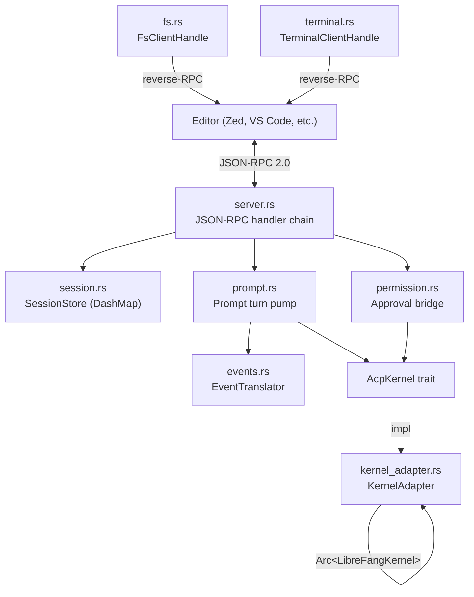

# Agent Control Protocol (ACP)

# Agent Control Protocol (ACP) Module

## Overview

`librefang-acp` bridges LibreFang's agent runtime to the [Agent Client Protocol](https://agentclientprotocol.com/), a JSON-RPC 2.0 protocol over a duplex byte stream (typically stdio). Editors like Zed, VS Code, and JetBrains embed a LibreFang agent natively through this adapter — providing their own approval modals, file references, image attachments, and prompt streaming UI instead of the LibreFang dashboard.

The crate depends on the `agent-client-protocol` crate (published by Zed) for wire-format handling, and provides only the LibreFang-specific glue: event translation, session management, permission bridging, and reverse-RPC dispatch for filesystem and terminal operations.

## Architecture



Data flows in two directions:

- **Client → Agent**: The editor sends `session/prompt`, `session/cancel`, and permission responses. The server translates these into kernel operations.
- **Agent → Client**: The kernel emits `StreamEvent`s during a prompt turn. The `EventTranslator` converts these into `session/update` notifications streamed back to the editor. For reverse-RPCs (`fs/*`, `terminal/*`), the agent requests that the editor perform the operation using its own filesystem/PTY authority.

## Entry Points

### `run(kernel, agent_id)`

Runs the ACP server on stdio. Used by `librefang acp` CLI subcommand for in-process execution:

```rust
let kernel = Arc::new(LibreFangKernel::boot(config).await?);
let agent_id = kernel.resolve_agent("my-agent").await?;
run(kernel, agent_id).await?;
```

### `run_with_transport(kernel, agent_id, transport)`

Same as `run` but with an explicit transport. Used by `librefang-api`'s UDS listener and integration tests (which use `tokio::io::duplex` pipes).

## Module Reference

### `AcpKernel` Trait (`lib.rs`)

The core abstraction. Defines every kernel operation the ACP server needs:

| Method | Purpose |
|--------|---------|
| `resolve_agent` | Map a name/UUID string to an `AgentId` |
| `send_prompt` | Start a streaming agent turn; returns `mpsc::Receiver<StreamEvent>` |
| `subscribe_approvals` | Get a broadcast receiver for `ApprovalEvent`s |
| `resolve_approval` | Feed an editor decision back to the kernel's approval gate |
| `remember_decision` | Persist an "always" choice for `(agent_id, tool_name)` |
| `set_fs_client` / `set_terminal_client` | Hand the kernel reverse-RPC handles at `initialize` |
| `register_session_fs` / `register_session_terminal` | Bind handles to a specific LibreFang session |
| `fetch_session_history` | Pull persisted message history for `session/load` |

The trait is `#[async_trait]` + `Send + Sync + 'static`. Production uses `KernelAdapter`; integration tests use stub implementations that return canned `StreamEvent` sequences.

### `KernelAdapter` (feature: `kernel-adapter`)

Concrete `AcpKernel` over `Arc<LibreFangKernel>`. Holds:

- The kernel as both the concrete type (for `send_message_streaming_with_routing_and_session_override`) and as a `KernelHandle` trait object (for `resolve_tool_approval`, which must route through the trait to fire the deferred-approval spawn).
- `Arc<RwLock<Option<FsClientHandle>>>` and `Arc<RwLock<Option<TerminalClientHandle>>>` populated at `initialize` time.

**Critical routing note for `resolve_approval`**: The adapter calls `kernel_handle.resolve_tool_approval()` (the trait method), not `kernel.approvals().resolve()` directly. The trait impl wraps both the resolution *and* the deferred tool execution spawn. Without this routing, an "Allow once" click from the editor would clear the approval record but the agent loop would hang forever waiting for a tool result that never arrives.

### `SessionStore` (`session.rs`)

Concurrent `DashMap<AcpSessionId, SessionState>`. Each `SessionState` contains:

- `librefang_session_id: LfSessionId` — derived deterministically from the ACP session id via UUID v5 (`ACP_SESSION_NS` namespace). Same ACP id always maps to the same kernel-side session, so a reconnecting editor's `session/load` rejoins persisted history.
- `cwd: PathBuf` — the editor's project root from `session/new`.
- `cancel: CancellationToken` — triggered by `session/cancel` to interrupt the prompt pump.

Key operations: `insert`, `get`, `remove`, `find_by_librefang_id` (reverse lookup for the permission bridge), `drain_active` (cleanup on disconnect).

### `EventTranslator` (`events.rs`)

Stateful, one-per-session-per-prompt-turn translator from `StreamEvent` → `Vec<SessionUpdate>`.

| StreamEvent | SessionUpdate | Notes |
|-------------|---------------|-------|
| `TextDelta` | `AgentMessageChunk` | Direct text streaming |
| `ThinkingDelta` | `AgentThoughtChunk` | Agent reasoning |
| `OwnerNotice` | `AgentMessageChunk` | Surfaces as regular message (Phase 2 may add dedicated variant) |
| `ToolUseStart` | `ToolCall` | Status `Pending`; pushes id onto per-name FIFO |
| `ToolInputDelta` | *(nothing)* | Suppressed to avoid hundreds of tiny notifications |
| `ToolUseEnd` | `ToolCallUpdate` | Status `InProgress`; attaches `raw_input` |
| `ToolExecutionResult` | `ToolCallUpdate` | Status `Completed`/`Failed`; pops from FIFO |
| `ContentComplete` | *(nothing)* | Consumed by the pump for `StopReason` |

**Parallel same-named tool calls**: The translator maintains a `HashMap<String, VecDeque<ToolCallId>>` (`in_flight_by_name`). When multiple calls to the same tool are in flight and the runtime can't correlate results back to a specific `tool_use_id`, the FIFO pop is a best-effort guess. When ≥2 calls are pending, the result payload is prepended with a disambiguation note so the editor user knows attribution may be incorrect. Drained entries are reaped from the map to prevent per-session leaks (#5144).

**`infer_tool_kind`**: Best-effort mapping from LibreFang tool names to ACP `ToolKind` (Read, Edit, Delete, Move, Search, Execute, Think, Fetch, Other) based on naming patterns.

### Permission Bridge (`permission.rs`)

Long-running background task spawned by the server builder. Subscribes to the kernel's `ApprovalEvent` broadcast channel, filters by session, and translates each `ApprovalEvent::Created` into a `session/request_permission` reverse-RPC to the editor.

Flow for a single approval:
1. Kernel fires `ApprovalEvent::Created` with `session_id`, `tool_name`, `tool_use_id`
2. `dispatch_pending` maps the LibreFang session id → ACP session id via `SessionStore::find_by_librefang_id`
3. Builds `RequestPermissionRequest` with options: `Allow once`, `Allow always` (suppressed for high-risk tools), `Deny`, `Deny always`
4. Races the editor response against a 60-second timeout
5. Converts the outcome to `(ApprovalDecision, remember)` via `decision_from_outcome`
6. If `remember`, persists via `AcpKernel::remember_decision` *before* resolving (so concurrent calls see the cached decision)
7. Calls `AcpKernel::resolve_approval`

**High-risk tool suppression**: `shell_exec`, `file_write`, `file_delete`, `apply_patch`, and `skill_evolve_*` suppress "Allow always" because the in-memory `remembered` cache keys only on `(agent_id, tool_name)` — one click would grant permanent blanket access regardless of arguments. Dashboard/config remains the path for intentional blanket permissions.

### Prompt Handler (`prompt.rs`)

Drives a single `session/prompt` request end-to-end:

1. Looks up the ACP session in `SessionStore`
2. Concatenates text content blocks via `concat_text_blocks` (non-text blocks — image, audio, resource links — degrade to bracketed placeholders with a warning notification)
3. Calls `AcpKernel::send_prompt` to start a streaming turn
4. Pumps events with `tokio::select!` racing the event channel against the session's `CancellationToken`
5. Emits `session/update` notifications for each translated event
6. Returns a `PromptResponse` with the appropriate `StopReason`

`concat_text_blocks` intentionally omits base64 byte counts from image/audio placeholders to avoid leaking signal to prompt-injection probes.

`map_stop_reason` translates LibreFang stop reasons to ACP: `ToolUse` and `StopSequence` become `EndTurn` (the agent is mid-turn in ACP's model), `ContentFiltered` becomes `Refusal`.

### Filesystem Reverse-RPC (`fs.rs`)

`FsClientHandle` wraps `ConnectionTo<Client>` to issue `fs/read_text_file` and `fs/write_text_file` requests to the editor. The editor — not the agent's local filesystem — is the file source, reading from current buffers, in-memory edits, or virtual filesystems.

- `FsCapabilities`: flat bool struct (`read_text_file`, `write_text_file`) captured from `ClientCapabilities` at `initialize`
- All requests have a 60-second timeout (`FS_RPC_TIMEOUT`)
- Implements `AcpFsClient` trait from `librefang-kernel-handle` so the kernel can route runtime tool calls through the editor without depending on the ACP schema crate
- Uses an empty `SessionId` placeholder when the caller's session id is already folded into the kernel registration key

### Terminal Reverse-RPC (`terminal.rs`)

`TerminalClientHandle` wraps the five-method ACP terminal state machine:

1. `create` → returns `TerminalId`
2. `wait_for_exit` → blocks until command finishes (600s timeout)
3. `output` → snapshots captured stdout/stderr
4. `kill` → kills process without releasing terminal
5. `release` → drops terminal entirely

The `AcpTerminalClient` impl provides `run_command` which performs the full dance: create → wait_for_exit → output → release. Terminal is always released (even on intermediate failure) to prevent editor-side leaks.

### Error Handling (`error.rs`)

`AcpError` enum with variants:

| Variant | Meaning | JSON-RPC mapping |
|---------|---------|-------------------|
| `UnknownSession` | Session id not from `session/new` | `invalid_params` with reason |
| `AgentNotFound` | Agent name/id unresolvable | `invalid_params` with reason |
| `Kernel` | Wrapped `LibreFangError` | `internal_error` |
| `Transport` | ACP wire-level error | Pass-through |
| `PromptInFlight` | Duplicate prompt on same session | `internal_error` |
| `Internal` | Catch-all (channel closed, panic) | `internal_error` |

`into_acp_error()` converts for use in request handler responses. The type alias `AcpResult<T>` is used throughout.

### Server Assembly (`server.rs`)

Builds the handler chain on `agent_client_protocol::Agent::builder()`:

- `initialize` — captures client capabilities, hands kernel the `FsClientHandle` and `TerminalClientHandle`, declares `PromptCapabilities` with multimodal disabled
- `session/new` — mints UUID v4 id, derives stable LibreFang session, registers fs/terminal clients
- `session/load` — same as new + replays up to `MAX_REPLAY_TURNS` (50) persisted history turns as `session/update` notifications
- `session/resume` — same as load (distinction moot in Phase 1)
- `session/list` — enumerates active sessions, optionally filtered by cwd
- `session/close` — removes session, unregisters fs/terminal clients
- `session/prompt` — delegates to `prompt::handle`
- `session/cancel` — fires the session's `CancellationToken`
- Catch-all dispatch — returns `method_not_found` for unimplemented methods (rather than `internal_error`, so editors silently skip optional features)

**Drop-guard cleanup**: After the transport loop ends (clean exit, editor crash, network drop), the server drains all remaining sessions and unregisters their fs/terminal clients. Without this, a subsequent `register_session_fs` for the same deterministic `SessionId` would shadow a dead handle and tool calls would block for 60 seconds against a closed transport.

## Connection to the Rest of the Codebase

- **`librefang-cli`**: Calls `run()` from the `librefang acp` subcommand. Uses `KernelAdapter` to wrap the booted kernel.
- **`librefang-api`**: Calls `run_with_transport()` from UDS and pipe listeners (`acp_uds.rs`, `acp_pipe.rs`) for daemon-attached mode.
- **`librefang-kernel`**: Provides `KernelHandle` trait, `AcpFsClient`/`AcpTerminalClient` traits, and the `register_acp_fs_client`/`register_acp_terminal_client` registry that the adapter feeds.
- **`librefang-runtime`**: Emits `StreamEvent`s consumed by the event translator. Subprocess sandbox and checkpoint manager call `terminal::kill` for cleanup.
- **`librefang-llm-driver`**: Defines `StreamEvent` — the upstream event type that `EventTranslator` converts.
- **`librefang-types`**: Defines `AgentId`, `SessionId`, `ApprovalDecision`, `ApprovalEvent`, `StopReason`, `TokenUsage` — shared domain types.
- **`agent-client-protocol`** (external): Provides wire-format types, JSON-RPC framing, `Agent::builder()`, and transport abstractions.