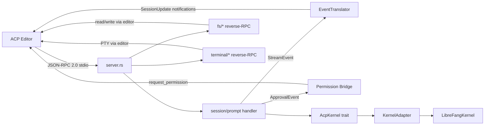

# Agent Control Protocol (ACP)

# Agent Client Protocol (ACP) Adapter

## Overview

`librefang-acp` bridges LibreFang's agent runtime to the [Agent Client Protocol](https://agentclientprotocol.com/), a JSON-RPC 2.0 protocol that lets editors (Zed, VS Code, JetBrains) embed a LibreFang agent natively. The editor provides approval modals, file access, terminal hosting, and prompt streaming through its own UI — no LibreFang dashboard required.

The crate is transport-agnostic on the LibreFang side (behind the `AcpKernel` trait) and wire-compatible with any ACP-speaking editor on the client side via the `agent-client-protocol` crate.

## Architecture


```mermaid
graph LR
    E[ACP Editor] -->|JSON-RPC 2.0 stdio| S[server.rs]
    S --> H[session/prompt handler]
    H -->|StreamEvent| EV[EventTranslator]
    EV -->|SessionUpdate notifications| E
    H -->|ApprovalEvent| PB[Permission Bridge]
    PB -->|request_permission| E
    S --> FS[fs/* reverse-RPC]
    S --> TM[terminal/* reverse-RPC]
    FS -->|read/write via editor| E
    TM -->|PTY via editor| E
    H --> K[AcpKernel trait]
    K --> KA[KernelAdapter]
    KA --> LF[LibreFangKernel]
```

The arrow of control is bidirectional: the editor initiates requests (`session/prompt`, `session/new`) and the agent initiates reverse-RPCs back to the editor (`session/request_permission`, `fs/read_text_file`, `terminal/create`).

## Entry Points

- **`run(kernel, agent_id)`** — binds to stdio. Used by the `librefang acp` CLI subcommand for in-process execution.
- **`run_with_transport(kernel, agent_id, transport)`** — same server logic with an explicit transport. Used by daemon-attached UDS listeners (`librefang-api`) and integration tests (over `tokio::io::duplex`).

Both functions return when the editor disconnects or the transport errors. On exit, a drop-guard drains all active sessions and unregisters their `fs/*` and `terminal/*` handles from the kernel so stale references don't block future tool calls.

## Core Trait: `AcpKernel`

Defined in `lib.rs`, this trait exposes the minimal kernel surface the ACP adapter needs. Keeping it as a trait decouples the protocol crate from `librefang-kernel`'s full dependency tree and enables integration tests to inject stub implementations.

Key methods:

| Method | Purpose |
|---|---|
| `resolve_agent` | Map a name or UUID string to an `AgentId` |
| `send_prompt` | Start a streaming prompt turn; returns `mpsc::Receiver<StreamEvent>` |
| `subscribe_approvals` | Subscribe to `ApprovalEvent` broadcasts |
| `resolve_approval` | Feed a user decision back to the kernel's approval gate |
| `remember_decision` | Persist an "always" choice for `(agent_id, tool_name)` |
| `set_fs_client` / `register_session_fs` | Wire the editor's `fs/*` capability into the kernel |
| `set_terminal_client` / `register_session_terminal` | Wire the editor's `terminal/*` capability |
| `fetch_session_history` | Pull persisted turns for `session/load` replay |

Default implementations are no-ops so test stubs only override what they need.

## Module Breakdown

### `session` — Session State Map

`SessionStore` is a `DashMap<AcpSessionId, SessionState>` shared across all handler closures via `Arc`. Each `SessionState` holds:

- **`librefang_session_id`** — derived deterministically from the ACP session id via UUID v5 (`ACP_SESSION_NS` namespace). Same ACP id always maps to the same kernel-side session, so a reconnecting editor's `session/load` rejoins the persisted history.
- **`cwd`** — the project root the editor declared at session creation.
- **`cancel`** — a `CancellationToken` triggered by `session/cancel` to interrupt the prompt pump.

The store also supports reverse lookup (`find_by_librefang_id`) used by the permission bridge to translate kernel approval events back to ACP session ids.

### `events` — StreamEvent → SessionUpdate Translation

`EventTranslator` is a stateful, per-session translator that converts `librefang_llm_driver::StreamEvent` values into ACP `SessionUpdate` notifications.

**Translation rules:**

| StreamEvent | ACP Output |
|---|---|
| `TextDelta` | `AgentMessageChunk` |
| `ThinkingDelta` | `AgentThoughtChunk` |
| `OwnerNotice` | `AgentMessageChunk` (placeholder until dedicated variant exists) |
| `ToolUseStart` | `ToolCall` with `Pending` status; tracks id in per-name FIFO |
| `ToolInputDelta` | Suppressed (buffered, emitted once at `ToolUseEnd`) |
| `ToolUseEnd` | `ToolCallUpdate` with `InProgress` + final `raw_input` |
| `ToolExecutionResult` | `ToolCallUpdate` with `Completed`/`Failed` + result content |
| `ContentComplete` / `PhaseChange` | No wire output (consumed by the pump for `StopReason`) |

**Parallel tool call tracking:** When multiple calls to the same tool are in flight, results lack a correlation id (the runtime's `ToolExecutionResult` carries only `name`, not `tool_use_id`). The translator maintains a `HashMap<String, VecDeque<ToolCallId>>` — a FIFO queue per tool name — and pops the front on each result. When ≥2 calls are pending for the same name, the result payload is prepended with a disambiguation note so the editor user knows the attribution may be a guess.

**Queue reaping (#5144):** Once a tool name's queue drains, the `HashMap` entry is removed. Without this the map would grow unboundedly with distinct tool names over a long session.

`infer_tool_kind(name)` does best-effort mapping from LibreFang tool names to ACP `ToolKind` values (Read, Edit, Delete, Move, Search, Execute, Think, Fetch, Other) based on naming conventions.

### `prompt` — Prompt Turn Handler

`prompt::handle` drives a single `session/prompt` end-to-end:

1. Looks up the ACP session, resolves the LibreFang `SessionId`.
2. Concatenates text content blocks via `concat_text_blocks` (non-text blocks become placeholders with a warning notification).
3. Calls `AcpKernel::send_prompt` to start the streaming turn.
4. Pumps events in a `tokio::select!` loop, racing the event channel against the per-session `CancellationToken`:
   - `ContentComplete` captures the `StopReason`.
   - All other events are translated via `EventTranslator` and sent as `session/update` notifications.
5. Returns a `PromptResponse` with the mapped stop reason.

**Stop reason mapping:**

| LibreFang | ACP |
|---|---|
| `EndTurn` | `EndTurn` |
| `MaxTokens` | `MaxTokens` |
| `ToolUse` / `StopSequence` | `EndTurn` (mid-turn states surfaced as completable) |
| `ContentFiltered` | `Refusal` |

**Multimodal handling:** Image, audio, resource link, and embedded resource blocks are converted to bracketed text placeholders. The byte count is intentionally omitted from image/audio placeholders to avoid leaking signal to the LLM. A warning notification is emitted when any non-text blocks are present.

### `permission` — Approval Bridge

`permission::run_bridge` runs as a background task (spawned via `Builder::with_spawned`) that subscribes to the kernel's `ApprovalEvent` broadcast channel and forwards matching events to the editor as `session/request_permission` requests.

**Flow:**

1. Receive `ApprovalEvent::Created` from the kernel broadcast.
2. Filter: skip events without a session id or for sessions not owned by this connection.
3. Map the approval to a `RequestPermissionRequest` with the tool's `ToolCallId` (from `tool_use_id`, falling back to `approval-{req_id}`).
4. Send to the editor, race against a 60-second timeout.
5. On response (or timeout), translate the `RequestPermissionOutcome` to an `ApprovalDecision` + `remember` flag.
6. If `remember` is true, call `AcpKernel::remember_decision` before resolving.
7. Call `AcpKernel::resolve_approval` to feed the decision back to the kernel.

**Security:** "Allow always" is suppressed for high-risk tools (`shell_exec`, `file_write`, `file_delete`, `apply_patch`, `skill_evolve_*`) because the kernel's remembered-decision cache keys on `(agent_id, tool_name)` only — not args. Granting permanent shell access from a per-call modal is a foot-gun. Operators who want blanket allow can set policy via the dashboard or `agent.toml`. "Deny always" is always available since denying is safe.

### `server` — Handler Assembly

`server.rs` builds the `agent_client_protocol::Agent` handler chain:

- **`initialize`** — captures `FsClientHandle` and `TerminalClientHandle` from the connection; declares capabilities (session list/resume/close, no multimodal prompt support yet).
- **`session/new`** — mints a UUID v4 ACP session id, derives the LibreFang session id, registers `fs/*` and `terminal/*` clients.
- **`session/load`** — same as new, plus replays persisted history as `session/update` notifications (capped at `MAX_REPLAY_TURNS = 50`).
- **`session/resume`** — identical to load in Phase 1.
- **`session/list`** — enumerates active sessions, optionally filtered by `cwd`.
- **`session/close`** — removes the session and unregisters kernel-side `fs/*` and `terminal/*` handles.
- **`session/prompt`** — delegates to `prompt::handle`.
- **`session/cancel`** (notification) — triggers the session's `CancellationToken`.
- **Catch-all dispatch** — unhandled requests get `method_not_found` (not `internal_error`) so editors silently skip optional features.

### `fs` — Filesystem Reverse-RPCs

`FsClientHandle` wraps the `ConnectionTo<Client>` to issue `fs/read_text_file` and `fs/write_text_file` requests to the editor. Each call is bounded by `FS_RPC_TIMEOUT` (60 seconds). The handle also implements `AcpFsClient` from `librefang_kernel_handle` so the kernel can route runtime tool calls through the editor without depending on the ACP schema crate.

`FsCapabilities` mirrors the editor's declared `FileSystemCapabilities` as plain bools (`read_text_file`, `write_text_file`), captured at `initialize` time.

The kernel keys its registry by LibreFang `SessionId`, not the ACP `SessionId` — so the `AcpFsClient` impl uses a dummy empty session id (editors echo it without inspecting).

### `terminal` — Terminal Reverse-RPCs

`TerminalClientHandle` wraps the five-method ACP terminal state machine:

1. `create` — ask the editor to host a PTY
2. `wait_for_exit` — block until the command finishes (up to 10 minutes)
3. `output` — snapshot captured stdout/stderr
4. `kill` — kill the process without releasing the terminal
5. `release` — drop the terminal entirely

The `AcpTerminalClient` implementation provides `run_command` which executes the full create → wait → output → release dance, always releasing the terminal even on intermediate failure.

### `kernel_adapter` — Concrete Kernel Binding

Behind the `kernel-adapter` feature gate, `KernelAdapter` wraps `Arc<LibreFangKernel>` to implement `AcpKernel`. Notable details:

- **Dual kernel references:** Holds both the concrete `Arc<LibreFangKernel>` (for `send_message_streaming_with_routing_and_session_override`) and a `KernelHandle` trait object (for `resolve_tool_approval`, which must route through the trait to fire the deferred-approval spawn).
- **`resolve_approval`** goes through `KernelHandle::resolve_tool_approval`, not `ApprovalManager::resolve` directly. The trait method wraps both the resolve and the deferred-tool-execution spawn; calling `resolve` alone would clear the pending entry but leave the agent loop hanging forever.
- **`fetch_session_history`** pulls from the memory substrate, filters out system messages, and concatenates text blocks.

### `error` — Error Types

`AcpError` wraps kernel errors (`LibreFangError`), transport errors (`agent_client_protocol::Error`), and ACP-specific conditions (unknown session, agent not found, prompt already in flight). The `into_acp_error` method translates to protocol-level errors suitable for JSON-RPC responses.

## Session Lifecycle

```
Editor connects (stdio)
  └─ initialize
       └─ set_fs_client, set_terminal_client
  └─ session/new (or session/load / session/resume)
       └─ register_session_fs, register_session_terminal
       └─ [session/load replays history]
  └─ session/prompt  ←→  streaming events + permission requests
  └─ session/cancel (optional)
  └─ session/close
       └─ unregister_session_fs, unregister_session_terminal
  └─ [editor disconnects]
       └─ drop-guard drains remaining sessions
```

## Connecting to the Rest of the Codebase

- **`librefang-cli`** (`src/acp.rs`) constructs a `KernelAdapter` and calls `run()` for the `librefang acp` CLI subcommand.
- **`librefang-api`** (`src/acp_uds.rs`, `src/acp_pipe.rs`) calls `run_with_transport()` over Unix domain sockets or named pipes for daemon-attached mode.
- **`librefang-kernel`** exposes `register_acp_fs_client` / `register_acp_terminal_client` so the runtime can discover the editor-backed handles during tool execution.
- **`librefang-runtime`** uses `kill` from the terminal module via the kernel handle for subprocess management and checkpoint operations.
- **Integration tests** (`tests/acp_integration.rs`) use `run_with_transport` over `tokio::io::duplex` with stub `AcpKernel` implementations.

## Known Limitations

- **Multimodal input:** Image, audio, and embedded resource blocks are downgraded to text placeholders. True multimodal pipeline support requires per-driver wire format work in `librefang-llm-drivers`.
- **Parallel tool result attribution:** When multiple same-named tools run concurrently, results are attributed via FIFO rather than exact correlation. The runtime's `StreamEvent::ToolExecutionResult` needs to carry the originating `tool_use_id` for a proper fix.
- **Approval cache key:** "Allow always" decisions are keyed on `(agent_id, tool_name)` only, not args. High-risk tools suppress the "Allow always" option as mitigation.
- **`session/load` replay:** Only text turns are replayed (no tool-call detail). Capped at 50 most recent turns.