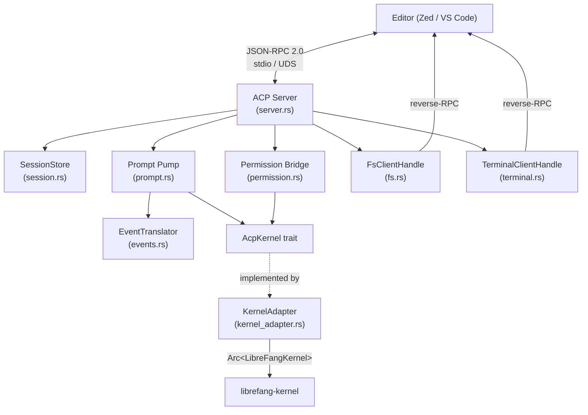

# Agent Control Protocol

# Agent Client Protocol (ACP) Adapter

Bridges LibreFang's agent runtime to the [Agent Client Protocol](https://agentclientprotocol.com/), enabling editors (Zed, VS Code, JetBrains) to embed a LibreFang agent with native approval modals, file references, streaming prompts, and terminal hosting — all over a JSON-RPC 2.0 duplex stream (typically stdio).

## Architecture Overview

## Module Layout

| File | Purpose |
|------|---------|
| `lib.rs` | `AcpKernel` trait definition, crate root, public re-exports |
| `error.rs` | `AcpError` enum and `AcpResult<T>` type alias |
| `events.rs` | `StreamEvent` → `SessionUpdate` translation |
| `session.rs` | `SessionStore` — concurrent map of ACP sessions |
| `server.rs` | Handler chain assembly, `run()` / `run_with_transport()` entry points |
| `prompt.rs` | `session/prompt` request handler — the core event pump |
| `permission.rs` | Approval bridge — kernel `ApprovalEvent` → ACP `request_permission` |
| `fs.rs` | `fs/read_text_file` / `fs/write_text_file` reverse-RPC client |
| `terminal.rs` | Five-method terminal state machine reverse-RPC client |
| `kernel_adapter.rs` | Concrete `AcpKernel` impl over `Arc<LibreFangKernel>` (feature-gated) |

## The `AcpKernel` Trait

The central abstraction. Everything in this crate talks to the kernel through [`AcpKernel`](lib.rs), not `LibreFangKernel` directly. This decouples the ACP server from the heavy kernel dependency tree and makes integration testing possible with stub implementations.

Key methods:

- **`resolve_agent(name_or_id)`** — Resolves a human-readable name or UUID to an `AgentId`. Called once at startup.
- **`send_prompt(agent_id, message, session_id)`** — Starts a streaming prompt turn. Returns an `mpsc::Receiver<StreamEvent>`.
- **`subscribe_approvals()`** — Returns a `broadcast::Receiver<ApprovalEvent>` for the permission bridge.
- **`resolve_approval(request_id, decision, decided_by)`** — Feeds an editor user's choice back to the kernel's approval gate.
- **`remember_decision(agent_id, tool_name, decision)`** — Persists "always" choices for short-circuiting future approvals.
- **`set_fs_client` / `register_session_fs` / `unregister_session_fs`** — Lifecycle hooks for the editor's filesystem reverse-RPC channel.
- **`set_terminal_client` / `register_session_terminal` / `unregister_session_terminal`** — Same pattern for terminal access.
- **`fetch_session_history(lf_session_id)`** — Pulls persisted `(role, text)` turns for chat rehydration.

All methods have default no-op implementations so test mocks only need to override what they use.

## Session Management

`SessionStore` (in `session.rs`) is a `DashMap`-backed concurrent map from ACP `SessionId` strings to `SessionState` structs containing:

- **`librefang_session_id`** — Derived deterministically from the ACP session id via `Uuid::new_v5` with a fixed namespace UUID. Same ACP id always maps to the same kernel session, so a reconnecting editor's `session/load` rejoins the persisted history.
- **`cwd`** — The working directory the editor declared at session creation.
- **`cancel`** — A `CancellationToken` triggered by `session/cancel` to interrupt an in-flight prompt pump.

The store supports reverse lookups (`find_by_librefang_id`) used by the permission bridge to map kernel approval events back to ACP sessions, and `drain_active` for cleanup when the connection drops without explicit `session/close`.

## Prompt Turn Lifecycle

The `prompt::handle` function drives a single `session/prompt` end-to-end:

1. Look up the ACP session, extract the `SessionState`.
2. Concatenate prompt content blocks into text via `concat_text_blocks` — non-text blocks (image, audio, resource links) degrade to bracketed placeholders. The count of converted blocks is emitted as a warning `session/update`.
3. Call `kernel.send_prompt()` to start the agent loop.
4. Pump events in a `tokio::select!` loop racing the cancel token against the event receiver.
5. Each `StreamEvent` goes through `EventTranslator::translate`, producing zero or more `SessionUpdate` notifications.
6. `StreamEvent::ContentComplete` is consumed to capture the `StopReason` but produces no wire update.
7. When the channel closes or cancel fires, map the stop reason and return a `PromptResponse`.

### Stop Reason Mapping

| LibreFang `StopReason` | ACP `StopReason` |
|------------------------|------------------|
| `EndTurn` | `EndTurn` |
| `MaxTokens` | `MaxTokens` |
| `ToolUse` | `EndTurn` |
| `StopSequence` | `EndTurn` |
| `ContentFiltered` | `Refusal` |
| (cancel token fired) | `Cancelled` |

## Event Translation

`EventTranslator` (in `events.rs`) is stateful — one instance per prompt turn. It maintains an `in_flight_by_name` map of tool-name → `VecDeque<ToolCallId>` to track which tool calls are running.

Translation rules:

| `StreamEvent` | Wire Output |
|---------------|-------------|
| `TextDelta` | `SessionUpdate::AgentMessageChunk` |
| `ThinkingDelta` | `SessionUpdate::AgentThoughtChunk` |
| `OwnerNotice` | `SessionUpdate::AgentMessageChunk` ( surfaced as regular text ) |
| `ToolUseStart` | `SessionUpdate::ToolCall` (status `Pending`); pushes id onto FIFO queue |
| `ToolInputDelta` | *Suppressed* — clients don't need raw JSON streaming |
| `ToolUseEnd` | `SessionUpdate::ToolCallUpdate` (status `InProgress`, carries `raw_input`) |
| `ToolExecutionResult` | `SessionUpdate::ToolCallUpdate` (status `Completed`/`Failed`); pops FIFO queue |
| `ContentComplete` | *Consumed internally* — no wire output |
| `PhaseChange` | *Consumed internally* — no wire output |

### Tool Kind Inference

`infer_tool_kind(name)` maps tool names to `ToolKind` variants by prefix/pattern matching (e.g., `bash` → `Execute`, `read_*` → `Read`, `write_*`/`edit` → `Edit`, `search`/`grep` → `Search`). Unknown tools default to `Other`.

### Parallel Same-Named Tool Calls

When multiple calls to the same tool are in flight, `ToolExecutionResult` lacks the originating `tool_use_id`. The translator uses a FIFO queue per tool name, popping the oldest entry. When ≥2 calls are pending, the result payload is prepended with a disambiguation note warning that the attribution may be a guess. This is a known limitation tracked as a follow-up — the proper fix requires `StreamEvent::ToolExecutionResult` to carry the originating tool-use id from the runtime.

## Permission Bridge

`permission::run_bridge` runs as a background task, subscribing to the kernel's approval broadcast channel:

1. Receives `ApprovalEvent::Created`.
2. Filters by session id — skips approvals not tagged with a session this ACP connection owns.
3. Maps the LibreFang session id back to its ACP counterpart via `SessionStore::find_by_librefang_id`.
4. Builds a `RequestPermissionRequest` with the tool call id (preferring the LLM-assigned `tool_use_id` from the approval, falling back to `approval-{request_id}`).
5. Sends the request to the editor and awaits response with a 60-second timeout.
6. Translates the outcome to `(ApprovalDecision, remember)` via `decision_from_outcome`.
7. If `remember` is true, calls `kernel.remember_decision()` before resolving.
8. Calls `kernel.resolve_approval()` which routes through `KernelHandle::resolve_tool_approval` — this is critical because that method both clears the pending entry *and* spawns the deferred tool execution. Calling `ApprovalManager::resolve` directly would hang the agent loop.

### High-Risk Tool Suppression

`is_high_risk_tool` suppresses the "Allow always" option for `shell_exec`, `file_write`, `file_delete`, `apply_patch`, and `skill_evolve_*` tools. The approval cache keys on `(agent_id, tool_name)` only — not args — so a blanket "Allow always" on these tools would grant excessive blast radius. Operators who want blanket allow must use the dashboard or `agent.toml`.

## Reverse-RPC: Filesystem

`FsClientHandle` (in `fs.rs`) wraps the ACP `ConnectionTo<Client>` to issue `fs/read_text_file` and `fs/write_text_file` requests to the editor. The editor is the file authority — it reads from its own buffers, in-memory edits, virtual filesystems — not the agent's local disk.

- 60-second timeout (`FS_RPC_TIMEOUT`) prevents a hung editor from freezing the agent loop.
- `FsCapabilities` captures what the editor declared at `initialize`.
- Implements `AcpFsClient` from `librefang-kernel-handle` so the kernel can route runtime tool calls through the editor without depending on ACP schema types.
- Session id in requests uses an empty placeholder — the connection itself scopes the request.

## Reverse-RPC: Terminal

`TerminalClientHandle` (in `terminal.rs`) wraps the five-method ACP terminal state machine:

1. `create` — Ask the editor to host a PTY (60s timeout).
2. `wait_for_exit` — Block until the command exits (600s timeout — commands can legitimately run long).
3. `output` — Snapshot captured stdout/stderr.
4. `kill` — Kill the process without releasing the terminal.
5. `release` — Drop the terminal entirely.

The `AcpTerminalClient::run_command` implementation chains create → wait_for_exit → output → release, always releasing even on intermediate failure.

## Error Handling

`AcpError` wraps three categories:

- **Protocol-level**: `UnknownSession`, `AgentNotFound`, `PromptInFlight` — mapped to `invalid_params` JSON-RPC errors.
- **Kernel-level**: `Kernel(#[from] LibreFangError)` — surfaces as `internal_error`.
- **Transport-level**: `Transport(#[from] agent_client_protocol::Error)` — passed through verbatim.
- **Internal**: catch-all for channel closures, task panics, timeouts.

`into_acp_error()` converts any variant into an `agent_client_protocol::Error` suitable for returning from request handlers.

## Kernel Adapter

`KernelAdapter` (feature-gated behind `kernel-adapter`) is the production `AcpKernel` impl:

- Wraps `Arc<LibreFangKernel>` plus `Arc<dyn KernelHandle>` (needed because `resolve_tool_approval` must go through the trait to spawn deferred tool execution).
- Holds `fs_client` and `terminal_client` behind `Arc<RwLock<Option<_>>>`, populated at `initialize`.
- `fetch_session_history` pulls from the kernel's memory substrate, filtering out system messages and concatenating text blocks.

## Server Entry Points

`run(kernel, agent_id)` — runs on stdio. Used by `librefang acp` CLI subcommand.

`run_with_transport(kernel, agent_id, transport)` — accepts any `ConnectTo<Agent>` transport. Used by:
- Integration tests via `tokio::io::duplex` pipes
- `librefang-api` daemon over Unix domain sockets (`acp_uds.rs`, `acp_pipe.rs`)

The server registers handlers for: `initialize`, `session/{new,load,resume,list,close,prompt,cancel}`, a catch-all dispatch for unimplemented methods (returns `method_not_found`), and spawns the permission bridge as a background task.

### Cleanup on Disconnect

After the JSON-RPC loop exits (stdin EOF, transport error, editor crash), `drain_active` removes all remaining sessions and unregisters their `fs/*` and `terminal/*` kernel handles. Without this, stale `Arc<dyn AcpFsClient>` entries would cause runtime tools to block for `FS_RPC_TIMEOUT` against a dead transport.

### History Replay on Load/Resume

`replay_session_history` emits up to `MAX_REPLAY_TURNS` (50) of the most recent persisted turns as `UserMessageChunk` / `AgentMessageChunk` notifications. Tool-call detail is not replayed — the goal is conversational context, not exact wire reconstruction.