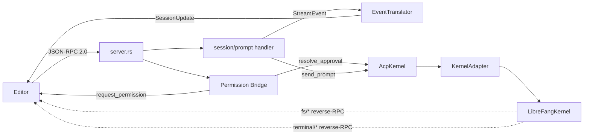

# Agent Control Protocol

# Agent Client Protocol (ACP) Adapter

## Overview

`librefang-acp` bridges LibreFang's agent runtime to the [Agent Client Protocol](https://agentclientprotocol.com/) — a JSON-RPC 2.0 protocol over a duplex byte stream (typically stdio). Editors like Zed, VS Code, and JetBrains use ACP to embed a LibreFang agent natively, providing their own approval modals, file access, terminal hosting, and prompt streaming UI instead of relying on the LibreFang dashboard.

The crate does not implement the wire format itself — that lives in the `agent-client-protocol` crate published by Zed. This crate provides the LibreFang-specific glue: translating events, managing sessions, routing permissions, and exposing reverse-RPC channels (filesystem and terminal) back through the editor.

## Architecture


```mermaid
graph LR
    E[Editor] -->|JSON-RPC 2.0| S[server.rs]
    S --> H[session/prompt handler]
    H -->|StreamEvent| ET[EventTranslator]
    ET -->|SessionUpdate| E
    S --> PB[Permission Bridge]
    PB -->|request_permission| E
    PB -->|resolve_approval| K[AcpKernel]
    H -->|send_prompt| K
    K --> KH[KernelAdapter]
    KH --> FK[LibreFangKernel]
    FK -.->|fs/* reverse-RPC| E
    FK -.->|terminal/* reverse-RPC| E
```

**Data flow for a prompt turn:**

1. The editor sends `session/prompt` with the user's message.
2. `prompt::handle` concatenates text blocks, calls `AcpKernel::send_prompt`.
3. The kernel returns an `mpsc::Receiver<StreamEvent>`.
4. The prompt pump translates each `StreamEvent` into `SessionUpdate` notifications via `EventTranslator` and streams them to the editor.
5. `StreamEvent::ContentComplete` carries the `StopReason` for the `PromptResponse`.
6. If the agent invokes a tool requiring approval, the kernel broadcasts an `ApprovalEvent`. The permission bridge translates it into a `session/request_permission` round-trip to the editor, then feeds the user's decision back via `AcpKernel::resolve_approval`.

## Public API

### Entry Points

- **`run(kernel, agent_id)`** — Start the ACP server on stdio. Blocks until stdin closes or the transport errors. Used by `librefang acp` CLI subcommand.
- **`run_with_transport(kernel, agent_id, transport)`** — Same server logic with an explicit transport. Used by integration tests and the daemon-attached UDS listener (`librefang-api`).

Both accept a `SharedAcpKernel` (`Arc<dyn AcpKernel>`) and an `AgentId`.

### `AcpKernel` Trait

The minimal kernel surface the ACP adapter requires. Extracted as a trait for testability and to avoid a direct dependency on `librefang-kernel`.

| Method | Purpose |
|---|---|
| `resolve_agent(name_or_id)` | Resolve a name or UUID to an `AgentId`. Called once at startup. |
| `send_prompt(agent_id, message, session_id)` | Begin a streaming prompt turn. Returns `mpsc::Receiver<StreamEvent>`. |
| `subscribe_approvals()` | Subscribe to `ApprovalEvent` broadcasts. |
| `resolve_approval(request_id, decision, decided_by)` | Resolve a pending approval after the editor user picks an option. |
| `remember_decision(agent_id, tool_name, decision)` | Persist an "always" decision for future short-circuiting. |
| `set_fs_client(handle)` | Hand the kernel an `FsClientHandle` for reverse-RPC `fs/*` calls. |
| `set_terminal_client(handle)` | Same for `terminal/*`. |
| `register_session_fs(lf_session_id)` | Bind the `fs/*` client to a LibreFang session. |
| `unregister_session_fs(lf_session_id)` | Drop the registration on session close. |
| `register_session_terminal` / `unregister_session_terminal` | Terminal equivalents. |
| `fetch_session_history(lf_session_id)` | Pull persisted message history for `session/load` replay. |

Default implementations are no-ops, so test mocks only need to override what they use.

### `KernelAdapter`

Concrete `AcpKernel` implementation over `Arc<LibreFangKernel>`. Lives behind the `kernel-adapter` feature gate. Both the in-process CLI path and the daemon-attached UDS listener instantiate this against the same kernel.

Key implementation details:

- Holds the kernel both as the concrete type (for methods not on `KernelHandle`) and as a `KernelHandle` trait object.
- `resolve_approval` routes through `KernelHandle::resolve_tool_approval` — not `ApprovalManager::resolve` directly — because the trait method wraps both the resolve *and* the deferred tool execution spawn. Bypassing it would cause the agent loop to hang after the user clicks "Allow once".
- `resolve_agent` accepts both UUIDs and human-readable names via the registry's name index.
- `fs_client` and `terminal_client` are stored in `Arc<RwLock<Option<_>>>` since they're populated at `initialize` time and read by subsequent handlers.

## Module Breakdown

### `error` — Error Types

`AcpError` is the crate's unified error enum:

| Variant | Meaning |
|---|---|
| `UnknownSession(session_id)` | The ACP session ID doesn't map to a `session/new` session. |
| `AgentNotFound(name_or_id)` | The agent name or UUID cannot be resolved. |
| `Kernel(LibreFangError)` | Wrapped kernel-level error. |
| `Transport(agent_client_protocol::Error)` | Wire-level JSON-RPC error. |
| `PromptInFlight(session_id)` | A prompt is already running for this session. |
| `Internal(msg)` | Catch-all for channel closures, task panics, etc. |

`into_acp_error()` converts to the protocol crate's error type: `UnknownSession` and `AgentNotFound` become `invalid_params` with a reason; `Transport` passes through; everything else becomes `internal_error`.

`AcpResult<T>` is `Result<T, AcpError>`.

### `events` — Stream Event Translation

`EventTranslator` is a stateful, per-session translator that converts `librefang_llm_driver::StreamEvent` values into ACP `SessionUpdate` notifications.

**Translation mapping:**

| StreamEvent | SessionUpdate |
|---|---|
| `TextDelta` | `AgentMessageChunk` |
| `ThinkingDelta` | `AgentThoughtChunk` |
| `OwnerNotice` | `AgentMessageChunk` (Phase 1; dedicated treatment in Phase 2) |
| `ToolUseStart` | `ToolCall` with status `Pending` |
| `ToolInputDelta` | *Suppressed* (too chatty; input arrives with `ToolUseEnd`) |
| `ToolUseEnd` | `ToolCallUpdate` with `InProgress` + `raw_input` |
| `ToolExecutionResult` | `ToolCallUpdate` with `Completed`/`Failed` + content |
| `ContentComplete` | *No wire update* — consumed by the pump for `StopReason` |
| `PhaseChange` | *No wire update* |

**Tool call ID tracking:** The translator maintains `in_flight_by_name: HashMap<String, VecDeque<ToolCallId>>` — a FIFO queue per tool name. `ToolExecutionResult` events carry only a `name`, not an `id`, so the translator pops the front of the queue to attribute the result.

**Parallel same-named calls limitation:** When ≥2 calls to the same tool are in flight and results arrive, the FIFO pop is a best-effort guess. The translator prepends a disambiguation note to the result content so the editor user knows the attribution may be wrong. The proper fix requires `StreamEvent::ToolExecutionResult` to carry the originating tool-use ID (tracked as a follow-up).

**Queue reaping:** Once a tool name's queue drains, the `HashMap` entry is removed to prevent unbounded growth over the session lifetime (#5144).

`infer_tool_kind(name)` does best-effort mapping from tool name strings to `ToolKind` categories (Read, Edit, Delete, Move, Search, Execute, Think, Fetch, Other) based on naming conventions.

### `session` — Session State Management

`SessionStore` is a `DashMap<AcpSessionId, SessionState>` providing concurrent access from all handlers.

`SessionState` holds:
- `librefang_session_id: LfSessionId` — derived deterministically via UUID v5 from the ACP session ID string (namespace `ACP_SESSION_NS`). Same input ⇒ same kernel session, so reconnecting editors resume the same persisted history.
- `cwd: PathBuf` — the editor's declared working directory.
- `cancel: CancellationToken` — triggered by `session/cancel` to interrupt the prompt pump.

Key operations:
- `find_by_librefang_id(lf_id)` — reverse lookup used by the permission bridge to map kernel `ApprovalRequest.session_id` back to an ACP session.
- `drain_active()` — empties the store, returning all `(AcpSessionId, LfSessionId)` pairs. Used by the server's cleanup path when the connection drops without explicit `session/close`.

### `prompt` — Prompt Turn Handler

`handle()` drives a single `session/prompt` end-to-end:

1. Looks up the ACP session to get the `LfSessionId` and cancel token.
2. Calls `concat_text_blocks()` to extract text from the prompt. Non-text blocks (image, audio, resource links) are converted to bracketed placeholders — true multimodal is a separate epic. A warning notification is emitted when blocks are converted.
3. Calls `AcpKernel::send_prompt` to start the streaming agent turn.
4. Pumps events in a `tokio::select!` loop, racing the event channel against the cancel token.
5. Each `StreamEvent` is translated and sent as a `SessionUpdate` notification.
6. On channel close or cancellation, resolves the `StopReason` and returns a `PromptResponse`.

`map_stop_reason()` converts `LfStopReason` → ACP `StopReason`:
- `EndTurn` → `EndTurn`
- `MaxTokens` → `MaxTokens`
- `ToolUse` / `StopSequence` → `EndTurn` (agent is mid-turn; editor should let user reply)
- `ContentFiltered` → `Refusal`

### `permission` — Approval Bridge

Runs as a background task (`permission::run_bridge`) that subscribes to the kernel's `ApprovalEvent` broadcast and forwards matching events to the editor.

**Flow:**
1. Receives `ApprovalEvent::Created` from the broadcast.
2. Extracts the `session_id`, maps it back to an ACP session ID via `SessionStore::find_by_librefang_id`.
3. Builds a `RequestPermissionRequest` with the tool call ID (from `tool_use_id` or synthetic `approval-{req_id}`), title, and permission options.
4. Sends it to the editor and waits up to 60 seconds (`PERMISSION_TIMEOUT`).
5. On response (or timeout), translates the outcome via `decision_from_outcome()` and calls `AcpKernel::resolve_approval`.

**High-risk tool suppression:** `is_high_risk_tool()` identifies tools (`shell_exec`, `file_write`, `file_delete`, `apply_patch`, `skill_evolve_*`) where "Allow always" is hidden from the modal. This is a security mitigation: the in-memory remembered-decision cache keys on `(agent_id, tool_name)` only — not args — so one "Allow always" click would grant unrestricted access. Users who want blanket allow must set policy via dashboard or config.

**Permission options for normal tools:** Allow once, Allow always, Deny, Deny always.
**Permission options for high-risk tools:** Allow once, Deny, Deny always.

Approvals are serialized (one at a time) to keep tests deterministic and avoid spawn context issues.

### `fs` — Filesystem Reverse-RPC

Editors, not the agent's local filesystem, are the file source in ACP. `fs/read_text_file` and `fs/write_text_file` are agent→client requests.

`FsClientHandle` wraps `ConnectionTo<Client>` with:
- `read_text_file(session_id, path, line, limit)` — issues the request with a 60s timeout.
- `write_text_file(session_id, path, content)` — same.
- `capabilities()` — returns `FsCapabilities` snapshot (bools for `read_text_file`, `write_text_file`).

`FsClientHandle` implements `librefang_kernel_handle::AcpFsClient` so the kernel can route runtime tool calls through the editor without depending on the ACP schema crate. The ACP `SessionId` in the request is set to empty string (editors echo it without inspecting — the request is implicitly scoped by connection).

### `terminal` — Terminal Reverse-RPC

ACP's terminal family is a five-method state machine:

| Method | Purpose |
|---|---|
| `terminal/create` | Ask the editor to host a new PTY. Returns a `TerminalId`. |
| `terminal/wait_for_exit` | Block until the command exits (up to 10 minutes). |
| `terminal/output` | Snapshot stdout/stderr captured so far. |
| `terminal/kill` | Kill the process without releasing the terminal. |
| `terminal/release` | Drop the terminal entirely. |

`TerminalClientHandle` wraps all five methods with appropriate timeouts (60s for most, 600s for `wait_for_exit`).

The `AcpTerminalClient` trait implementation provides `run_command()` — a convenience that performs the full create → wait_for_exit → output → release dance, mirroring synchronous `shell_exec` semantics. Terminal release happens in a cleanup block after the result is collected, with a warning logged on failure.

### `server` — Handler Assembly

Assembles the `agent_client_protocol::Agent` builder with handlers for:

| Method | Behavior |
|---|---|
| `initialize` | Sets `FsClientHandle` and `TerminalClientHandle` on the kernel. Declares capabilities (session list/resume/close, no multimodal prompt). |
| `session/new` | Mints a UUID v4 ACP session ID, derives the `LfSessionId`, registers fs/terminal clients, stores in `SessionStore`. |
| `session/load` | Creates/overwrites the session mapping, registers fs/terminal, replays history (up to 50 most recent turns) as `session/update` notifications. |
| `session/resume` | Same as load in Phase 1 — both create-or-replace. |
| `session/list` | Enumerates active sessions, optionally filtered by `cwd`. |
| `session/close` | Removes the session, unregisters fs/terminal clients. |
| `session/prompt` | Delegates to `prompt::handle`. |
| `session/cancel` | Fires the session's `CancellationToken`. |
| *catch-all* | Returns `method_not_found` for unimplemented methods so editors gracefully skip optional features. |

The permission bridge is spawned as a background task via `with_spawned`.

**Cleanup guard:** After `connect_to` returns (cleanly or on error), the server drains all remaining sessions and unregisters their fs/terminal clients. Without this, a crashed editor would leave stale `Arc<dyn AcpFsClient>` entries in the kernel registry, and subsequent tool calls would block for 60s against the closed transport.

## ACP Session ↔ LibreFang Session Mapping

The mapping is deterministic:

```
ACP SessionId (UUID v4 string)
    → UUID v5(namespace=ACP_SESSION_NS, name=ACP_SessionId_string)
    → LfSessionId(UUID)
```

Same ACP session ID always produces the same LibreFang session ID, so a reconnecting editor's `session/load` picks up the existing persisted history. The namespace UUID is `a30c713a-4b1c-4f6e-b512-9c7f88d0a142`.

## Timeouts

| Constant | Duration | Purpose |
|---|---|---|
| `FS_RPC_TIMEOUT` | 60s | `fs/read_text_file`, `fs/write_text_file` |
| `TERMINAL_RPC_TIMEOUT` | 60s | `terminal/create`, `output`, `kill`, `release` |
| `TERMINAL_WAIT_TIMEOUT` | 600s | `terminal/wait_for_exit` |
| `PERMISSION_TIMEOUT` | 60s | `session/request_permission` |

All reverse-RPC timeouts mirror each other at 60s except `terminal/wait_for_exit` (10 minutes for long-running commands). On timeout the caller falls back to local behavior.

## Feature Flags

- **`kernel-adapter`** — Enables `KernelAdapter`, the concrete `AcpKernel` implementation over `Arc<LibreFangKernel>`. Without this feature, the crate only provides the trait and protocol glue; consumers must supply their own implementation.