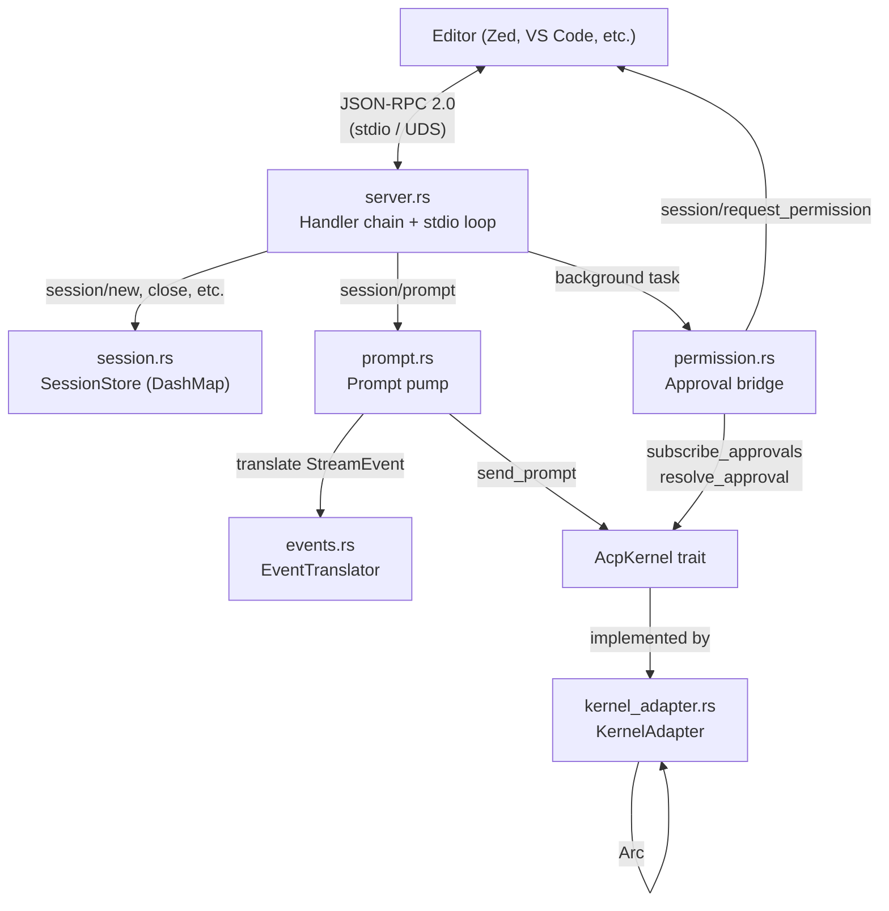

# Agent Control Protocol

# Agent Client Protocol (ACP) Adapter

## Purpose

`librefang-acp` bridges LibreFang's agent runtime to the [Agent Client Protocol](https://agentclientprotocol.com/) — a JSON-RPC 2.0 protocol over a duplex byte stream (typically stdio). Editors like Zed, VS Code, and JetBrains embed a LibreFang agent natively through this adapter: the editor provides approval modals, file references, image attachments, and prompt streaming through its own UI rather than the LibreFang dashboard.

The crate is intentionally thin on protocol logic. Wire framing, schema types, and the JSON-RPC dispatch loop are handled by the external `agent-client-protocol` crate. This crate only provides the LibreFang-specific glue: translating between LibreFang's internal event stream and ACP's notification model, managing session identity, and routing reverse-RPCs (file reads, terminal execution) back through the editor.

## Architecture


```mermaid
graph TD
    Editor["Editor (Zed, VS Code, etc.)"]
    Server["server.rs<br/>Handler chain + stdio loop"]
    Session["session.rs<br/>SessionStore (DashMap)"]
    Prompt["prompt.rs<br/>Prompt pump"]
    Events["events.rs<br/>EventTranslator"]
    Permission["permission.rs<br/>Approval bridge"]
    Kernel["AcpKernel trait"]
    Adapter["kernel_adapter.rs<br/>KernelAdapter"]

    Editor <-->|"JSON-RPC 2.0<br/>(stdio / UDS)"| Server
    Server -->|"session/prompt"| Prompt
    Server -->|"session/new, close, etc."| Session
    Server -->|"background task"| Permission
    Prompt -->|"translate StreamEvent"| Events
    Prompt -->|"send_prompt"| Kernel
    Permission -->|"subscribe_approvals<br/>resolve_approval"| Kernel
    Permission -->|"session/request_permission"| Editor
    Kernel -->|"implemented by"| Adapter
    Adapter -->|"Arc<LibreFangKernel>"| Adapter
```

## Entry Points

### `run(kernel, agent_id)`

Starts the ACP server on stdio. Used by the `librefang acp` CLI subcommand for in-process execution. Returns when stdin closes or the transport errors.

### `run_with_transport(kernel, agent_id, transport)`

Same as `run` but accepts an explicit transport. Used by the daemon-attached UDS listener (`librefang-api`) and integration tests (which drive the server over a `tokio::io::duplex` pipe).

Both functions build the handler chain via `Agent.builder()`, wire up all session lifecycle and prompt handlers, spawn the permission bridge as a background task, and run a cleanup pass on drop that unregisters any sessions that didn't get an explicit `session/close` (editor crash, network drop).

## The `AcpKernel` Trait

Defined in `lib.rs`, this is the minimal kernel surface the ACP adapter needs. Extracted as a trait so:

1. The server is testable in isolation — integration tests use a stub impl that returns canned `StreamEvent` sequences without booting a real kernel.
2. The crate doesn't depend on `librefang-kernel` by default. The concrete `KernelAdapter` lives behind the `kernel-adapter` feature flag.

Key methods:

| Method | Purpose |
|--------|---------|
| `resolve_agent` | Map a name or UUID string to an `AgentId`. Called once at startup. |
| `send_prompt` | Start a streaming prompt turn. Returns an `mpsc::Receiver<StreamEvent>`. |
| `subscribe_approvals` | Subscribe to kernel `ApprovalEvent`s for the permission bridge. |
| `resolve_approval` | Feed an editor user's decision back to the kernel's approval gate. |
| `remember_decision` | Persist an "always" choice for `(agent_id, tool_name)`. |
| `set_fs_client` / `set_terminal_client` | Hand the kernel a reverse-RPC handle for editor-mediated fs/terminal ops. |
| `register_session_fs` / `register_session_terminal` | Bind those handles to a specific LibreFang session. |
| `fetch_session_history` | Pull persisted message history for `session/load` replay. |

Most methods have no-op defaults so test mocks only need to override what they exercise.

## Session Management (`session.rs`)

ACP sessions are created by `session/new` and tracked in a `SessionStore` — a `DashMap<AcpSessionId, SessionState>` wrapped in `Arc` and cloned into every handler.

Each `SessionState` holds:

- **`librefang_session_id`** — A `Uuid::new_v5` derived deterministically from the ACP session id string and a namespace UUID (`ACP_SESSION_NS`). Same ACP id always maps to the same kernel-side session, so a reconnecting editor's `session/load` rejoins the persisted conversation.
- **`cwd`** — The working directory the editor declared at session creation.
- **`cancel`** — A `CancellationToken` triggered by `session/cancel` to interrupt an in-flight prompt pump.

The store supports forward lookup (`get`), reverse lookup (`find_by_librefang_id` — used by the permission bridge to map kernel approval events back to ACP sessions), enumeration (`list`), and a `drain_active` method used by the cleanup path to release all remaining sessions when the connection closes.

## Prompt Handling (`prompt.rs`)

`prompt::handle` drives a single `session/prompt` turn end-to-end:

1. **Lookup session** — Resolve the ACP `SessionId` to a `SessionState` (error if unknown).
2. **Concatenate text** — `concat_text_blocks` folds the prompt's `ContentBlock` sequence into a single text string. Non-text blocks (image, audio, resource links) degrade to bracketed placeholders (e.g., `[image attachment: image/png]`) since the multimodal pipeline isn't wired yet. A count of converted blocks triggers an informational `session/update` so the user knows the attachment landed but wasn't passed to the LLM verbatim.
3. **Start the agent turn** — Call `AcpKernel::send_prompt` to get the `mpsc::Receiver<StreamEvent>`.
4. **Pump events** — In a `tokio::select!` loop, race the event channel against the session's cancel token. Each `StreamEvent` is translated by `EventTranslator` into zero or more `SessionUpdate` notifications sent to the editor.
5. **Resolve stop reason** — On channel close or cancel, map the last `StreamEvent::ContentComplete`'s `StopReason` to ACP's `StopReason` and return a `PromptResponse`.

Stop reason mapping: `EndTurn` → `EndTurn`, `MaxTokens` → `MaxTokens`, `ContentFiltered` → `Refusal`, `ToolUse`/`StopSequence` → `EndTurn` (mid-turn states that ACP doesn't distinguish).

## Event Translation (`events.rs`)

`EventTranslator` is a stateful, per-session translator that converts `StreamEvent` values into `SessionUpdate` notifications. State is required because ACP models tool calls as a multi-step lifecycle:

```
ToolUseStart → ToolCall (Pending)
ToolUseEnd   → ToolCallUpdate (InProgress, with raw_input)
ToolExecutionResult → ToolCallUpdate (Completed/Failed, with content)
```

### In-flight tool tracking

`ToolExecutionResult` carries only a tool `name`, not an id. The translator maintains a `HashMap<String, VecDeque<ToolCallId>>` — a FIFO queue per tool name — so parallel calls of the same tool are disambiguated in start order.

**Known limitation:** When multiple same-named calls complete out of start-order, the FIFO pop attributes the first finished result to the first started call regardless of which actually finished. When ≥2 calls are in flight for the same name, the translator prepends a disambiguation note to the result content so the editor user can see the attribution may be a guess. The proper fix requires `StreamEvent::ToolExecutionResult` to carry the originating `tool_use_id` from the runtime (tracked as a follow-up).

Queue entries are reaped once drained to prevent unbounded growth over a long session (fixed in #5144).

### `infer_tool_kind`

Best-effort mapping from tool name to ACP `ToolKind` based on naming conventions (`read_*` → Read, `bash` → Execute, `write_*` → Edit, etc.). Falls back to `Other` for unrecognized names.

## Permission Bridge (`permission.rs`)

Runs as a background task spawned by the server builder. Subscribes to kernel `ApprovalEvent::Created` broadcasts, filters by LibreFang session id, and translates matching approvals into `session/request_permission` requests to the editor.

Flow:

1. Receive `ApprovalEvent::Created` from kernel broadcast.
2. Extract the `session_id`, map to an ACP session via `SessionStore::find_by_librefang_id`.
3. Build a `RequestPermissionRequest` with the tool call id (preferring the LLM-assigned `tool_use_id`, falling back to `approval-{request_id}`), title, and option set.
4. Send to editor, race the response against a **60-second timeout**.
5. On response (or timeout → deny), call `AcpKernel::resolve_approval` and optionally `remember_decision`.

### High-risk tool suppression

The in-memory "always" cache is keyed on `(agent_id, tool_name)` only — it does not bind to arguments. For high-risk tools (`shell_exec`, `file_write`, `file_delete`, `apply_patch`, `skill_evolve_*`), the "Allow always" option is suppressed from the modal. Users can still grant blanket access via the dashboard or `agent.toml`, where the scope is visible up front.

## Reverse-RPC: Filesystem (`fs.rs`)

ACP exposes `fs/read_text_file` and `fs/write_text_file` as agent→client requests: the editor is the file source, not the agent's local filesystem. `FsClientHandle` wraps the protocol connection and exposes:

- **`read_text_file`** — Issues the request, awaits the response with a **60-second timeout**. Returns the file content as a string.
- **`write_text_file`** — Same pattern, writes content to a path.
- **`capabilities`** — Snapshot of editor-declared `FileSystemCapabilities` from `initialize`.

The handle implements `AcpFsClient` from `librefang-kernel-handle`, bridging the kernel's registry (keyed by LibreFang `SessionId`) to the ACP transport. The ACP `SessionId` in the wire request is set to empty — the request is implicitly scoped by the connection.

## Reverse-RPC: Terminal (`terminal.rs`)

ACP's terminal family is a five-method state machine: `create`, `wait_for_exit`, `output`, `kill`, `release`. `TerminalClientHandle` wraps all five and provides a higher-level `run_command` that performs the full dance:

```
create → wait_for_exit → output → release
```

The `release` call happens regardless of intermediate success/failure (with a warning on failure) to prevent editor-side terminal leaks.

Timeouts:
- Most calls: 60 seconds (`TERMINAL_RPC_TIMEOUT`)
- `wait_for_exit`: 10 minutes (`TERMINAL_WAIT_TIMEOUT`) — legitimate long-running commands need time.

## Error Handling (`error.rs`)

`AcpError` wraps kernel-level `LibreFangError`, transport-level `agent_client_protocol::Error`, and adapter-specific conditions (unknown session, agent not found, prompt already in flight, internal failures).

`into_acp_error()` converts to the protocol crate's error type for wire responses:
- `UnknownSession` / `AgentNotFound` → `invalid_params` with a reason data field
- `Transport` errors → passed through verbatim
- Everything else → `internal_error`

## Concrete Kernel Adapter (`kernel_adapter.rs`)

Behind the `kernel-adapter` feature flag. `KernelAdapter` wraps `Arc<LibreFangKernel>` and implements `AcpKernel`. Notable implementation details:

- **`resolve_agent`** accepts either a UUID or a human-readable name, resolving through the kernel's agent registry.
- **`send_prompt`** delegates to `send_message_streaming_with_routing_and_session_override`, flattening kernel errors through `to_string` (Phase 2 will narrow the error type).
- **`resolve_approval`** routes through the `KernelHandle` trait (not `ApprovalManager::resolve` directly) so deferred tool execution spawns correctly — calling `resolve` alone would clear the pending entry but leave the agent loop hanging.
- **`fetch_session_history`** pulls from the memory substrate, filtering out system messages and concatenating text blocks.

## Server Assembly (`server.rs`)

Builds the full handler chain on `Agent.builder()`:

| Handler | ACP Method |
|---------|-----------|
| `on_receive_request` | `initialize` — captures capabilities, hands kernel the fs/terminal handles |
| `on_receive_request` | `session/new` — creates session state, registers fs/terminal clients |
| `on_receive_request` | `session/load` — creates state + replays up to 50 most recent history turns |
| `on_receive_request` | `session/resume` — same as load |
| `on_receive_request` | `session/list` — enumerates sessions, optionally filtered by cwd |
| `on_receive_request` | `session/close` — removes session, unregisters fs/terminal clients |
| `on_receive_request` | `session/prompt` — delegates to `prompt::handle` |
| `on_receive_notification` | `session/cancel` — triggers the session's cancel token |
| `on_receive_dispatch` | Catch-all — returns `method_not_found` for unimplemented methods |

The permission bridge runs via `with_spawned` as a background task.

### History replay

`session/load` and `session/resume` call `replay_session_history`, which pulls persisted messages from the kernel and emits them as `UserMessageChunk` / `AgentMessageChunk` notifications. Capped at the most recent 50 turns (`MAX_REPLAY_TURNS`) to avoid flooding the editor's buffer. System messages are filtered out.

### Cleanup on disconnect

After `connect_to` returns, the server drains all remaining sessions and unregisters their fs/terminal clients. This handles editor crashes and network drops where `session/close` never arrives — without it, stale `Arc<dyn AcpFsClient>` entries would linger and cause 60-second timeouts on subsequent tool calls.

## Feature Flags

| Flag | Effect |
|------|--------|
| `kernel-adapter` | Enables `kernel_adapter::KernelAdapter` and the dependency on `librefang-kernel`. Off by default so pure-protocol consumers (tests, tooling) stay lightweight. |