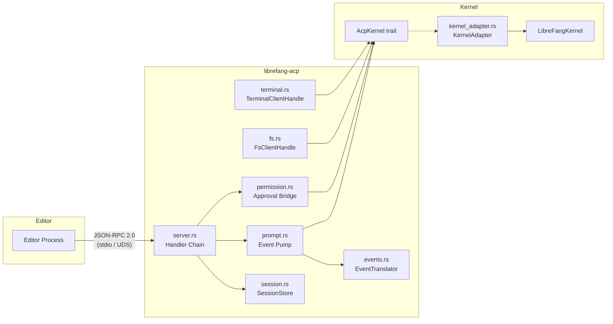

# Agent Control Protocol

# Agent Client Protocol (ACP) Adapter

## Overview

`librefang-acp` bridges LibreFang's agent runtime to the [Agent Client Protocol](https://agentclientprotocol.com/), a JSON-RPC 2.0 protocol over a duplex byte stream (typically stdio). This lets editors—Zed, VS Code, JetBrains—embed a LibreFang agent natively, with the editor providing approval modals, file I/O, terminal hosting, and prompt streaming through its own UI rather than the LibreFang dashboard.

The crate handles only the LibreFang-specific glue layer. Wire-format serialization, JSON-RPC framing, and the schema types come from the external `agent-client-protocol` crate.

## Architecture

```mermaid
graph LR
    subgraph Editor
        E[Editor Process]
    end
    subgraph librefang-acp
        SV[server.rs<br/>Handler Chain]
        PR[prompt.rs<br/>Event Pump]
        EV[events.rs<br/>EventTranslator]
        PM[permission.rs<br/>Approval Bridge]
        FS[fs.rs<br/>FsClientHandle]
        TM[terminal.rs<br/>TerminalClientHandle]
        SS[session.rs<br/>SessionStore]
    end
    subgraph Kernel
        AK[AcpKernel trait]
        KA[kernel_adapter.rs<br/>KernelAdapter]
        K[LibreFangKernel]
    end
    E -- "JSON-RPC 2.0<br/>(stdio / UDS)" --> SV
    SV --> PR
    PR --> EV
    SV --> PM
    SV --> SS
    PR --> AK
    PM --> AK
    FS --> AK
    TM --> AK
    AK -.-> KA
    KA --> K
```

The adapter is split into a transport-agnostic trait (`AcpKernel`) and a concrete implementation (`KernelAdapter`, behind the `kernel-adapter` feature). This separation means the ACP server is testable without booting a real kernel—integration tests in `tests/acp_integration.rs` use a stub impl that returns canned `StreamEvent` sequences.

## Entry Points

**`run(kernel, agent_id)`** — Bind to stdio. Used by the `librefang acp` CLI subcommand for in-process execution.

**`run_with_transport(kernel, agent_id, transport)`** — Accept an explicit transport. Used by the daemon-attached UDS listener (`librefang-api`) and integration tests driving the server over a `tokio::io::duplex` pipe.

Both functions clone `Arc<AcpKernel>` and `Arc<SessionStore>` into each handler closure, assemble the handler chain on an `Agent.builder()`, spawn the permission bridge as a background task, and drive the JSON-RPC loop until the transport closes. On exit, a drop-guard drains all remaining sessions and unregisters their kernel-side `fs/*` and `terminal/*` handles so stale connections don't leak.

## Session Lifecycle

Sessions are managed in `session::SessionStore`, a `DashMap<AcpSessionId, SessionState>` shared across all handlers. Each `SessionState` holds:

- **`librefang_session_id`** — The kernel-side session UUID, derived deterministically from the ACP session id via `Uuid::new_v5` using a fixed namespace. Same ACP id always maps to the same kernel session, so a reconnecting editor's `session/load` rejoins the existing persisted history.
- **`cwd`** — The project root the editor declared at session creation, surfaced to the agent loop for resolving file-relative paths.
- **`cancel`** — A `CancellationToken` triggered by `session/cancel` notifications to interrupt the active prompt pump.

| ACP Method | Behavior |
|---|---|
| `session/new` | Mints a UUID v4 ACP session id, derives the kernel session, inserts into the store, registers `fs/*` and `terminal/*` clients. |
| `session/load` | Creates or replaces the mapping, then replays persisted message history (most recent 50 turns) as `session/update` notifications so the editor's chat panel rehydrates. |
| `session/resume` | Same as load in Phase 1—both create-or-replace the mapping with history replay. |
| `session/list` | Returns all sessions, optionally filtered by `cwd`. |
| `session/close` | Removes the session, unregisters `fs/*` and `terminal/*` clients from the kernel. |
| `session/cancel` | Fires the session's `CancellationToken`, breaking the prompt pump's `select!`. |

## Prompt Handling

`prompt::handle` drives a single prompt turn end-to-end:

1. Look up the ACP session and resolve to a LibreFang `SessionId`.
2. Concatenate the prompt's content blocks via `concat_text_blocks`. Only text blocks pass through verbatim; image/audio/resource-link blocks degrade to bracketed placeholders (e.g. `[image attachment: image/png]`) since the build doesn't yet pipe binary payloads to the LLM driver. The caller surfaces a warning notification when non-text blocks are converted.
3. Call `AcpKernel::send_prompt` to start a streaming agent turn, receiving an `mpsc::Receiver<StreamEvent>`.
4. Pump events in a `tokio::select!` loop, racing the event channel against the session's cancel token.
5. When the channel closes or cancel fires, resolve the `StopReason` from the last-seen `ContentComplete` event and return a `PromptResponse`.

`PromptResponse.stop_reason` mapping:

| LibreFang `StopReason` | ACP `StopReason` |
|---|---|
| `EndTurn` | `EndTurn` |
| `MaxTokens` | `MaxTokens` |
| `ToolUse`, `StopSequence` | `EndTurn` (agent is mid-turn in ACP's model) |
| `ContentFiltered` | `Refusal` |

## Event Translation

`events::EventTranslator` is a stateful translator instantiated once per prompt turn. It converts `StreamEvent` values from the agent loop into ACP `SessionUpdate` notifications:

| `StreamEvent` variant | ACP `SessionUpdate` |
|---|---|
| `TextDelta` | `AgentMessageChunk` |
| `ThinkingDelta` | `AgentThoughtChunk` |
| `OwnerNotice` | `AgentMessageChunk` (Phase 1; dedicated variant planned) |
| `ToolUseStart` | `ToolCall` (status: `Pending`) |
| `ToolInputDelta` | Suppressed — too granular for wire |
| `ToolUseEnd` | `ToolCallUpdate` (status: `InProgress`, raw input attached) |
| `ToolExecutionResult` | `ToolCallUpdate` (status: `Completed` or `Failed`) |
| `ContentComplete`, `PhaseChange` | No wire update — consumed by the pump for `StopReason` |

### Tool Call ID Tracking

`ToolExecutionResult` carries only a tool `name`, not an `id`. The translator maintains a `HashMap<String, VecDeque<ToolCallId>>` — a FIFO queue per tool name — mapping results back to the originating `ToolUseStart` call. Empty queues are reaped from the map to prevent per-session memory growth.

**Known limitation:** When multiple same-named calls are in flight and complete out of start-order, the FIFO pop attributes the first finished result to the first started call regardless of which actually finished. When ≥2 calls are pending for the same name, the translator prepends a disambiguation note to the result content so the editor user knows the attribution is approximate.

### Tool Kind Inference

`infer_tool_kind` maps LibreFang tool names to ACP `ToolKind` categories by inspecting name prefixes and substrings (`read` → `Read`, `bash`/`exec` → `Execute`, etc.). Unknown names fall back to `ToolKind::Other`.

## Permission Bridge

`permission::run_bridge` runs as a background task, subscribing to the kernel's `ApprovalEvent` broadcast channel and forwarding `Created` events to the editor as `session/request_permission` requests.

The flow for each approval:

1. Filter by LibreFang session id — skip approvals from non-ACP surfaces.
2. Map the session id to the ACP session id via `SessionStore::find_by_librefang_id`.
3. Build permission options. High-risk tools (`shell_exec`, `file_write`, `file_delete`, `apply_patch`, `skill_evolve_*`) suppress the "Allow always" option because the kernel's remembered-decision cache keys on `(agent_id, tool_name)` only — no args hash — so a blanket allow would grant outsized blast radius.
4. Send the request to the editor with a 60-second timeout.
5. On response (or timeout), translate the outcome to `ApprovalDecision` and persist "always" choices via `AcpKernel::remember_decision` before resolving.

`resolve_approval` routes through the `KernelHandle` trait (not `ApprovalManager::resolve` directly) so the kernel's deferred-approval path spawns the queued tool execution. Without this routing, an editor "Allow once" would clear the approval record but the agent loop would hang waiting for a tool result that never lands.

## Reverse-RPC: File System

`fs::FsClientHandle` wraps `ConnectionTo<Client>` to issue `fs/read_text_file` and `fs/write_text_file` requests back to the editor. The editor is the file authority — reads come from its current buffer/virtual filesystem, not the agent process's local disk.

- `FsCapabilities` captures the editor's declared support at `initialize` time so the runtime can short-circuit when the editor doesn't support the operation.
- All calls carry a 60-second timeout (`FS_RPC_TIMEOUT`) to prevent a hung editor from freezing the agent loop.
- `FsClientHandle` implements the kernel's `AcpFsClient` trait, bridging into the kernel registry so runtime tool calls route through the editor without depending on ACP schema types.

Session binding: `set_fs_client` is called at `initialize`; `register_session_fs` binds the handle to a specific LibreFang session at `session/{new,load,resume}`; `unregister_session_fs` drops the binding at `session/close`.

## Reverse-RPC: Terminal

`terminal::TerminalClientHandle` exposes ACP's five-method terminal state machine:

1. `terminal/create` → returns a `TerminalId`
2. `terminal/wait_for_exit` → blocks until command exits (10-minute cap)
3. `terminal/output` → snapshots captured stdout/stderr
4. `terminal/kill` → kills the process without releasing
5. `terminal/release` → drops the terminal entirely

The `AcpTerminalClient::run_command` implementation orchestrates the full dance (create → wait_for_exit → output → release), always releasing on completion or failure. This mirrors the synchronous `shell_exec` semantics LibreFang's runtime tools already expect.

## Kernel Adapter

`kernel_adapter::KernelAdapter` (behind the `kernel-adapter` feature) is the concrete `AcpKernel` implementation wrapping `Arc<LibreFangKernel>`. It holds the kernel both as the concrete type (for methods like `send_message_streaming_with_routing_and_session_override`) and as a `KernelHandle` trait object (for `resolve_tool_approval`, which must go through the trait to trigger deferred tool execution).

Key behaviors:

- **Agent resolution:** Accepts UUID strings or human-readable agent names via the registry's name index.
- **Prompt dispatch:** Calls into the kernel's streaming send, flattening kernel errors through `to_string` (typed conversion planned for Phase 2).
- **Session history:** Pulls persisted messages from the memory substrate, filtering out system prompts and concatenating text blocks. Empty/error paths degrade to empty history so the editor's `session/load` always succeeds.

## Error Handling

`AcpError` wraps kernel-level `LibreFangError`, transport-level `agent_client_protocol::Error`, and adapter-specific conditions:

| Variant | Meaning | JSON-RPC Mapping |
|---|---|---|
| `UnknownSession` | Session id not from `session/new` | `invalid_params` with reason |
| `AgentNotFound` | Agent name/id unresolvable | `invalid_params` with reason |
| `Kernel` | Structured kernel error | `internal_error` |
| `Transport` | Wire-level failure | Pass-through |
| `PromptInFlight` | Concurrent prompt on same session | `internal_error` |
| `Internal` | Catch-all (channel closed, panic, timeout) | `internal_error` |

`into_acp_error()` converts any `AcpError` into a protocol-level error suitable for returning from request handlers.

## Initialization Handshake

The `initialize` handler:

1. Captures the editor's `FsCapabilities` and `TerminalCapabilities` from `client_capabilities`.
2. Creates `FsClientHandle` and `TerminalClientHandle` wrapping the connection and hands them to the kernel via `set_fs_client` / `set_terminal_client`.
3. Returns `AgentCapabilities` declaring session load/resume/close support, with `PromptCapabilities` defaulting all multimodal flags to `false` (image/audio/resource support is not yet plumbed).

## Cleanup

When the JSON-RPC loop ends — whether cleanly, via transport error, or editor crash — `run_with_transport` drains all remaining sessions and unregisters their kernel-side handles. This prevents stale `Arc<dyn AcpFsClient>` / `Arc<dyn AcpTerminalClient>` entries from blocking future registrations for the same deterministic `SessionId` with 60-second timeouts against a dead transport.