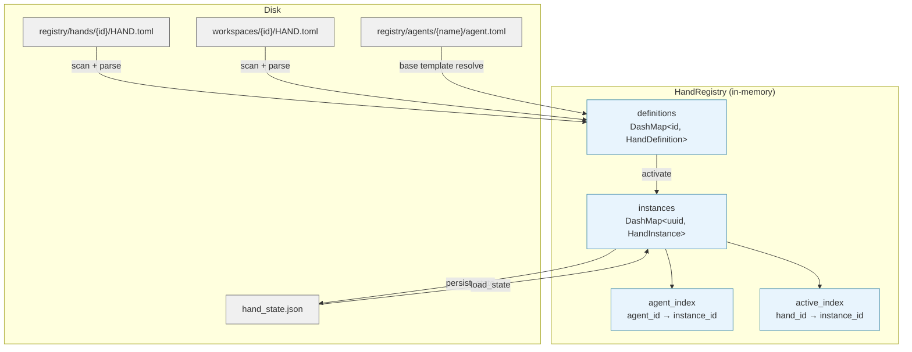

# Agent Hands

# Agent Hands

Hands are pre-built, domain-complete autonomous agent configurations that users activate from a marketplace. Unlike regular agents you chat with interactively, Hands run in the background — you check in on them, not the other way around.

Each Hand is defined by a `HAND.toml` file (with optional `SKILL.md` for agent instructions) and managed at runtime by the `HandRegistry`.

## Architecture



## HAND.toml Format

A `HAND.toml` describes everything about a hand: its identity, agents, requirements, settings, dashboard metrics, and routing hints.

### Single-Agent vs Multi-Agent

Hands support two agent declaration formats:

**Single-agent** — use `[agent]` at the top level. Internally stored as role `"main"` with `coordinator = true`:

```toml
[agent]
name = "clip-agent"
description = "Video clip creator"
system_prompt = "You create video clips."
```

**Multi-agent** — use `[agents.<role>]` sections. One agent should be marked `coordinator` (the one receiving user messages). If none is marked, the first by role name is used:

```toml
[agents.planner]
coordinator = true
invoke_hint = "Use planner for task decomposition"
name = "planner-agent"
system_prompt = "You plan tasks."

[agents.analyst]
name = "analyst-agent"
system_prompt = "You analyze data."
```

### Model Configuration — Nested vs Legacy Flat

Agents can declare their model config in two ways:

**Nested** (preferred for new hands):
```toml
[agents.planner.model]
provider = "anthropic"
model = "claude-sonnet-4-20250514"
max_tokens = 8192
temperature = 0.5
system_prompt = "You plan research."
```

**Legacy flat** (fields at the agent level):
```toml
[agents.planner]
name = "planner-agent"
provider = "groq"
model = "llama-3.3-70b-versatile"
system_prompt = "You plan."
```

Flat fields are auto-converted to nested format during parsing. The provider/model defaults are the string `"default"`, which the kernel resolves to the user's global default at agent spawn time.

### Base Template Reuse

Multi-agent entries can reference a shared agent template via `base`, avoiding duplication:

```toml
[agents.writer]
coordinator = true
base = "generic-chat"          # loaded from registry/agents/generic-chat/agent.toml
name = "blog-writer"           # overrides base name

[agents.writer.model]
system_prompt = "You write blog posts."  # overrides base prompt
# provider, model, max_tokens etc. inherited from base
```

Base templates are resolved by `parse_multi_agent_entry`, which loads the template TOML, normalizes flat fields to nested, and deep-merges the hand's overrides on top. Template names are validated against path traversal (`..`, `/`, `\`).

### Full Reference

```toml
id = "clip"
version = "1.2.0"
name = "Clip Hand"
description = "Autonomous video clip creation"
category = "content"
icon = "🎬"
tools = ["shell_exec"]
skills = ["video_editing"]
mcp_servers = []
allowed_plugins = []

[routing]
aliases = ["video editor", "clip maker"]
weak_aliases = ["cut video", "trim"]

[metadata]
frequency = "on-demand"
token_consumption = "medium"
default_active = false
activation_warning = "Uses FFmpeg for video processing"

[[requires]]
key = "ffmpeg"
label = "FFmpeg"
requirement_type = "binary"
check_value = "ffmpeg"
description = "Core video processing engine"
optional = false

[requires.install]
macos = "brew install ffmpeg"
linux_apt = "sudo apt install ffmpeg"
manual_url = "https://ffmpeg.org/download.html"
estimated_time = "2-5 min"

[[settings]]
key = "stt_provider"
label = "STT Provider"
description = "Speech-to-text engine"
setting_type = "select"
default = "auto"

[[settings.options]]
value = "auto"
label = "Auto-detect"

[[settings.options]]
value = "groq"
label = "Groq Whisper"
provider_env = "GROQ_API_KEY"
binary = "whisper"

[[dashboard.metrics]]
label = "Clips created"
memory_key = "clips_count"
format = "number"

[i18n.zh]
name = "剪辑 Hand"
description = "自主视频剪辑"
```

## Core Types

### `HandDefinition`

The parsed representation of a `HAND.toml`. Key fields:

| Field | Purpose |
|-------|---------|
| `id` | Unique identifier (e.g. `"clip"`) |
| `agents` | `BTreeMap<String, HandAgentManifest>` — role name to agent manifest. Single-agent hands use key `"main"`. |
| `requires` | `Vec<HandRequirement>` — checked before/during activation |
| `settings` | `Vec<HandSetting>` — user-facing configuration |
| `routing` | `HandRouting` — alias keywords for intent matching |
| `skill_content` | Bundled `SKILL.md` content (populated at load, not in TOML) |
| `agent_skill_content` | Per-role `SKILL-{role}.md` overrides |
| `i18n` | `HashMap<String, HandI18n>` — localized strings by language code |

Key methods:
- **`coordinator()`** → `Option<(&str, &HandAgentManifest)>` — finds the coordinator agent (explicit flag, or first by sort order)
- **`agent()`** → `Option<&AgentManifest>` — backward-compatible single-agent accessor
- **`is_multi_agent()`** → `bool` — true when more than one agent is defined

### `HandInstance`

A running instantiation of a `HandDefinition`. Created by `activate()`, tracked in the registry until `deactivate()`.

| Field | Purpose |
|-------|---------|
| `instance_id` | `Uuid` — unique per activation |
| `hand_id` | Which definition this is an instance of |
| `status` | `Active`, `Paused`, `Error(String)`, or `Inactive` |
| `agent_ids` | `BTreeMap<String, AgentId>` — role → spawned agent (populated by kernel) |
| `coordinator_role` | Explicitly persisted coordinator role name |
| `config` | User's configuration overrides |

Coordinator resolution follows a precedence chain:
1. Explicit `coordinator_role` if it matches an existing agent
2. Single-agent case: the only entry
3. Fallback to role named `"main"`
4. First agent by BTreeMap sort order

### `HandRequirement`

Declares a prerequisite for activation. `requirement_type` determines the check:

| Type | Check performed |
|------|----------------|
| `Binary` | Binary exists on PATH (special cases for `python3` and `chromium`) |
| `EnvVar` / `ApiKey` | Environment variable is set and non-empty |
| `AnyEnvVar` | Any of the comma-separated env vars in `check_value` is set |

Optional requirements (`optional = true`) don't block activation. When an active hand has unmet optional requirements, it's reported as **degraded** rather than "requirements not met".

### `HandSetting` and `resolve_settings`

Settings declared in `[[settings]]` are shown in the activation modal. Three types:

- **`Select`** — dropdown with `[[settings.options]]`. Options can declare `provider_env` / `binary` for availability badges.
- **`Toggle`** — boolean switch (`"true"`/`"false"`).
- **`Text`** — freeform input. Can declare `env_var` to expose the value.

`resolve_settings(settings, config)` produces:
- `prompt_block` — a markdown summary of the user's choices to inject into the system prompt
- `env_vars` — environment variable names the agent's subprocess needs access to (based on selected options)

### `HandError`

```rust
pub enum HandError {
    NotFound(String),           // hand_id not in registry
    AlreadyActive(String),      // hand already has a live instance
    AlreadyRegistered(String),  // hand_id already in definitions
    BuiltinHand(String),        // can't uninstall registry hands
    InstanceNotFound(Uuid),     // instance uuid not found
    ActivationFailed(String),   // generic activation error
    TomlParse(String),          // HAND.toml parse failure
    Io(std::io::Error),         // filesystem error
    Config(String),             // configuration error
}
```

## HandRegistry

Thread-safe (`Send + Sync`) registry managing hand definitions and active instances. All concurrent access uses lock-free `DashMap` for reads; a `Mutex` serializes the check-then-insert in `activate` to prevent duplicate activations.

### Definition Installation

Three installation paths, all going through `register_definition()` which rejects duplicate IDs:

| Method | Use case | Base templates | Persisted to disk |
|--------|----------|----------------|-------------------|
| `install_from_path` | Local directory install | ✅ resolved | No |
| `install_from_content` | API-based install from raw TOML | ❌ rejected | No |
| `install_from_content_persisted` | Dashboard "install from content" | ✅ resolved | Yes → `workspaces/{id}/` |

`install_from_content` explicitly rejects hands with `base` references because it has no access to the agents registry directory. Use `install_from_content_persisted` or `install_from_path` when templates are needed.

### Uninstallation

`uninstall_hand(home_dir, hand_id)` enforces three invariants:

1. **NotFound** — hand_id must exist in the registry
2. **BuiltinHand** — only hands with a `workspaces/{id}/HAND.toml` file can be removed. Registry-sourced hands live under `registry/hands/` and would be recreated on the next sync.
3. **AlreadyActive** — deactivate before uninstalling. Prevents dangling kernel references.

On success, removes the in-memory definition and deletes the `workspaces/{id}/` directory.

### Hand Discovery

`scan_hands_dir(home_dir)` searches two locations:

1. `home_dir/registry/hands/` — built-in hands from the shared registry tarball (reset on every sync)
2. `home_dir/workspaces/` — user-installed hands (survive restarts)

Subdirectories of `workspaces/` that aren't hands (e.g. agent workspace directories) are filtered out by the `HAND.toml` existence check. Registry entries take precedence on ID collisions.

Each hand directory can contain:
- `HAND.toml` (required)
- `SKILL.md` — shared skill content for all agents
- `SKILL-{role}.md` — per-agent skill override (e.g. `SKILL-planner.md`)

### Activation Lifecycle

```
1. Kernel receives activate request
2. registry.activate(hand_id, config)
   - Checks definition exists
   - Checks not already active (via active_index, O(1))
   - Creates HandInstance with fresh UUID
   - Inserts into instances, active_index
3. Kernel spawns agents (single or multi)
4. registry.set_agents(instance_id, agent_ids, coordinator_role)
   - Stores role → AgentId mapping
   - Updates agent_index for O(1) reverse lookup
5. registry.persist_state(path)
   - Writes Active/Paused/Error instances to hand_state.json
```

The `activate_lock` Mutex ensures two concurrent requests cannot both pass the "already active" check before either inserts.

### State Persistence

`persist_state()` writes all non-Inactive instances to `hand_state.json` (version 4 format). `load_state()` restores them, supporting backward compatibility with v1–v3 formats:

| Version | Format |
|---------|--------|
| v1 | Bare JSON array of instance objects |
| v2 | Single `agent_id` field (converted to `{"main": id}`) |
| v3 | `PersistedState` with versioned schema |
| v4 | Current — includes `coordinator_role`, `activated_at`, `updated_at` |

Errored and inactive instances are skipped during load. Restored instances preserve their original UUID via `activate_with_id()` so deterministic agent IDs remain stable across restarts.

### Readiness

`readiness(hand_id)` computes a snapshot combining requirement checks with runtime state:

```rust
pub struct HandReadiness {
    pub requirements_met: bool,  // all mandatory reqs satisfied
    pub active: bool,            // has a running instance
    pub degraded: bool,          // active but some reqs unmet
}
```

Only non-optional requirements gate `requirements_met`. Degraded is true when any requirement (optional or not) is unmet while the hand is active — some features may not work.

### Requirement Checking Details

`check_requirement` performs platform-aware checks:

- **Binary**: walks `PATH` segments, checks file existence and execute bit (Unix). Special cases:
  - `python3`: actually runs `python3 --version` / `python --version` and checks for "Python 3" in output, with `OnceLock` caching. Falls back to absolute paths (`/usr/bin/python3`, `/usr/local/bin/python3`).
  - `chromium`: tries `chromium-browser`, `google-chrome`, `google-chrome-stable`, `chrome`, and `CHROME_PATH` env var.
- **EnvVar / ApiKey**: checks var is set and non-empty. Supports aliases (e.g., `GEMINI_API_KEY` also accepts `GOOGLE_API_KEY`).
- **AnyEnvVar**: comma-separated list in `check_value`; any one being set is sufficient.

### Settings Availability

`check_settings_availability(hand_id, lang)` returns per-option availability status. For each `Select` option:
- No `provider_env` and no `binary` → always available
- `provider_env` set → checks env var (with alias support)
- `binary` set → checks binary on PATH

Supports i18n: when `lang` is provided, label/description are pulled from `[i18n.{lang}.settings.{key}]` if present, falling back to English.

## Relationship to the Kernel

The kernel (`src/kernel/mod.rs`) is the primary consumer:

| Kernel action | Registry method |
|---------------|-----------------|
| Boot | `reload_from_disk(home_dir)` |
| Activate hand | `activate()` → spawn agents → `set_agents()` |
| Deactivate hand | `deactivate()` → kill agents |
| Pause/resume | `pause()` / `resume()` |
| Find hand by agent | `find_by_agent(agent_id)` |
| Check dependencies | `readiness(hand_id)` → `check_requirements(hand_id)` |
| Persist state | `persist_state(path)` |
| Restore on restart | `load_state(path)` → `activate_with_id()` |
| Get active agent | `instance.agent_id()` via `list_instances()` |

The HTTP routes (`src/routes/skills.rs`) use `readiness()` and `check_requirements()` to populate the hands list and dependency check endpoints. The router module (`librefang-kernel-router`) calls `parse_hand_toml()` directly to extract routing keywords from hand definitions for intent matching.