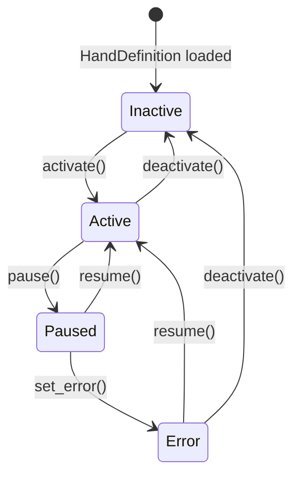

# Agent Hands

# LibreFang Hands — Autonomous Capability Packages

Hands are pre-built, domain-complete agent configurations that users activate from a marketplace. Unlike regular agents (where you chat with them), Hands work autonomously for you — you check in on them periodically while they run in the background.

## Overview

The `librefang-hands` crate provides:

- **Hand definitions** — parsed from `HAND.toml` files, describing agent capabilities, settings, requirements, and routing metadata
- **Hand instances** — running activations of a hand, tracking status and spawned agents
- **Hand registry** — in-memory store managing definitions, instances, and persistence
- **Requirement checking** — validates that system dependencies (binaries, API keys, environment variables) are available before activation

## Key Types

### HandDefinition

The complete configuration for a hand, parsed from `HAND.toml`:

```rust
pub struct HandDefinition {
    pub id: String,                      // e.g. "clip"
    pub version: String,                 // e.g. "1.2.0"
    pub name: String,                    // Human-readable name
    pub description: String,
    pub category: HandCategory,           // Content, Security, Data, etc.
    pub icon: String,                     // Emoji icon
    pub tools: Vec<String>,              // Required tools
    pub skills: Vec<String>,             // Skill allowlist
    pub mcp_servers: Vec<String>,        // MCP server allowlist
    pub allowed_plugins: Vec<String>,
    pub requires: Vec<HandRequirement>,   // Activation prerequisites
    pub settings: Vec<HandSetting>,      // User-configurable options
    pub agents: BTreeMap<String, HandAgentManifest>,  // Agent configs by role
    pub dashboard: HandDashboard,
    pub routing: HandRouting,             // Keywords for hand selection
    pub skill_content: Option<String>,   // Bundled SKILL.md content
    pub agent_skill_content: HashMap<String, String>,  // SKILL-{role}.md content
    pub metadata: Option<HandMetadata>,   // Frequency, token consumption, warnings
    pub i18n: HashMap<String, HandI18n>, // Localized strings
}
```

### HandInstance

A running activation of a hand:

```rust
pub struct HandInstance {
    pub instance_id: Uuid,
    pub hand_id: String,
    pub status: HandStatus,              // Active, Paused, Error, Inactive
    pub agent_ids: BTreeMap<String, AgentId>,  // Spawned agents by role
    pub coordinator_role: Option<String>, // Which role receives user messages
    pub config: HashMap<String, serde_json::Value>,  // User settings
    pub activated_at: DateTime<Utc>,
    pub updated_at: DateTime<Utc>,
}
```

### HandRegistry

The central manager for all hands:

```rust
pub struct HandRegistry {
    definitions: DashMap<String, HandDefinition>,  // hand_id → definition
    instances: DashMap<Uuid, HandInstance>,        // instance_id → instance
    agent_index: DashMap<String, Uuid>,            // agent_id → instance_id
    active_index: DashMap<String, Uuid>,            // hand_id → active instance_id
    activate_lock: Mutex<()>,                       // Serializes activate/deactivate
    persist_lock: Mutex<()>,                        // Guards hand_state.json writes
}
```

## HAND.toml Format

Hands are defined in TOML with two agent configuration formats:

### Single-Agent Format

```toml
id = "clip"
name = "Clip Hand"
description = "Autonomous video clipping"
category = "content"
icon = "✂️"
tools = ["shell_exec"]

[[requires]]
key = "ffmpeg"
label = "FFmpeg must be installed"
requirement_type = "binary"
check_value = "ffmpeg"

[agent]
name = "clip-agent"
description = "Clips videos"
system_prompt = "You clip videos..."

[dashboard]
metrics = []
```

### Multi-Agent Format

```toml
id = "research"
name = "Research Hand"
description = "Multi-agent research pipeline"
category = "content"

[agents.planner]
coordinator = true
invoke_hint = "Use planner for task decomposition"
name = "planner-agent"
system_prompt = "You plan research tasks..."

[agents.analyst]
name = "analyst-agent"
description = "Analyzes data"
provider = "groq"
model = "llama-3.3-70b-versatile"
system_prompt = "You analyze data..."
```

Multi-agent hands can use `base` template references to inherit from agent templates:

```toml
[agents.writer]
coordinator = true
base = "my-writer-template"  # Loads from agents registry
system_prompt = "You are a blog post writer."
```

## Agent Template Resolution

Hands can reuse agent configurations via the `base` field. When a hand agent specifies `base = "template-name"`, the registry:

1. Loads `agents/template-name/agent.toml` from the agents registry directory
2. Deep-merges the hand's inline fields on top

```mermaid
graph LR
    A[HandDefinition HAND.toml] --> B{has base?}
    B -->|Yes| C[Load agents/{base}/agent.toml]
    B -->|No| D[Use inline config]
    C --> E[Deep merge: hand fields win]
    D --> E
    E --> F[HandAgentManifest]
    
    G[Flat format] --> H[normalize_flat_to_nested]
    H --> E
```

The `normalize_flat_to_nested` function converts legacy flat-format agent TOML (where `provider`, `model`, `system_prompt` are top-level scalars) into the nested `[model]` sub-table format before merging. This ensures that hand overlays with nested `[model]` sections correctly override base template fields.

## Settings and User Configuration

Hands declare configurable settings that users fill in when activating:

```toml
[[settings]]
key = "stt_provider"
label = "STT Provider"
description = "Speech-to-text engine"
setting_type = "select"
default = "auto"

[[settings.options]]
value = "auto"
label = "Auto-detect"

[[settings.options]]
value = "groq"
label = "Groq Whisper"
provider_env = "GROQ_API_KEY"

[[settings.options]]
value = "local"
label = "Local Whisper"
binary = "whisper"
```

The `resolve_settings()` function converts user selections into:

- A **prompt block** appended to the system prompt (e.g., "STT: Groq Whisper (groq)")
- A list of **environment variables** the agent subprocess needs (e.g., `GROQ_API_KEY`)

```rust
pub fn resolve_settings(
    settings: &[HandSetting],
    config: &HashMap<String, serde_json::Value>,
) -> ResolvedSettings {
    // Returns: prompt_block + env_vars
}
```

### Setting Types

| Type | Description | Config Value |
|------|-------------|--------------|
| `select` | Choose from options | `"value"` string |
| `text` | Free-form text input | `"value"` string |
| `toggle` | Boolean on/off | `"true"` or `"false"` |

## Requirements System

Requirements gate activation — the hand cannot activate until all non-optional requirements are met.

```toml
[[requires]]
key = "ffmpeg"
label = "FFmpeg must be installed"
requirement_type = "binary"
check_value = "ffmpeg"
description = "FFmpeg is the core video processing engine."
optional = false

[requires.install]
macos = "brew install ffmpeg"
windows = "winget install Gyan.FFmpeg"
linux_apt = "sudo apt install ffmpeg"
manual_url = "https://ffmpeg.org/download.html"
estimated_time = "2-5 min"
```

### Requirement Types

| Type | Check | Example |
|------|-------|---------|
| `binary` | Binary exists on PATH | `"ffmpeg"`, `"chromium"` |
| `env_var` | Environment variable is set | `"HOME"` |
| `api_key` | API key env var is set | `"OPENAI_API_KEY"` |
| `any_env_var` | Any of comma-separated vars set | `"GROQ_API_KEY,OPENAI_API_KEY"` |

### Python3 Detection

The `python3` binary check has special handling to avoid false positives from:

- **Windows Store shims** — `python3.exe` that opens the Store instead of running
- **Python 2 installations** — where `python` exists but is Python 2

It runs `python3 --version` (or `python --version` as fallback) and verifies the output contains "Python 3". The result is cached for the process lifetime via `OnceLock`.

## Hand Lifecycle



### Activation

```rust
impl HandRegistry {
    pub fn activate(
        &self,
        hand_id: &str,
        config: HashMap<String, serde_json::Value>,
    ) -> HandResult<HandInstance>
}
```

- Checks requirements are met
- Serializes via `activate_lock` to prevent race conditions
- Creates a `HandInstance` with status `Active`
- Returns the instance; **agent spawning is done by the kernel**

### Multi-Instance Support

The registry supports multiple instances of the same hand. Pass `instance_id: Some(uuid)` to `activate_with_id()` when restoring from persisted state:

```rust
pub fn activate_with_id(
    &self,
    hand_id: &str,
    config: HashMap<String, serde_json::Value>,
    instance_id: Option<Uuid>,
    timestamps: Option<(DateTime<Utc>, DateTime<Utc>)>,
) -> HandResult<HandInstance>
```

## Persistence and Recovery

The registry persists active instances to `hand_state.json` so they survive daemon restarts:

```rust
impl HandRegistry {
    pub fn persist_state(&self, path: &Path) -> HandResult<()>
    pub fn load_state(path: &Path) -> Vec<HandStateEntry>
}
```

Persisted fields:

- `hand_id`, `instance_id`, `config`, `agent_ids`, `coordinator_role`
- `status` (Active and Paused are persisted; Error is also persisted so users see what went wrong)
- `activated_at`, `updated_at`

### Legacy Format Support

The loader handles three format versions:

- **v4**: `PersistedState { version: 4, instances: [...] }`
- **v2/v3**: `{ "version": 2, "instances": [...] }`
- **v1**: Bare array `[...]`

Single-agent v1/v2 format (`agent_id: "uuid"`) is converted to multi-agent format (`{"main": uuid}`).

## Internationalization

Hands can provide localized strings for display names, descriptions, and settings:

```toml
[i18n.zh]
name = "线索生成"
description = "自主线索生成"

[i18n.zh.agents.main]
name = "主协调器"
description = "协调各个子智能体完成任务"

[i18n.zh.settings.target_industry]
label = "目标行业"
description = "聚焦的行业领域"
```

All fields are optional — the English defaults from `[[settings]]` and `[agent]` are used when translations are absent.

## Registry Operations

### Loading Hands from Disk

```rust
pub fn reload_from_disk(&self, home_dir: &Path) -> (usize, usize)
```

Scans two locations, with registry entries taking precedence on ID collisions:

1. `registry/hands/{id}/` — Read-only registry (synced from librefang-registry tarball)
2. `workspaces/{id}/` — User-installed hands (survives daemon restarts)

### Installing Hands

| Method | Use Case | Base Template Resolution |
|--------|----------|-------------------------|
| `install_from_path` | Install from filesystem directory | ✅ Yes (via `agents_dir`) |
| `install_from_content` | API-based install | ❌ No (rejected if base is used) |
| `install_from_content_persisted` | Dashboard "install from content" | ✅ Yes (resolves `agents_dir`) |

### Uninstalling Hands

```rust
pub fn uninstall_hand(&self, home_dir: &Path, hand_id: &str) -> HandResult<()>
```

Rules:

1. **NotFound** — Hand ID doesn't exist in memory
2. **BuiltinHand** — Hand lives in `registry/hands/` (would be recreated on next sync)
3. **AlreadyActive** — A live instance exists (must deactivate first)
4. **Success** — Removes from memory, deletes `workspaces/{id}/`

## Requirement and Settings Availability

### Checking Requirements

```rust
pub fn check_requirements(&self, hand_id: &str) -> HandResult<Vec<(HandRequirement, bool)>>
```

Returns each requirement paired with whether it's currently satisfied.

### Checking Settings Availability

```rust
pub fn check_settings_availability(
    &self,
    hand_id: &str,
    lang: Option<&str>,
) -> HandResult<Vec<SettingStatus>>
```

For each setting option, determines availability based on:

- **`provider_env`**: Checks if the env var (or aliases like `GEMINI_API_KEY` → `GOOGLE_API_KEY`) is set
- **`binary`**: Checks if the binary exists on PATH and is executable

### Readiness

```rust
pub fn readiness(&self, hand_id: &str) -> Option<HandReadiness>
```

Returns a combined view:

```rust
pub struct HandReadiness {
    pub requirements_met: bool,  // All non-optional requirements satisfied
    pub active: bool,             // Has an Active-status instance
    pub degraded: bool,           // Active but some requirement unmet
}
```

## Integration Points

### With the Kernel

The kernel is responsible for:

- **Spawning agents** after `activate()` returns the instance
- **Killing agents** after `deactivate()`
- **Updating instance agent IDs** via `set_agents()`

```rust
// Kernel spawns agents, then:
registry.set_agents(instance_id, agent_ids, coordinator_role);

// Kernel encounters error, then:
registry.set_error(instance_id, error_message);
```

### With the Router

The router uses hand routing keywords for deterministic hand selection:

```rust
pub struct HandRouting {
    pub aliases: Vec<String>,      // Strong signals (score ×3)
    pub weak_aliases: Vec<String>, // Weak signals (score ×1)
}
```

### With the TUI

The TUI uses `list_definitions()` and `list_instances()` to display the hand dashboard.

### With the API

The HTTP API routes use the registry for all hand operations:

- `GET /api/hands` → `list_definitions()`
- `POST /api/hands/:id/activate` → `activate()`
- `POST /api/hands/:id/deactivate` → `deactivate()`
- `GET /api/hands/:id/requirements` → `check_requirements()`
- `GET /api/hands/:id/settings` → `check_settings_availability()`

## Key Design Decisions

1. **Single-instance by default** — Only one active instance per hand unless `instance_id` is explicitly passed to `activate_with_id()`. This simplifies the common case.

2. **DashMap for concurrent access** — All registry maps use `DashMap` for lock-free concurrent reads. The `activate_lock` mutex only serializes the check-then-insert window for activation.

3. **Reverse indexes** — `agent_index` enables O(1) `find_by_agent()`, and `active_index` enables O(1) "is this hand active?" checks.

4. **Skill content loading** — `SKILL.md` is loaded into `skill_content`; `SKILL-{role}.md` files populate `agent_skill_content` with per-role overrides.

5. **TOML flexibility** — Both flat and wrapped (`[hand]`) formats are supported, with automatic format detection and legacy field conversion.