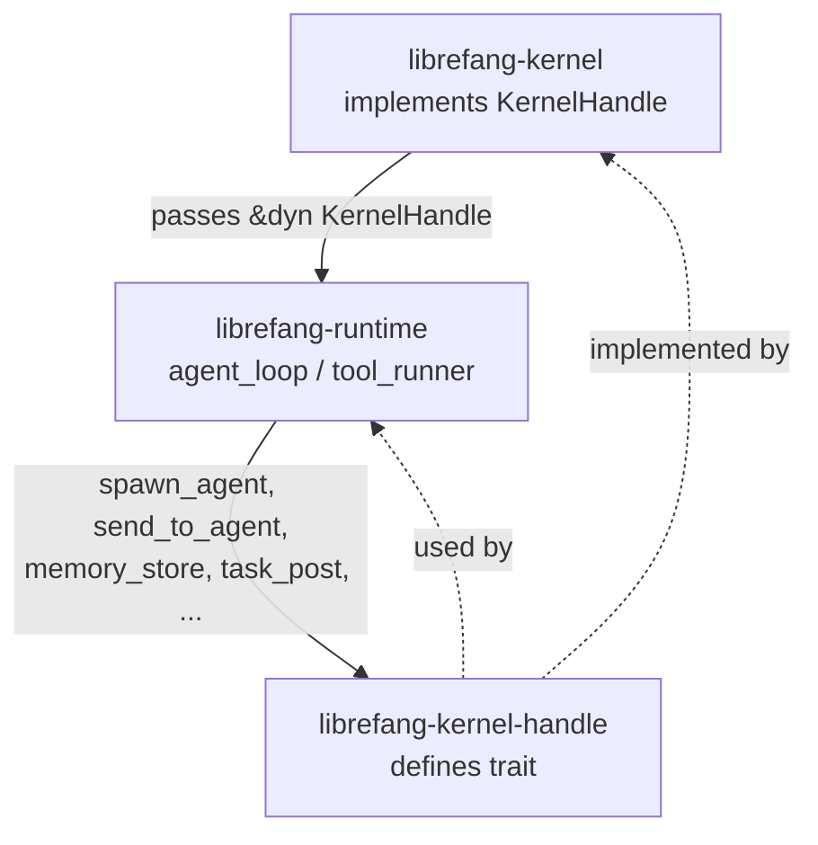

# Agent Kernel — librefang-kernel-handle-src

# librefang-kernel-handle

Trait abstraction that decouples the agent runtime from the kernel, enabling inter-agent operations without circular dependencies.

## Purpose

`librefang-runtime` needs to invoke kernel-level operations—spawning agents, sending messages, managing tasks—but cannot depend directly on `librefang-kernel` without creating a circular crate graph. This module solves that by defining the `KernelHandle` trait. The kernel implements the trait concretely and injects it into the agent loop at startup. The runtime then calls through the trait object, knowing nothing about the kernel's internals.



## Key Components

### `AgentInfo`

Data transfer object returned by discovery and listing operations:

| Field | Type | Description |
|---|---|---|
| `id` | `String` | Agent UUID |
| `name` | `String` | Human-readable name |
| `state` | `String` | Current lifecycle state |
| `model_provider` | `String` | LLM provider (e.g. `"openai"`) |
| `model_name` | `String` | Model identifier |
| `description` | `String` | Agent purpose description |
| `tags` | `Vec<String>` | Classification labels |
| `tools` | `Vec<String>` | Tool names the agent can use |

### `KernelHandle` trait

An `#[async_trait]` with `Send + Sync` bounds. Every method provides a safe default—either a no-op or an error string like `"Cron scheduler not available"`—so implementors only need to override the subsystems they support.

## Method Reference by Subsystem

### Agent Lifecycle

| Method | Sync/Async | Returns | Description |
|---|---|---|---|
| `spawn_agent(manifest_toml, parent_id)` | async | `(id, name)` | Spawn from TOML manifest. `parent_id` tracks lineage. |
| `spawn_agent_checked(manifest_toml, parent_id, parent_caps)` | async | `(id, name)` | Same as `spawn_agent` but verifies child capabilities are a subset of `parent_caps`. Default delegates to `spawn_agent` with no enforcement. |
| `send_to_agent(agent_id, message)` | async | `String` | Send a message to another agent and return its response. |
| `list_agents()` | sync | `Vec<AgentInfo>` | All running agents. |
| `find_agents(query)` | sync | `Vec<AgentInfo>` | Case-insensitive match on name substring, tag, or tool name. |
| `kill_agent(agent_id)` | sync | `()` | Terminate an agent by ID. |

### Shared Memory

All memory methods accept an optional `peer_id` for namespace isolation—when provided, keys are scoped to that peer so different users of the same agent get independent memory.

| Method | Description |
|---|---|
| `memory_store(key, value, peer_id)` | Write a JSON value. |
| `memory_recall(key, peer_id)` | Read a value; returns `None` if missing. |
| `memory_list(peer_id)` | List all keys in the namespace. |

### Task Queue

| Method | Async | Description |
|---|---|---|
| `task_post(title, description, assigned_to, created_by)` | yes | Create a task; returns task ID. |
| `task_claim(agent_id)` | yes | Claim the next available task; returns task JSON or `None`. |
| `task_complete(task_id, result)` | yes | Mark done with result string. |
| `task_list(status)` | yes | Filter by status (`Some("pending")`) or list all. |
| `task_delete(task_id)` | yes | Delete; returns whether it existed. |
| `task_retry(task_id)` | yes | Reset to pending; returns whether it was reset. |

### Knowledge Graph

| Method | Description |
|---|---|
| `knowledge_add_entity(entity)` | Insert an `Entity` node. |
| `knowledge_add_relation(relation)` | Insert a `Relation` edge. |
| `knowledge_query(pattern)` | Match against a `GraphPattern`, returning `Vec<GraphMatch>`. |

Types come from `librefang_types::memory`.

### Events

`publish_event(event_type, payload)` — fires a custom event that can trigger proactive agents listening for that type.

### Cron / Scheduling

All default to `"Cron scheduler not available"`.

| Method | Description |
|---|---|
| `cron_create(agent_id, job_json)` | Create a scheduled job for the agent. |
| `cron_list(agent_id)` | List the agent's jobs. |
| `cron_cancel(job_id)` | Cancel a job. |

### Approval System

Controls which tool executions require human approval before proceeding.

| Method | Sync | Description |
|---|---|---|
| `requires_approval(tool_name)` | yes | Simple policy check. Default: `false`. |
| `requires_approval_with_context(tool_name, sender_id, channel)` | yes | Context-aware check. Default falls back to `requires_approval`. |
| `is_tool_denied_with_context(tool_name, sender_id, channel)` | yes | Hard denial—tool cannot run at all. Default: `false`. |
| `request_approval(agent_id, tool_name, action_summary)` | no (async) | Blocks until approved/denied/timed out. Default: auto-approve. |
| `submit_tool_approval(agent_id, tool_name, action_summary, deferred)` | no (async) | Non-blocking submission; returns `ToolApprovalSubmission` immediately. |
| `resolve_tool_approval(request_id, decision, decided_by, totp_verified, user_id)` | no (async) | Approve/reject a pending request; returns the deferred payload for execution. |
| `get_approval_status(request_id)` | yes | Poll current state of a request. Default: `None`. |

The approval flow involves three participants:
1. **tool_runner** calls `request_approval` or `submit_tool_approval` during tool execution
2. **HTTP routes** (`approve_request`, `reject_request`, `modify_request` in `src/routes/system.rs`) call `resolve_tool_approval` to enact a human decision
3. The deferred tool execution is then either run or discarded

### Hands (Autonomous Specialized Agents)

All default to `"Hands system not available"`.

| Method | Description |
|---|---|
| `hand_list()` | List Hands and activation status. |
| `hand_install(toml_content, skill_content)` | Install a Hand from TOML + skill definition. |
| `hand_activate(hand_id, config)` | Spawn the Hand's specialized agent. |
| `hand_status(hand_id)` | Dashboard metrics for an active Hand. |
| `hand_deactivate(instance_id)` | Stop a running Hand. |

### A2A (Agent-to-Agent Protocol)

| Method | Description |
|---|---|
| `list_a2a_agents()` | Discovered external agents as `(name, url)` pairs. Default: empty. |
| `get_a2a_agent_url(name)` | Look up a specific agent's URL. Default: `None`. |

### Channel Messaging

All default to `"Channel ... not available"`. Used by `tool_channel_send` in the runtime.

| Method | Description |
|---|---|
| `send_channel_message(channel, recipient, message, thread_id)` | Text message to a user via an adapter (e.g. `"telegram"`). |
| `send_channel_media(channel, recipient, media_type, media_url, caption, filename, thread_id)` | Image or file by URL. |
| `send_channel_file_data(channel, recipient, data, filename, mime_type, thread_id)` | Raw bytes from a local file. |
| `send_channel_poll(channel, recipient, question, options, is_quiz, correct_option_id, explanation)` | Poll/quiz message. |

### Heartbeat

`touch_heartbeat(agent_id)` — resets the agent's `last_active` timestamp. Called during long-running LLM calls inside `run_agent_loop_streaming` and `run_agent_loop` to prevent the health monitor from marking the agent as stale.

### Prompt Versioning & Experiments

Enables A/B testing and version control of agent system prompts.

**Prompt versions** — default to `"Prompt store not available"` for mutations, empty/`None` for reads:

| Method | Description |
|---|---|
| `get_prompt_version(version_id)` | Retrieve a specific version. |
| `list_prompt_versions(agent_id)` | All versions for an agent. |
| `create_prompt_version(version)` | Store a new version. |
| `delete_prompt_version(version_id)` | Remove a version. |
| `set_active_prompt_version(version_id, agent_id)` | Mark a version as live. |
| `auto_track_prompt_version(agent_id, system_prompt)` | Called from `build_prompt_setup` to auto-track changes. Default: no-op. |

**Experiments** — A/B test framework for prompt variants:

| Method | Description |
|---|---|
| `get_running_experiment(agent_id)` | Active experiment for the agent. |
| `record_experiment_request(experiment_id, variant_id, latency_ms, cost_usd, success)` | Log per-request metrics. Default: no-op. |
| `list_experiments(agent_id)` | All experiments for an agent. |
| `create_experiment(experiment)` | Create a new experiment. |
| `get_experiment(experiment_id)` | Retrieve by ID. |
| `update_experiment_status(experiment_id, status)` | Transition status (e.g. running → completed). |
| `get_experiment_metrics(experiment_id)` | Aggregated metrics per variant. |

### Goals

| Method | Description |
|---|---|
| `goal_list_active(agent_id)` | Pending/in-progress goals, optionally filtered. Default: empty. |
| `goal_update(goal_id, status, progress)` | Update status and/or progress percentage. Default: error. |

### Workflows

`run_workflow(workflow_id, input)` — execute a workflow by UUID or name. Returns `(run_id, output)`. Default: `"Workflow engine not available"`.

### Forked Agent Execution

```rust
async fn run_forked_agent_oneshot(
    &self,
    agent_id: &str,
    prompt: &str,
    allowed_tools: Option<Vec<String>>,
) -> Result<String, String>;
```

A specialized primitive used by the proactive memory extractor (`try_forked_extract` in `librefang-runtime/src/proactive_memory.rs`). It runs a forked agent turn that collapses to a single text response. Key properties:

- The forked call shares the parent turn's `(system + tools + messages)` prefix, preserving Anthropic prompt cache alignment.
- Messages from the fork do **not** persist into the agent's canonical session.
- The turn-end hook fires with `is_fork: true` so auto-dream won't recurse.
- Passing `allowed_tools = Some(vec![])` forces a single-turn text-only response.

Default: `"run_forked_agent_oneshot not available"`.

### Configuration Accessors

| Method | Default | Description |
|---|---|---|
| `tool_timeout_secs()` | `120` | Seconds before a tool execution is killed. Used by `execute_single_tool_call`. |
| `max_agent_call_depth()` | `5` | Maximum nesting of inter-agent calls. Enforced by `tool_agent_send`. |

## Internal Delegation

Two methods delegate to other trait methods by default:

- **`requires_approval_with_context`** → falls back to `requires_approval(tool_name)`, ignoring sender/channel. Override when policy needs per-user or per-channel rules.
- **`spawn_agent_checked`** → falls back to `spawn_agent(manifest_toml, parent_id)`, ignoring `parent_caps`. The real kernel **must** override this to enforce capability inheritance.

## Implementation Notes

When implementing `KernelHandle` for a real or test kernel:

1. **Required methods** — `spawn_agent`, `send_to_agent`, `list_agents`, `kill_agent`, and the memory/task/knowledge methods have no default and **must** be implemented.
2. **Optional subsystems** — cron, approvals, Hands, A2A, channels, prompts, experiments, goals, workflows, and forked execution all have safe defaults. Override only the subsystems your kernel supports.
3. **Thread safety** — the trait requires `Send + Sync`. Implementations must be safe to call from async contexts across threads.
4. **Testing** — for unit tests that don't need a full kernel, implement only the methods under test and let the remaining defaults return errors. The error strings (e.g. `"Cron scheduler not available"`) are stable enough to match against in test assertions.