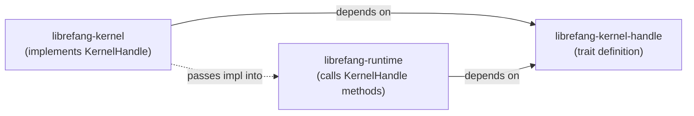

# Agent Kernel — librefang-kernel-handle-src

# librefang-kernel-handle

Dependency-inversion boundary between the agent runtime and the kernel.

## Purpose

`librefang-runtime` drives agent loops and executes tools. Those tools need to call back into the kernel — to spawn agents, send messages, manage shared memory, and so on. But the runtime cannot depend on `librefang-kernel` directly without creating a circular dependency.

This crate solves that by defining `KernelHandle`: a trait that enumerates every kernel operation the runtime might need. The kernel implements the trait and injects the concrete handle into each agent loop at startup.



The runtime never knows which kernel it is talking to; it only sees the trait object.

---

## Key type: `AgentInfo`

A plain data struct returned by listing and discovery operations:

| Field | Type | Description |
|---|---|---|
| `id` | `String` | Agent UUID |
| `name` | `String` | Human-readable name |
| `state` | `String` | Current lifecycle state |
| `model_provider` | `String` | e.g. `"openai"`, `"anthropic"` |
| `model_name` | `String` | e.g. `"gpt-4o"` |
| `description` | `String` | Agent purpose |
| `tags` | `Vec<String>` | Free-form labels |
| `tools` | `Vec<String>` | Tool names available to the agent |

---

## The `KernelHandle` trait

`KernelHandle` is an async trait (`Send + Sync`) with over 50 methods organised into functional groups. Every method has a **default implementation** so that stubs, test doubles, and partial implementations compile without boilerplate.

### Design patterns in the defaults

**Error-on-missing.** Methods for optional subsystems (cron, hands, approvals, channels, workflows, prompt store) default to returning an error string like `"Cron scheduler not available"`. This makes it immediately clear when a feature is used against a handle that doesn't support it.

**Graceful no-op.** Utility methods (`touch_heartbeat`, `fire_agent_step`, `auto_track_prompt_version`, `readonly_workspace_prefixes`) default to doing nothing, so lightweight implementations work without overrides.

**Delegation chain.** Some methods delegate to a simpler sibling so implementors only need to override one of the pair:

| Method | Default delegate | Purpose of the wrapper |
|---|---|---|
| `send_to_agent_as` | `send_to_agent` | Adds cancel-cascade tracking (issue #3044) |
| `spawn_agent_checked` | `spawn_agent` | Adds capability-inheritance enforcement |
| `requires_approval_with_context` | `requires_approval` | Adds sender/channel context |
| `tool_timeout_secs_for` | `tool_timeout_secs` | Adds per-tool glob-based overrides |

---

## Method groups

### Agent lifecycle

| Method | Async | Description |
|---|---|---|
| `spawn_agent` | ✓ | Create an agent from a TOML manifest; returns `(id, name)` |
| `spawn_agent_checked` | ✓ | Same, but validates child capabilities against `parent_caps` |
| `list_agents` | | All running agents |
| `find_agents` | | Search by name substring, tag, or tool name (case-insensitive) |
| `kill_agent` | | Terminate by ID |

### Inter-agent messaging

| Method | Description |
|---|---|
| `send_to_agent` | Send a message and receive the response |
| `send_to_agent_as` | Like above, but records `parent_agent_id` so `/stop` cascades through the call chain |

`tool_agent_send` in the runtime calls `send_to_agent_as` and also consults `max_agent_call_depth` to prevent unbounded recursion between agents.

### Shared memory

| Method | Scoped by `peer_id`? | Description |
|---|---|---|
| `memory_store` | ✓ | Write a JSON value under a key |
| `memory_recall` | ✓ | Read a value back |
| `memory_list` | ✓ | List all keys (within a namespace) |

When `peer_id` is `Some`, keys are isolated per-peer so different users of the same agent don't see each other's data.

### Task queue

A cooperative task board agents use to distribute work:

| Method | Async | Description |
|---|---|---|
| `task_post` | ✓ | Create a task; returns task ID |
| `task_claim` | ✓ | Claim the next unassigned task |
| `task_complete` | ✓ | Mark done with a result string |
| `task_list` | ✓ | Filter by status (`"pending"`, `"completed"`, etc.) |
| `task_get` | ✓ | Single task by ID, including result and retry count |
| `task_delete` | ✓ | Remove a task |
| `task_retry` | ✓ | Reset to pending |
| `task_update_status` | ✓ | Set to `"pending"` or `"cancelled"` |

### Events and knowledge graph

| Method | Description |
|---|---|
| `publish_event` | Fire a custom event that proactive agents can react to |
| `knowledge_add_entity` | Add an entity to the graph |
| `knowledge_add_relation` | Add a relation |
| `knowledge_query` | Match a `GraphPattern`, return `GraphMatch` results |

### Cron scheduling

| Method | Default | Description |
|---|---|---|
| `cron_create` | Error | Create a scheduled job for an agent |
| `cron_list` | Error | List an agent's jobs |
| `cron_cancel` | Error | Cancel by job ID |

All three default to `"Cron scheduler not available"`. The runtime's `tool_schedule_create`, `tool_schedule_list`, and `tool_schedule_delete` tools call through these.

### Approval system

The approval flow has two paths:

**Blocking path** — used when the tool call is already in flight:
- `requires_approval` / `requires_approval_with_context` — check policy
- `request_approval` — block until approved/denied/timeout (defaults to `Approved`)

**Deferred path** — used when the tool should be paused and resumed:
- `submit_tool_approval` — returns a `ToolApprovalSubmission` immediately
- `resolve_tool_approval` — approve/deny, returns the deferred payload
- `get_approval_status` — poll current state

`is_tool_denied_with_context` provides a hard-deny check that short-circuits before the approval flow even starts.

### Hands

Specialised autonomous agents that can be installed and activated:

| Method | Default | Description |
|---|---|---|
| `hand_list` | Error | Available Hands and activation status |
| `hand_install` | Error | Install from TOML + skill content |
| `hand_activate` | Error | Spawn the Hand's agent |
| `hand_status` | Error | Dashboard metrics for an active Hand |
| `hand_deactivate` | Error | Stop a running Hand |

### A2A (Agent-to-Agent) discovery

| Method | Default | Description |
|---|---|---|
| `list_a2a_agents` | Empty vec | External A2A agents as `(name, url)` pairs |
| `get_a2a_agent_url` | `None` | Look up URL by name |

`tool_a2a_send` in the runtime resolves the target via `get_a2a_agent_url` before sending.

### Channel messaging

Multi-adapter outbound messaging to users on Slack, Telegram, email, etc.:

| Method | Supports threads | Supports multi-account |
|---|---|---|
| `send_channel_message` | ✓ | ✓ |
| `send_channel_media` | ✓ | ✓ |
| `send_channel_file_data` | ✓ | ✓ |
| `send_channel_poll` | — | ✓ |

All default to `"Channel … not available"`. The runtime's `tool_channel_send` dispatches to the appropriate method based on the tool arguments.

### Prompt versioning and experiments

A full CRUD system for prompt version management and A/B experimentation:

**Versions:** `get_prompt_version`, `list_prompt_versions`, `create_prompt_version`, `delete_prompt_version`, `set_active_prompt_version`, `auto_track_prompt_version`

**Experiments:** `list_experiments`, `create_experiment`, `get_experiment`, `update_experiment_status`, `get_experiment_metrics`, `get_running_experiment`, `record_experiment_request`

All default to empty/error. The runtime's `build_prompt_setup` calls `auto_track_prompt_version` and `get_prompt_version` during prompt assembly.

### Workflows, goals, and forked execution

| Method | Default | Description |
|---|---|---|
| `run_workflow` | Error | Execute a workflow by ID or name; returns `(run_id, output)` |
| `goal_list_active` | Empty | Pending/in-progress goals |
| `goal_update` | Error | Change status or progress |
| `run_forked_agent_oneshot` | Error | Forked turn that collapses to a single text response; used by proactive memory extraction |

`run_forked_agent_oneshot` is notable: it shares the parent turn's `(system + tools + messages)` prefix for prompt cache alignment with Anthropic, rather than issuing a cold standalone call. The fork's messages do not persist into the canonical session, and the turn-end hook fires with `is_fork: true` to prevent recursive auto-dream.

### Utilities

| Method | Default | Called by |
|---|---|---|
| `touch_heartbeat` | No-op | `run_agent_loop`, `run_agent_loop_streaming` — prevents heartbeat false-positives during long LLM calls |
| `tool_timeout_secs` | `120` | Global tool execution timeout |
| `tool_timeout_secs_for` | Delegates to `tool_timeout_secs` | `execute_single_tool_call` — per-tool override with glob matching |
| `max_agent_call_depth` | `5` | `tool_agent_send` — inter-agent recursion guard |
| `fire_agent_step` | No-op | `run_agent_loop` — external hook at each loop iteration |
| `readonly_workspace_prefixes` | Empty | `execute_tool_raw` — enforces workspace access modes |

---

## Implementing `KernelHandle`

The kernel's concrete implementation lives in `librefang-kernel`. A minimal implementation for testing only needs to override the methods it exercises:

```rust
struct MockHandle;

#[async_trait]
impl KernelHandle for MockHandle {
    async fn send_to_agent(&self, _id: &str, msg: &str) -> Result<String, String> {
        Ok(format!("echo: {msg}"))
    }

    fn list_agents(&self) -> Vec<AgentInfo> {
        vec![]
    }
}
```

Every other method will use its default. Methods for subsystems you don't override will return clear error messages when accidentally called, rather than panicking or silently doing the wrong thing.

When implementing delegation-chain methods, override the **inner** method (`send_to_agent`, `spawn_agent`, `requires_approval`, `tool_timeout_secs`) and only override the wrapper if you need the extended semantics.