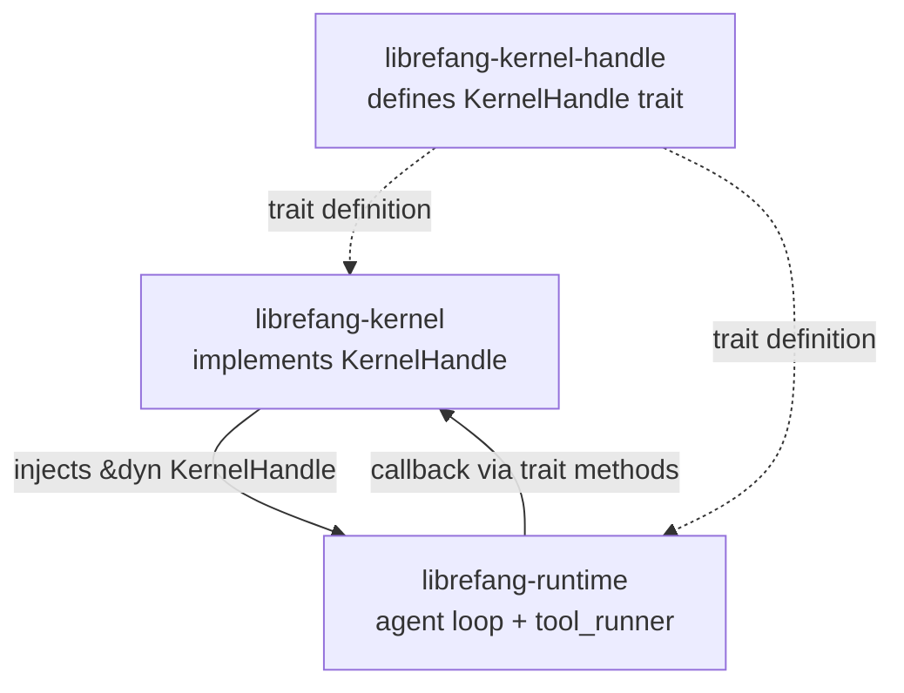

# Agent Kernel — librefang-kernel-handle-src

# librefang-kernel-handle

Dependency inversion layer between the agent runtime and the kernel.

## Purpose

The agent runtime (`librefang-runtime`) needs to perform kernel-level operations — spawning agents, reading shared memory, posting tasks, sending channel messages, and more. However, the runtime cannot depend directly on the kernel crate without creating a circular dependency: the kernel owns agents, and agents run via the runtime.

This crate solves that by defining the `KernelHandle` trait. The kernel implements the trait and injects a reference into the agent loop at startup. The runtime calls trait methods without knowing anything about the kernel's internals.



## Key Types

### `AgentInfo`

```rust
pub struct AgentInfo {
    pub id: String,
    pub name: String,
    pub state: String,
    pub model_provider: String,
    pub model_name: String,
    pub description: String,
    pub tags: Vec<String>,
    pub tools: Vec<String>,
}
```

Read-only snapshot of an agent's identity and capabilities. Returned by `list_agents` and `find_agents`. The `tools` field lists tool names the agent has access to; `tags` are free-form labels from the agent's manifest.

### `KernelHandle` trait

An `#[async_trait]` trait bound by `Send + Sync`. Every method has a default implementation so that partial implementations (test stubs, feature-gated kernels) compile without boilerplate.

## Method Groups

### Agent Lifecycle

| Method | Sync/Async | Description |
|---|---|---|
| `spawn_agent` | async | Create an agent from a TOML manifest. `parent_id` tracks lineage. Returns `(id, name)`. |
| `spawn_agent_checked` | async | Like `spawn_agent`, but the kernel verifies every capability in the child manifest is covered by `parent_caps`. Defaults to delegating to `spawn_agent` without enforcement — real kernels **must** override. |
| `list_agents` | sync | All running agents. |
| `find_agents` | sync | Case-insensitive substring match on name, tag, or tool name. |
| `kill_agent` | sync | Terminate an agent by ID. |
| `send_to_agent` | async | Send a message to another agent and await its response. |
| `touch_heartbeat` | sync | Reset `last_active` during long LLM calls to prevent heartbeat timeout false-positives. |
| `fire_agent_step` | sync | Emit an `agent:step` hook event each loop iteration. |

### Shared Memory

All methods accept `peer_id: Option<&str>` for namespace isolation. When `Some`, keys are scoped to that peer so different users of the same agent get independent memory.

- **`memory_store`** — write a `serde_json::Value` under a key.
- **`memory_recall`** — read a key; returns `Ok(None)` if absent.
- **`memory_list`** — enumerate keys in a namespace.

### Task Queue

A cooperative work system agents use to hand off and claim units of work.

| Method | Returns |
|---|---|
| `task_post` | Created task ID |
| `task_claim` | `Option<serde_json::Value>` — next available task for `agent_id` |
| `task_complete` | Unit |
| `task_list` | Tasks filtered by optional status |
| `task_delete` | `bool` — whether deletion succeeded |
| `task_retry` | `bool` — resets task to pending |

### Knowledge Graph

Agents store and query structured knowledge about entities and their relationships.

- **`knowledge_add_entity`** / **`knowledge_add_relation`** — insert nodes and edges using `librefang_types::memory::{Entity, Relation}`.
- **`knowledge_query`** — pattern-matched lookup returning `Vec<GraphMatch>`.

### Cron Scheduling

All default to `"Cron scheduler not available"`. The kernel overrides when the scheduler is enabled.

- `cron_create` — register a job for an agent.
- `cron_list` — enumerate jobs for an agent.
- `cron_cancel` — remove a job.

These are called from tool implementations (`tool_schedule_create`, `tool_schedule_list`, `tool_schedule_delete`, `tool_cron_create`, `tool_cron_list`, `tool_cron_cancel`) and the workflow route handler.

### Approval System

Controls whether tool executions require human approval.

| Method | Purpose |
|---|---|
| `requires_approval` | Simple policy check by tool name. Defaults to `false`. |
| `requires_approval_with_context` | Policy check considering `sender_id` and `channel`. Falls back to `requires_approval`. |
| `is_tool_denied_with_context` | Hard deny check — tool cannot run at all under this context. Defaults to `false`. |
| `request_approval` | Blocking approval request. Returns `ApprovalDecision`. Defaults to auto-approve. |
| `submit_tool_approval` | Non-blocking submission with `DeferredToolExecution` payload. Returns `ToolApprovalSubmission`. |
| `resolve_tool_approval` | Accept/reject a pending request. Returns the deferred payload so execution can resume or be discarded. Called by the `approve_request`, `reject_request`, and `modify_request` HTTP routes in `src/routes/system.rs`. |
| `get_approval_status` | Poll whether a request has been decided. Defaults to `Ok(None)`. |

### Channel Messaging

Send text, media, files, and polls to users via adapters like Telegram or Email.

- **`send_channel_message`** — text. Optional `thread_id` for replies, `account_id` for multi-bot routing.
- **`send_channel_media`** — image or file by URL.
- **`send_channel_file_data`** — raw bytes with MIME type. Used by `tool_channel_send` when `file_path` is provided.
- **`send_channel_poll`** — poll or quiz with configurable correct answer and explanation.

All default to `"Channel [type] send not available"`.

### Hands

Specialized autonomous agents installed and managed at runtime.

- `hand_list` — discover available Hands.
- `hand_install` — register a Hand from TOML + skill content.
- `hand_activate` — spawn a Hand's agent with configuration.
- `hand_status` — dashboard metrics for an active Hand.
- `hand_deactivate` — stop a Hand's agent.

### A2A (Agent-to-Agent) Discovery

- `list_a2a_agents` — external agents as `(name, url)` pairs. Defaults to empty.
- `get_a2a_agent_url` — lookup by name. Defaults to `None`.

Used by `tool_a2a_send` in the runtime to route messages to federated agents.

### Prompt Versioning and Experiments

A version control system for agent system prompts with A/B experiment support.

**Versioning:**

| Method | Default |
|---|---|
| `get_prompt_version` | `Ok(None)` |
| `list_prompt_versions` | `Ok(Vec::new())` |
| `create_prompt_version` | Error |
| `delete_prompt_version` | Error |
| `set_active_prompt_version` | Error |
| `auto_track_prompt_version` | No-op |

`auto_track_prompt_version` is called from `build_prompt_setup` in the agent loop to detect system prompt drift and auto-create versions.

**Experiments:**

| Method | Default |
|---|---|
| `get_running_experiment` | `Ok(None)` |
| `list_experiments` | `Ok(Vec::new())` |
| `create_experiment` | Error |
| `get_experiment` | `Ok(None)` |
| `update_experiment_status` | Error |
| `get_experiment_metrics` | `Ok(Vec::new())` |
| `record_experiment_request` | No-op |

### Goals and Workflows

- **`goal_list_active`** — pending or in-progress goals, optionally filtered by agent.
- **`goal_update`** — change status/progress. Called from `tool_goal_update`.
- **`run_workflow`** — execute a workflow by ID or name, returning `(run_id, output)`. Called from `tool_workflow_run` and the workflow integration tests.

### Utility Methods

- **`tool_timeout_secs`** — per-execution timeout. Default: `120`.
- **`max_agent_call_depth`** — prevents infinite inter-agent recursion. Default: `5`. Checked by `tool_agent_send`.
- **`run_forked_agent_oneshot`** — advanced primitive for running a forked LLM call that shares the parent's prompt cache prefix. The fork's messages do not persist in the canonical session, and the turn-end hook fires with `is_fork: true` to prevent recursive auto-dream cycles. Default: error. Used by the proactive memory extractor.

## Design Principles

**Default-to-stub.** Every method has a sensible default — either a no-op, an empty collection, or an error string. This means a test harness or minimal kernel only needs to implement the methods it cares about. Methods that the kernel overrides completely (cron, approvals, channels, knowledge graph, Hands, workflows) all default to `"…not available"` errors rather than panicking.

**Sync vs. async split.** Read-only and fast operations (`list_agents`, `find_agents`, `kill_agent`, memory reads, approval checks) are synchronous. Operations involving I/O, network, or blocking waits (`spawn_agent`, `send_to_agent`, `task_post`, channel sends) are async. This avoids requiring a runtime handle for simple queries.

**Capability-aware spawning.** `spawn_agent_checked` enforces that a parent agent cannot grant a child capabilities it doesn't itself possess. The default implementation bypasses enforcement, so kernels with capability security enabled must override this method.

## Implementing the Trait

The kernel (`librefang-kernel`) provides the concrete implementation, wrapping its internal state (agent registry, memory store, task queue, channel adapters, etc.) behind `Arc` and exposing them through the trait methods.

For testing, you can implement only the methods under test:

```rust
struct TestHandle;

#[async_trait]
impl KernelHandle for TestHandle {
    fn list_agents(&self) -> Vec<AgentInfo> {
        vec![AgentInfo {
            id: "test-agent".into(),
            name: "Test".into(),
            state: "running".into(),
            model_provider: "test".into(),
            model_name: "test-model".into(),
            description: String::new(),
            tags: vec![],
            tools: vec!["echo".into()],
        }]
    }
    // all other methods use defaults
}
```