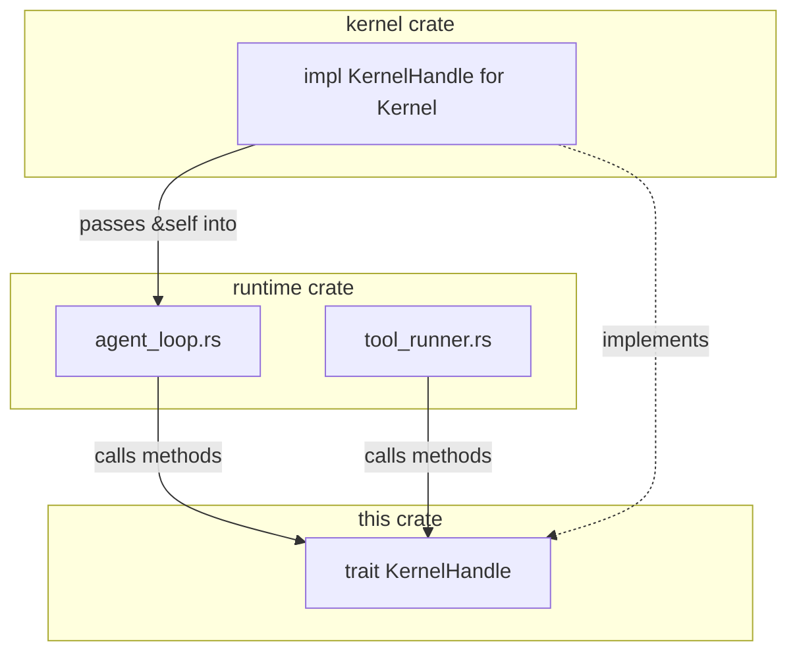

# Agent Kernel — librefang-kernel-handle-src

# Agent Kernel — `librefang-kernel-handle`

## Purpose

This crate defines the `KernelHandle` trait — the **dependency inversion boundary** between `librefang-runtime` (the agent loop) and `librefang-kernel` (the process manager). By expressing kernel operations as a trait, the runtime can invoke inter-agent actions (spawn, send, kill, memory access, task queues, etc.) without importing the kernel crate directly, breaking what would otherwise be a circular dependency.

The real kernel implements this trait and injects it into each agent's loop at startup. Test suites and embedded callers use lightweight stubs that rely on the trait's pervasive default implementations.

## Architecture



The kernel owns the concrete state (agent registry, memory store, task queue, channel adapters, etc.) and exposes it through the trait. The runtime only sees the trait interface.

## `AgentInfo`

A serializable snapshot of a running agent, returned by discovery methods:

| Field | Type | Description |
|---|---|---|
| `id` | `String` | UUID of the agent |
| `name` | `String` | Human-readable name from manifest |
| `state` | `String` | Current lifecycle state |
| `model_provider` | `String` | LLM backend (e.g. `"openai"`, `"anthropic"`) |
| `model_name` | `String` | Model identifier |
| `description` | `String` | Agent description from manifest |
| `tags` | `Vec<String>` | Categorisation tags |
| `tools` | `Vec<String>` | Names of tools available to this agent |

## `KernelHandle` trait

All methods are documented in source; this section groups them by domain and explains the design decisions behind each group.

### Agent lifecycle

| Method | Sync/Async | Description |
|---|---|---|
| `spawn_agent` | async | Create an agent from a TOML manifest. `parent_id` tracks lineage. Returns `(agent_id, agent_name)`. |
| `spawn_agent_checked` | async | Like `spawn_agent` but enforces capability inheritance — every capability in the child manifest must be covered by `parent_caps`. Default delegates to `spawn_agent` (no enforcement). |
| `list_agents` | sync | Return `AgentInfo` for all running agents. |
| `find_agents` | sync | Case-insensitive search on name substring, tags, or tool names. |
| `kill_agent` | sync | Terminate an agent by ID. |

### Inter-agent messaging

| Method | Notes |
|---|---|
| `send_to_agent` | Send a message to another agent, await its response. |
| `send_to_agent_as` | Variant that records `parent_agent_id` so a `/stop` issued to the parent cascades into the callee (issue #3044). **Default falls back to `send_to_agent`** and emits a `trace`-level log so operators can identify non-cascading handles. |

The runtime's `tool_agent_send` in `tool_runner.rs` calls `send_to_agent_as` and also checks `max_agent_call_depth` before dispatching.

### Memory

All memory methods accept an optional `peer_id` for namespace isolation — when `Some`, keys are scoped to that peer so different users of the same agent get independent memory views.

| Method | Description |
|---|---|
| `memory_store` | Write a JSON value under a key. |
| `memory_recall` | Read a value; returns `None` if missing. |
| `memory_list` | List all keys in a namespace. |
| `memory_acl_for_sender` | RBAC M3 gate (#3054 Phase 2). Returns `UserMemoryAccess` for a sender+channel pair so the runtime can build a `MemoryNamespaceGuard`. `None` means no per-user restriction (preserves single-user behaviour). |

### Task queue

A cooperative task system for agents to post, claim, and complete work items:

| Method | Async | Description |
|---|---|---|
| `task_post` | ✓ | Create a task with optional assignee and creator. Returns task ID. |
| `task_claim` | ✓ | Claim the next available task for an agent. |
| `task_complete` | ✓ | Mark a task done with a result string. |
| `task_list` | ✓ | List tasks, optionally filtered by status. |
| `task_delete` | ✓ | Delete a task. |
| `task_retry` | ✓ | Reset a task to pending for re-execution. |
| `task_get` | ✓ | Get a single task with result and retry count. |
| `task_update_status` | ✓ | Set status to `pending` or `cancelled`. |

### Knowledge graph

| Method | Description |
|---|---|
| `knowledge_add_entity` | Add an `Entity` node. |
| `knowledge_add_relation` | Add a `Relation` edge. |
| `knowledge_query` | Query with a `GraphPattern`, returns `GraphMatch` results. |

### Approval system

Tools that require human approval go through this flow:

1. `requires_approval` / `requires_approval_with_context` — synchronous gate checks.
2. `is_tool_denied_with_context` — hard deny before prompting.
3. `resolve_user_tool_decision` — RBAC-aware verdict returning `Allow`, `Deny`, or `NeedsApproval`.
4. `request_approval` — blocking call that waits for an `ApprovalDecision`.
5. `submit_tool_approval` — non-blocking; returns a `ToolApprovalSubmission` with a request UUID.
6. `resolve_tool_approval` — approve/deny a pending request and retrieve the deferred payload.
7. `get_approval_status` — poll the current status of a request.

`requires_approval_with_context` defaults to calling `requires_approval`. `resolve_user_tool_decision` defaults to `Allow` — the real kernel always overrides this; changing the default was considered during PR #3205 but rejected because it broke unrelated test stubs.

### Channel adapters

Outbound messaging to users through configured adapters (Telegram, Email, etc.):

- `send_channel_message` — text, with optional `thread_id` and `account_id` routing.
- `send_channel_media` — image or file by URL.
- `send_channel_file_data` — raw bytes with MIME type.
- `send_channel_poll` — quiz or poll with options.

All default to `"not available"` errors since they require adapter infrastructure.

### Hands system

Autonomous skill agents:

- `hand_list` — list installed Hands.
- `hand_install` — install from TOML + skill content.
- `hand_activate` — spawn a Hand's agent with config.
- `hand_status` — dashboard metrics.
- `hand_deactivate` — stop a running Hand.

### Cron scheduler

- `cron_create`, `cron_list`, `cron_cancel` — all default to `"Cron scheduler not available"`.

### Prompt experiments & versioning

A complete prompt management surface for A/B testing:

- **Versions**: `get_prompt_version`, `list_prompt_versions`, `create_prompt_version`, `delete_prompt_version`, `set_active_prompt_version`.
- **Experiments**: `create_experiment`, `get_experiment`, `list_experiments`, `update_experiment_status`, `get_running_experiment`, `get_experiment_metrics`.
- **Auto-tracking**: `auto_track_prompt_version` — called from `build_prompt_setup` to detect system prompt drift.
- **Metrics**: `record_experiment_request` — logs latency, cost, and success per variant.

Defaults return empty results or errors; the kernel overrides with real storage.

### Goals & workflows

- `goal_list_active` — list pending/in-progress goals.
- `goal_update` — change goal status and progress.
- `run_workflow` — execute a workflow by ID or name, returns `(run_id, output)`.

### Advanced primitives

| Method | Description |
|---|---|
| `run_forked_agent_oneshot` | Forked-turn primitive for structured extraction. Spawns a streaming run, drains it, returns final text. The fork's messages do **not** persist into the canonical session, and the turn-end hook fires with `is_fork: true`. Uses the parent's prompt cache prefix instead of starting cold. |
| `touch_heartbeat` | Reset `last_active` during long LLM calls to prevent heartbeat false-positives. Called from both `run_agent_loop` and `run_agent_loop_streaming`. |
| `fire_agent_step` | Emit an `agent:step` hook at each loop iteration. |
| `readonly_workspace_prefixes` | Paths that file-write tools must reject. |
| `named_workspace_prefixes` | All declared workspaces with their `WorkspaceMode` — used by file-read, file-list, file-write, and apply-patch tools for sandbox allow-listing. |

### Configuration queries

| Method | Default | Description |
|---|---|---|
| `tool_timeout_secs` | `120` | Global tool execution timeout. |
| `tool_timeout_secs_for` | delegates to `tool_timeout_secs` | Per-tool override with glob matching. Resolution: exact match → longest glob → global. |
| `max_agent_call_depth` | `5` | Maximum recursive inter-agent calls. |
| `skill_env_passthrough_policy` | `None` | Operator gate for skill environment variable access. `None` = only built-in hard blocks apply. |

### A2A (Agent-to-Agent)

- `list_a2a_agents` — discovered external agents as `(name, url)` pairs.
- `get_a2a_agent_url` — look up a specific agent's URL by name.

## Default implementation strategy

Nearly every method has a sensible default: no-ops, empty collections, or errors like `"not available"`. This is intentional — it allows:

- **Test stubs** to implement only the methods under test.
- **Embedded callers** to get a working system without wiring every subsystem.
- **Incremental feature rollout** — new methods land with safe defaults rather than breaking every implementor.

The kernel crate overrides every method with real implementations backed by its internal state. If a default is used in production (e.g., `spawn_agent_checked` falling through to `spawn_agent` without capability checks), that's a misconfiguration — the kernel always overrides these.

## Key internal delegation chains

```
requires_approval_with_context → requires_approval
tool_timeout_secs_for         → tool_timeout_secs
send_to_agent_as              → send_to_agent          (with trace log on fallback)
spawn_agent_checked           → spawn_agent            (no capability enforcement)
```

## Thread safety

The trait is bounded by `Send + Sync` via `#[async_trait]`. Implementations must be safe to call from multiple tokio tasks concurrently — the kernel achieves this through `Arc<Mutex<...>>` or `Arc<RwLock<...>>` guards on its internal registries.