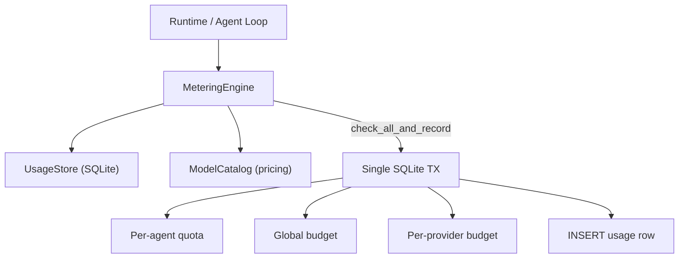

# Agent Kernel — librefang-kernel-metering-src

# Agent Kernel — Metering Engine (`librefang-kernel-metering`)

## Purpose

The metering engine is the cost-control layer for LLM invocations. It records every usage event, estimates call costs using model-specific pricing, and enforces spending quotas at three levels of granularity — per-agent, per-provider, and global — to prevent runaway spending across the system.

## Architecture



All quota checks and usage persistence flow through `UsageStore` (from `librefang-memory`), which is backed by SQLite. The preferred entry point `check_all_and_record` wraps the check-and-insert cycle in a single transaction, closing the TOCTOU race that would exist if you called `check_quota` then `record` separately.

## Key Types

### `MeteringEngine`

The core struct. Constructed with `MeteringEngine::new(store)` where `store` is an `Arc<UsageStore>`. It has no internal mutable state — all state lives in the SQLite database.

### `BudgetStatus`

A serializable snapshot of current spend versus configured limits across hourly, daily, and monthly windows. Produced by `budget_status()`. Each window includes `*_spend`, `*_limit`, and `*_pct` (spend/limit ratio for dashboard progress bars).

## Usage Recording & Quota Enforcement

### The Preferred Path: `check_all_and_record`

After every LLM call, call `check_all_and_record(record, quota, budget)`. This atomically:

1. Checks the agent's per-agent quota (`ResourceQuota`: hourly, daily, monthly USD limits)
2. Checks the global budget (`BudgetConfig`: hourly, daily, monthly across all agents)
3. Resolves the record's provider and checks the per-provider budget (`ProviderBudget` in `budget.providers`)
4. On all checks passing, inserts the usage row

If any check fails, the transaction rolls back — the usage row is **not** inserted. This guarantees that a failed quota check cannot be silently bypassed by concurrent requests.

### Non-Atomic Alternatives

| Method | Scope | Use Case |
|---|---|---|
| `check_quota` | Per-agent only | Pre-dispatch gating, dashboards |
| `check_global_budget` | Global only | Pre-dispatch gating, dashboards |
| `check_provider_budget` | Single provider | Pre-dispatch gating, dashboards |
| `check_quota_and_record` | Per-agent + record | Single-level atomic operation |
| `check_global_budget_and_record` | Global + record | Single-level atomic operation |
| `check_all_and_record` | All three + record | **Post-LLM-call recording** |

The non-atomic methods exist for scenarios where you need a read-only budget probe (e.g., UI dashboards) or want to fail fast before making an LLM call.

### Zero-Limit Semantics

All quota/budget fields use `0.0` (or `0` for tokens) to mean **unlimited** — a zero-valued limit is skipped entirely during enforcement. This means a freshly initialized `ResourceQuota::default()` never blocks anything.

## Cost Estimation

Two static methods estimate the cost of a call before or after it happens.

### `estimate_cost` (Fallback)

```
MeteringEngine::estimate_cost(model, input_tokens, output_tokens, cache_read, cache_creation)
```

Uses hardcoded default rates: **$1.00 per million input tokens, $3.00 per million output tokens**. The `model` parameter is accepted for API symmetry but currently ignored. Use this in unit tests or when no catalog is available.

### `estimate_cost_with_catalog` (Production)

```
MeteringEngine::estimate_cost_with_catalog(&catalog, model, input_tokens, output_tokens, cache_read, cache_creation)
```

Looks up the model in the `ModelCatalog` to get real per-model pricing. Falls back to the default $1/$3 rates when:

- The model ID is not found in the catalog
- The model is a `chatgpt` provider model with zero pricing (session-auth models that don't expose billable rates — these get a conservative estimate using default rates)

**Local-tier models** with zero pricing are an intentional exception: they return $0.00 cost, since they run on local hardware.

### Cache Token Pricing

The internal `estimate_cost_from_rates` function applies differentiated pricing for prompt-caching tokens:

| Token Type | Multiplier vs Base Input Price |
|---|---|
| Regular input | 1.0× |
| Cache-read | 0.1× (90% discount) |
| Cache-creation | 1.25× (25% surcharge) |
| Output | Uses output rate (no multiplier) |

Regular input tokens are computed as `total_input - cache_read - cache_creation` (saturating subtraction). This mirrors Anthropic-style prompt caching economics where reading cached prompts is cheap but populating the cache costs extra.

## Query Methods

| Method | Returns | Description |
|---|---|---|
| `get_summary(agent_id: Option<AgentId>)` | `UsageSummary` | Aggregate stats (call count, token totals) optionally filtered to one agent |
| `get_by_model()` | `Vec<ModelUsage>` | Usage broken down by model |
| `budget_status(&budget)` | `BudgetStatus` | Current spend vs limits across all time windows |
| `cleanup(days)` | `usize` | Deletes records older than N days, returns count of deleted rows |

## Dependencies

- **`librefang-memory`**: Provides `UsageStore`, `UsageRecord`, `UsageSummary`, `ModelUsage`, and `MemorySubstrate`. All persistence goes through `UsageStore`'s SQLite connection.
- **`librefang-types`**: Provides `AgentId`, `ResourceQuota`, `BudgetConfig`, `ProviderBudget`, `ModelCatalogEntry`, and error types (`LibreFangError::QuotaExceeded`).
- **`librefang-runtime`**: Provides `ModelCatalog` for production cost estimation.

## Error Behavior

All quota enforcement methods return `LibreFangError::QuotaExceeded` with a descriptive message including the agent/provider ID, the exceeded limit type, current spend, and the limit. For example:

```
Agent <uuid> exceeded hourly cost quota: $1.0500 / $1.0000
Provider 'moonshot' exceeded daily cost budget: $2.5000 / $2.0000
Global hourly budget exceeded: $5.2500 / $5.0000
```

The error is returned *before* the usage row is inserted (in the atomic methods), so the failing request does not inflate the recorded spend.