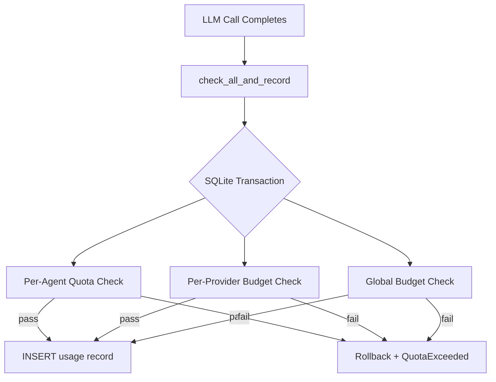

# Agent Kernel — librefang-kernel-metering-src

# Agent Kernel — Metering Engine

## Overview

`librefang-kernel-metering` is the cost accounting and budget enforcement layer for LibreFang. Every LLM call passes through this module to have its cost estimated, recorded, and checked against spending limits before and after execution. The engine operates on three independent budget axes—per-agent, per-provider, and global—each with hourly, daily, and monthly windows.

All persistent state lives in a SQLite-backed `UsageStore` (from `librefang-memory`), wrapped here in an `Arc` so the engine can be freely cloned across tasks.

## Architecture



The preferred entry point for the runtime is `check_all_and_record`, which performs all quota/budget checks **and** the insert inside a single SQLite transaction. This eliminates the TOCTOU race that would exist if you called `check_quota` then `record` separately—concurrent requests could both pass the check before either writes its row.

## Key Types

### `MeteringEngine`

The main public struct. Construct it with `MeteringEngine::new(store)` where `store` is an `Arc<UsageStore>`.

```rust
let substrate = MemorySubstrate::open(path)?;
let store = Arc::new(UsageStore::new(substrate.usage_conn()));
let engine = MeteringEngine::new(store);
```

The engine is stateless beyond the store reference—all query and mutation logic delegates to `UsageStore`.

### `BudgetStatus`

A serializable snapshot of current spend versus limits across all time windows. Returned by `budget_status()` for dashboard/alerting use. Fields include `hourly_spend`, `hourly_limit`, `hourly_pct` (and daily/monthly equivalents), plus the configured `alert_threshold` and `default_max_llm_tokens_per_hour`.

## Quota and Budget Enforcement

### Three Enforcement Scopes

| Scope | Config type | What it limits | Check method |
|-------|------------|----------------|--------------|
| Per-agent | `ResourceQuota` | Individual agent spending | `check_quota` |
| Per-provider | `ProviderBudget` | Spending through a specific LLM provider (e.g. moonshot) | `check_provider_budget` |
| Global | `BudgetConfig` | Total system-wide spending | `check_global_budget` |

Each scope supports three time windows: hourly, daily, and monthly. A limit of `0.0` means **no enforcement** for that window—checks are skipped entirely.

### Atomic vs. Non-Atomic Operations

**Non-atomic (separate check + record):**
- `check_quota` → `record` — two separate database operations. Fine for dashboards or pre-dispatch gating where exact enforcement isn't critical.
- `check_global_budget` — standalone global check.
- `check_provider_budget` — standalone provider check.

**Atomic (single transaction):**
- `check_quota_and_record` — per-agent check + insert in one transaction.
- `check_global_budget_and_record` — global check + insert.
- **`check_all_and_record`** — per-agent **and** global **and** per-provider, all in one transaction. This is the method the runtime should call after every LLM completion.

### Per-Provider Budgets

Provider-specific budgets are stored in `BudgetConfig.providers` as a `HashMap<String, ProviderBudget>`. When `check_all_and_record` processes a `UsageRecord`, it looks up the record's `provider` field in that map. If the provider has no configured budget, provider-level enforcement is skipped for that request.

`ProviderBudget` also supports `max_tokens_per_hour` — a token-volume limit independent of cost, useful for rate-limited subscription plans.

On failure, the record is **not inserted**. The transaction rolls back entirely.

## Cost Estimation

Cost estimation is separate from quota enforcement. The runtime estimates cost before recording, but the metering engine also provides helpers.

### `estimate_cost` (static, no catalog)

Uses hardcoded default rates: **$1.00 per million input tokens, $3.00 per million output tokens**. Useful for unit tests or when no catalog is available.

```rust
let cost = MeteringEngine::estimate_cost("any-model", input_tokens, output_tokens, cache_read, cache_creation);
```

### `estimate_cost_with_catalog` (static, with catalog)

Looks up the model in a `ModelCatalog` to get real pricing. Falls back to default rates if the model is unknown.

```rust
let cost = MeteringEngine::estimate_cost_with_catalog(&catalog, "claude-sonnet-4-20250514", input, output, cache_read, cache_creation);
```

**Special case — ChatGPT session-auth models:** When a model's catalog entry has both `input_cost_per_m` and `output_cost_per_m` equal to zero **and** its provider is `"chatgpt"`, the engine applies the legacy default rates ($1/$3 per million) instead of returning $0. This gives conservative budget estimates for session-authenticated models whose actual billing is opaque. See `should_use_legacy_budget_estimate`.

**Special case — Local models:** Zero-priced models from non-chatgpt providers (e.g., local-tier models) correctly return $0.00 cost.

**Subscription-based providers** (e.g., `alibaba-coding-plan`): These have zero per-token costs in the catalog. Cost tracking shows $0.00; usage must be monitored via the provider's console.

### Cache Token Pricing

The cost calculation distinguishes four token categories:

| Token Type | Price Formula |
|-----------|---------------|
| Regular input | `tokens / 1M × input_rate` |
| Cache-read input | `tokens / 1M × input_rate × 0.10` |
| Cache-creation input | `tokens / 1M × input_rate × 1.25` |
| Output | `tokens / 1M × output_rate` |

Regular input tokens are derived as `total_input - cache_read - cache_creation`, using saturating subtraction. This matches Anthropic-style prompt caching economics where reading a cached prompt is cheap but first-time cache population is slightly more expensive.

## Query Methods

| Method | Returns | Description |
|--------|---------|-------------|
| `get_summary(agent_id)` | `UsageSummary` | Aggregate stats (call count, token totals) optionally filtered by agent |
| `get_by_model()` | `Vec<ModelUsage>` | Usage broken down by model |
| `budget_status(budget)` | `BudgetStatus` | Current spend vs. limits for all windows |
| `cleanup(days)` | `usize` | Delete records older than N days, returns count of deleted rows |

## Error Handling

All enforcement methods return `LibreFangResult<()>`. On quota violation, they produce `LibreFangError::QuotaExceeded` with a human-readable message including:

- The scope (agent, provider, or global)
- The time window (hourly, daily, monthly)
- Current spend and limit (for cost budgets)
- Current and limit token counts (for token budgets)

Example error message:
```
Agent 0x1a2b... exceeded hourly cost quota: $1.0500 / $1.0000
```

## Integration Points

- **`librefang-memory`** — `UsageStore` provides all SQLite operations (`record`, `query_hourly`, `query_daily`, `query_monthly`, `query_global_hourly`, `query_today_cost`, `query_global_monthly`, `query_provider_hourly`, `query_provider_daily`, `query_provider_monthly`, `query_provider_tokens_hourly`, `check_quota_and_record`, `check_global_budget_and_record`, `check_all_with_provider_and_record`, `cleanup_old`).
- **`librefang-types`** — `AgentId`, `ResourceQuota`, `LibreFangError`, `ModelCatalogEntry`, `BudgetConfig`, `ProviderBudget`.
- **`librefang-runtime`** — `ModelCatalog` for pricing lookups (used by `estimate_cost_with_catalog`).