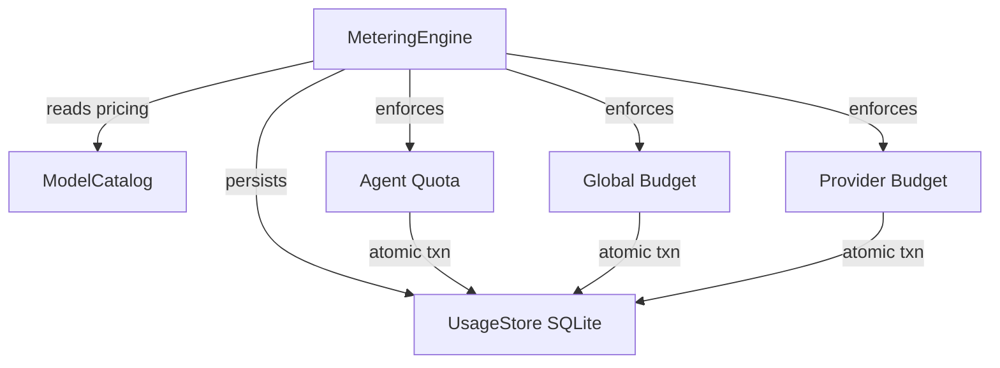

# Agent Kernel — librefang-kernel-metering-src

# Agent Kernel — Metering Engine

## Overview

The metering engine (`MeteringEngine`) tracks LLM token usage, estimates costs, and enforces spending quotas at three independent levels: per-agent, per-provider, and global. All persistent state lives in a SQLite-backed `UsageStore` (provided by `librefang-memory`).

## Architecture



Every usage event is represented by a `UsageRecord` (agent ID, provider, model, token counts, cost, latency). The engine can persist records, query aggregate spend across time windows, and block calls that would exceed configured limits.

## Quota Enforcement Hierarchy

Budget limits are checked at three levels, each with hourly / daily / monthly windows:

| Level | Config type | Scope |
|-------|-------------|-------|
| **Per-agent** | `ResourceQuota` | Spending attributed to a single `AgentId` |
| **Per-provider** | `ProviderBudget` | Spending routed through a named provider (e.g. `moonshot`, `openrouter`) |
| **Global** | `BudgetConfig` | Total spend across all agents and providers |

A zero-valued limit means **unlimited** — that window is skipped entirely during enforcement.

## Key API Surface

### Construction

```rust
let store = Arc::new(UsageStore::new(substrate.usage_conn()));
let engine = MeteringEngine::new(store);
```

The engine holds a single `Arc<UsageStore>` and performs no I/O at construction time.

### Recording Usage

```rust
engine.record(&UsageRecord { agent_id, provider, model, input_tokens, output_tokens, cost_usd, tool_calls, latency_ms })?;
```

`record` is a thin pass-through to `UsageStore::record`. It persists a single usage event but does **not** check any quotas.

### Atomic Check-and-Record

The non-atomic pattern of calling `check_quota` then `record` has a TOCTOU race — concurrent requests can both pass the check before either writes. The engine provides three atomic variants that wrap the check and insert in a single SQLite transaction:

| Method | Checks performed |
|--------|-----------------|
| `check_quota_and_record` | Per-agent quota only |
| `check_global_budget_and_record` | Global budget only |
| `check_all_and_record` | Per-agent + global + per-provider |

`check_all_and_record` is the **preferred entry point** after an LLM call. It resolves the per-provider budget from `BudgetConfig.providers` keyed by `record.provider`, then delegates to `UsageStore::check_all_with_provider_and_record`. On failure, the record is **not** inserted — the transaction rolls back.

### Standalone Quota Checks

For pre-dispatch gating or dashboard use:

- `check_quota(agent_id, &quota)` — per-agent hourly/daily/monthly
- `check_global_budget(&budget)` — global hourly/daily/monthly
- `check_provider_budget(provider, &budget)` — per-provider cost + token limits

These are read-only and non-atomic. They return `LibreFangError::QuotaExceeded` with a human-readable message identifying which limit was breached.

### Budget Status

`budget_status(&budget)` returns a `BudgetStatus` snapshot with current spend, configured limit, and utilization percentage for each window:

```rust
pub struct BudgetStatus {
    pub hourly_spend: f64,   pub hourly_limit: f64,   pub hourly_pct: f64,
    pub daily_spend: f64,    pub daily_limit: f64,    pub daily_pct: f64,
    pub monthly_spend: f64,  pub monthly_limit: f64,  pub monthly_pct: f64,
    pub alert_threshold: f64,
    pub default_max_llm_tokens_per_hour: u64,
}
```

`BudgetStatus` implements `serde::Serialize` for API exposure.

### Querying Usage

- `get_summary(agent_id: Option<AgentId>)` — aggregate `UsageSummary` for one agent or all agents
- `get_by_model()` — `Vec<ModelUsage>` grouped by model name

### Cleanup

`cleanup(days)` delegates to `UsageStore::cleanup_old` to purge records older than the given number of days. Returns the count of deleted rows.

## Cost Estimation

Two static methods estimate cost from token counts — they do not touch the store:

### `estimate_cost` (fallback, no catalog)

```rust
let cost = MeteringEngine::estimate_cost(model, input_tokens, output_tokens, cache_read_tokens, cache_creation_tokens);
```

Uses flat default rates: **$1.00 / $3.00 per million tokens** (input / output). Useful in tests or when no catalog is available.

### `estimate_cost_with_catalog` (preferred)

```rust
let cost = MeteringEngine::estimate_cost_with_catalog(&catalog, model, input_tokens, output_tokens, cache_read, cache_creation);
```

Looks up the model in the `ModelCatalog` and uses its `input_cost_per_m` / `output_cost_per_m`. Falls back to default rates if the model is not found.

**Special case — ChatGPT session-auth models:** If the catalog returns zero pricing for a model whose provider is `"chatgpt"`, the method applies the default rates instead of returning $0. This ensures budgets still function for session-authenticated models that don't expose per-token pricing. Local-tier models with zero pricing are **not** substituted — they genuinely cost nothing.

### Token Pricing Breakdown

The internal `estimate_cost_from_rates` function handles three token categories:

| Token type | Pricing multiplier |
|------------|--------------------|
| Regular input (total minus cache tokens) | `input_per_m × 1.0` |
| Cache-read input | `input_per_m × 0.10` |
| Cache-creation input | `input_per_m × 1.25` |
| Output | `output_per_m × 1.0` |

Regular input is computed as `input_tokens - cache_read_input_tokens - cache_creation_input_tokens`, clamped to zero via `saturating_sub`.

## Dependencies

| Crate | What's used |
|-------|-------------|
| `librefang-memory` | `UsageStore`, `UsageRecord`, `UsageSummary`, `ModelUsage`, `MemorySubstrate` |
| `librefang-types` | `AgentId`, `ResourceQuota`, `LibreFangError`, `ModelCatalogEntry`, `BudgetConfig`, `ProviderBudget` |
| `librefang-runtime` | `ModelCatalog` (for catalog-based cost estimation) |