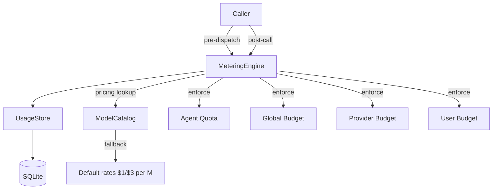

# Agent Kernel — librefang-kernel-metering-src

# Agent Kernel — Metering Engine (`librefang-kernel-metering`)

## Purpose

The metering engine is the cost-control layer for the LibreFang agent kernel. Every LLM call that flows through the system is measured, priced, and checked against spending limits before and after execution. The engine enforces budgets at four independent levels — per-agent, per-provider, per-user, and global — and persists every usage event to SQLite for audit and analytics.

## Architecture



The `MeteringEngine` is a thin orchestration layer over `librefang_memory::usage::UsageStore`. All persistence goes through the store; the engine adds quota semantics, cost estimation, and snapshot reporting on top.

## Key Struct

### `MeteringEngine`

```rust
pub struct MeteringEngine {
    store: Arc<UsageStore>,
}
```

Constructed with `MeteringEngine::new(store)`. The engine holds no mutable state of its own — it borrows concurrency safety from the `Arc<UsageStore>` and the SQLite transactions beneath it.

## Quota Enforcement Hierarchy

Budgets are checked at four levels. All four use the same pattern: query the relevant time-window aggregate from the store, compare against a configurable limit, return `LibreFangError::QuotaExceeded` on breach. A limit of `0.0` means **unlimited** and is skipped entirely.

| Level | Method | Time Windows | Scope |
|---|---|---|---|
| Agent | `check_quota` | hourly, daily, monthly | Per `AgentId` |
| Global | `check_global_budget` | hourly, daily, monthly | All agents combined |
| Provider | `check_provider_budget` | hourly, daily, monthly + tokens/hour | Per provider string (e.g. `"anthropic"`) |
| User | `check_user_budget` | hourly, daily, monthly | Per `UserId` (RBAC) |

### Atomic Check-and-Record

The non-atomic path (check → LLM call → record) has a TOCTOU race: two concurrent requests can both pass the quota check before either writes its usage. The engine provides three atomic methods that wrap the check and insert into a single SQLite transaction:

| Method | Checks Performed |
|---|---|
| `check_quota_and_record` | Per-agent quota only |
| `check_global_budget_and_record` | Global budget only |
| `check_all_and_record` | Per-agent + global + per-provider (the preferred post-call path) |

`check_all_and_record` also resolves a per-provider budget from `BudgetConfig.providers` using the record's `provider` field. If the provider has no configured budget, that layer is skipped.

### User Budget Semantics

`check_user_budget` is a **post-call** check. The cost of the just-completed call is already committed to the store (via `check_all_and_record`). If the check fails, it means the *next* call from this user must be denied — the current call is not rolled back. This mirrors the global and per-agent post-call semantics.

## Cost Estimation

### `estimate_cost` (static, catalog-free)

```rust
MeteringEngine::estimate_cost(model, input_tokens, output_tokens,
                              cache_read_input_tokens, cache_creation_input_tokens) -> f64
```

Uses fixed default rates of **$1.00/M input** and **$3.00/M output**. The `model` parameter is accepted for API consistency but is not consulted. Use this only when no model catalog is available (e.g., unit tests).

### `estimate_cost_with_catalog` (preferred)

```rust
MeteringEngine::estimate_cost_with_catalog(&catalog, model, input_tokens, output_tokens,
                                           cache_read_input_tokens, cache_creation_input_tokens) -> f64
```

Looks up pricing from the `ModelCatalog`. Falls back to default rates when the model is not found.

#### Special case: zero-priced ChatGPT models

ChatGPT session-auth models (`provider == "chatgpt"`) register with `$0.00/$0.00` in the catalog because billing is handled externally. To avoid budget blind spots, these models are automatically re-priced at the default `$1/$3` rates by the `should_use_legacy_budget_estimate` helper. This ensures budget enforcement still works with a conservative estimate.

Local-tier models with zero pricing are **not** re-priced — they genuinely cost nothing.

### Token Pricing Formula

The `estimate_cost_from_rates` helper breaks input tokens into three categories:

| Token Type | Price Multiplier | Rationale |
|---|---|---|
| Regular input | 1.0× input rate | Standard prompt tokens |
| Cache-read | 0.10× input rate | Prompt-cache hit (90% discount) |
| Cache-creation | 1.25× input rate | Upfront cost to seed the cache |
| Output | 1.0× output rate | Completion tokens |

Regular input = `total_input - cache_read - cache_creation`. Token counts are saturating-subtracted to avoid underflow.

## Querying and Reporting

| Method | Returns | Use Case |
|---|---|---|
| `get_summary(agent_id: Option<AgentId>)` | `UsageSummary` | Total calls, tokens, cost — optionally filtered to one agent |
| `get_by_model()` | `Vec<ModelUsage>` | Usage broken down by model name |
| `budget_status(&BudgetConfig)` | `BudgetStatus` | Snapshot of current spend vs limits for all windows |

`BudgetStatus` includes spend, limit, and percentage for hourly/daily/monthly windows, plus the configured `alert_threshold` and `default_max_llm_tokens_per_hour`. It is serializable (`#[derive(serde::Serialize])`) for API responses.

## Record Cleanup

`cleanup(days: u32)` deletes usage records older than the given number of days. Returns the number of deleted rows. Delegates to `UsageStore::cleanup_old`.

## Dependencies

| Crate | What's Used |
|---|---|
| `librefang_memory` | `UsageStore`, `UsageRecord`, `UsageSummary`, `ModelUsage`, `MemorySubstrate` |
| `librefang_types` | `AgentId`, `UserId`, `ResourceQuota`, `BudgetConfig`, `ProviderBudget`, `UserBudgetConfig`, `LibreFangError` |
| `librefang_runtime` | `ModelCatalog` for pricing lookups |

## Integration Pattern

The typical call flow from the agent kernel after an LLM response:

1. **Build a `UsageRecord`** with token counts and the computed `cost_usd` (from `estimate_cost_with_catalog`).
2. **Call `check_all_and_record(&record, &quota, &budget)`** — this atomically verifies per-agent, global, and per-provider limits, then inserts the record. If any limit is breached, the insert is rolled back and `QuotaExceeded` is returned.
3. **Call `check_user_budget(user_id, &user_budget)`** — post-call gate for the next request from this user.
4. **Optionally query** `budget_status` or `get_summary` for dashboards and alerting.