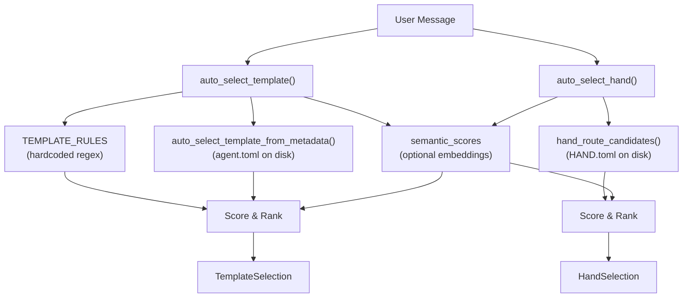

# Agent Kernel — librefang-kernel-router-src

# Agent Kernel — `librefang-kernel-router`

## Purpose

This module is the **routing engine** for LibreFang. Given a user message, it decides which specialist agent template or hand should handle it. Routing uses a layered scoring system that blends keyword matching (with bilingual regex rules) and optional embedding-based semantic similarity.

The router makes two independent decisions:

1. **Template selection** — which agent persona (coder, researcher, architect, etc.) to invoke.
2. **Hand selection** — which tool-bearing hand (browser, collector, trader, etc.) to activate.

Both follow the same scoring philosophy but draw their candidate pools from different sources.

---

## Architecture Overview



---

## Public API

### `auto_select_template`

```rust
pub fn auto_select_template(
    message: &str,
    agents_dir: &Path,
    semantic_scores: Option<&HashMap<String, f32>>,
) -> TemplateSelection
```

Selects the best agent template for a user message. Returns a `TemplateSelection` containing the template name, a human-readable reason string, and the numeric score.

**Selection logic, in order:**

1. **Built-in rules** — The `TEMPLATE_RULES` table provides curated regex patterns for ~30 templates, each with strong and weak tiers. Scored at `EXPLICIT_ALIAS_WEIGHT` (6) per strong hit and `WEAK_PHRASE_WEIGHT` (1) per weak hit.
2. **Manifest metadata** — Scans `agents_dir/*/agent.toml` for `[metadata.routing]` aliases and auto-generated phrases from name/description/tags. Explicit aliases score 6, generated phrases score 2, weak aliases score 1.
3. **Semantic fallback** — When keyword matching produces nothing and `semantic_scores` is provided, any template with similarity ≥ `SEMANTIC_ONLY_THRESHOLD` (0.55) receives a bonus up to `MAX_SEMANTIC_BONUS` (5 points).
4. **Multi-domain detection** — If the message matches multiple distinct specialties and contains multi-domain tokens (e.g. "同时", "分别", "multi", "together"), the router selects `orchestrator`.
5. **Default** — Falls back to `orchestrator` with score 0.

When both built-in rules and manifest metadata produce matches, the manifest wins only if its score exceeds the rule-based score by at least 2 points (preventing metadata noise from overriding curated rules).

### `auto_select_hand`

```rust
pub fn auto_select_hand(
    message: &str,
    semantic_scores: Option<&HashMap<String, f32>>,
) -> HandSelection
```

Selects the best hand for a user message. Returns a `HandSelection` with an optional `hand_id` (None if no hand clears the threshold), a reason string, and the score.

Candidate phrases come from `HAND.toml` files:

| Phrase tier | Source | Weight |
|---|---|---|
| Strong | `[routing].aliases` + description-derived phrases | 6 per hit |
| Weak | `[routing].weak_aliases` + id-derived tokens (≥3 chars, non-generic) | 1 per hit |

Semantic scores are blended the same way as template routing. A minimum score of `MIN_HAND_SCORE` (2) is required — a single weak hit is too noisy to trigger routing.

### Template Manifest Loading

```rust
pub fn load_template_manifest(home_dir: &Path, template: &str) -> Result<AgentManifest, String>
```

Reads and parses `workspaces/agents/{template}/agent.toml`. Template names are validated by `is_safe_template_name` — only ASCII alphanumeric characters plus `-` and `_` are allowed.

### Description Export

```rust
pub fn all_template_descriptions(agents_dir: &Path) -> Vec<(String, String)>
```

Returns `(template_name, embed_text)` pairs for all routable templates (excludes `"assistant"`). Used by the kernel to build embeddings for semantic routing. The embed text combines name, description, and tags.

### Cache Control

```rust
pub fn set_hand_route_home_dir(home_dir: &Path)
pub fn invalidate_hand_route_cache()
pub fn invalidate_manifest_cache()
```

The router maintains three global caches (via `OnceLock<Mutex<...>>`):

| Cache | Contents | Invalidated by |
|---|---|---|
| `REGEX_CACHE` | Compiled `Regex` objects keyed by pattern string | Never (safe to keep) |
| `MANIFEST_CACHE` | `ManifestRouteCandidate` list keyed by `agents_dir` path | `invalidate_manifest_cache()` |
| `HAND_ROUTE_CACHE` | `HandRouteCandidate` list keyed by home directory | `invalidate_hand_route_cache()` |

Call the invalidation functions after config hot-reload or agent/hand install/uninstall. The skills route handler (`install_hand`, `uninstall_hand` in `src/routes/skills.rs`) calls `invalidate_hand_route_cache` automatically.

---

## Scoring System

All routing uses the same weighted scoring model:

```
score = Σ(strong_hits) × 6
      + Σ(generated_hits) × 2   // manifest metadata only
      + Σ(weak_hits) × 1
      + round(semantic_similarity × 5.0)
```

| Constant | Value | Purpose |
|---|---|---|
| `EXPLICIT_ALIAS_WEIGHT` | 6 | Curated aliases and strong regex hits |
| `GENERATED_PHRASE_WEIGHT` | 2 | Auto-extracted phrases from name/description/tags |
| `WEAK_PHRASE_WEIGHT` | 1 | Weak aliases and id-derived tokens |
| `MAX_SEMANTIC_BONUS` | 5.0 | Cap on embedding similarity bonus |
| `SEMANTIC_ONLY_THRESHOLD` | 0.55 | Minimum similarity for semantic-only fallback |
| `MIN_HAND_SCORE` | 2 | Minimum score to select a hand |

Ties are broken by number of matched phrases (more specific wins), then by candidate ID lexicographic order.

---

## Keyword Matching Pipeline

The router extracts routing phrases from several sources and matches them against the user message at query time.

### Source Extraction

**From HAND.toml** (`hand_route_candidate_from_definition`):
- Strong: `[routing].aliases` + `description_phrases(def.description)`
- Weak: `[routing].weak_aliases` + tokens from the hand ID (split on `-`/`_`, filtered by length ≥ 3 and not in `GENERIC_ENGLISH_WORDS`)

**From agent.toml** (`build_manifest_route_candidates`):
- Explicit aliases: `[metadata.routing].aliases` + `strong_aliases`
- Generated phrases: `english_variants(template_name)` + `tag_phrases(tags)` + `description_phrases(description)`
  - Skipped when `[metadata.routing].exclude_generated = true`
- Weak: `[metadata.routing].weak_aliases` + template name tokens

**Phrase extraction from free text** (`description_phrases`, `tag_phrases`):
1. Text is split into chunks via `split_phrase_chunks` on punctuation and CJK delimiter characters (、。；：（）etc.)
2. Each chunk is normalized: leading/trailing non-alphanumeric characters are stripped, generic English stop words are trimmed from both ends
3. ASCII chunks produce word-level candidates via `ascii_phrase_candidates` — individual content words (≥ `min_len` chars, non-generic) and adjacent bigrams
4. Non-ASCII chunks (CJK, etc.) pass through if 2–32 characters

### Phrase Matching

`phrase_matches(message, phrase)` handles two cases:
- **ASCII phrases**: Builds a case-insensitive regex with word-boundary assertions, treating spaces in the phrase as flexible separators (`[\s_-]+`)
- **Non-ASCII phrases**: Case-folded substring containment check

For built-in rules (`TEMPLATE_RULES`), `regex_matches(message, pattern)` uses pre-compiled regex patterns cached globally in `REGEX_CACHE`.

---

## TEMPLATE_RULES Reference

The hardcoded rules cover ~30 specialist templates. Each rule has a target template name, strong patterns (high-confidence), and weak patterns (supporting evidence). Patterns support bilingual matching (English and Chinese). Key categories:

| Category | Templates |
|---|---|
| Software engineering | `coder`, `debugger`, `test-engineer`, `code-reviewer`, `architect` |
| Security & ops | `security-auditor`, `devops-lead`, `ops` |
| Research & analysis | `researcher`, `analyst`, `data-scientist` |
| Content | `writer`, `doc-writer`, `translator`, `tutor` |
| Business | `email-assistant`, `meeting-assistant`, `sales-assistant`, `customer-support`, `recruiter`, `legal-assistant` |
| Personal | `personal-finance`, `recipe-assistant`, `travel-planner`, `health-tracker`, `home-automation` |
| Social & marketing | `social-media`, `planner` |
| Meta | `orchestrator` (multi-domain), `hello-world` (greetings) |

Templates listed in `ROUTING_EXCLUDED_TEMPLATES` (currently `["assistant"]`) are excluded from metadata-based routing.

---

## Filesystem Layout

The router reads from two directory trees under the LibreFANG home directory:

```
~/.librefang/
├── registry/
│   └── hands/
│       ├── browser/
│       │   └── HAND.toml       ← hand routing candidates
│       ├── collector/
│       │   └── HAND.toml
│       └── ...
└── workspaces/
    └── agents/
        ├── coder/
        │   └── agent.toml      ← template manifest + routing metadata
        ├── researcher/
        │   └── agent.toml
        └── ...
```

The home directory is resolved in this order:
1. Explicitly set via `set_hand_route_home_dir()`
2. `LIBREFANG_HOME` environment variable
3. `~/.librefang` (falls back to system temp if home is unavailable)

---

## Semantic Score Integration

The router does not compute embeddings itself. The caller provides pre-computed similarity scores as a `HashMap<String, f32>` mapping template or hand IDs to cosine similarity values (0.0–1.0).

The blending strategy is additive: semantic bonus is added to the keyword score. This means strong keyword matches are never overridden by semantic signals alone, since a single strong keyword hit (6 points) exceeds the maximum semantic bonus (5 points).

When keyword matching produces zero hits, the semantic-only fallback activates for any candidate with similarity ≥ 0.55.

**Cross-lingual support**: Semantic scores enable routing for languages without keyword coverage (Japanese, Korean, etc.). The caller computes embeddings against hand/template descriptions exported by `all_template_descriptions`.

---

## Return Types

```rust
pub struct HandSelection {
    pub hand_id: Option<String>,  // None if no hand cleared MIN_HAND_SCORE
    pub reason: String,           // e.g. "matched collector via monitor, change detection"
    pub score: usize,
}

pub struct TemplateSelection {
    pub template: String,         // always set; defaults to "orchestrator"
    pub reason: String,
    pub score: usize,
}
```