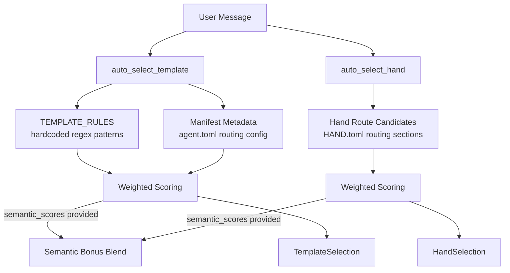

# Agent Kernel — librefang-kernel-router-src

# Agent Kernel — `librefang-kernel-router`

Message routing engine that maps incoming user messages to the most appropriate agent template or hand. Uses layered keyword matching with optional semantic similarity blending for cross-lingual support.

## Architecture



Two independent routing decisions are made for each message: which **template** (agent persona) to use, and which **hand** (tool-capable agent) to activate. Callers invoke `auto_select_template` and `auto_select_hand` separately, passing the same message and optional semantic scores.

## Template Routing

`auto_select_template(message, agents_dir, semantic_scores)` returns a `TemplateSelection` with the template name, match reason, and score.

The function evaluates three sources in priority order:

1. **Hardcoded `TEMPLATE_RULES`** — 28 built-in `RouteRule` entries covering English and Chinese regex patterns. Each rule has `strong` patterns (weighted 6) and `weak` patterns (weighted 1).
2. **Manifest metadata** — `auto_select_template_from_metadata` scans `agents_dir` for agent directories containing `agent.toml`. The `[metadata.routing]` section declares `aliases`, `weak_aliases`, and `exclude_generated`.
3. **Semantic fallback** — When keyword matching yields nothing and `semantic_scores` is provided, any template scoring ≥ 0.55 similarity gets a bonus.

When the top two scored templates differ by a small margin and the message contains multi-domain indicators (`同时`, `分别`, `协作`, `多个`, `multi`, `together`), the router falls back to `orchestrator`.

The excluded template `"assistant"` is never a routing target.

### Scoring Weights

| Source | Weight |
|---|---|
| Explicit alias (hardcoded strong or manifest `aliases`) | 6 |
| Generated phrase (from name/tags/description) | 2 |
| Weak alias (hardcoded weak or manifest `weak_aliases`) | 1 |
| Semantic bonus | 0–5 (scaled from cosine similarity) |

### `TemplateSelection`

```rust
pub struct TemplateSelection {
    pub template: String,
    pub reason: String,
    pub score: usize,
}
```

When no match is found, defaults to `"orchestrator"` with score 0.

## Hand Routing

`auto_select_hand(message, semantic_scores)` returns a `HandSelection`.

Hands are loaded from `{LIBREFANG_HOME}/registry/hands/{hand_id}/HAND.toml`. Each `HandDefinition` provides a `[routing]` section with `aliases` (strong) and `weak_aliases`. Additional strong phrases are auto-generated from the hand's description; weak phrases come from the hand ID's hyphen-separated tokens (filtered against `GENERIC_ENGLISH_WORDS`).

### Minimum Score Threshold

`MIN_HAND_SCORE = 2`. A single weak keyword hit (score 1) is rejected as too noisy. At least one strong hit or two weak hits are required.

### `HandSelection`

```rust
pub struct HandSelection {
    pub hand_id: Option<String>,  // None when no hand matches
    pub reason: String,
    pub score: usize,
}
```

## Semantic Score Blending

Both `auto_select_template` and `auto_select_hand` accept `Option<&HashMap<String, f32>>` containing precomputed cosine similarities between the message embedding and each candidate's description embedding.

Blending rules:
- Semantic bonus is computed as `(similarity * 5.0).round()` and added to the keyword score.
- Keyword matches always participate in scoring; semantic is additive.
- For **semantic-only** fallback (no keyword hits), similarity must reach `SEMANTIC_ONLY_THRESHOLD = 0.55`.
- Strong keyword matches override conflicting semantic suggestions because the combined keyword + semantic score for the correct candidate exceeds the semantic-only score for a wrong candidate.

Callers are expected to use `all_template_descriptions(agents_dir)` to get `(template_name, embed_text)` pairs for computing embeddings externally.

## Caching

Three global caches avoid redundant work across calls:

| Cache | Static | Invalidation |
|---|---|---|
| `MANIFEST_CACHE` | `OnceLock<Mutex<Option<ManifestCacheEntry>>>` | `invalidate_manifest_cache()` |
| `HAND_ROUTE_CACHE` | `OnceLock<Mutex<Option<HandRouteCacheEntry>>>` | `invalidate_hand_route_cache()` |
| `REGEX_CACHE` | `OnceLock<Mutex<HashMap<String, Regex>>>` | Never invalidated |

The manifest cache keys on the `agents_dir` path — a different directory triggers a rebuild. The hand route cache keys on the resolved home directory string.

**Call `invalidate_manifest_cache()` and `invalidate_hand_route_cache()` after**:
- Config hot-reload
- Agent install/uninstall (incoming calls from `install_hand` / `uninstall_hand` in `src/routes/skills.rs`)
- Any modification to `HAND.toml` or `agent.toml` files

## Phrase Generation

Several functions extract matchable phrases from metadata:

- **`description_phrases(description)`** — Splits on punctuation and CJK delimiters (`、。，；：（）–—`), strips generic English words, returns ASCII word n-grams (via `ascii_phrase_candidates`) and meaningful Unicode segments (2–32 chars).
- **`tag_phrases(tags)`** — Normalizes each tag the same way as description phrases, with a lower minimum word length of 3.
- **`english_variants(text)`** — Generates the original kebab-case form, a space-separated form, and individual hyphen-split parts.
- **`manifest_routing_config(manifest)`** — Extracts `aliases`, `strong_aliases`, `weak_aliases`, and `exclude_generated` from `[metadata.routing]`.

All phrase lists are deduplicated by `dedupe()`, which preserves insertion order.

## Pattern Matching

- **`regex_matches(message, pattern)`** — Case-insensitive regex match with cached compilation. Invalid patterns compile to a never-match sentinel.
- **`phrase_matches(message, phrase)`** — Dispatches on `is_ascii_phrase`. ASCII phrases get word-boundary-aware regex matching (`(?i)(^|[^a-z0-9])...([^a-z0-9]|$)` with spaces mapped to `[\s_-]+`). Unicode phrases use simple `contains` on lowercased strings.

## Template Manifest Loading

`load_template_manifest(home_dir, template)` resolves to `{home_dir}/workspaces/agents/{template}/agent.toml` and deserializes into `AgentManifest`. Template names are validated by `is_safe_template_name` — only ASCII alphanumeric, hyphens, and underscores are allowed.

`all_template_descriptions(agents_dir)` returns `(template_name, "name: description. Tags: tag1, tag2")` pairs for every non-excluded template that has a non-empty description. Use this to build embedding vectors for semantic routing.

## Home Directory Resolution

`resolve_hand_route_home_dir()` checks, in order:
1. `HAND_ROUTE_HOME_DIR` set via `set_hand_route_home_dir()`
2. `LIBREFANG_HOME` environment variable
3. `~/.librefang` (via `dirs::home_dir()` with temp fallback)

## Public API Summary

| Function | Purpose |
|---|---|
| `auto_select_template` | Route message to agent template |
| `auto_select_hand` | Route message to hand |
| `load_template_manifest` | Load `AgentManifest` from disk |
| `all_template_descriptions` | Get template descriptions for embedding |
| `set_hand_route_home_dir` | Configure home directory for hand loading |
| `invalidate_manifest_cache` | Clear manifest routing cache |
| `invalidate_hand_route_cache` | Clear hand routing cache |

## Integration Points

- **`install_hand` / `uninstall_hand`** (`src/routes/skills.rs`) → call `invalidate_hand_route_cache()` after registry mutations.
- **`librefang_hands::registry::parse_hand_toml`** → used by `load_hand_route_candidates` to parse `HAND.toml` definitions.
- **`librefang_types::agent::AgentManifest`** → the manifest type returned by `load_template_manifest`.
- **`librefang_runtime::registry_sync::resolve_home_dir_for_tests`** → used in test setup to initialize the hand route home directory.