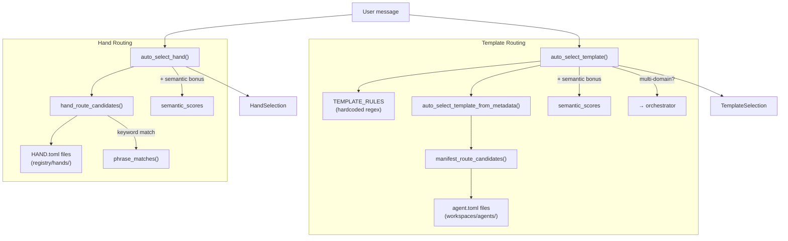

# Agent Kernel — librefang-kernel-router-src

# Agent Kernel — `librefang-kernel-router`

## Overview

The router module is the dispatch brain of LibreFang. Given an incoming user message, it determines which **agent template** or **hand** should handle it. Routing combines three signal sources—hardcoded keyword rules, manifest metadata, and optional embedding-based semantic similarity—into a single scored selection.

The module is stateless between calls (modulo caches) and never spawns agents itself; it simply returns a selection result that the kernel acts on.

## Architecture



## Public API

### `auto_select_template(message, agents_dir, semantic_scores) → TemplateSelection`

The primary entry point for template routing. Returns a `TemplateSelection` containing the template name, a human-readable reason string, and a numeric score.

**Scoring sources, evaluated in order of priority:**

| Source | Weight | Description |
|---|---|---|
| Hardcoded `TEMPLATE_RULES` regex matches | 6 (strong) / 1 (weak) | Curated bilingual regex patterns for ~28 built-in templates |
| Manifest `explicit_aliases` / `strong_aliases` | 6 | User-configured in `agent.toml` under `[metadata.routing]` |
| Manifest `generated_phrases` | 2 | Auto-derived from template name, description, and tags |
| Manifest `weak_aliases` | 1 | User-configured weak aliases + id-derived tokens |
| Semantic similarity bonus | 0–5 | Scaled from cosine similarity against template descriptions |

**Special behaviors:**

- If two different templates score highly and the message contains multi-domain indicators (`同时`, `分别`, `协作`, `多个`, `multi`, `together`), the function routes to `"orchestrator"` instead.
- If no keyword match is found but `semantic_scores` is provided, templates with similarity ≥ 0.55 are considered as semantic-only candidates.
- The final fallback is `"orchestrator"` with a descriptive reason.

### `auto_select_hand(message, semantic_scores) → HandSelection`

Routes a message to the best-matching hand. Works identically to template routing but reads keywords from `HAND.toml` `[routing]` sections rather than hardcoded rules.

Returns `HandSelection { hand_id: None, .. }` when no hand meets the minimum score threshold (`MIN_HAND_SCORE = 2`).

### `load_template_manifest(home_dir, template) → Result<AgentManifest, String>`

Reads and parses an `agent.toml` file from `<home_dir>/workspaces/agents/<template>/agent.toml`. Validates that the template name is safe (alphanumeric, hyphens, underscores only).

### `all_template_descriptions(agents_dir) → Vec<(String, String)>`

Returns `(template_name, embed_text)` pairs for every routable template. Used by the kernel to compute embedding vectors for semantic routing. Excludes templates listed in `ROUTING_EXCLUDED_TEMPLATES` (currently `["assistant"]`). The embed text combines name, description, and tags.

### Cache Management

```rust
pub fn set_hand_route_home_dir(home_dir: &Path)
pub fn invalidate_hand_route_cache()
pub fn invalidate_manifest_cache()
```

The router caches parsed routing candidates in global `OnceLock<Mutex<…>>` slots. Call `invalidate_hand_route_cache()` and `invalidate_manifest_cache()` after config hot-reload or agent/hand install/uninstall. `set_hand_route_home_dir` configures the filesystem root for hand discovery; the incoming call graph shows it is also triggered from `skills.rs` during hand install/uninstall.

## Scoring Constants

| Constant | Value | Purpose |
|---|---|---|
| `EXPLICIT_ALIAS_WEIGHT` | 6 | Strong aliases and hardcoded regex rules |
| `GENERATED_PHRASE_WEIGHT` | 2 | Auto-derived phrases from name/description/tags |
| `WEAK_PHRASE_WEIGHT` | 1 | Weak aliases and id-derived tokens |
| `MAX_SEMANTIC_BONUS` | 5.0 | Upper bound on embedding similarity bonus |
| `SEMANTIC_ONLY_THRESHOLD` | 0.55 | Minimum cosine similarity for semantic-only fallback |
| `MIN_HAND_SCORE` | 2 | Floor for hand routing — prevents single weak-keyword false positives |

## Hand Routing Data Flow

Hands are discovered from `<home_dir>/registry/hands/*/HAND.toml`. Each `HandDefinition` is parsed via `librefang_hands::registry::parse_hand_toml_with_agents_dir` (the agents registry directory is passed to resolve `base = "<template>"` references without emitting spurious warnings).

From each definition, the router extracts:

- **Strong phrases**: `[routing].aliases` + phrases derived from the hand description
- **Weak phrases**: `[routing].weak_aliases` + tokens from the hand ID (filtered against `GENERIC_ENGLISH_WORDS`, minimum 3 characters)

The home directory resolution order is:

1. Explicitly set via `set_hand_route_home_dir()`
2. `LIBREFANG_HOME` environment variable
3. `~/.librefang` (falling back to system temp dir)

## Template Routing Data Flow

Template routing has two parallel sources that are scored independently:

### 1. Hardcoded Rules (`TEMPLATE_RULES`)

A static array of `RouteRule` entries. Each rule defines a `target` template name plus `strong` and `weak` pattern groups. Patterns are `(label, regex)` pairs compiled once and cached in `REGEX_CACHE`. Rules cover ~28 templates with bilingual (English + Chinese) patterns covering domains like coding, debugging, testing, architecture, security, DevOps, research, writing, and more.

### 2. Manifest Metadata (`auto_select_template_from_metadata`)

Scans all `agent.toml` files in `agents_dir`. For each manifest:

1. Reads `[metadata.routing]` configuration:
   - `aliases` / `strong_aliases` → explicit aliases (weight 6)
   - `weak_aliases` → weak aliases (weight 1)
   - `exclude_generated` → optionally disables auto-generated phrases
2. Auto-generates phrases from:
   - Template name via `english_variants()` (splits on hyphens/underscores)
   - Tags via `tag_phrases()`
   - Description via `description_phrases()`

The results are cached in `MANIFEST_CACHE`, keyed by `agents_dir` path.

## Phrase Generation

The router extracts routing phrases from free-text descriptions and tags in a language-agnostic way:

- **`description_phrases(text)`**: Splits text on punctuation (including CJK punctuation like `、。，（）`). For ASCII chunks, strips leading/trailing generic English words and generates word-level and bigram candidates. For Unicode chunks (CJK, etc.), keeps the raw chunk if it's 2–32 characters.
- **`english_variants(text)`**: Produces the original form, a space-joined form (replacing hyphens/underscores), and individual hyphen-split components.
- **`tag_phrases(tags)`**: Applies `english_variants` to ASCII tags and preserves Unicode tags as-is.
- **`ascii_phrase_candidates(text, min_len)`**: Filters out generic words, generates the full phrase plus individual content words plus adjacent-word bigrams.

All phrase lists pass through `dedupe()`, which preserves insertion order while removing duplicates.

## Phrase Matching

`phrase_matches(message, phrase)` handles two cases:

- **ASCII phrases**: Builds a regex with word-boundary-aware matching (`(^|[^a-z0-9])phrase([^a-z0-9]|$)`) after escaping the phrase and normalizing internal spaces to `[\s_-]+`.
- **Unicode phrases**: Simple case-insensitive `contains` check.

Regex patterns are compiled once and stored in `REGEX_CACHE` (a global `HashMap<String, Regex>`).

## Return Types

```rust
pub struct HandSelection {
    pub hand_id: Option<String>,  // None when no hand meets the threshold
    pub reason: String,           // Human-readable explanation
    pub score: usize,             // Aggregate score
}

pub struct TemplateSelection {
    pub template: String,         // Always populated (defaults to "orchestrator")
    pub reason: String,
    pub score: usize,
}
```

## Integration Points

- **`librefang_types::agent::AgentManifest`** — the manifest type loaded from `agent.toml`
- **`librefang_hands::registry::parse_hand_toml_with_agents_dir`** — parses `HAND.toml` files during hand candidate loading
- **`librefang_runtime::registry_sync::resolve_home_dir_for_tests`** — used in test setup to find the test home directory
- **Skills route handlers** (`src/routes/skills.rs`) call `invalidate_hand_route_cache()` after hand install/uninstall operations

## Configuration Reference

### `agent.toml` routing section

```toml
[metadata.routing]
aliases = ["release notes", "changelog generator"]
strong_aliases = ["release notes"]       # merged with aliases
weak_aliases = ["changelog"]
exclude_generated = false                # set true to disable auto-phrase generation
```

### `HAND.toml` routing section

```toml
[routing]
aliases = ["uptime pulse monitor"]       # strong phrases
weak_aliases = ["uptime pulse"]          # weak phrases
```