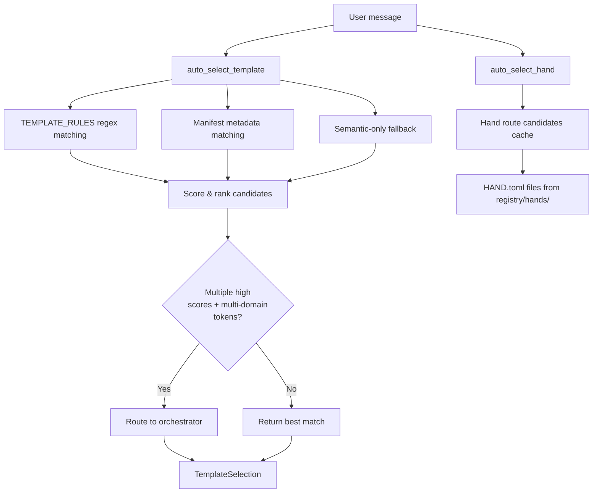

# Agent Kernel — librefang-kernel-router-src

# Agent Kernel — `librefang-kernel-router`

Routes incoming user messages to the most appropriate agent template or hand using layered keyword matching and optional semantic similarity scoring.

## Purpose

When a user sends a message like *"debug this stack trace"* or *"帮我做深度调研"*, the router determines which specialist should handle it — `debugger`, `researcher`, `orchestrator`, or a dynamically installed hand. This avoids requiring every message to go through a general-purpose assistant when a more targeted specialist exists.

The router supports three sources of routing signal, blended into a single numeric score:

| Source | Weight per hit | Origin |
|---|---|---|
| Explicit aliases / strong patterns | 6 | `TEMPLATE_RULES`, `HAND.toml` `[routing].aliases`, `agent.toml` `[metadata.routing].aliases` |
| Generated phrases / strong regex | 2 | Auto-derived from template name, tags, description |
| Weak aliases / weak patterns | 1 | `TEMPLATE_RULES` weak entries, `[routing].weak_aliases`, ID-derived tokens |
| Semantic bonus | 0–5 (scaled from cosine similarity) | Caller-provided embedding scores |

## Architecture



## Core Types

### `HandSelection`

Returned by `auto_select_hand`. Indicates which hand (if any) matched and why.

```rust
pub struct HandSelection {
    pub hand_id: Option<String>,  // None when no hand meets MIN_HAND_SCORE
    pub reason: String,           // e.g. "matched researcher via deep research"
    pub score: usize,
}
```

### `TemplateSelection`

Returned by `auto_select_template`. Identifies the chosen agent template.

```rust
pub struct TemplateSelection {
    pub template: String,         // Template directory name (e.g. "coder")
    pub reason: String,
    pub score: usize,
}
```

### `ManifestRouteCandidate` (internal)

Built from each `agent.toml` manifest. Carries three tiers of phrases:

- **`explicit_aliases`** — User-configured via `[metadata.routing].aliases` and `[metadata.routing].strong_aliases`. Highest confidence.
- **`generated_phrases`** — Auto-extracted from the manifest's name, description, and tags. Medium confidence.
- **`weak_phrases`** — Explicit `[metadata.routing].weak_aliases` plus tokens split from the template ID (filtered against `GENERIC_ENGLISH_WORDS`). Lowest confidence.

## Public API

### Routing Functions

#### `auto_select_template(message, agents_dir, semantic_scores) -> TemplateSelection`

Main entry point for template routing. Evaluates three layers in order:

1. **Manifest metadata** — Scans `agents_dir` for agent manifests and matches against their routing config + generated phrases.
2. **Hardcoded `TEMPLATE_RULES`** — Regex-based rules for ~28 built-in templates (coder, debugger, architect, etc.). These rules define bilingual strong/weak patterns (English + Chinese).
3. **Semantic-only fallback** — When keyword matching yields nothing, candidates with cosine similarity ≥ `SEMANTIC_ONLY_THRESHOLD` (0.55) receive a bonus score.

**Multi-domain detection:** If the top two candidates score above zero, target different templates, *and* the message contains multi-domain tokens (e.g. "同时", "协作", "multi"), the function routes to `orchestrator` instead.

**Fallback:** If no candidate scores at all, returns `TemplateSelection { template: "orchestrator", ... }`.

#### `auto_select_hand(message, semantic_scores) -> HandSelection`

Routes to a hand using phrases loaded from `HAND.toml` files under `$LIBREFANG_HOME/registry/hands/`. Each hand's `[routing]` section contributes strong and weak phrases. Requires a minimum score of `MIN_HAND_SCORE` (2) to return a match — a single weak hit is too noisy.

#### `load_template_manifest(home_dir, template) -> Result<AgentManifest, String>`

Loads and parses `workspaces/agents/<template>/agent.toml` relative to `home_dir`. Validates template names via `is_safe_template_name` (alphanumeric, `-`, `_` only).

#### `all_template_descriptions(agents_dir) -> Vec<(String, String)>`

Returns `(template_name, embed_text)` pairs for all non-excluded templates. Used by the kernel to build embedding vectors for semantic routing. The embed text combines name, description, and tags.

### Cache Management

#### `set_hand_route_home_dir(home_dir)`

Sets the base directory used to locate `registry/hands/`. Must be called before the first routing request. Typically set during application startup.

#### `invalidate_hand_route_cache()`

Clears the cached hand route candidates. Must be called after hand install/uninstall operations. The skills route handlers (`install_hand`, `uninstall_hand`) call this automatically.

#### `invalidate_manifest_cache()`

Clears the cached manifest route candidates. Call after config hot-reload or agent install/uninstall.

## Scoring in Detail

### Keyword Scoring

For each candidate, matches are counted and weighted:

```
score = (strong_hits × 6) + (weak_hits × 1)
```

For manifest-based candidates, generated phrases use `GENERATED_PHRASE_WEIGHT` (2):

```
score = (explicit_hits × 6) + (generated_hits × 2) + (weak_hits × 1)
```

### Semantic Blending

When the caller provides `semantic_scores` (a `HashMap<String, f32>` of cosine similarities), each candidate receives:

```
bonus = round(similarity × MAX_SEMANTIC_BONUS)  // MAX_SEMANTIC_BONUS = 5.0
```

This means a perfect 1.0 similarity adds 5 points — enough to override a single weak hit (1 point) but not a strong hit (6 points). This preserves keyword authority while allowing embedding-based routing for non-English input.

### Semantic-Only Fallback

When keyword matching produces zero candidates, templates with similarity ≥ 0.55 receive a standalone score. This threshold prevents low-confidence semantic noise from triggering false routes.

## Phrase Extraction

The router auto-generates routing phrases from manifest metadata via several internal functions:

### `description_phrases(description) -> Vec<String>`

Splits the description into chunks at punctuation and CJK delimiters, then:

- **ASCII chunks:** Strips leading/trailing generic English words (from `GENERIC_ENGLISH_WORDS`), generates the full phrase plus individual content words (≥4 chars), and adjacent word bigrams.
- **Unicode chunks:** Kept as-is if length is 2–32 characters.

### `tag_phrases(tags) -> Vec<String>`

Treats each tag as a mini-description. ASCII tags produce word-level candidates (≥3 chars); non-ASCII tags are preserved whole.

### `english_variants(text) -> Vec<String>`

Generates the original form plus space-separated and split forms for hyphenated/underscored names (e.g. `"code-review"` → `["code-review", "code review", "code", "review"]`).

### `phrase_matches(message, phrase) -> bool`

Case-insensitive matching. For ASCII phrases, uses regex with word-boundary enforcement (`(^|[^a-z0-9])phrase([^a-z0-9]|$)`). For non-ASCII phrases, uses simple `contains`.

## Hardcoded Template Rules

`TEMPLATE_RULES` defines 28 built-in route targets with bilingual (English + Chinese) regex patterns. Each rule has a `target` template name, `strong` patterns, and optional `weak` patterns:

- **Strong examples:** `\bdebug\b|traceback|stack trace` (debugger), `架构设计|模块划分|技术方案` (architect)
- **Weak examples:** `\bbug\b` (debugger), `分析|指标|趋势` (analyst)

Templates excluded from routing are listed in `ROUTING_EXCLUDED_TEMPLATES` (currently `["assistant"]`).

## Caching Strategy

Three `OnceLock<Mutex<...>>` globals provide lazy, thread-safe caching:

| Cache | Key | Invalidated by |
|---|---|---|
| `HAND_ROUTE_CACHE` | `home_dir` path string | `invalidate_hand_route_cache()` |
| `MANIFEST_CACHE` | `agents_dir` path | `invalidate_manifest_cache()` |
| `REGEX_CACHE` | Raw pattern string | Never (patterns are static) |

Caches are automatically rebuilt on next access after invalidation. The hand route cache also invalidates if the resolved `home_dir` changes between calls.

## Integration Points

- **`librefang-types`** — `AgentManifest` type for parsed agent.toml.
- **`librefang-hands`** — `parse_hand_toml` and `HandDefinition` for loading HAND.toml routing config.
- **`librefang-runtime`** — `resolve_home_dir_for_tests` in test setup.
- **Skills route handlers** — Call `invalidate_hand_route_cache()` after `install_hand`/`uninstall_hand`.
- **Kernel embedding layer** — Calls `all_template_descriptions()` to build vectors, then passes resulting similarity scores into routing functions.

## Configuration

### HAND.toml routing section

```toml
[routing]
aliases = ["deep research", "systematic review"]    # strong phrases
weak_aliases = ["research", "study"]                 # weak phrases
```

### agent.toml routing section

```toml
[metadata.routing]
aliases = ["release notes"]            # strong phrases
strong_aliases = ["changelog entries"]  # also strong
weak_aliases = ["changelog"]            # weak phrases
exclude_generated = false               # set true to skip auto-generated phrases
```