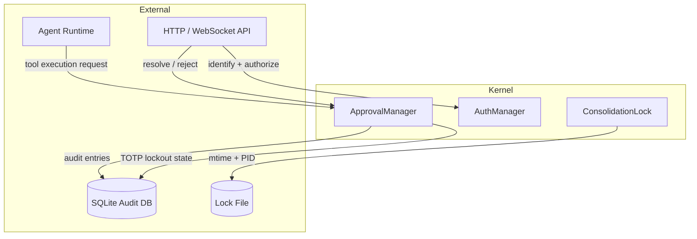
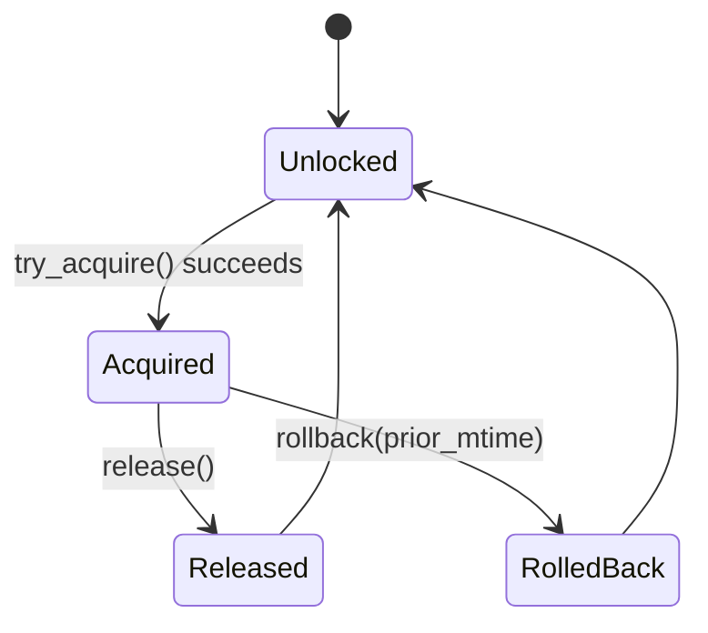

# Agent Kernel — librefang-kernel-src

# Agent Kernel — `librefang-kernel`

The agent kernel is the central coordination layer for LibreFang. It controls which operations require human approval before execution, enforces role-based access control for multi-user deployments, and manages background consolidation locks for the auto-dream subsystem.

## Architecture



---

## Approval System (`approval.rs`)

### Purpose

Dangerous agent operations — shell execution, file writes, patch applications — must not run autonomously unless a human explicitly approves them. The `ApprovalManager` implements this gate with two execution paths:

| Path | Method | Behavior |
|------|--------|----------|
| **Blocking** | `request_approval()` | Agent coroutine awaits resolution (or timeout). Used for synchronous tool calls. |
| **Deferred** | `submit_request()` | Returns immediately with a UUID; the `DeferredToolExecution` payload is stored and returned atomically on `resolve()`. Used for multi-step agent responses. |

### Key Constants

| Constant | Value | Purpose |
|----------|-------|---------|
| `MAX_PENDING_PER_AGENT` | 5 | Prevents a single agent from flooding the approval queue. |
| `MAX_RECENT_APPROVALS` | 100 | In-memory history ring buffer for dashboard display. |
| `MAX_ESCALATIONS` | 3 | Maximum re-notification rounds before falling back to `TimedOut`. |
| `TOTP_MAX_FAILURES` | 5 | Consecutive TOTP failures before lockout. |
| `TOTP_LOCKOUT_SECS` | 300 | Lockout duration in seconds (5 minutes). |

### Construction

```rust
// In-memory only (no audit persistence)
let mgr = ApprovalManager::new(policy);

// With persistent audit log and TOTP lockout survival across restarts
let mgr = ApprovalManager::new_with_db(policy, sqlite_connection);
```

`new_with_db` loads persisted TOTP lockout state from the `totp_lockout` table. Entries whose lockout window has already expired are discarded at load time so a daemon restart does not extend a lockout beyond the original 5-minute window.

### Policy Evaluation

#### `requires_approval(tool_name)`

Checks the `require_approval` list using glob matching (via `glob_matches`). Patterns like `"file_*"` match `file_read`, `file_write`, etc. A single `"*"` matches everything.

#### `requires_approval_with_context(tool_name, sender_id, channel)`

Context-aware check with a priority chain:

1. **Trusted sender bypass** — if `sender_id` appears in `trusted_senders`, returns `false` immediately.
2. **Channel rules** — if a `ChannelToolRule` exists for the channel:
   - Explicit allow → `false` (no approval needed).
   - Explicit deny → `true` (approval required, hard gate).
3. **Default list** — falls back to `require_approval` glob matching.

`is_tool_denied_with_context()` checks only the deny side (trusted sender still bypasses).

### Blocking Approval Flow

```rust
let decision = mgr.request_approval(req).await;
```

Internally this:

1. Checks the per-agent pending limit (`MAX_PENDING_PER_AGENT`). Exceeding it returns `Denied` immediately.
2. Creates a `tokio::sync::oneshot` channel and inserts a `PendingRequest` into the `DashMap`.
3. Waits with `tokio::time::timeout` using an effective timeout computed by `effective_timeout_secs()`.
4. On timeout, the `TimeoutFallback` policy determines the outcome:
   - `Escalate { extra_timeout_secs }` — bumps `escalation_count`, re-inserts the request, and loops (up to `MAX_ESCALATIONS` rounds, each with increasing timeout).
   - `Skip` — resolves as `Skipped`.
   - `Deny` (default) — resolves as `TimedOut`.

### Deferred (Non-Blocking) Approval Flow

```rust
let id = mgr.submit_request(req, deferred_execution)?;
// ... later ...
let (response, maybe_deferred) = mgr.resolve(id, decision, decided_by, totp_verified, user_id)?;
```

- `submit_request()` rejects duplicate `tool_use_id` values (same tool call cannot be submitted twice).
- `expire_pending_requests()` is called periodically by the kernel to sweep timed-out deferred requests. Returns escalated requests separately from terminal expirations.
- On resolve, the `DeferredToolExecution` is returned atomically with the `ApprovalResponse`.

### Resolution

`resolve()` is the single entry point for both blocking and deferred paths:

- For blocking requests, it sends the decision through the oneshot channel to wake the awaiting agent.
- For deferred requests, it returns the stored `DeferredToolExecution` payload.
- If the request ID is not found in pending, it checks `recent` records and returns a descriptive error (e.g., "Already Approved by admin").

Batch operations:

| Method | Notes |
|--------|-------|
| `resolve_batch()` | Resolves multiple IDs with the same decision. No TOTP support. |
| `resolve_all_for_session()` | Resolves every pending request matching a `session_id`. Skips TOTP-protected items (returns `Err` per item). |

### Session-Scoped Queries

Mirrors Hermes-Agent's gateway approval model:

- `list_pending_for_session(session_id)` — all pending requests for a session.
- `has_pending_for_session(session_id)` — boolean check for dashboard gating.
- `resolve_all_for_session(session_id, decision, decided_by)` — atomically resolve all matching requests.

### TOTP Second Factor

When `ApprovalPolicy.second_factor` is `SecondFactor::Totp`, approvals for tools listed in `totp_tools` (or all tools if the list is empty) require a verified TOTP code.

#### Verification Flow

1. Caller verifies the TOTP code externally using `ApprovalManager::verify_totp_code(secret, code)`.
2. Caller passes `totp_verified: true` to `resolve()`.
3. `resolve()` checks `policy.tool_requires_totp(tool_name)` and enforces the gate.

#### Grace Period

After a successful TOTP verification, the user enters a grace period (`totp_grace_period_secs`). Subsequent approvals by the same `user_id` bypass TOTP within this window. Set to `0` to disable.

#### Lockout

- `record_totp_failure(sender_id)` increments the failure counter. After `TOTP_MAX_FAILURES` consecutive failures, the sender is locked out for `TOTP_LOCKOUT_SECS`.
- `is_totp_locked_out(sender_id)` checks the current state.
- Lockout state is persisted to SQLite (`totp_lockout` table) and restored on restart.
- A successful TOTP verification (`record_totp_grace`) clears the failure counter.

#### TOTP Utilities

| Method | Description |
|--------|-------------|
| `verify_totp_code(secret, code)` | RFC 6238, SHA-1, 6 digits, 30s step, ±1 window. |
| `verify_totp_code_with_issuer(secret, code, issuer)` | Same with custom issuer label. |
| `generate_totp_secret(issuer, account)` | Returns `(base32_secret, otpauth_uri, qr_base64_png)`. |
| `generate_recovery_codes()` | 8 codes in `DDDD-DDDD` format. |
| `verify_recovery_code(stored_json, code)` | Consumes a matching code, returns updated JSON. |

### Risk Classification

`classify_risk(tool_name)` is a static method returning:

| Tool | Risk |
|------|------|
| `shell_exec` | Critical |
| `file_write`, `file_delete`, `apply_patch` | High |
| `web_fetch`, `browser_navigate` | Medium |
| Everything else | Low |

### Audit Logging

When constructed with `new_with_db()`, every resolved request is written to the `approval_audit` table. Query methods:

- `query_audit(limit, offset, agent_id, tool_name)` — paginated with optional filters.
- `audit_count(agent_id, tool_name)` — total count with optional filters.

### Hot-Reload

`update_policy(policy)` replaces the active policy under a write lock. The `RwLock` is acquired once and held for both the TOTP gate check and grace-period recording in `resolve()`, preventing a hot-reload race between two separate lock acquisitions.

---

## Authentication & Authorization (`auth.rs`)

### Purpose

Maps platform identities (Telegram user ID, Discord user ID, etc.) to LibreFang users with hierarchical roles, then enforces permission checks on kernel actions.

### Role Hierarchy

```rust
pub enum UserRole {
    Viewer = 0,  // Read-only — can view agent output
    User   = 1,  // Standard — can chat with agents
    Admin  = 2,  // Can spawn/kill agents, install skills
    Owner  = 3,  // Full access including user management
}
```

Roles are ordered (`Ord`), so `identity.role >= action.required_role()` is the single authorization check.

### Action Permissions

| Action | Minimum Role |
|--------|-------------|
| `ChatWithAgent` | User |
| `ViewConfig` | User |
| `ViewUsage` | Admin |
| `SpawnAgent` | Admin |
| `KillAgent` | Admin |
| `InstallSkill` | Admin |
| `ModifyConfig` | Owner |
| `ManageUsers` | Owner |

### Construction and Identity Resolution

```rust
let auth = AuthManager::new(&user_configs);
```

Each `UserConfig` contains a name, role string, and a map of channel bindings (`"telegram" → "123456"`). The manager builds two indexes:

- `users`: `DashMap<UserId, UserIdentity>` — the canonical user store.
- `channel_index`: `DashMap<String, UserId>` — maps `"channel_type:platform_id"` to a user.

#### `identify(channel_type, platform_id) → Option<UserId>`

Looks up the channel index. Returns `None` for unrecognized users.

#### `authorize(user_id, action) → LibreFangResult<()>`

Returns `Ok(())` if the user's role meets the action's requirement, or `LibreFangError::AuthDenied` otherwise. Unknown users are always denied.

#### `is_enabled()`

Returns `false` when no users are configured. When RBAC is disabled, the kernel typically falls back to open access.

---

## Auto-Dream Consolidation Lock (`auto_dream/lock.rs`)

### Purpose

Prevents concurrent consolidation runs (the "auto-dream" background process that restructures agent memory) across both threads and separate processes. Uses a lock file with a dual-purpose design:

- **File body**: `"<pid>:<uuid>"` — identifies the current lock holder for liveness checks.
- **File mtime**: Treated as `last_consolidated_at` (milliseconds since epoch). No separate timestamp store exists.

### Lock Lifecycle



### `try_acquire() → Result<Option<u64>>`

1. Reads existing lock file. If a live holder PID is found within `HOLDER_STALE_MS` (1 hour), returns `Ok(None)` (lock is held).
2. Stale or dead holders are reclaimed.
3. Writes `"<our_pid>:<unique_uuid>"` to the file.
4. Re-reads the file to verify the write won the race (last-writer-wins). The UUID token prevents same-process racers from falsely passing this check.
5. An in-process `DashSet` (`IN_PROCESS_CLAIMS`) serializes concurrent acquirers within the same daemon.
6. Returns `Ok(Some(prior_mtime))` on success.

### `rollback(prior_mtime)`

After a failed consolidation, rewinds the lock file's mtime to its pre-acquire value so the next time-gate check will pass and retry. If `prior_mtime` is `0` (no prior lock existed), the file is deleted entirely.

### `release()`

Clears the PID body and refreshes mtime to now. Without clearing the body, the still-running process would appear as a live holder on the next tick, blocking re-dreams.

### `read_last_consolidated_at() → Result<u64>`

Returns the lock file's mtime in milliseconds, or `0` if the file doesn't exist (never consolidated).

### Platform Notes

- **Unix**: `set_mtime_ms()` uses `libc::utimes()` for sub-second mtime precision. Process liveness uses `kill(pid, 0)` (signal 0 probe).
- **Non-Unix**: Mtime rewind is a no-op (lock file is written but mtime is not set back on failure). Process liveness always returns `true`, relying solely on the stale window.

---

## Integration Points

| Consumer | Uses |
|----------|------|
| HTTP API routes (`src/routes/system.rs`) | TOTP setup/confirm/revoke flows call `ApprovalManager` TOTP utilities and vault integration. |
| Agent runtime | Calls `request_approval()` for synchronous tool gating, `submit_request()` for deferred tools. |
| Kernel tick loop | Calls `expire_pending_requests()` periodically to sweep timed-out deferred requests. |
| Dashboard / WebSocket | Calls `list_pending()`, `list_recent()`, `query_audit()` for UI display. |
| Channel gateways | Call `identify()` + `authorize()` to map platform users to roles before processing commands. |
| Auto-dream scheduler | Calls `ConsolidationLock::try_acquire()` / `release()` / `rollback()` around consolidation runs. |
| Skill registry | Uses `path()` from lock module for test fixtures (shared test utilities). |

### Policy Hot-Reload

The kernel can call `update_policy()` at any time. The `RwLock` ensures concurrent reads during policy evaluation are not disrupted. In `resolve()`, the policy snapshot is taken once and reused for both the TOTP gate check and grace-period recording to avoid TOCTOU issues.