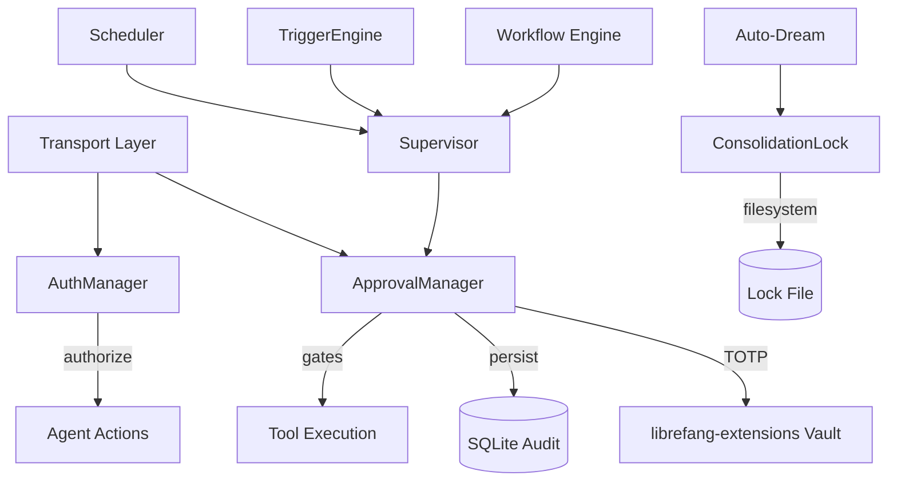
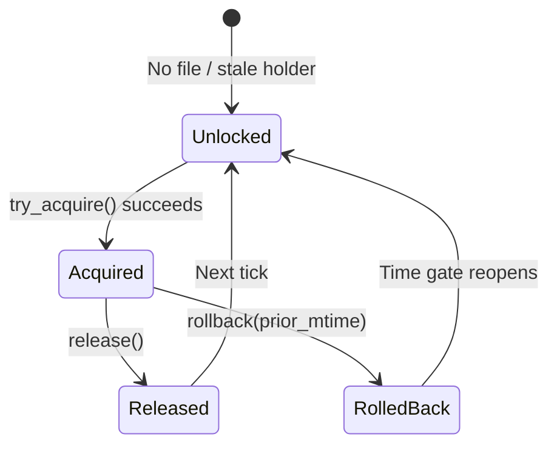

# Agent Kernel — librefang-kernel-src

# LibreFang Kernel (`librefang-kernel`)

The kernel is the central runtime that governs agent behavior, enforces security boundaries, and coordinates all subsystems. It sits between the transport layer (Telegram, Discord, WhatsApp, API) and the agent runtime, ensuring every dangerous operation is gated, every user is authorized, and every background process is coordinated safely.

## Architecture Overview



---

## Subsystem: Approval Manager (`approval.rs`)

The approval manager gates dangerous tool invocations behind human decisions. Every call to `shell_exec`, `file_write`, `file_delete`, `apply_patch`, or `skill_evolve_*` must be explicitly approved, denied, or it will time out.

### Two Execution Paths

Agents can request approval through two distinct paths depending on their execution model:

**Blocking path** — `request_approval()` creates a `tokio::sync::oneshot` channel, inserts the request into the pending map, and awaits resolution with a timeout. The calling agent coroutine blocks until a human resolves the request or it expires. This is used by synchronous/chat-driven agents.

**Deferred path** — `submit_request()` accepts a `DeferredToolExecution` payload, stores it alongside the pending request, and returns immediately with the request UUID. The kernel later retrieves the deferred payload atomically via `resolve()`. This is used by autonomous agents that cannot block.

### Policy Evaluation

Policy checks are layered with explicit precedence:

1. **Trusted sender bypass** — If `sender_id` appears in `trusted_senders`, all approval and deny checks return `false` (no gate). This is checked first.
2. **Channel rules** — Per-channel allow/deny lists in `channel_rules` override the default list. A channel can explicitly allow a normally-gated tool or deny an otherwise-open one.
3. **Default list** — Falls back to the `require_approval` list, which supports glob patterns via `glob_matches()` (e.g., `"file_*"` matches `"file_read"`, `"file_write"`, etc.).

The methods `requires_approval()`, `requires_approval_with_context()`, and `is_tool_denied_with_context()` encode these three layers. Always use the `_with_context` variants when sender or channel information is available.

### Escalation and Timeout

When a request times out, the behavior depends on `timeout_fallback` in the policy:

| Fallback | Behavior |
|---|---|
| `TimedOut` (default) | Resolves as `ApprovalDecision::TimedOut` |
| `Skipped` | Resolves as `ApprovalDecision::Skipped` |
| `Escalate { extra_timeout_secs }` | Increments `escalation_count`, re-inserts with a longer timeout. After `MAX_ESCALATIONS` (3) rounds, falls through to `TimedOut`. |

The effective timeout grows with each escalation round:

```
effective_timeout = request.timeout_secs + (extra_timeout_secs × escalation_count)
```

### Session-Scoped Operations

For multi-turn conversations where multiple approval requests may be in-flight for a single session, use:

- `list_pending_for_session(session_id)` — all pending requests for a session.
- `has_pending_for_session(session_id)` — quick boolean check.
- `resolve_all_for_session(session_id, decision)` — atomically resolves every pending request matching the session. This mirrors the Hermes-Agent pattern where a user's "approve all" button resolves all blocking approvals for their conversation.

### Per-Agent Limits

Each agent is limited to `MAX_PENDING_PER_AGENT` (5) concurrent pending requests. Exceeding this returns an immediate `Denied` (blocking path) or `Err` (deferred path). This prevents a runaway agent from flooding the approval queue.

### Duplicate Request Guard

`submit_request()` rejects duplicate `tool_use_id` values. This prevents a single tool call from being submitted twice while still allowing identical tool inputs from distinct tool calls in the same assistant response (different `tool_use_id`, same `input`).

### TOTP Second Factor

When `second_factor` is `Totp` in the policy, approvals require a one-time code. The flow:

1. `generate_totp_secret(issuer, account)` returns `(base32_secret, otpauth_uri, qr_base64_png)`.
2. The user enrolls via an authenticator app.
3. On approval, `resolve()` checks `totp_verified`. If `false` and the tool requires TOTP, resolution is rejected with an error.
4. Callers verify codes via `verify_totp_code(secret_base32, code)` before calling `resolve()` with `totp_verified = true`.

**Grace period** — After a successful TOTP-verified approval, subsequent approvals from the same `user_id` within `totp_grace_period_secs` bypass the TOTP requirement. This avoids requiring the user to pull out their phone for every rapid-fire approval. Set `totp_grace_period_secs: 0` to always require TOTP.

**Per-tool scoping** — When `totp_tools` is non-empty, only the listed tools require TOTP. An empty `totp_tools` means all tools require TOTP when the second factor is enabled.

**Rate limiting and lockout** — After `TOTP_MAX_FAILURES` (5) consecutive failures, the user is locked out for `TOTP_LOCKOUT_SECS` (300 seconds). Lockout state is persisted to SQLite via `persist_totp_lockout_save()` so it survives daemon restarts. On load, `load_totp_lockout()` discards entries whose lockout window has already expired.

**Recovery codes** — `generate_recovery_codes()` produces 8 codes in `xxxx-xxxx` format. `verify_recovery_code(stored_json, code)` checks and atomically consumes a code, returning the updated JSON list.

### Audit Trail

Every resolved request is recorded to:

- **In-memory ring buffer** — `recent` holds the last `MAX_RECENT_APPROVALS` (100) records for quick dashboard display via `list_recent(limit)`.
- **SQLite database** (optional) — When constructed with `new_with_db()`, `audit_log_write()` persists every `ApprovalAuditEntry` to the `approval_audit` table. Query via `query_audit(limit, offset, agent_id, tool_name)` and `audit_count()`.

### Policy Hot-Reload

`update_policy(policy)` replaces the active policy under a write lock. All subsequent checks use the new policy immediately. Existing pending requests are not re-evaluated — they were submitted under the old policy.

### Risk Classification

`classify_risk(tool_name)` is a static mapping:

| Tool | Risk |
|---|---|
| `shell_exec` | Critical |
| `file_write`, `file_delete`, `apply_patch` | High |
| `web_fetch`, `browser_navigate` | Medium |
| Everything else | Low |

### Key Constants

| Constant | Value | Purpose |
|---|---|---|
| `MAX_PENDING_PER_AGENT` | 5 | Concurrent pending requests per agent |
| `MAX_RECENT_APPROVALS` | 100 | In-memory history buffer size |
| `MAX_ESCALATIONS` | 3 | Escalation rounds before final timeout |
| `TOTP_MAX_FAILURES` | 5 | Consecutive failures before lockout |
| `TOTP_LOCKOUT_SECS` | 300 | Lockout duration in seconds |

---

## Subsystem: Auth Manager (`auth.rs`)

Role-based access control for multi-user deployments. Maps platform identities to LibreFang users with hierarchical roles, then enforces permission checks on kernel actions.

### Role Hierarchy

```
Owner (3) > Admin (2) > User (1) > Viewer (0)
```

Roles are ordered — any role at or above the required level can perform an action.

### Action Permission Matrix

| Action | Minimum Role |
|---|---|
| `ChatWithAgent` | User |
| `ViewConfig` | User |
| `ViewUsage` | Admin |
| `SpawnAgent` | Admin |
| `KillAgent` | Admin |
| `InstallSkill` | Admin |
| `ModifyConfig` | Owner |
| `ManageUsers` | Owner |

### Channel Identity Binding

Users are identified by their platform identity (e.g., Telegram user ID, Discord user ID). During initialization, `AuthManager::new(user_configs)` indexes all `channel_bindings` from the configuration into a `channel_index` map keyed by `"channel_type:platform_id"`. The `identify()` method resolves a platform identity to a `UserId`.

A single user can have multiple channel bindings (e.g., Alice is bound to both `telegram:123456` and `discord:987654`), and all resolve to the same `UserId`.

### Usage Pattern

```rust
let user_id = auth.identify("telegram", &msg.from.id.to_string());
match user_id {
    Some(id) => auth.authorize(id, &Action::ChatWithAgent)?,
    None => return Err("Unrecognized user"),
}
```

When `is_enabled()` returns `false` (no users configured), the kernel typically operates in single-user mode and skips authorization.

---

## Subsystem: Auto-Dream Consolidation Lock (`auto_dream/lock.rs`)

Coordinates dream consolidation runs across processes and threads. The lock file on disk serves two purposes:

1. **mtime = `last_consolidated_at`** — The file's modification time is the sole source of truth for when consolidation last ran. No separate timestamp store exists.
2. **body = holder identity** — The file contents are `"<pid>:<uuid>"`, used to detect live holders and resolve same-process races.

### Lock Lifecycle



**`try_acquire()`** — Probes the existing holder. If a live process holds the lock within the stale window (`HOLDER_STALE_MS` = 1 hour), returns `Ok(None)`. Otherwise, writes a `<pid>:<uuid>` token, re-reads to verify the write won the race (the UUID makes this check meaningful even for same-process racers), and returns `Ok(Some(prior_mtime))`.

**`release()`** — Clears the body to an empty string and refreshes the mtime to now. This is critical: without clearing the body, the still-running process would appear as a live holder on the next tick.

**`rollback(prior_mtime)`** — After a failed consolidation, rewinds the mtime to its pre-acquire value so the time gate reopens. If `prior_mtime` was `0` (no lock existed before), the file is unlinked entirely.

### Race Protection

Two layers prevent concurrent consolidation:

- **In-process** — A `DashSet<PathBuf>` (`IN_PROCESS_CLAIMS`) serializes concurrent acquirers within the same daemon.
- **Cross-process** — The `<pid>:<uuid>` token and verify-on-write pattern ensure only one process wins. The UUID disambiguates same-PID writers (which would otherwise both see "their" PID in the file).

### Stale Holder Reclamation

A holder is considered stale if either:

- The PID is no longer running (checked via `kill(pid, 0)` on Unix — `ESRCH` means dead, `EPERM` means alive under another user).
- The holder has exceeded `HOLDER_STALE_MS` (1 hour), regardless of PID liveness. This guards against PID reuse where a new process adopts the old PID.

### Platform Notes

- **Unix** — mtime manipulation uses `libc::utimes()`. PID liveness uses `libc::kill(pid, 0)`.
- **Non-Unix** — mtime rewind is a no-op (failed consolidations wait for `min_hours`). PID liveness always returns `true`, relying solely on the stale window.

---

## Cross-Cutting Concerns

### Concurrency Model

- `ApprovalManager` uses `DashMap` for the pending map (lock-free concurrent reads and writes) and `std::sync::Mutex`/`RwLock` for policy, recent history, and TOTP state.
- `AuthManager` uses `DashMap` for both the user map and channel index — read-heavy workloads benefit from the sharded design.
- `ConsolidationLock` is stateless per operation; every method re-reads from disk for cross-process coherence.

### Connection to the Vault

The TOTP setup and confirmation flows route through `librefang-extensions::Vault` for secret storage. The execution flow for TOTP enrollment:

1. API route calls `totp_setup` / `totp_confirm` in the system routes.
2. Secrets are stored/retrieved via `vault_get` → `unlock` → `resolve_master_key` → `load_keyring_key` → `machine_fingerprint`.
3. The UI finalizes via `WizardPage` or `AgentManifestForm`.

### Connection to Supervisor and Scheduler

- The **Supervisor** owns the `ApprovalManager` and routes tool approval requests from agent runtimes.
- The **Scheduler** enforces per-agent token budgets and rate limits before requests reach the approval layer.
- The **TriggerEngine** evaluates memory deltas and scheduled events, potentially spawning agents that create approval requests.