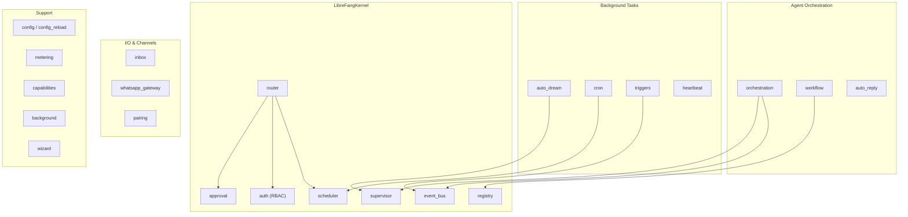

# Agent Kernel — librefang-kernel-src

# LibreFang Agent Kernel (`librefang-kernel`)

The kernel is the runtime core of the LibreFang Agent Operating System. It manages agent lifecycles, memory, permissions, scheduling, inter-agent communication, and all background infrastructure that keeps agents running autonomously.

The two primary re-exports are [`LibreFangKernel`](src/lib.rs) and [`DeliveryTracker`](src/lib.rs) from the `kernel` submodule — most consumers interact with the system through these types.

## Architecture



## Module Inventory

| Module | Purpose |
|--------|---------|
| `kernel` | Top-level kernel struct, `DeliveryTracker`, initialization |
| `approval` | Human-in-the-loop gating for dangerous tool calls |
| `auth` | RBAC: maps channel identities to users with roles |
| `auto_dream` | Periodic per-agent memory consolidation |
| `background` | Generic background task spawning and lifecycle |
| `capabilities` | Agent capability negotiation/advertisement |
| `config` / `config_reload` | Kernel configuration and hot-reload |
| `cron` | Cron-style scheduled tasks |
| `error` | Kernel-specific error types |
| `event_bus` | Pub/sub event bus for inter-agent and system events |
| `heartbeat` | Agent liveness monitoring |
| `inbox` | Message inbox management for agents |
| `metering` | Token usage metering (re-exported from `librefang-kernel-metering`) |
| `mcp_oauth_provider` | OAuth credential provider for MCP tool servers |
| `orchestration` | Multi-agent orchestration and coordination |
| `pairing` | Channel/device pairing flow |
| `registry` | Agent manifest registry (install, lookup, list) |
| `router` | Request routing (re-exported from `librefang-kernel-router`) |
| `scheduler` | Resource quotas, rate limiting, usage tracking |
| `supervisor` | Process supervision, panic counting, graceful shutdown |
| `triggers` | Event-driven trigger evaluation (memory deltas, cross-agent) |
| `whatsapp_gateway` | WhatsApp Business API gateway lifecycle |
| `wizard` | First-run setup wizard (plan generation, manifest scaffolding) |
| `workflow` | DAG-based multi-step workflow engine |

---

## Approval System (`approval`)

The [`ApprovalManager`](src/approval.rs) gates dangerous tool executions behind human approval. It supports two execution paths:

- **Blocking** — `request_approval()` suspends the caller until a human resolves (approve/deny) or the request times out.
- **Deferred (non-blocking)** — `submit_request()` returns immediately with a UUID. The deferred `DeferredToolExecution` payload is returned atomically on `resolve()`.

### Policy Evaluation

Whether a tool requires approval is determined by [`requires_approval_with_context()`](src/approval.rs), which checks in order:

1. **Trusted sender bypass** — if `sender_id` is in `trusted_senders`, no approval needed.
2. **Channel rules** — per-channel allow/deny lists override the default.
3. **Default list** — `require_approval` patterns (supports glob wildcards like `file_*` or `*`).

### Timeout and Escalation

When a request times out, the `timeout_fallback` policy controls behavior:

| Fallback | Behavior |
|----------|----------|
| `Deny` | Resolves as `Denied` (default) |
| `Skip` | Resolves as `Skipped` |
| `Escalate { extra_timeout_secs }` | Re-inserts with `escalation_count += 1`, granting additional time per round. After `MAX_ESCALATIONS` (3) rounds, falls back to `TimedOut`. |

The kernel's periodic sweep calls `expire_pending_requests()` to drive escalation/expiry for the deferred path.

### Constraints

- Maximum 5 pending requests per agent (`MAX_PENDING_PER_AGENT`).
- Anti-duplicate guard on `tool_use_id` prevents the same tool call from being submitted twice.
- Up to 100 recent resolved records retained in-memory (`MAX_RECENT_APPROVALS`).

### TOTP Second Factor

When `second_factor` is `Totp` in the approval policy, approving requires a TOTP code:

- **Verification**: `verify_totp_code()` uses RFC 6238 (SHA-1, 6 digits, 30s step, ±1 window).
- **Grace period**: After a successful TOTP verification, subsequent approvals from the same `user_id` within `totp_grace_period_secs` skip TOTP.
- **Lockout**: After 5 consecutive failures (`TOTP_MAX_FAILURES`), the user is locked out for 300 seconds (`TOTP_LOCKOUT_SECS`). Lockout state is persisted in SQLite so it survives daemon restarts.
- **Per-tool scoping**: `totp_tools` can restrict TOTP to specific tool names. An empty list means all tools require TOTP.
- **Recovery codes**: `generate_recovery_codes()` produces 8 single-use `DDDD-DDDD` codes. `verify_recovery_code()` consumes a matching code and returns the updated list.

### Risk Classification

`classify_risk()` maps tool names to risk levels:

| Tool | Risk |
|------|------|
| `shell_exec` | Critical |
| `file_write`, `file_delete`, `apply_patch` | High |
| `web_fetch`, `browser_navigate` | Medium |
| Everything else | Low |

### Persistent Audit

When constructed with `new_with_db()`, every approval decision is written to an `approval_audit` SQLite table via `query_audit()` / `audit_count()`. Policy can be hot-reloaded with `update_policy()` without restarting the kernel.

---

## Authentication & Authorization (`auth`)

[`AuthManager`](src/auth.rs) implements role-based access control for multi-user deployments.

### Role Hierarchy

```
Owner (3) > Admin (2) > User (1) > Viewer (0)
```

### Action Permissions

| Action | Minimum Role |
|--------|-------------|
| `ChatWithAgent`, `ViewConfig` | User |
| `SpawnAgent`, `KillAgent`, `InstallSkill`, `ViewUsage` | Admin |
| `ModifyConfig`, `ManageUsers` | Owner |

### Identity Resolution

Users are defined in kernel config with channel bindings (e.g. `"telegram" → "123456"`). The manager builds an internal index:

```
"telegram:123456" → UserId
```

`identify(channel_type, platform_id)` resolves a platform identity to a LibreFang `UserId`. `authorize(user_id, action)` checks the user's role against the action's minimum requirement.

When no users are configured (`is_enabled() == false`), authorization is effectively disabled.

---

## Auto-Dream (`auto_dream`)

Auto-dream is the background memory consolidation system. It periodically asks each opted-in agent to reflect on its own memory and consolidate recent signal through a four-phase prompt (Orient / Gather / Consolidate / Prune).

### Gating Pipeline

Each agent is checked through five gates (cheapest first):

1. **Global enabled** — `config.auto_dream.enabled` must be `true`.
2. **Per-agent opt-in** — agent manifest must have `auto_dream_enabled = true`.
3. **Time gate** — at least `min_hours` since the last consolidation (tracked via lock file mtime).
4. **Session count gate** — at least `min_sessions` sessions touched since last consolidation. Set to `0` to disable.
5. **Lock gate** — per-agent filesystem lock prevents concurrent consolidation across processes.

### Consolidation Lock (`auto_dream::lock`)

[`ConsolidationLock`](src/auto_dream/lock.rs) is a filesystem-based lock using mtime as the timestamp source and file body for PID tracking:

- **`try_acquire()`** — Reads the lock file. If a live process holds it (PID check via `kill(0)`), returns `None`. Otherwise writes `<pid>:<uuid>` and verifies the write won the race. Returns the prior mtime for potential rollback.
- **`release()`** — Clears the PID body and refreshes mtime to now, allowing immediate re-acquisition.
- **`rollback(prior_mtime)`** — Rewinds mtime to its pre-acquire value (or unlinks the file if it didn't exist), reopening the time gate for the next tick.
- **Stale detection** — Locks held longer than `HOLDER_STALE_MS` (1 hour) are reclaimed regardless of PID liveness, guarding against PID reuse.

The body format `<pid>:<uuid>` (rather than bare PID) ensures that two concurrent acquirers in the same process produce different tokens, so the verify step correctly identifies a single winner. A process-local `DashSet` (`IN_PROCESS_CLAIMS`) provides additional same-process serialization.

### Dream Execution

Dreams run via `kernel.run_forked_agent_streaming` with tool scoping:

```rust
pub const DREAM_ALLOWED_TOOLS: &[&str] = &["memory_store", "memory_recall", "memory_list"];
```

Any tool_use for a non-allowed tool receives a synthetic error result. Progress is tracked in a `DashMap<AgentId, DreamProgress>` with a cap of 30 turns per entry.

### Integration Points

- The scheduler calls auto-dream's tick function periodically.
- The event bus can trigger event-driven gate scans (rate-limited by `SESSION_SCAN_INTERVAL_MS`).
- The abort endpoint reaches into the progress map to cancel a running dream.
- Failed/aborted dreams roll back the lock mtime so the time gate reopens on the next tick.

---

## Workflow Engine (`workflow`)

A DAG-based multi-step workflow engine that runs sequences of agent invocations with variable passing, conditional execution, and loop support.

Key operations:
- **`register()`** — Register a workflow definition.
- **`create_run()`** — Instantiate a workflow run with parameter bindings.
- **`build_plan()`** — Resolve the DAG and produce an execution plan.
- **`build_context_prompt()`** — Build a context prompt using `SubagentContext` and `format_preamble` from `librefang-types`.
- **`workflow_to_template()`** — Convert a workflow to a `WorkflowTemplate` for sharing/reuse.
- **`load_templates_from_dir()` / `load_runs()`** — Persist and hydrate workflows from disk.

Workflows support `depends_on` edges for topological ordering, parallel step execution, and output variable capture between steps.

---

## Triggers (`triggers`)

Event-driven triggers that fire agent actions in response to system events (memory updates, cross-agent signals, etc.).

- **`register()` / `register_with_target()`** — Register a trigger, optionally targeting a specific agent.
- **`register_cross_agent_trigger()`** — Set up a trigger where one agent's event activates another agent.
- **`evaluate()`** — Check a trigger against an incoming event.
- **`list_agent_triggers()`** — Enumerate triggers for an agent (used by backup/restore).
- Triggers support cooldown periods, per-event budgets, and enable/disable state.

Memory delta triggers (`MemoryDelta` from `librefang-types::event`) fire when an agent's memory is modified, enabling reactive agent behaviors.

---

## Scheduler (`scheduler`)

Manages resource quotas and rate limiting for agent execution:

- **`register()`** — Register an agent with its `ResourceQuota`.
- **`record_usage()`** — Record token usage (`TokenUsage` from `librefang-types`).
- **`check_quota()`** — Enforce limits using `effective_token_limit()` from `librefang-types`.
- Supports burst limiting and per-tool call rate limits.
- Zero limits mean unlimited (no enforcement).

---

## Supervisor (`supervisor`)

Process supervision with panic tracking and graceful shutdown:

- **`new()`** — Create a supervisor instance.
- **`health()`** — Returns health status including `panic_count()`.
- **`shutdown()`** — Gracefully shut down supervised tasks.

---

## Wizard (`wizard`)

First-run setup assistant that generates agent manifests and configuration:

- **`build_plan()`** — Produces a `SetupPlan` containing `AgentManifest` and `ModelConfig` entries based on user intent (`AgentIntent`).

---

## Configuration Hot-Reload

The `config_reload` module enables live policy and configuration updates without restarting the kernel. The approval manager's `update_policy()` method is the primary consumer — it swaps the `RwLock<ApprovalPolicy>` in-place, immediately affecting all subsequent approval checks.

---

## Key Cross-Crate Dependencies

| Crate | Used By | Purpose |
|-------|---------|---------|
| `librefang-types` | Nearly all modules | Shared types: `AgentId`, `SessionId`, `ApprovalPolicy`, `ResourceQuota`, `WorkflowTemplate`, `MemoryDelta`, etc. |
| `librefang-llm-driver` | `auto_dream` | `StreamEvent` for streaming LLM output during dreams |
| `librefang-extensions` | `mcp_oauth_provider`, `whatsapp_gateway`, `workflow` | Vault operations (`unlock`, `resolve_master_key`, `exists`) |
| `librefang-kernel-metering` | Re-exported as `metering` | Token usage metering |
| `librefang-kernel-router` | Re-exported as `router` | Request routing infrastructure |
| `rusqlite` | `approval` | Persistent audit log and TOTP lockout storage |
| `dashmap` | `approval`, `auth`, `auto_dream`, `triggers` | Concurrent maps for shared mutable state |
| `totp-rs` | `approval` | RFC 6238 TOTP generation and verification |