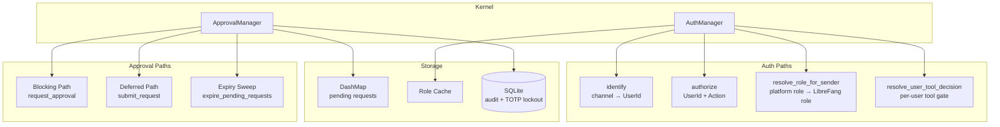

# Agent Kernel — librefang-kernel-src

# Agent Kernel — `librefang-kernel`

The kernel module implements two foundational safety layers for the LibreFang agent platform:

1. **Execution approval gating** — dangerous tool invocations (shell commands, file writes, etc.) are held until a human explicitly approves, denies, or a configurable timeout policy decides.
2. **RBAC authentication and authorization** — platform user identities (Telegram, Discord, Slack) are mapped to LibreFang users with hierarchical roles, and every privileged action is checked against the user's role and per-user tool policies.

---

## Architecture Overview



---

## `ApprovalManager` — Execution Approval Gating

### Purpose

When an agent wants to run a dangerous tool, the kernel intercepts the call and creates an approval request. A human operator (via API, dashboard, or chat channel) must resolve the request before execution proceeds. This module manages the full lifecycle: submission, escalation, timeout, TOTP verification, and audit logging.

### Construction

```rust
// In-memory only (no audit DB):
let mgr = ApprovalManager::new(policy);

// With persistent audit log and TOTP lockout recovery:
let mgr = ApprovalManager::new_with_db(policy, sqlite_connection);
```

`new_with_db` restores TOTP lockout counters from the `totp_lockout` table on startup. Expired lockouts are discarded so a daemon restart does not extend a 5-minute lockout beyond its original window.

### Policy Evaluation

Three methods control whether a tool requires approval:

| Method | When to use |
|--------|------------|
| `requires_approval(tool_name)` | Simple check against the `require_approval` list only |
| `requires_approval_with_context(tool_name, sender_id, channel)` | Full check including trusted senders and channel rules |
| `is_tool_denied_with_context(tool_name, sender_id, channel)` | Check if a channel rule hard-denies the tool |

The evaluation precedence in `requires_approval_with_context`:

1. **Trusted sender bypass** — if `sender_id` is in `trusted_senders`, returns `false` immediately.
2. **Channel rule** — if a `ChannelToolRule` explicitly allows or denies the tool for the given channel, that wins.
3. **Default list** — falls back to matching `tool_name` against `require_approval` patterns.

Wildcard patterns are supported in the `require_approval` list. `"file_*"` matches `"file_read"`, `"file_write"`, etc. `"*"` matches everything.

### Two Execution Paths

#### Blocking Path — `request_approval`

The agent's async task awaits resolution:

```rust
let decision = mgr.request_approval(req).await;
```

Internally:
- A `tokio::sync::oneshot` channel is created and stored with the pending request.
- The caller awaits with a timeout computed by `effective_timeout_secs`.
- On timeout, the `TimeoutFallback` policy determines what happens next (see below).
- On resolution via `resolve()`, the oneshot sender delivers the decision and the awaiting task unblocks.

#### Deferred (Non-Blocking) Path — `submit_request`

Used when the agent should continue processing other tool calls while waiting:

```rust
let id = mgr.submit_request(req, deferred_execution)?;
```

- Returns the request UUID immediately.
- Stores the `DeferredToolExecution` payload alongside the pending request.
- On resolution, `resolve()` returns the deferred payload atomically with the `ApprovalResponse`.
- A duplicate `tool_use_id` guard prevents the same tool call from being submitted twice.

### Timeout and Escalation

The `TimeoutFallback` policy controls what happens when no human responds in time:

| Policy | Behavior |
|--------|----------|
| `TimeoutFallback::Deny` | Resolves as `Denied` |
| `TimeoutFallback::Skip` | Resolves as `Skipped` |
| `TimeoutFallback::Escalate { extra_timeout_secs }` | Re-inserts with `escalation_count += 1` and a longer timeout. After `MAX_ESCALATIONS` (3), falls through to `TimedOut`. |

The effective timeout is `request.timeout_secs + (extra_timeout_secs × escalation_count)`, giving approvers progressively more time at each escalation level.

The kernel calls `expire_pending_requests()` periodically to sweep timed-out deferred requests. It returns escalated requests (still pending) and expired requests (with their `DeferredToolExecution` payloads) separately.

### TOTP Second-Factor Authentication

When `ApprovalPolicy.second_factor` is `Totp`, approved decisions require a verified TOTP code:

1. `requires_totp()` checks the global policy.
2. Per-tool opt-in via `totp_tools` — if non-empty, only listed tools require TOTP; if empty, all tools do.
3. `resolve()` enforces the gate: if TOTP is required and `totp_verified` is `false`, resolution is rejected with an error.
4. `verify_totp_code(secret_base32, code)` validates against RFC 6238 (SHA-1, 6 digits, 30-second step, ±1 window).

**Grace period** — after a successful TOTP verification, subsequent approvals from the same `user_id` within `totp_grace_period_secs` bypass the TOTP check. Controlled by `is_within_totp_grace` / `record_totp_grace`. A grace period of 0 means every approval requires TOTP.

**Lockout** — 5 consecutive TOTP failures (`TOTP_MAX_FAILURES`) trigger a 5-minute lockout (`TOTP_LOCKOUT_SECS`). During lockout, `is_totp_locked_out()` returns `true`. Lockout state is persisted to SQLite so it survives daemon restarts.

**Recovery codes** — `generate_recovery_codes()` produces 8 single-use codes in `DDDD-DDDD` format. `verify_recovery_code()` checks and consumes a code from a JSON-encoded list.

### Session-Scoped Operations

For multi-request conversations (e.g., a chat session where several tools need approval):

| Method | Purpose |
|--------|---------|
| `list_pending_for_session(session_id)` | All pending requests for a session |
| `has_pending_for_session(session_id)` | Boolean check for blocking UI state |
| `resolve_all_for_session(session_id, decision, decided_by)` | Resolve every pending request in a session atomically. TOTP-gated requests are skipped (not counted). |

These mirror the Hermes-Agent `resolve_gateway_approval(session_key, choice, resolve_all=True)` pattern.

### Audit Logging

Every resolved request is recorded via `push_recent()`:

1. An `ApprovalAuditEntry` is written to the `approval_audit` SQLite table (if `audit_db` is configured).
2. An `ApprovalRecord` is pushed to an in-memory ring buffer (capped at `MAX_RECENT_APPROVALS = 100`).

Query methods:
- `query_audit(limit, offset, agent_id, tool_name)` — paginated SQL queries.
- `audit_count(agent_id, tool_name)` — total count with filters.
- `list_recent(limit)` — in-memory ring buffer, newest first.

### Constants and Limits

| Constant | Value | Purpose |
|----------|-------|---------|
| `MAX_PENDING_PER_AGENT` | 5 | Prevents a single agent from flooding the approval queue |
| `MAX_RECENT_APPROVALS` | 100 | In-memory history ring buffer size |
| `MAX_ESCALATIONS` | 3 | Maximum escalation rounds before `TimedOut` |
| `TOTP_MAX_FAILURES` | 5 | Consecutive TOTP failures before lockout |
| `TOTP_LOCKOUT_SECS` | 300 (5 min) | Lockout duration |

### Policy Hot-Reload

`update_policy(policy)` replaces the active `ApprovalPolicy` behind an `RwLock`. The policy is read once per operation and held as a snapshot to avoid races between the gate check and grace-period recording.

### Risk Classification

`classify_risk(tool_name)` is a static helper that maps tool names to `RiskLevel`:

| Tool | Level |
|------|-------|
| `shell_exec` | Critical |
| `file_write`, `file_delete`, `apply_patch` | High |
| `web_fetch`, `browser_navigate` | Medium |
| Everything else | Low |

---

## `AuthManager` — RBAC Authentication and Authorization

### Purpose

Maps platform-specific identities (Telegram user ID, Discord user ID, etc.) to LibreFang `UserId` entities with hierarchical roles, then enforces permission checks on kernel actions.

### User Roles

```rust
pub enum UserRole {
    Viewer = 0,  // Read-only
    User   = 1,  // Can chat with agents
    Admin  = 2,  // Can spawn/kill agents, install skills
    Owner  = 3,  // Full access: user management, config changes
}
```

Roles are ordered (`Ord`), so a simple `user_role >= required_role` check suffices for authorization.

Role parsing:
- `from_str_role(s)` — lenient; unknown strings fall through to `User`. Used for `UserConfig.role` in `config.toml`.
- `try_from_str_role(s)` — strict; returns `None` for unknown strings. Used by channel-role-mapping translators so typos fail closed (→ `Viewer`).

The string `"guest"` maps to `Viewer` (not `User`), which is a deliberate M4 behavior change.

### Construction and Population

```rust
let auth = AuthManager::new(&user_configs);
// or with tool group awareness:
let auth = AuthManager::with_tool_groups(&user_configs, &tool_groups);
```

`populate()` iterates `UserConfig` entries and:
1. Creates a `UserIdentity` with resolved `ResolvedUserPolicy` (per-user tool policy, channel tool rules, tool categories, memory access).
2. Preserves raw `Option<...>` fields (`raw_tool_policy`, `raw_tool_categories`, `raw_memory_access`) for diagnostic snapshots.
3. Builds a channel binding index: `"channel_type:platform_id"` → `UserId`.

Channel bindings are strictly tuple-keyed (`"telegram:12345"`) — there is no bare `platform_id` fallback. This prevents cross-channel attribution leaks where two users sharing the same platform ID on different channels would alias incorrectly.

### Identification and Authorization

```rust
// Look up a user by channel identity:
let user_id: Option<UserId> = auth.identify("telegram", "12345678");

// Check if a user can perform an action:
auth.authorize(user_id, &Action::SpawnAgent)?;
```

`Action` enum and their minimum required roles:

| Action | Min Role |
|--------|----------|
| `ChatWithAgent`, `ViewConfig` | User |
| `ViewUsage`, `SpawnAgent`, `KillAgent`, `InstallSkill` | Admin |
| `ModifyConfig`, `ManageUsers` | Owner |

### Channel-Derived Role Resolution

`resolve_role_for_sender(sender, mapping, role_query).await` resolves a LibreFang role for a sender who may not have an explicit user binding:

1. **Explicit `UserConfig.role`** — if the sender matches a channel binding, that user's configured role wins. No platform API call is made.
2. **Cached result** — a `DashMap` keyed by `(channel, account_id, chat_id, user_id)` avoids redundant lookups.
3. **Platform query** — calls `ChannelRoleQuery::lookup_role()` on the platform adapter, then translates via `ChannelRoleMapping`.
4. **Default-deny** — `Viewer` if nothing matches.

Transient platform errors (5xx, timeout) are **not cached** so the next call retries. Only definitive outcomes populate the cache.

### Per-User Tool Policy

`resolve_user_tool_decision(user_id, tool_name, channel, sender_role)` evaluates the four-layer intersection:

1. Per-agent `ToolPolicy`
2. Per-user `tool_policy` (allow/deny lists)
3. Per-user `tool_categories` (group-based rules resolved against `ToolGroup` definitions)
4. Per-channel `ChannelToolPolicy`

Returns `UserToolDecision` indicating whether the tool is allowed, denied, or needs approval escalation.

### Config Hot-Reload

`reload(user_configs, tool_groups)` replaces the in-memory user and channel indexes atomically:

1. Clears `users`, `channel_index`, and `role_cache`.
2. Swaps the `tool_groups` snapshot.
3. Re-populates from the new config.

This is called inside the `config_reload_lock` write guard to prevent torn reads. A poisoned `RwLock` panics intentionally — silently keeping a stale snapshot would be worse than a visible restart.

### Diagnostic Snapshot

`effective_permissions(user_id)` returns an `EffectivePermissions` struct containing every raw RBAC input for a user (tool policy, categories, memory access, budget, channel rules, bindings). This powers the permission simulator UI without duplicating the gate-path logic.

### Role Cache Invalidation

`invalidate_role_cache()` drops all cached channel-derived roles. Called on session restart so stale platform roles don't persist across sessions.

---

## Integration Points

| Kernel Component | Calls Into | Purpose |
|-----------------|------------|---------|
| `tool_runner` (librefang-runtime) | `ApprovalManager::requires_approval_with_context` | Gate tool execution before running |
| `tool_runner` | `ApprovalManager::submit_request` | Submit deferred approval for async resolution |
| API routes (`/api/approval/*`) | `ApprovalManager::resolve`, `list_pending`, `list_recent` | Human operator resolution |
| API routes (`/api/system/totp_*`) | `ApprovalManager::verify_totp_code`, `generate_totp_secret`, `generate_recovery_codes` | TOTP enrollment and verification |
| Config hot-reload | `AuthManager::reload`, `ApprovalManager::update_policy` | Live policy changes without restart |
| Channel adapters | `AuthManager::resolve_role_for_sender` | Map platform users to LibreFang roles |
| Agent loop | `AuthManager::resolve_user_tool_decision` | Per-user tool gating at inference time |
| `mcp_oauth_provider` | Vault (via `vault_get`) | TOTP secret storage for second-factor flows |

## SQLite Schema Requirements

When using `new_with_db`, the connection must have these tables:

```sql
-- Approval audit log
CREATE TABLE IF NOT EXISTS approval_audit (
    id TEXT PRIMARY KEY,
    request_id TEXT,
    agent_id TEXT,
    tool_name TEXT,
    description TEXT,
    action_summary TEXT,
    risk_level TEXT,
    decision TEXT,
    decided_by TEXT,
    decided_at TEXT,
    requested_at TEXT,
    feedback TEXT,
    second_factor_used INTEGER DEFAULT 0
);

-- TOTP lockout persistence
CREATE TABLE IF NOT EXISTS totp_lockout (
    sender_id TEXT PRIMARY KEY,
    failures INTEGER,
    locked_at INTEGER
);
```