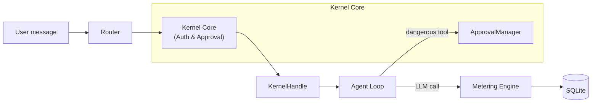

# Agent Kernel

# Agent Kernel — Module Overview

## Purpose

The **Agent Kernel** is the core orchestration and safety layer of the LibreFang agent platform. It governs how user messages reach agents, how agent actions are authorized and approved, and how resource consumption is tracked and bounded.

## Sub-modules

| Sub-module | Responsibility |
|---|---|
| [Kernel Core](librefang-kernel-src.md) | Execution approval gating and RBAC authentication/authorization |
| [Kernel Handle](librefang-kernel-handle-src.md) | Dependency inversion boundary — the `KernelHandle` trait that breaks circular dependencies between runtime and kernel |
| [Metering Engine](librefang-kernel-metering-src.md) | Per-call cost estimation, four-level budget enforcement (agent/provider/user/global), and usage persistence to SQLite |
| [Router](librefang-kernel-router-src.md) | Message-to-agent dispatch — selects the appropriate agent template or hand using keyword rules, manifest metadata, and optional semantic embeddings |

## How They Fit Together

Every user interaction and agent action flows through a layered pipeline:

1. **Incoming message** → The [Router](librefang-kernel-router-src.md) evaluates the message against keyword rules, manifest metadata, and (when available) embedding similarity to select the best agent template or hand. It returns a selection result but does not spawn agents itself.

2. **Authentication & authorization** → The [Kernel Core](librefang-kernel-src.md) maps the platform identity (Telegram, Discord, Slack) to a LibreFang user, resolves their hierarchical role, and checks per-user tool policies before any privileged action proceeds.

3. **Cost gating** → Before an LLM call is dispatched, the [Metering Engine](librefang-kernel-metering-src.md) estimates cost and checks it against budgets at four independent levels. After the call, actual usage is recorded to SQLite for audit and analytics.

4. **Execution approval** → Dangerous tool invocations (shell commands, file writes, etc.) are intercepted by the [Kernel Core's](librefang-kernel-src.md) `ApprovalManager`, which holds them until a human explicitly approves, denies, or a timeout policy decides.

5. **Inter-agent operations** → Agent loops interact with the kernel exclusively through the [`KernelHandle`](librefang-kernel-handle-src.md) trait — enabling spawn, send, kill, memory access, and task queue operations without importing the kernel crate directly. Test suites use lightweight stubs based on the trait's default implementations.

## Key Cross-Module Workflows

**Message handling**: Router selects agent → Core authenticates user → Metering pre-checks budget → Agent loop runs via `KernelHandle` → Dangerous tools hit `ApprovalManager` → Metering records final usage.

**TOTP credential management** (spanning kernel and extensions): Routes like `totp_setup` and `totp_revoke` flow through the kernel's vault/OAuth provider into the extensions vault module for keyring resolution and machine fingerprinting, ultimately surfacing results in the UI wizard.

## Design Principles

- **Dependency inversion**: The `KernelHandle` trait ensures the runtime never depends directly on the kernel crate, eliminating circular imports.
- **Layered safety**: RBAC, approval gating, and budget enforcement operate independently — a failure in one layer does not bypass the others.
- **Stateless routing**: The router maintains no inter-call state (only caches), keeping dispatch decisions pure and auditable.
- **Observable costs**: Every LLM call is measured and persisted, with pricing sourced from a model catalog that falls back to sensible defaults.