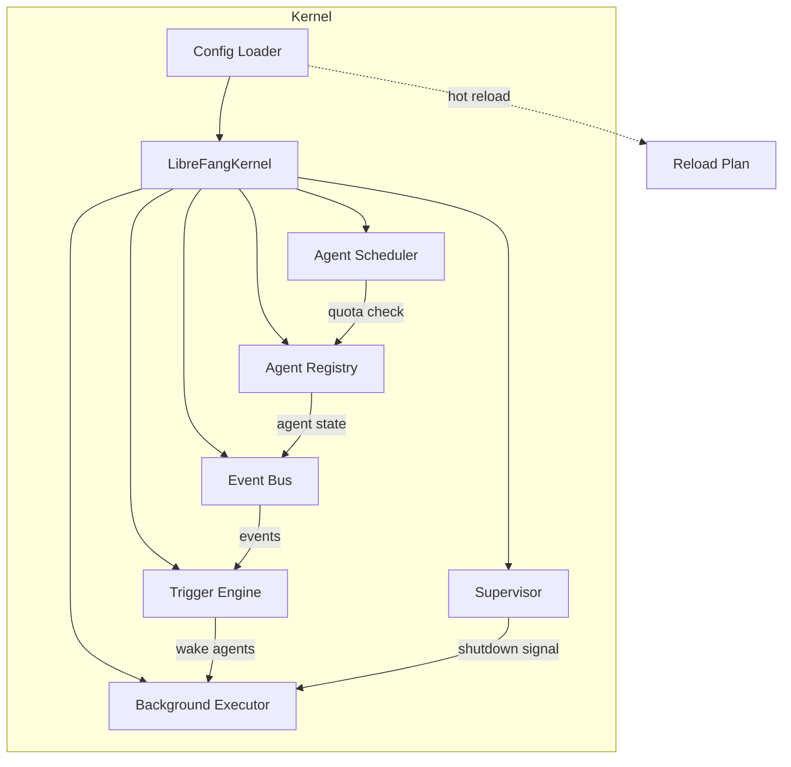
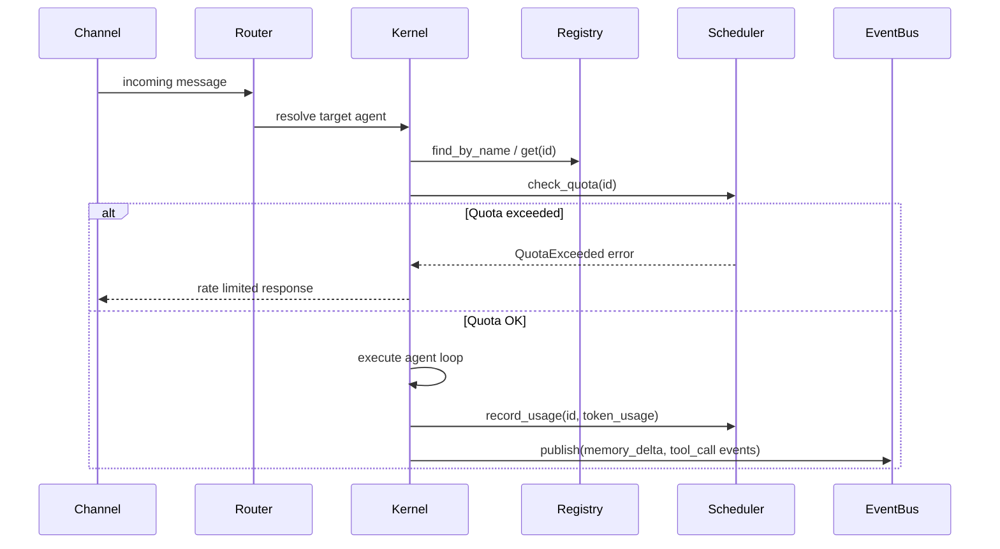

# Agent Kernel

# Agent Kernel

The Agent Kernel is the runtime core of the LibreFang Agent Operating System. It manages agent lifecycles, configuration, scheduling, inter-agent communication, process supervision, and resource enforcement.

## Architecture

## Key Types

The kernel crate re-exports two primary entry points from the `kernel` submodule:

- **`LibreFangKernel`** — the top-level kernel struct holding all subsystems (registry, event bus, scheduler, supervisor, background executor, config, skill loader, MCP manager, etc.).
- **`DeliveryTracker`** — tracks message delivery status across channels.

Error handling uses **`KernelError`** (`error.rs`), which wraps `LibreFangError` with kernel-specific context like `BootFailed`. All kernel-internal results use the alias `KernelResult<T>`.

## Configuration System

### Loading (`config.rs`)

`load_config(path: Option<&Path>)` loads configuration from a TOML file, defaulting to `~/.librefang/config.toml`. The home directory is resolved via:

1. `LIBREFANG_HOME` environment variable
2. `~/.librefang` (falls back to temp dir if no home)

#### Include system

The `include` field accepts an array of relative TOML file paths. Included files are deep-merged before the root config, so the root always wins. Security constraints:

- Absolute paths are rejected
- `..` path components are rejected
- Canonical path must stay within the config directory
- Circular includes are detected (tracked via `HashSet<PathBuf>`)
- Maximum nesting depth is 10 (`MAX_INCLUDE_DEPTH`)

The merge is performed by `deep_merge_toml`, which recursively overlays tables while preserving non-overlapping keys.

#### Version migration

Configs carry a `config_version` integer. When the on-disk version is below `CONFIG_VERSION`, `run_migrations` transforms the TOML value in place and writes the migrated config back to disk. On migration failure, the original config is used as a best-effort fallback.

#### Strict vs. tolerant mode

- **Tolerant** (default): unknown top-level fields produce warnings but the config still loads.
- **Strict** (`strict_config = true`): unknown fields cause the config to be rejected entirely, falling back to defaults (with `strict_config` preserved).

### Hot Reload (`config_reload.rs`)

When the config file changes at runtime, `build_reload_plan(old, new)` diffs the two `KernelConfig` instances and produces a `ReloadPlan` with three categories:

| Category | Examples | Behavior |
|---|---|---|
| **Restart required** | `api_listen`, `network_enabled`, `memory`, `home_dir`, `data_dir`, `vault` | Kernel must fully restart |
| **Hot-reloadable** | `channels`, `skills`, `mcp_servers`, `default_model`, `tool_policy`, `proxy`, `provider_api_keys`, `approval`, `extensions`, `cron` | Applied in-place via `HotAction` enum |
| **No-op** | `log_level`, `language`, `mode`, `sanitize`, `stable_prefix_mode`, `api_key` | Effective immediately through ArcSwap config swap |

Before applying a reload, call `validate_config_for_reload(&config)` to run sanity checks (non-empty `api_listen`, reasonable `max_cron_jobs`, valid approval policy, network secret present when networking is enabled).

The `should_apply_hot(mode, plan)` helper maps the configured `ReloadMode` (`Off`, `Restart`, `Hot`, `Hybrid`) to a boolean decision.

## Event Bus (`event_bus.rs`)

The `EventBus` provides async pub/sub messaging with three routing modes via `EventTarget`:

- **`Agent(id)`** — delivers to a specific agent's channel
- **`Broadcast`** — fans out to all agent channels plus the global channel
- **`System` / `Pattern`** — delivered to the global channel (pattern matching is applied at the subscriber level in phase 1)

Key APIs:

- `publish(event)` — routes and stores in history
- `subscribe_agent(id)` — per-agent `broadcast::Receiver<Event>` (256-slot buffer)
- `subscribe_all()` — global receiver (1024-slot buffer)
- `history(limit)` — returns the most recent events from a 1000-entry ring buffer
- `gc_stale_channels(live_agents)` — removes channels for deregistered agents

When channels are full, events are silently dropped. A rate-limited warning (once per 10 seconds) logs the cumulative `dropped_count`.

## Agent Registry (`registry.rs`)

`AgentRegistry` is a concurrent (`DashMap`-backed) store for `AgentEntry` instances with three indexes:

- **Primary**: `AgentId → AgentEntry`
- **Name**: `String → AgentId` (enforces uniqueness, uses atomic `Entry` API to prevent TOCTOU races)
- **Tag**: `String → Vec<AgentId>`

Beyond basic CRUD, the registry provides fine-grained mutators that update a single field and touch `last_active`:

| Mutator | Field(s) Updated |
|---|---|
| `update_system_prompt` | `manifest.model.system_prompt` |
| `update_model` | `manifest.model.model` |
| `update_model_and_provider` | model + provider |
| `update_model_provider_config` | model + provider + `api_key_env` + `base_url` |
| `update_temperature` | `manifest.model.temperature` |
| `update_max_tokens` | `manifest.model.max_tokens` |
| `update_skills` | `manifest.skills` (also clears `skills_disabled`) |
| `update_tool_filters` | `manifest.tool_allowlist` / `tool_blocklist` (clears `tools_disabled`) |
| `update_mcp_servers` | `manifest.mcp_servers` |
| `update_name` | `name` + manifest + name index (atomic rename) |
| `update_fallback_models` | `manifest.fallback_models` |
| `update_auto_dream_enabled` | `manifest.auto_dream_enabled` |
| `update_resources` | hourly/daily/monthly cost + token limits |
| `replace_manifest` | entire manifest (used by disk reload) |

`is_auto_dream_enabled(id)` is a lightweight read-only accessor that returns `false` for missing agents — designed for the hot path where it fires on every agent turn and avoids cloning the full `AgentEntry`.

## Supervisor (`supervisor.rs`)

`Supervisor` manages graceful shutdown and health monitoring:

- **Shutdown**: `watch::channel<bool>` — call `shutdown()` to signal all subscribers. Tasks check via `subscribe()` receiver or `is_shutting_down()`.
- **Restart tracking**: Per-agent restart counters with `record_agent_restart(id, max_restarts)`, which returns `Err` when the limit is exceeded. `max_restarts = 0` means unlimited.
- **Panic tracking**: `record_panic()` increments an atomic counter.
- **Health snapshot**: `health()` returns `SupervisorHealth { is_shutting_down, panic_count, restart_count }`.

## Agent Scheduler (`scheduler.rs`)

`AgentScheduler` enforces resource quotas and tracks usage per agent with a rolling 1-hour window.

### Usage tracking (`UsageTracker`)

The tracker maintains:
- Hourly counters for `total_tokens`, `input_tokens`, `output_tokens`, `llm_calls`
- A sliding window of tool-call timestamps (per-minute rate limiting)
- A sliding window of `(timestamp, token_count)` pairs (burst limiting)

Windows auto-reset when the hour expires (`reset_if_expired`).

### Quota enforcement (`check_quota`)

Three layers of enforcement, all gated on non-zero limits:

1. **Hourly token limit**: `total_tokens > effective_token_limit()` → `QuotaExceeded`
2. **Burst limit**: No more than 1/5 of the hourly budget in any single minute
3. **Tool call rate limit**: `tool_calls_in_last_minute >= max_tool_calls_per_minute` → `QuotaExceeded`

Agents with no registered quota, or with limits set to `0`, are unrestricted.

`update_quota` replaces the quota without resetting accumulated usage (for hot-reload scenarios). `reset_usage` clears all counters (for session reset).

### Snapshot (`UsageSnapshot`)

`get_usage(id)` returns a point-in-time snapshot of `total_tokens`, `input_tokens`, `output_tokens`, `tool_calls`, and `llm_calls`.

## Background Executor (`background.rs`)

`BackgroundExecutor` runs autonomous agent loops based on `ScheduleMode`:

| Mode | Behavior |
|---|---|
| `Reactive` | No background task — agent only responds to messages |
| `Continuous { check_interval_secs }` | Self-prompts on a fixed interval |
| `Periodic { cron }` | Wakes on a simplified cron schedule |
| `Proactive` | Event-driven via the trigger engine |

### Concurrency control

A global `Semaphore` limits concurrent background LLM calls (default: 5). Override via `with_concurrency(shutdown_rx, max_concurrent)`. Each tick acquires a permit before calling the LLM; the permit is held until the agent's response completes.

### Tick overlap prevention

A per-agent `AtomicBool` (`busy` flag) prevents overlapping ticks. A `BusyGuard` RAII wrapper ensures the flag clears even on panic.

### Pause/resume

`pause_agent(id)` sets a flag that causes ticks to be skipped. Pre-creating the flag before `start_agent` allows pausing a hand before its loop starts, so it begins in the paused state.

### Startup jitter

Both continuous and periodic loops apply random jitter (0..interval) on first tick to avoid thundering-herd memory spikes at boot.

### Shutdown

All loops select on both the sleep timer and the supervisor's shutdown watch channel, exiting cleanly on signal.

## Other Kernel Subsystems

The following modules are declared in `lib.rs` but live in separate source files not shown here:

| Module | Purpose |
|---|---|
| `approval` | Human-in-the-loop approval workflows for sensitive actions |
| `auth` | Authentication and API key verification |
| `auto_dream` | Automatic background dreaming / creative exploration |
| `auto_reply` | Automatic reply generation for incoming messages |
| `capabilities` | Agent capability discovery and declaration |
| `cron` | Cron-style scheduled job management |
| `heartbeat` | Periodic health reporting and liveness checks |
| `inbox` | Per-agent message inbox management |
| `kernel` | Core `LibreFangKernel` struct and `DeliveryTracker` |
| `mcp_oauth_provider` | OAuth flows for MCP (Model Context Protocol) servers |
| `metering` | Usage metering and billing (re-exported from `librefang_kernel_metering`) |
| `orchestration` | Multi-agent orchestration with checkpoints and quality gates |
| `pairing` | Device/channel pairing workflows |
| `router` | Message routing (re-exported from `librefang_kernel_router`) |
| `triggers` | Event-triggered agent wake conditions (memory deltas, patterns) |
| `whatsapp_gateway` | WhatsApp channel bridge |
| `wizard` | Interactive setup wizard for new agent creation |
| `workflow` | DAG-based workflow execution with templates and variables |

## Data Flow: Incoming Message

