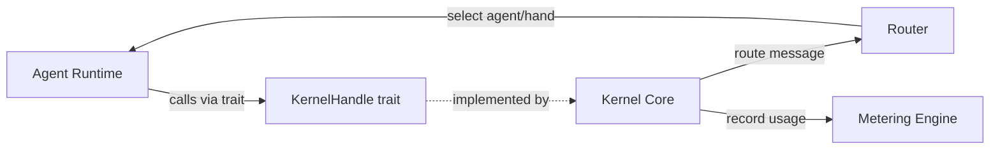

# Agent Kernel

# Agent Kernel

The agent kernel is LibreFang's central coordination layer. It mediates every interaction between the agent runtime and the outside world — handling approvals, routing messages, tracking costs, and enforcing access control.

## Sub-modules

| Module | Responsibility |
|--------|---------------|
| [**librefang-kernel**](librefang-kernel.md) | Core services: approval gates, auth, consolidation locks, and workflow execution |
| [**librefang-kernel-handle**](librefang-kernel-handle.md) | Dependency-inversion trait (`KernelHandle`) that lets the runtime call back into the kernel without circular imports |
| [**librefang-kernel-metering**](librefang-kernel-metering.md) | Token usage tracking, cost estimation, and quota enforcement at agent, provider, and global levels |
| [**librefang-kernel-router**](librefang-kernel-router.md) | Maps incoming user messages to the best agent template or hand via keyword and semantic matching |

## How they fit together

The runtime never imports the kernel directly. Instead, it depends on the thin `librefang-kernel-handle` crate, which defines the `KernelHandle` trait. The kernel implements this trait and injects the concrete handle at agent startup, breaking the circular dependency.

Once the runtime is running, the kernel orchestrates three key concerns:

1. **Message routing** — When a user message arrives, the kernel delegates to the [router](librefang-kernel-router.md), which scores candidates via keyword rules, manifest metadata, and optional semantic similarity, then returns the best-matching template or hand.

2. **Approval gating** — Tool execution requests flow through the kernel's `ApprovalManager`. High-risk operations suspend until resolved or rejected through the external API, with every decision persisted to the SQLite audit database.

3. **Cost enforcement** — Every LLM call produces a `UsageRecord` that the [metering engine](librefang-kernel-metering.md) persists and checks against three independent budgets (agent, provider, global). Overages are rejected before the request reaches the provider.

## Key cross-cutting workflows

**Agent loop lifecycle** — The kernel injects a `KernelHandle` into each agent loop. The runtime uses this handle to spawn agents, send messages, and manage shared memory. The router selects which agent template to instantiate, the metering engine tracks its token spend, and the approval manager gates its tool calls.

**Incoming message flow** — User message → router (`auto_select_template` or `auto_select_hand`) → agent instantiation → kernel-mediated execution → usage record persisted.

**Auto-dream consolidation** — The kernel's `ConsolidationLock` coordinates background dream cycles, ensuring only one consolidation runs at a time while the router and metering engine continue serving foreground requests.