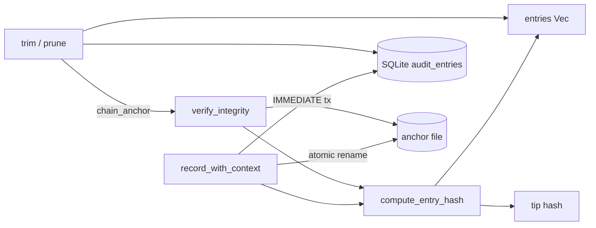

# Agent Runtime — librefang-runtime-audit-src

# Agent Runtime — `librefang-runtime-audit`

## Purpose

This module provides an append-only, tamper-evident audit log for the LibreFang agent runtime. Every security-relevant action—tool invocations, agent lifecycle events, authentication attempts, budget enforcement, configuration changes, and more—is recorded into a **Merkle hash chain** where each entry's SHA-256 is computed over its own fields plus the hash of the preceding entry. Any retroactive modification to a single entry breaks every subsequent hash, making tampering detectable.

When a SQLite connection pool is provided, entries are persisted to the `audit_entries` table so the trail survives daemon restarts. An optional external **anchor file** stores the chain tip outside the database, closing the gap where an attacker with DB write access could rewrite the entire table from scratch.

---

## Architecture



### Hash chain structure

The chain is a linked list of `AuditEntry` records. The **genesis sentinel** (`"0" × 64`) serves as the `prev_hash` of the first entry. Each subsequent entry's `hash` field is `SHA-256(seq ‖ timestamp ‖ agent_id ‖ action ‖ detail ‖ outcome ‖ [user_id] ‖ [channel] ‖ prev_hash)`.

When the retention trimmer drops a prefix of the chain, the `chain_anchor` field records the hash of the last dropped entry. Verification then seeds its walk from that anchor instead of the genesis sentinel, keeping the surviving suffix verifiable.

---

## Core Types

### `AuditAction`

An enum categorising every auditable action type:

| Variant | Purpose |
|---|---|
| `ToolInvoke` | Agent called a tool |
| `CapabilityCheck` | Capability gate evaluation |
| `AgentSpawn` / `AgentKill` / `AgentMessage` | Agent lifecycle |
| `MemoryAccess` / `FileAccess` / `NetworkAccess` | Resource access |
| `ShellExec` | Shell command execution |
| `AuthAttempt` | Authentication attempt |
| `WireConnect` | Wire protocol connection |
| `ConfigChange` | Runtime configuration edit |
| `DreamConsolidation` | Auto-dream memory consolidation |
| `UserLogin` | Successful credential exchange (RBAC M5) |
| `RoleChange` | User role mutation (RBAC M5) |
| `PermissionDenied` | Authorization rejection (RBAC M5) |
| `BudgetExceeded` | Spend cap hit (RBAC M5) |
| `RetentionTrim` | Retention job execution (M7) |
| `A2aDiscovered` | External A2A agent card fetched |
| `A2aTrusted` | Pending A2A agent promoted to trusted |

**Stability contract:** `Display` is derived from `Debug`, and the variant name feeds directly into the SHA-256 input. Adding new variants is safe; renaming or removing existing ones invalidates every persisted hash. Treat this enum as append-only.

### `AuditEntry`

A single chain link containing:

- `seq` — monotonically increasing sequence number (0-indexed)
- `timestamp` — ISO-8601 recording time
- `agent_id` — the agent that triggered or is the subject of the action
- `action` — the `AuditAction` category
- `detail` / `outcome` — free-form context strings
- `user_id` — optional `UserId` (absent for kernel-internal or pre-migration entries)
- `channel` — optional origin channel (`"telegram"`, `"slack"`, `"dashboard"`, `"cli"`, etc.)
- `prev_hash` — SHA-256 of the previous entry (or genesis sentinel)
- `hash` — SHA-256 of this entry's content plus `prev_hash`

### `TrimReport`

Returned by `trim()`. Contains `dropped_by_action` (a `BTreeMap<String, usize>` tallying per-action drops), `total_dropped`, and `new_chain_anchor` (the hash of the last dropped entry, or `None` when nothing was removed).

### `AuditLog`

The primary struct. Thread-safe—internal state is serialised through `Mutex` guards on `entries`, `tip`, and `chain_anchor`, plus an `AtomicUsize` for the soft-cap setting.

---

## Construction

### `AuditLog::new()`

Creates an in-memory-only log. The tip starts at the genesis sentinel. No persistence. Suitable for tests and short-lived processes.

### `AuditLog::with_db(pool)`

Creates a log backed by SQLite. On construction:

1. Loads all rows from `audit_entries` ordered by `seq ASC`.
2. Recovers the `chain_anchor` from the first surviving entry's `prev_hash` (if it's not the genesis sentinel, a prior trim dropped the predecessor).
3. Runs `verify_integrity()` and logs the result at `WARN` on failure, `INFO` on success.

Column mapping (`audit_entries` schema V22+):

```
seq | timestamp | agent_id | action | detail | outcome | user_id | channel | prev_hash | hash
```

`user_id` and `channel` are nullable; `None` deserialises correctly and preserves hash compatibility with pre-migration rows.

### `AuditLog::with_db_anchored(pool, anchor_path)`

Wraps `with_db()` and adds an external anchor file. The anchor stores `<seq> <hex-hash>\n` and is atomically rewritten (via `.tmp` + `rename`) on every append.

On boot, the constructor compares the anchor against the in-DB tip:

- **Match** → normal operation.
- **Mismatch** → `tracing::error` logged; `verify_integrity()` will return `Err` on subsequent calls until an operator resolves the discrepancy (via `librefang security verify` / `audit-reset`).
- **Anchor missing, DB has rows** → seeds the anchor from the current tip so future rewrites are detectable.
- **Anchor corrupt** → error logged; `verify_integrity()` fails closed.

---

## Recording Events

### `record(agent_id, action, detail, outcome) -> String`

Convenience wrapper that omits user/channel attribution. Returns the SHA-256 hash of the new entry.

### `record_with_context(agent_id, action, detail, outcome, user_id, channel) -> String`

Full recording path:

1. Derives `seq` from the last entry's `seq + 1` (not `entries.len()`, to handle post-trim gaps).
2. Takes the current tip as `prev_hash`.
3. Computes the entry hash via `compute_entry_hash`.
4. **If DB-backed**, opens a `BEGIN IMMEDIATE` transaction and inserts the row. On failure, the entry is dropped and the chain is not advanced—this prevents the in-memory tip from diverging from the persisted tail (see *Write failure handling* below). On success, the transaction commits.
5. Pushes the entry into the in-memory buffer and advances the tip.
6. Enforces the **soft cap**: if the in-memory buffer exceeds the effective ceiling (`configured × 1.5`, falling back to `MAX_AUDIT_ENTRIES = 10_000`), drains the oldest prefix and updates `chain_anchor`.
7. Rewrites the external anchor file (if configured).

**Write failure handling:** If the SQLite `INSERT` fails, the entry is not appended to memory and the tip is not advanced. This prevents a class of corruption where an unpersisted entry becomes the `prev_hash` of the next persisted entry, causing a permanent chain break after restart. The error is logged at `ERROR` level; the next call will reuse the same `seq` with a fresh timestamp.

**Concurrency:** `BEGIN IMMEDIATE` acquires a SQLite `RESERVED` lock, ensuring that at most one writer is between `prev_hash` derivation and `INSERT` at any instant. This is the invariant the Merkle chain depends on under concurrent access from pooled connections.

---

## Integrity Verification

### `verify_integrity() -> Result<(), String>`

Walks the entire in-memory chain and recomputes every hash:

1. Seeds `expected_prev` from `chain_anchor` (or genesis sentinel if no anchor exists).
2. For each entry, checks `prev_hash == expected_prev`, then recomputes the hash and checks it matches `entry.hash`.
3. If an external anchor is configured, reads the anchor file and verifies both `seq` and `hash` agree with the in-memory/DB tip.
4. Returns `Err(message)` on the first inconsistency, `Ok(())` if the entire chain is intact.

Called from the `audit_verify` route handler and automatically on boot in `with_db()`.

---

## Retention and Trimming

Both `trim()` and `prune()` drop a **contiguous prefix** of the chain. Punching holes in the middle would break the Merkle linkage, so the first entry that survives retention stops the trim even if later entries would individually qualify for removal.

### `trim(policy, now) -> TrimReport`

Applies a `AuditRetentionConfig` with two passes:

1. **Global cap** — if `max_in_memory_entries` is set and the total exceeds it, marks the oldest surplus for dropping.
2. **Per-action windows** — walks forward from the cap boundary; entries whose action has a configured `retention_days` and whose timestamp is older than `now - retention_days` are dropped. Actions without a rule are preserved.

The same prefix is deleted from SQLite (`DELETE FROM audit_entries WHERE seq < first_survivor_seq`). The `chain_anchor` is updated, and the external anchor file's `seq` column is refreshed to match the new entry count.

The `TrimReport` is typically fed back into `record_with_context` as an `AuditAction::RetentionTrim` entry so the trim itself is auditable.

### `prune(retention_days) -> usize`

Simpler variant: drops every entry older than `retention_days` days (prefix-only). Returns the count of removed entries. When `retention_days` is `0`, the call is a no-op.

Both methods handle the edge case where every entry is dropped by bumping `first_survivor_seq` past the last entry's `seq`, preventing orphaned rows from failing verification on the next boot.

---

## In-Memory Management

### Soft cap mechanism

| Parameter | Value |
|---|---|
| `MAX_AUDIT_ENTRIES` (hard default) | 10,000 |
| Soft-cap multiplier | `3/2` (1.5×) |

`set_max_in_memory_entries(n)` stores the operator's configured cap in an `AtomicUsize`. The effective ceiling enforced on every append is:

```
if n == 0:  MAX_AUDIT_ENTRIES          (10,000)
else:       n × 3 / 2                  (e.g. 5,000 → 7,500)
```

The 1.5× headroom prevents the append path from trimming on every single `record_with_context` call; the scheduled `trim()` cycle (driven by `trim_interval_secs`) handles the bulk of the reduction. Entries drained from memory are already persisted in SQLite, so no forensic data is lost.

---

## Anchor File Threat Model

A Merkle chain stored entirely inside SQLite is self-consistent but cannot detect a **full table rewrite**: an attacker with write access to `audit_entries` can delete every row, fabricate a new history, and recompute all hashes from the genesis sentinel forward. `verify_integrity()` would return `Ok` because it has nothing to compare against.

The anchor file closes this gap by storing the latest `seq:hash` pair **outside** the SQLite row store. An attacker must now tamper with two independent storage locations simultaneously. Recommended anchor locations:

- A `chmod 0400` file owned by a different user
- A systemd `ReadOnlyPaths=` mount
- An NFS share or write-once medium
- A pipe to an external logging service

---

## Integration Points

The audit log is called from across the codebase:

| Caller site | Action recorded |
|---|---|
| `src/routes/network.rs` (`a2a_approve_external`, `a2a_discover_external`, `comms_send`) | A2A discovery, trust promotion, wire communication |
| `src/routes/audit.rs` (`audit_verify`, `audit_recent`) | Verification endpoint, tip hash retrieval |
| `src/routes/budget.rs` (`update_user_budget`, `update_agent_budget`, `update_provider_budget`, `update_budget`, `delete_user_budget`) | Budget mutations |
| `src/routes/approvals.rs` (`approve_request`) | Approval decisions |
| `src/routes/config.rs` (`config_reload`, `config_set`, `shutdown`) | Configuration changes |
| `src/routes/logs.rs` (`logs_stream`) | Cursor-based SSE streaming via `since_seq()` |
| `librefang-api/src/middleware.rs` (`auth`) | Authentication events |

### Streaming with `since_seq(cursor)`

The `since_seq` method returns every entry with `seq > cursor` using a binary-search partition point (O(log n) seek). The SSE handler at `/api/logs/stream` uses this for incremental delivery: an initial `recent()` call backfills, then `since_seq(cursor)` provides delta updates on each poll. The `>` (not `>=`) semantics mean `since_seq(0)` skips `seq=0`—callers must handle initial backfill separately.

---

## Hash Stability

`compute_entry_hash` folds `user_id` and `channel` into the digest **only when present**. Pre-M1 entries recorded before user attribution was added continue to verify with their original hashes. New entries that supply either field commit it to the chain, so retroactively stripping user attribution from a row would break the Merkle link.

The nine-argument function signature is a deliberate choice over a temporary struct: building a struct on every call adds allocation overhead, and changing the input format would alter hash outputs for existing entries.