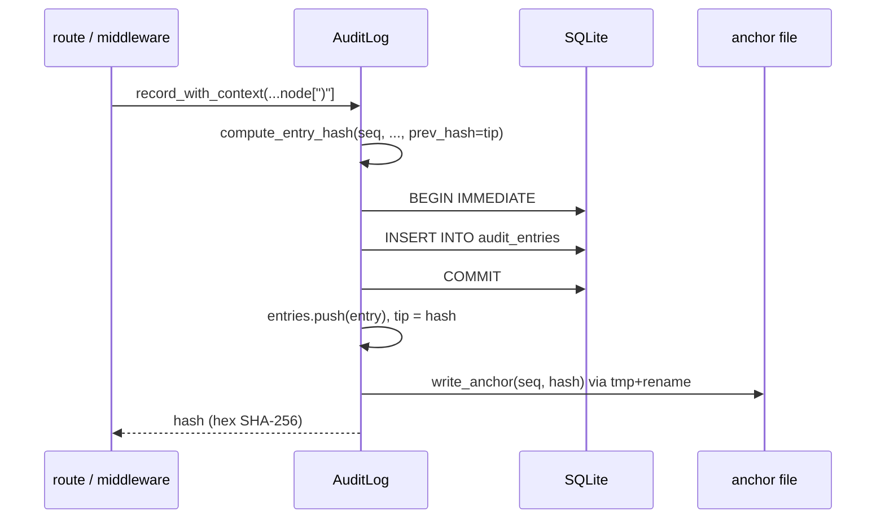

# Agent Runtime — librefang-runtime-audit-src

# librefang-runtime-audit

Merkle hash chain audit trail for security-critical actions in the agent runtime.

Every auditable event is appended to an append-only log where each entry contains the SHA-256 hash of its own contents concatenated with the hash of the previous entry, forming a tamper-evident chain. When a database connection is provided, entries are persisted to the `audit_entries` table (schema V8+) so the trail survives daemon restarts. An optional external anchor file stores the chain tip outside SQLite, making a full table rewrite detectable.

## Architecture



The chain is a linked list of SHA-256 hashes. Each `AuditEntry` stores its own `hash` and the `prev_hash` of its predecessor. The "genesis" sentinel is 64 zero characters. Verification walks the entire list recomputing each hash and checking the `prev_hash` linkage.

## Core Types

### `AuditAction`

Enum of all auditable event categories. The variant's `Display` output (derived from `Debug`) is folded into the SHA-256 hash, so **this enum is append-only** — renaming or reordering a variant invalidates every persisted hash that references it.

Notable variants:

| Variant | Purpose |
|---|---|
| `ToolInvoke` | Agent tool execution |
| `AuthAttempt` | Authentication events |
| `UserLogin` | RBAC credential exchange |
| `RoleChange` | RBAC role mutation |
| `PermissionDenied` | Authorization rejection |
| `BudgetExceeded` | Spend cap hit |
| `RetentionTrim` | Trim job self-audit |
| `A2aDiscovered` / `A2aTrusted` | A2A agent lifecycle |

### `AuditEntry`

A single chain entry carrying `seq` (monotonic 0-indexed), ISO-8601 `timestamp`, `agent_id`, `action`, free-form `detail`, `outcome`, optional `user_id` / `channel` for attribution, and the Merkle fields `prev_hash` and `hash`.

### `AuditLog`

The main struct. Thread-safe via internal `Mutex` guards on `entries`, `tip`, and `chain_anchor`. Constructed in one of three modes:

- **`AuditLog::new()`** — in-memory only, no persistence.
- **`AuditLog::with_db(pool)`** — loads existing entries from SQLite on construction, verifies chain integrity, persists new entries on every `record`.
- **`AuditLog::with_db_anchored(pool, anchor_path)`** — extends `with_db` with an external tip-anchor file. On boot, compares the anchor against the in-DB tip; mismatches are logged at `ERROR` and surface via `verify_integrity`.

### `TrimReport`

Returned by `trim()`. Contains `dropped_by_action` (per-action counts), `total_dropped`, and `new_chain_anchor` (hash of the last dropped entry, or `None` if nothing was trimmed).

## Recording Events

Two entry points, both returning the SHA-256 hex hash of the new entry:

```rust
// Without user/channel attribution (pre-M1 call sites)
fn record(&self, agent_id, action, detail, outcome) -> String;

// With full attribution
fn record_with_context(&self, agent_id, action, detail, outcome, user_id, channel) -> String;
```

### Write ordering

When SQLite is configured, the append path is:

1. Derive `seq` from the last entry's `seq + 1` (not `entries.len()`, which would collide after a trim).
2. Compute the hash under the **v2 delimited layout** via `compute_entry_hash`.
3. Open a `BEGIN IMMEDIATE` transaction, `INSERT`, `COMMIT`.
4. Only on commit success: push to the in-memory `entries` Vec and advance `tip`.
5. If configured, rewrite the anchor file atomically (`<path>.tmp` + `rename`).

If the database write fails, the entry is **dropped** — the chain is not advanced, and the next call retries the same `seq` with a fresh timestamp. This avoids the corruption scenario where an unpersisted entry's hash becomes another entry's `prev_hash`, producing a permanent chain break on restart.

### In-memory soft cap

`record_with_context` enforces a soft cap on the in-memory buffer after every successful append:

- If `max_in_memory_entries` is configured (via `set_max_in_memory_entries`), the effective ceiling is `configured × 1.5`.
- Otherwise the hard default `MAX_AUDIT_ENTRIES` (10,000) applies.
- When the buffer exceeds the ceiling, the oldest prefix is drained and `chain_anchor` is updated to the hash of the last dropped entry. All drained entries are already persisted to SQLite, so no forensic data is lost.

## Persistence and the Anchor File

### SQLite schema

Entries are stored in `audit_entries` with columns `seq` (INTEGER PRIMARY KEY), `timestamp`, `agent_id`, `action`, `detail`, `outcome`, `user_id` (nullable, schema v22), `channel` (nullable, schema v22), `prev_hash`, `hash`. The `user_id`/`channel` columns default to `NULL` for pre-migration rows, which deserializes as `None` and matches the original hash (absent fields are omitted from the digest).

### Anchor file

The anchor file (`<seq> <hex-hash>\n`) is an external witness stored outside SQLite. Its threat model:

> An attacker with write access to `audit_entries` can delete every row, fabricate a new history, and recompute all hashes from genesis — `verify_integrity` returns `Ok` against the DB alone. The anchor file closes this gap by requiring the attacker to also tamper with a separate file.

`with_db_anchored` seeds the anchor from the current tip on first run. On subsequent boots, it compares the anchor against the DB tip. Mismatches are logged at `ERROR` and cause `verify_integrity` to return `Err`. For stronger guarantees, point `anchor_path` at a location unprivileged code cannot write (chmod-0400, read-only mount, NFS share, pipe to `logger`).

The anchor is rewritten atomically after every successful append and after every `trim`/`prune`.

## Verification

```rust
fn verify_integrity(&self) -> Result<(), String>;
```

Walks the entire chain and:

1. **Linkage check** — each entry's `prev_hash` matches the previous entry's `hash` (or the `chain_anchor` for the first surviving entry after a trim, or the genesis sentinel).
2. **Hash recomputation** — recomputes each entry's SHA-256 and compares against the stored `hash`. Accepts both the current v2 (delimited) layout and the legacy v1 (undelimited) layout so upgrades don't raise false alarms on existing entries.
3. **Anchor check** — if an anchor file is configured, compares its `seq:hash` against the in-DB tip. This is the step that catches a full table rewrite.

Exposed via `audit_verify` in `src/routes/audit.rs` (called by `GET /api/audit/verify`).

### Chain anchor (trim boundary)

When `trim()` or `prune()` drops a prefix, `chain_anchor` is set to the hash of the last dropped entry. Verification seeds the walk from this anchor instead of the genesis sentinel, so the surviving suffix verifies cleanly across trim boundaries. The anchor is recovered on boot from the first surviving entry's `prev_hash` (if non-genesis, it points at the dropped predecessor).

## Retention and Memory Management

### `trim(policy, now)`

Applies an `AuditRetentionConfig` against the in-memory window. Two-pass logic:

1. **Pass 1** — enforce `max_in_memory_entries` cap (hard floor on memory).
2. **Pass 2** — walk forward from the cap boundary, extending the drop prefix as long as each entry's action has a configured retention window and the entry is older than it.

Dropping is **prefix-only** (contiguous from the front) — you cannot punch holes in a Merkle list. The first surviving entry stops the trim regardless of later entries' eligibility.

Returns a `TrimReport` with per-action drop counts. The trim itself is audited by writing a `RetentionTrim` entry (carrying the drop counts and new anchor hash), which by construction is the most recent entry and therefore survives every future trim.

### `prune(retention_days)`

Simpler time-based variant — walks the oldest contiguous prefix of entries whose RFC-3339 timestamps precede the cutoff, drops them, updates `chain_anchor`, deletes from SQLite, and refreshes the anchor file.

### `set_max_in_memory_entries(entries)`

Sets the operator-configured cap from `audit.retention.max_in_memory_entries`. Stored as an `AtomicUsize` so it can be updated without taking the `entries` mutex. Typically called once at boot.

## Hash Computation

Two layouts exist:

**v2 (current)** — `compute_entry_hash`: every field is `\x1f`-tagged (`\x1fseq=`, `\x1ftimestamp=`, etc.) to prevent field-boundary ambiguity. An attacker cannot shift bytes across fields without changing the digest. `user_id` and `channel` are included only when present, preserving hash stability for pre-M1 entries that lack these fields.

**v1 (legacy)** — `compute_entry_hash_legacy`: the original six fields concatenated with no separators, then optionally-tagged `user_id`/`channel`, then bare `prev_hash`. Retained solely for `verify_integrity` to validate entries written before the delimiter fix. Never used to write new entries.

## Querying

| Method | Description |
|---|---|
| `recent(n)` | Last `n` entries (cloned slice from the tail) |
| `since_seq(cursor)` | All entries with `seq > cursor` — O(log n) seek via `partition_point`, intended for cursor-based SSE streaming (`/api/logs/stream`) |
| `tip_hash()` | Current chain tip (genesis sentinel if empty) |
| `len()` / `is_empty()` | Buffer size queries |

## Thread Safety

All mutable state is guarded by `Mutex`:

- `entries: Mutex<Vec<AuditEntry>>` — the in-memory window
- `tip: Mutex<String>` — the current chain tip hash
- `chain_anchor: Mutex<Option<String>>` — the trim-boundary anchor
- `max_in_memory_entries: AtomicUsize` — the configured cap (atomic for lock-free updates)

The `entries` mutex is held for the full duration of `record_with_context` (including the SQLite INSERT). This serializes appends, which is correct — the Merkle chain's integrity depends on exactly one writer deriving `prev_hash` and committing between derivation and INSERT. `BEGIN IMMEDIATE` provides the same serialization at the SQLite layer for concurrent processes.

## Integration Points

The audit log is called from across the codebase:

- **Middleware** — `auth` and `rbac_denied_response` in `librefang-api/src/middleware.rs` record `UserLogin`, `AuthAttempt`, and `PermissionDenied` events with user attribution.
- **Route handlers** — budget routes (`update_budget`, `update_agent_budget`, etc.) record `BudgetExceeded`; config routes (`config_set`, `config_reload`, `shutdown`) record `ConfigChange`; network routes (`a2a_discover_external`, `a2a_approve_external`, `comms_send`) record A2A lifecycle events; user routes (`rotate_user_key`) record security-relevant mutations.
- **API surface** — `audit_recent` reads `tip_hash()`; `audit_verify` calls `verify_integrity()` and inspects `anchor_path()`; `logs_stream` uses `since_seq` for cursor-based SSE delivery.
- **Approval flow** — `approve_request` in `src/routes/approvals.rs` records the approval action.