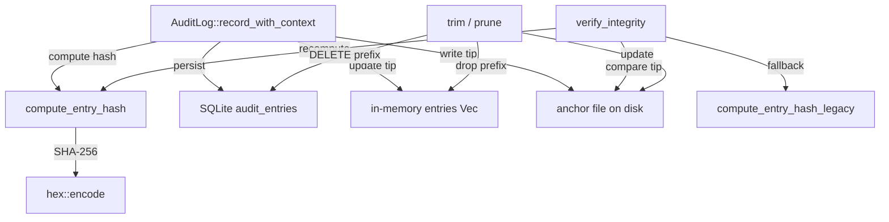

# Agent Runtime — librefang-runtime-audit-src

# librefang-runtime-audit

Merkle hash chain audit trail for security-critical agent actions.

Every auditable event is appended to an append-only log where each entry contains the SHA-256 hash of its own contents concatenated with the hash of the previous entry, forming a tamper-evident chain. When backed by SQLite, entries survive daemon restarts. An optional external anchor file closes the full-rewrite detection gap.

## Architecture

## Threat Model

The in-database Merkle chain alone is **self-consistent but not self-anchored**: an attacker with write access to `audit_entries` can delete every row, fabricate a new history, and recompute every hash from the genesis sentinel forward. `verify_integrity` would return `Ok(())` because there is nothing to compare the tip against.

The **anchor file** closes that gap. It stores the latest `seq:hash` pair on the filesystem, outside the SQLite row store. A full DB rewrite is detectable because the fabricated chain's tip will not match the anchor. For stronger guarantees, point `anchor_path` at a location the daemon can write to but unprivileged code cannot (a chmod-0400 file owned by a different user, a systemd `ReadOnlyPaths=` mount, an NFS share, or a pipe to `logger`).

## Core Types

### `AuditAction`

Enum of auditable action categories. Each variant folds into the per-entry SHA-256 via its `Display` representation (which derives from `Debug`).

**Stability contract**: adding new variants is safe — old entries continue to verify because their action string is unchanged. **Renaming or reordering variants is a breaking change** that invalidates every persisted hash. Treat this enum as append-only.

Variants include: `ToolInvoke`, `CapabilityCheck`, `AgentSpawn`, `AgentKill`, `AgentMessage`, `MemoryAccess`, `FileAccess`, `NetworkAccess`, `ShellExec`, `AuthAttempt`, `WireConnect`, `ConfigChange`, `DreamConsolidation`, `UserLogin`, `RoleChange`, `PermissionDenied`, `BudgetExceeded`, `RetentionTrim`, `A2aDiscovered`, `A2aTrusted`.

### `AuditEntry`

A single entry in the Merkle hash chain:

| Field | Description |
|---|---|
| `seq` | Monotonically increasing sequence number (0-indexed) |
| `timestamp` | ISO-8601 timestamp of when the entry was recorded |
| `agent_id` | Agent that triggered or is the subject of the action |
| `action` | Category of action being audited |
| `detail` | Free-form detail (tool name, file path, etc.) |
| `outcome` | Result of the action ("ok", "denied", error message) |
| `user_id` | `Option<UserId>` — the LibreFang user who triggered the action |
| `channel` | `Option<String>` — origin channel ("telegram", "slack", "dashboard", "cli") |
| `prev_hash` | SHA-256 hash of the previous entry (all-zeros for genesis) |
| `hash` | SHA-256 hash of this entry's content concatenated with `prev_hash` |

### `TrimReport`

Summary returned by `trim()`:

- `dropped_by_action`: `BTreeMap<String, usize>` — per-action-type drop counts
- `total_dropped`: sum of all drops
- `new_chain_anchor`: `Option<String>` — hash of the last dropped entry

### `AuditLog`

The main audit log struct. Thread-safe — all access is serialized through internal mutexes. Optionally backed by SQLite for persistence and/or an external anchor file for tamper detection.

Internal state:

| Field | Purpose |
|---|---|
| `entries` | `Mutex<Vec<AuditEntry>>` — the in-memory chain window |
| `tip` | `Mutex<String>` — hash of the most recent entry |
| `db` | `Option<Pool<SqliteConnectionManager>>` — SQLite connection pool |
| `anchor_path` | `Option<PathBuf>` — filesystem path for the tip anchor |
| `chain_anchor` | `Mutex<Option<String>>` — hash of the most recent **dropped** entry, used to bridge verification across trim boundaries |
| `max_in_memory_entries` | `AtomicUsize` — configured soft cap (0 = use hard default) |

## Construction

### `AuditLog::new()`

Creates an empty in-memory log with no persistence. The initial tip is 64 zero characters (the genesis sentinel).

### `AuditLog::with_db(pool)`

Creates a log backed by SQLite. On construction:

1. Loads all existing entries from the `audit_entries` table (schema V22 columns: `seq`, `timestamp`, `agent_id`, `action`, `detail`, `outcome`, `user_id`, `channel`, `prev_hash`, `hash`).
2. Recovers any chain anchor from a prior trim cycle (if the first surviving entry's `prev_hash` is non-genesis, that value becomes the anchor).
3. Runs `verify_integrity()` and logs the result at WARN on failure.

Rows persisted before the V22 migration return NULL for `user_id`/`channel`, which deserializes to `None`. The hash function omits absent fields, so original hashes remain valid.

### `AuditLog::with_db_anchored(pool, anchor_path)`

Creates a log with both SQLite persistence **and** an external anchor file. In addition to the `with_db` steps:

1. If the anchor file exists, compares its `seq:hash` against the in-DB tip. On mismatch, logs a loud ERROR — the daemon still starts, but `verify_integrity()` will return `Err`.
2. If the DB has rows but no anchor exists yet, seeds the anchor from the current tip.
3. If the anchor file is corrupt, logs an ERROR and refuses to overwrite it.

## Recording Events

### `record(agent_id, action, detail, outcome) -> String`

Convenience wrapper that omits user/channel attribution. Pre-M1 call sites use this form.

### `record_with_context(agent_id, action, detail, outcome, user_id, channel) -> String`

The primary recording path. Flow:

1. **Derive seq** from the last entry's `seq + 1` (not `entries.len()`, because a retention trim may have dropped a prefix).
2. **Compute hash** using the v2 delimited layout via `compute_entry_hash`.
3. **Persist to SQLite** inside `BEGIN IMMEDIATE` / `COMMIT`. This acquires a RESERVED lock so concurrent processes cannot interleave appends against the same `prev_hash`. On DB failure, the entry is **dropped** and the chain is NOT advanced — this preserves on-disk integrity at the cost of losing one audit event. The next call reuses the same `seq` with a fresh timestamp.
4. **Push to in-memory entries** and advance the tip.
5. **Enforce soft cap** — if `entries.len()` exceeds the effective ceiling, drain the oldest prefix and update `chain_anchor`. Entries are already persisted to SQLite before this drain, so no forensic data is lost.
6. **Update the anchor file** — atomic rewrite via `.tmp` + `rename`. Failures are logged but not propagated (the entry is already in SQLite).

Returns the SHA-256 hash of the new entry.

## Hash Computation

### `compute_entry_hash` (v2 — current)

Every field is prefixed with a `\x1f`-delimited tag (e.g. `\x1fseq=`, `\x1ftimestamp=`, etc.) so byte content cannot shift across field boundaries without changing the digest. Without delimiters, `agent_id="a", detail="bc"` and `agent_id="ab", detail="c"` produced identical hashes, allowing field-reshuffle attacks.

`user_id` and `channel` are included only when present, so pre-M1 entries (recorded before user attribution existed) verify with their original hashes.

### `compute_entry_hash_legacy` (v1 — verification only)

The original layout concatenated the six core fields with no separators, then optionally tagged `user_id`/`channel`, then bare `prev_hash`. Retained exclusively for `verify_integrity` to validate entries written before the delimiter fix. **Never used to write new entries.**

## Verification

### `verify_integrity() -> Result<(), String>`

Walks the entire chain and recomputes every hash:

1. **Chain anchor seeding**: starts from `chain_anchor` (or the genesis sentinel if no entries have been trimmed), so the walk correctly handles trimmed prefixes.
2. **Linked-list check**: each entry's `prev_hash` must equal the hash of the preceding entry.
3. **Hash recomputation**: tries v2 (`compute_entry_hash`) first, falls back to v1 (`compute_entry_hash_legacy`) for entries written before the delimiter fix. An upgrade does not raise false tamper alarms on existing logs.
4. **Anchor file check**: if configured, compares the on-disk `seq:hash` against the in-memory tip. A missing anchor file fails closed — a silent disappearance is indistinguishable from an attacker deleting it.

Returns `Ok(())` if the chain is intact, or `Err(msg)` describing the first inconsistency.

## Retention & Memory Management

### In-memory caps

Two tiers:

| Tier | Default | Source |
|---|---|---|
| **Hard cap** (`MAX_AUDIT_ENTRIES`) | 10,000 | Compile-time constant, fallback when no config |
| **Soft cap** | `config × 1.5` | Operator `audit.retention.max_in_memory_entries`, multiplied by `3/2` |

The soft cap is enforced inside `record_with_context` on every append, keeping memory bounded between scheduled `trim()` cycles. When the buffer exceeds the ceiling, the oldest non-anchor prefix is drained. All drained entries have already been persisted to SQLite, so forensic data is preserved on disk.

Set the soft cap via `set_max_in_memory_entries(entries)`. Pass `0` to fall back to the hard default.

### `trim(policy, now) -> TrimReport`

Applies a `AuditRetentionConfig` policy against the in-memory window:

1. **Pass 1 — hard cap**: if `max_in_memory_entries` is set and `total > cap`, marks the oldest `total - cap` entries for dropping.
2. **Pass 2 — per-action retention**: extends the drop prefix as long as entries have a configured retention window and are older than it. Stops at the first survivor.
3. **Persist**: deletes the same prefix from SQLite (`DELETE FROM audit_entries WHERE seq < first_survivor_seq`).
4. **Update chain_anchor** to the hash of the last dropped entry.
5. **Refresh anchor file** so `seq` matches the new `entries.len()`.

**Prefix-only**: dropping is always a contiguous prefix from the front. You cannot punch holes in a Merkle list. The first entry whose retention keeps it stops the trim.

### `prune(retention_days) -> usize`

Simpler time-based variant: drops the oldest contiguous prefix of entries whose timestamps fall outside the retention window. Updates `chain_anchor`, persists the deletion to SQLite, and refreshes the anchor file. Returns the count of pruned entries.

## Querying

| Method | Description |
|---|---|
| `recent(n)` | Returns the most recent `n` entries (cloned) |
| `since_seq(cursor)` | Returns every entry with `seq > cursor`, in insertion order. O(log n) seek + O(k) clone. Intended for cursor-based SSE streaming. Note: `since_seq(0)` skips seq=0 — initial backfill must use `recent()` |
| `len()` | Number of entries in the in-memory window |
| `is_empty()` | Whether the log is empty |
| `tip_hash()` | Current tip hash (hash of the most recent entry, or genesis sentinel) |
| `anchor_path()` | Configured external anchor path, if any |

## Anchor File Format

Single line: `<seq> <hex-hash>\n`

Example: `47 a3f2b8c1d4e5...`

Written atomically via `<path>.tmp` + `rename` so a crash mid-write never leaves a truncated anchor. Parsed by `read_anchor()` — malformed contents produce `Err` so verification fails closed.

## Thread Safety

All shared state is protected by `Mutex` (entries, tip, chain_anchor) or `AtomicUsize` (max_in_memory_entries). Poisoned mutexes are recovered via `unwrap_or_else(|e| e.into_inner())` — the daemon prefers degraded operation over a panic.

SQLite writes use `BEGIN IMMEDIATE` transactions to prevent concurrent writers from interleaving appends against the same `prev_hash`.

## Error Handling Philosophy

| Failure mode | Behavior |
|---|---|
| SQLite INSERT fails | Entry dropped, chain NOT advanced, ERROR logged. Next `record()` retries the same seq. |
| SQLite pool exhausted | Same as INSERT failure. Metric `librefang_memory_pool_get_failed_total` incremented. |
| Anchor file write fails | WARN logged, append still succeeds. Entry is in SQLite. |
| Anchor file missing on verify | `Err` returned — fails closed. |
| Anchor file corrupt on boot | ERROR logged, file not overwritten, verification will fail. |
| Chain integrity failure on boot | WARN logged, daemon still starts. Surface via `/api/audit/verify`. |
| Anchor mismatch on boot | ERROR logged with remediation instructions, daemon still starts. |

Recovery commands:
- `librefang security verify` — inspect chain state
- `librefang security audit-reset` — truncate chain and re-anchor at zero (**never in production/compliance environments**)