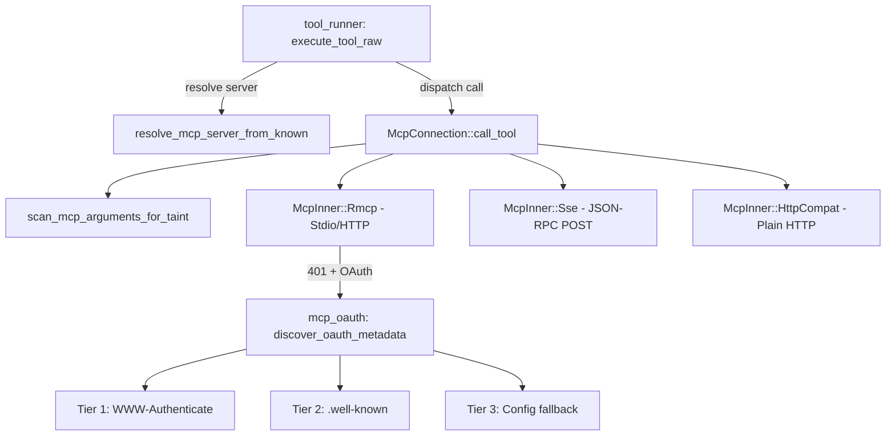

# Agent Runtime — librefang-runtime-mcp-src

# librefang-runtime-mcp — MCP Client Module

Connects the agent runtime to external MCP (Model Context Protocol) servers, discovers their tools, and dispatches tool calls. Every MCP tool is exposed to the LLM under a namespaced name (`mcp_{server}_{tool}`) to prevent collisions with built-in tools.

## Architecture Overview

---

## Transport Types

`McpTransport` is a serde-tagged enum (`#[serde(tag = "type")]`) with four variants:

| Variant | Protocol | Connection handling | Tool discovery |
|---|---|---|---|
| `Stdio` | MCP over stdin/stdout via rmcp SDK | `TokioChildProcess` with sandboxed env | Automatic via `list_all_tools()` |
| `Sse` | JSON-RPC over HTTP POST | `reqwest::Client` | Manual `initialize` + `tools/list` |
| `Http` | Streamable HTTP (MCP 2025-03-26+) | rmcp `StreamableHttpClientTransport` | Automatic via `list_all_tools()` |
| `HttpCompat` | Plain HTTP/JSON adapter | `reqwest::Client` | Static from config `tools` array |

---

## Connection Lifecycle

### `McpConnection::connect(config) -> Result<Self, String>`

Entry point. Performs transport-specific connection, handshake, and tool discovery:

1. **Stdio** — Spawns a subprocess with `connect_stdio`. Validates the command (blocks `..` paths and shell interpreters), builds a sandboxed environment, performs MCP handshake via rmcp, and discovers tools.

2. **Sse** — Creates an HTTP client with `connect_sse`. Tools are discovered later via `sse_initialize()` + `sse_discover_tools()`.

3. **Http (Streamable)** — Calls `connect_streamable_http`. If the server returns 401, it attempts OAuth discovery. If auth is needed but cannot be completed automatically, returns the sentinel error `"OAUTH_NEEDS_AUTH"` to signal the API layer.

4. **HttpCompat** — Validates config with `validate_http_compat_config`, probes the base URL, and registers tools from the static config.

All discovered tools are registered via `register_tool`, which applies namespacing.

### `McpConnection::call_tool(name, arguments) -> Result<String, String>`

Dispatches a tool call through the appropriate transport. Before dispatch, the arguments are passed through `scan_mcp_arguments_for_taint` (configurable per-server via `taint_scanning`).

The method resolves the namespaced tool name back to the original server-side name, determines the transport kind via a tag enum (avoids borrow-checker conflicts with `&mut self`), then dispatches:

- **Rmcp**: Builds `CallToolRequestParams`, calls `client.call_tool()`, extracts text content from the response.
- **Sse**: Sends a `tools/call` JSON-RPC request via `sse_send_request`.
- **HttpCompat**: Resolves the tool config, renders path templates, applies headers, and executes the HTTP request via `call_http_compat_tool`.

---

## Tool Namespacing

MCP tool names are normalized to prevent collisions and enable routing:

- **`format_mcp_tool_name(server, tool)`** — Produces `mcp_{server}_{tool}` with lowercase normalization and hyphen-to-underscore conversion.
- **`is_mcp_tool(name)`** — Quick prefix check (`mcp_`).
- **`resolve_mcp_server_from_known(tool_name, server_names)`** — Longest-prefix match against known server names. This is the robust runtime dispatch used by `tool_runner::execute_tool_raw`. It correctly handles multi-segment server names (e.g. `"my-server"` → `mcp_my_server_...`).
- **`extract_mcp_server(tool_name)`** — Heuristic that splits on the first `_` after `mcp_`. Only reliable for single-word server names. Use `resolve_mcp_server_from_known` when server names are available.

---

## Security Layers

### Outbound Taint Scanning

`scan_mcp_arguments_for_taint` walks every string leaf in the JSON argument tree before it leaves the process. It uses two detection mechanisms:

1. **Content-based** (`check_outbound_text_violation`) — Pattern-matches string values against credential/PII heuristics via `TaintSink::mcp_tool_call`.
2. **Key-name-based** — Object keys matching `MCP_SENSITIVE_KEY_NAMES` (e.g. `authorization`, `api_key`, `secret`) with non-empty string values are blocked unconditionally, even when `taint_scanning` is disabled.

Key properties:
- Recursion capped at `MCP_TAINT_SCAN_MAX_DEPTH` (64).
- Error messages are redacted — they include the JSON path but never the offending payload value, since the error flows back to the LLM and into logs.
- Non-string leaves (numbers, bools, null) are skipped.
- Per-server toggle via `McpServerConfig::taint_scanning` (defaults to `true`). Disabling it turns off content-based scanning only; key-name blocking always remains active.

### SSRF Protection

`check_ssrf` blocks URLs targeting cloud metadata endpoints (`169.254.169.254`, `metadata.google`). Applied to all HTTP-based transports during connection.

`is_ssrf_blocked_host` (in `mcp_oauth`) provides deeper checks for OAuth metadata URLs: loopback, private, link-local, and unique-local IP ranges.

### Subprocess Sandboxing

Stdio MCP servers run with a minimal environment:

- The parent environment is **not inherited** (`cmd.env_clear()`).
- Only `SAFE_ENV_VARS` (PATH, HOME, language/locale, XDG dirs, Windows essentials, Node/Python/Rust/Ruby/Go runtime paths) are passed through.
- Declared env vars from config (`env: Vec<String>`) support `"KEY=VALUE"` and legacy `"KEY"` (looked up from parent env) formats.
- Shell interpreters (`bash`, `sh`, `cmd.exe`, `powershell`, etc.) are blocked as commands — servers must specify a concrete runtime (`npx`, `node`, `python`).
- Path traversal (`..`) in the command path is rejected.
- On Windows, npm/npx `.cmd` wrappers are auto-detected and used.

### Environment Variable Expansion

`expand_env_vars` handles `$VAR` and `${VAR}` references in Stdio transport arguments, allowing config templates like `"$HOME/.config/mcp-server"` without wrapping in a shell.

---

## OAuth Authentication (`mcp_oauth` module)

Supports OAuth for Streamable HTTP MCP servers with PKCE (no client secret required).

### Three-Tier Metadata Discovery

`discover_oauth_metadata(server_url, www_authenticate, config)` resolves OAuth endpoints:

1. **Tier 1**: Parse the `WWW-Authenticate` header → extract `resource_metadata` URL → fetch RFC 8414 metadata.
2. **Tier 2**: Construct `{origin}/.well-known/oauth-authorization-server` → fetch metadata.
3. **Tier 3**: Fall back to `McpOAuthConfig` from config (requires both `auth_url` and `token_url`).

Each tier's results are merged with config via `merge_metadata_with_config`, where config values take precedence.

### `extract_metadata_url` Validation

Three-layer validation on the `resource_metadata` URL:
1. HTTPS only (RFC 8414 requirement).
2. Same-origin as the server URL (prevents cross-domain redirect).
3. No loopback/private/link-local IPs via `is_ssrf_blocked_host`.

### PKCE Flow

- `generate_pkce()` — Produces a `(verifier, challenge)` pair (32 random bytes, SHA-256, base64url-no-pad).
- `generate_state()` — 16 random bytes, base64url-no-pad.

The actual browser redirect and token exchange are driven by the API layer (`src/routes/mcp_auth`), not this module. The `McpOAuthProvider` trait handles token persistence (load/store/clear), implemented by the kernel's encrypted vault.

### `McpAuthState`

Tracks per-server auth state: `NotRequired`, `Authorized`, `NeedsAuth`, `PendingAuth`, `Expired`, `Error`. Stored in a shared `McpAuthStates` (`Mutex<HashMap<String, McpAuthState>>`).

### Connection-Time OAuth

`connect_streamable_http` attempts to load a cached token from the OAuth provider and inject it as an `Authorization: Bearer` header. If the server rejects with 401, it calls `discover_oauth_metadata` and returns `"OAUTH_NEEDS_AUTH"` to let the API layer initiate the user-facing PKCE flow.

The `extract_auth_header_from_error` function performs a manual downcast chain through rmcp's error types to extract the `WWW-Authenticate` header from `StreamableHttpError::AuthRequired`, with a fallback substring check for Display-formatted error strings.

---

## HttpCompat Adapter

A built-in transport for plain HTTP/JSON backends that don't speak MCP protocol. Configured with static tool definitions, each specifying a path template, HTTP method, request/response modes, and optional headers.

### Path Template Rendering

`render_http_compat_path` substitutes `{key}` placeholders in the path with argument values (URL-percent-encoded via `encode_http_compat_path_value`). Used arguments are removed from the remaining payload.

### Request Modes

- `JsonBody` — Remaining arguments sent as JSON body (skipped if empty).
- `Query` — Remaining arguments rendered as query parameters via `json_value_to_query_pairs`.
- `None` — No request body.

### Headers

`HttpCompatHeaderConfig` supports static `value` or environment-derived `value_env`. Applied to every request via `apply_http_compat_headers`.

### Response Modes

- `Text` — Raw body string.
- `Json` — Pretty-printed JSON (falls back to raw text on parse failure).

---

## Integration Points

| Caller | Function used | Purpose |
|---|---|---|
| `tool_runner::execute_tool_raw` | `is_mcp_tool`, `resolve_mcp_server_from_known`, `call_tool` | Route LLM tool calls to the correct MCP connection |
| `routes::agents::get_agent_mcp_servers` | `resolve_mcp_server_from_known` | Map discovered tools back to server configs for the API |
| `tui::event::spawn_fetch_agent_mcp_servers` | `resolve_mcp_server_from_known` | TUI server status display |
| `routes::mcp_auth::auth_start` | `discover_oauth_metadata` | Initiate OAuth flow from API endpoint |
| `kernel::mcp_oauth_provider::load_token` | `store_tokens` | Persist tokens after OAuth completion |