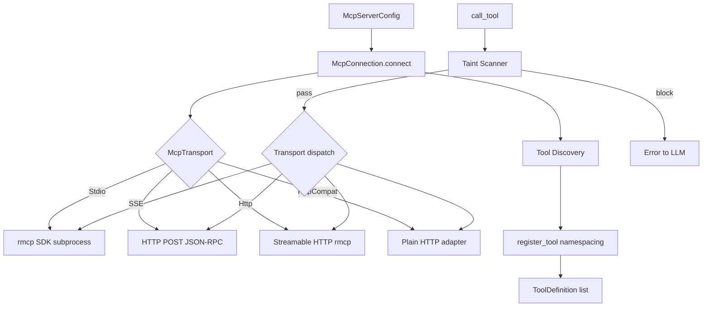
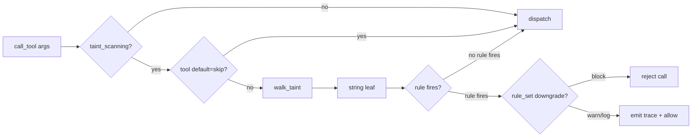

# Agent Runtime — librefang-runtime-mcp-src

# Agent Runtime — MCP Client (`librefang-runtime-mcp`)

## Overview

This module implements the MCP (Model Context Protocol) client for the librefang agent runtime. It manages connections to external MCP servers, discovers the tools they expose, and proxies tool invocations from the LLM agent to those servers. Every tool is namespaced as `mcp_{server}_{tool}` to prevent collisions across multiple MCP backends.

The module has three primary responsibilities:

1. **Transport management** — connect to MCP servers over four transport types, perform the MCP handshake, and discover available tools.
2. **Outbound taint scanning** — walk tool-call arguments before they leave the process and reject or downgrade calls that would exfiltrate credentials or PII to an external server.
3. **Tool namespacing and dispatch** — map between the namespaced tool names the agent sees and the raw names the server expects.

## Architecture



## Transport Types

The `McpTransport` enum defines four connection modes, selected by the `type` field in configuration:

### Stdio

Subprocess communication over stdin/stdout using the `rmcp` SDK for proper MCP protocol handling. The module spawns the configured command, performs the MCP handshake, and discovers tools via `tools/list`.

Key security measures:
- **Shell interpreter blocking** — commands like `bash`, `sh`, `powershell` are rejected; use a specific runtime (`npx`, `node`, `python`) instead.
- **Path traversal rejection** — commands containing `..` are blocked.
- **Environment sandboxing** — the subprocess does not inherit the parent environment. Only safe system variables (`PATH`, `HOME`, etc.) and explicitly declared `env` entries are passed through.
- **Restricted env var expansion** — `$VAR` references in arguments are only expanded for variables on the operator-declared allowlist, preventing templates from reading daemon secrets like `ANTHROPIC_API_KEY`.
- **Stderr draining** — child stderr is consumed in a background task (capped at 100 lines / 256 bytes per line) to prevent pipe-buffer stalls.

### SSE (Server-Sent Events)

Legacy HTTP transport using JSON-RPC over HTTP POST. The module sends requests and parses responses inline. Tool discovery requires an explicit `initialize` + `notifications/initialized` + `tools/list` sequence.

SSE is unidirectional (client-initiated only), so the `roots` capability is never declared — the server cannot send `roots/list` back.

### Http (Streamable HTTP)

MCP 2025-03-26+ Streamable HTTP transport via the `rmcp` SDK. Handles Accept headers, `Mcp-Session-Id` tracking, SSE stream parsing, and content-type negotiation. This is the preferred transport for remote MCP servers.

Roots are only advertised to local servers (determined by `is_local_url`). Supports OAuth authentication via PKCE.

### HttpCompat

A built-in compatibility adapter for plain HTTP/JSON backends that don't implement MCP. Tools are declared statically in configuration with path templates, HTTP methods, and request/response modes. Path templates support `{param}` placeholders that are URL-percent-encoded.

## Connection Lifecycle

### `McpConnection::connect(config)`

Entry point. Dispatches to the appropriate transport-specific connect method, discovers tools, and returns a ready-to-use `McpConnection`.

```rust
let conn = McpConnection::connect(config).await?;
let tools = conn.tools();  // &[ToolDefinition]
let name = conn.name();    // server display name
```

### `McpConnection::call_tool(name, arguments)`

Invokes a tool. Before dispatch, the taint scanner walks all string leaves in `arguments`. The `name` parameter accepts either the namespaced form (`mcp_servername_tool`) or the raw tool name.

Returns the tool's text output on success, or an error string on failure (including taint violations, timeouts, transport errors, or server-reported `is_error` flags).

### `McpConnection::close()` and `Drop`

Explicit `close()` cancels the rmcp service and awaits subprocess termination with a 10-second timeout. The `Drop` impl performs best-effort cleanup by spawning an async close on the current tokio runtime if available. Callers doing hot-reload should prefer explicit `close()` to guarantee the child is reaped before starting a new connection.

## Tool Namespacing

All MCP tools are prefixed to avoid collisions when multiple servers are connected:

| Helper | Purpose |
|--------|---------|
| `format_mcp_tool_name(server, tool)` | Produces `mcp_{normalized_server}_{normalized_tool}` |
| `is_mcp_tool(name)` | Checks for `mcp_` prefix |
| `extract_mcp_server(tool_name)` | Heuristic extraction from first segment (unreliable for multi-word names) |
| `resolve_mcp_server_from_known(tool_name, server_names)` | Robust resolution against known server names |
| `normalize_name(name)` | Lowercase + replace hyphens with underscores |

The robust variant `resolve_mcp_server_from_known` should be preferred at runtime because server names are normalized and may contain hyphens/underscores that the simple split-based heuristic cannot disambiguate.

## Outbound Taint Scanning

The taint scanner is the primary security boundary preventing a compromised LLM from exfiltrating credentials or PII through MCP tool-call arguments.

### Scan Flow



### `scan_mcp_arguments_for_taint_with_policy`

Walks every string leaf in the JSON argument tree and checks against `TaintSink::mcp_tool_call`. Non-string leaves (numbers, bools, null) are skipped. Recursion is capped at `MCP_TAINT_SCAN_MAX_DEPTH` (64).

**Critical invariant**: the returned error string must never contain the offending payload — it flows back to the LLM and into logs, and echoing the blocked secret would defeat the filter.

### Sensitive Key Name Detection

Object keys matching `authorization`, `api_key`, `secret`, `password`, etc. (see `MCP_SENSITIVE_KEY_NAMES`) are flagged when their value is a non-empty string, regardless of value shape. This catches patterns like `{"Authorization": "Bearer sk-…"}` where whitespace and scheme words would evade the content heuristic alone.

### Per-Tool, Per-Path Exemptions (`McpTaintPolicy`)

The `taint_policy` field on `McpServerConfig` supports fine-grained exemptions:

- **Path-level `skip_rules`** — JSONPath patterns (e.g. `$.tabId`) can skip specific `TaintRuleId`s. Supports exact paths, `*` wildcards, and `[*]` array wildcards.
- **Tool-level `default = "skip"`** — bypasses all scanning for the entire tool (including key-name blocking).
- **Named rule sets** — tools can reference `[[taint_rules]]` sets with `Block`, `Warn`, or `Log` actions. When multiple sets cover the same rule, the most permissive action wins (`Log` > `Warn` > `Block`).

### Rule Set Hot-Reload

`TaintRuleSetsHandle` (`Arc<ArcSwap<Vec<NamedTaintRuleSet>>>`) is shared across all MCP connections. The kernel updates it via `.store(Arc::new(new_rules))`; the scanner takes a `.load()` snapshot at scan start, ensuring a single scan sees a consistent rule set even during config reload.

### JSONPath Matching

The `jsonpath_matches` function supports dot-separated paths with `*` and `[*]` wildcards. **Limitation**: keys containing `.` or `[` cannot be addressed precisely — use broader patterns (`$.*`, `$.headers.*`) as a workaround.

## Security Controls Summary

| Control | Location | Purpose |
|---------|----------|---------|
| Taint scanning | `call_tool` | Block credential/PII exfiltration |
| SSRF protection | `check_ssrf`, `is_local_url` | Block metadata endpoint access (169.254.169.254, metadata.google) |
| Shell blocking | `connect_stdio` | Prevent shell interpreter commands |
| Env sandboxing | `connect_stdio` | Isolate subprocess from daemon secrets |
| Bounded response reading | `read_response_bytes_capped` | Prevent OOM from unbounded server responses (16 MiB cap, streaming) |
| JSON-RPC ID verification | `sse_send_request` | Detect mismatched responses from concurrent requests |
| Content-Type validation | `sse_send_request` | Reject non-JSON/SSE responses (proxy errors, misconfigured servers) |

### Bounded HTTP Response Reading

`read_response_bytes_capped` streams response bodies chunk-by-chunk rather than buffering entirely. It checks `Content-Length` as a fast-path rejection, then streams with a running byte counter. This prevents a malicious MCP server from forcing a 16 MiB allocation per request under chunked transfer encoding.

## OAuth Integration

Remote HTTP servers may require OAuth. The connection flow:

1. `connect_streamable_http` attempts connection. If the server returns 401, `extract_auth_header_from_error` extracts the `WWW-Authenticate` header from rmcp's error chain.
2. `discover_oauth_metadata` performs three-tier resolution (WWW-Authenticate header → `.well-known/oauth-authorization-server` → config fallback).
3. The connection returns `Err("OAUTH_NEEDS_AUTH")`, and the API layer drives the PKCE flow through the dashboard UI.

Cached tokens are injected via the `oauth_provider` field on `McpServerConfig`. The `mcp_oauth` submodule provides `generate_pkce`, `generate_state`, `store_tokens`, and SSRF-validated metadata discovery.

## MCP Protocol Version Negotiation

`SUPPORTED_MCP_VERSIONS` lists `2024-11-05` and `2025-03-26`. The first is advertised in `initialize`; both are accepted from the server. An unknown server version triggers a warning but does not abort the connection.

## MCP Roots Capability

When `roots` are configured on `McpServerConfig`, `RootsClientHandler` declares the `roots` capability during the MCP handshake and responds to `roots/list` with the configured directories converted to `file://` URIs. Roots are only advertised to local servers for HTTP transports.

## Subprocess Environment

The `SAFE_ENV_VARS` constant lists system variables that are unconditionally passed to stdio subprocesses (PATH, HOME, language/locale vars, XDG dirs, Windows essentials, Node/Python/Rust/Go/Ruby paths). The operator declares additional variables via the `env` field on `McpServerConfig`.

## Key Types

| Type | Role |
|------|------|
| `McpServerConfig` | Per-server configuration (transport, timeout, env, taint settings, OAuth) |
| `McpConnection` | Active connection: holds config, discovered tools, transport handle, auth state |
| `McpInner` | Transport-specific handle: `Rmcp(DynRmcpClient)`, `Sse{client, url, next_id}`, `HttpCompat{client}` |
| `McpTransport` | Configuration enum: `Stdio`, `Sse`, `Http`, `HttpCompat` |
| `RootsClientHandler` | rmcp `ClientHandler` that declares roots capability |
| `TaintRuleSetsHandle` | `Arc<ArcSwap<Vec<NamedTaintRuleSet>>>` — hot-reloadable rule set registry |

## Integration Points

- **`tool_runner::execute_tool_raw`** calls `is_mcp_tool`, `resolve_mcp_server_from_known`, and `McpConnection::call_tool`.
- **`agents::get_agent_mcp_servers`** and `tui::event::spawn_fetch_agent_mcp_servers` use `resolve_mcp_server_from_known` for routing.
- **`mcp_auth` routes** call `discover_oauth_metadata`, `generate_state`, and `is_ssrf_blocked_url`.
- **`mcp_oauth_provider`** (kernel) uses `is_ssrf_blocked_url` and `store_tokens` for token lifecycle management.

## HttpCompat Path Rendering

`render_http_compat_path` processes `{key}` placeholders in path templates. Matched arguments are URL-percent-encoded (unreserved characters per RFC 3986) and removed from the remaining arguments. Unmatched placeholders are left as-is. The remaining arguments are then dispatched according to the tool's `request_mode` (`JsonBody`, `Query`, or `None`).