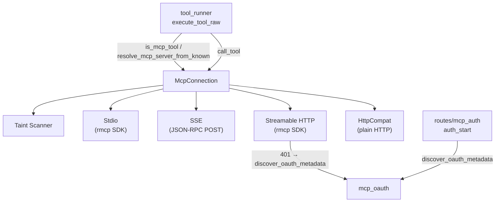

# Agent Runtime — librefang-runtime-mcp-src

# Agent Runtime — `librefang-runtime-mcp`

MCP (Model Context Protocol) client for connecting to external MCP servers, discovering their tools, and invoking them on behalf of the agent runtime. All MCP tools are surfaced as namespaced tools (`mcp_{server}_{tool}`) to prevent name collisions across servers.

## Architecture

## Transports

The module supports four transport modes via `McpTransport`:

| Transport | Protocol | Tool Discovery | Roots Support |
|---|---|---|---|
| `Stdio` | Subprocess stdin/stdout via rmcp SDK | `tools/list` during handshake | Yes — `RootsClientHandler` |
| `Sse` | HTTP POST with JSON-RPC 2.0 | `tools/list` after manual `initialize` | No — unidirectional |
| `Http` | Streamable HTTP (MCP 2025-03-26+) via rmcp SDK | `tools/list` during handshake | Local servers only |
| `HttpCompat` | Plain HTTP with configurable method/path | Static declaration in config | No — no MCP handshake |

### Connection lifecycle

`McpConnection::connect(config)` is the single entry point. It:

1. Validates the URL (SSRF check via `check_ssrf`)
2. Spawns/connects to the transport
3. Performs MCP handshake (Stdio/Http via rmcp; SSE via manual `initialize`)
4. Discovers tools via `tools/list` or static config (HttpCompat)
5. Registers each tool under `mcp_{server}_{tool}` namespace

### Tool invocation

`McpConnection::call_tool(name, arguments)` resolves the namespaced name back to the original, runs the outbound taint scanner, then dispatches to the appropriate transport. A `TransportKind` tag avoids borrow-checker conflicts between `self.inner` and `self.config` across await points.

## Security

### Outbound taint scanning

Before any tool call is dispatched, `scan_mcp_arguments_for_taint_with_policy` walks every string leaf in the JSON argument tree and checks it against `TaintSink::mcp_tool_call`. Two detection mechanisms run:

1. **Content heuristic** — `check_outbound_text_violation_with_skip` matches credential patterns (API keys, tokens, PII)
2. **Key-name blocking** — Object keys matching `MCP_SENSITIVE_KEY_NAMES` (e.g. `authorization`, `api_key`, `secret`) with non-empty string values are blocked regardless of value shape

The scanner is hard-capped at depth 64 (`MCP_TAINT_SCAN_MAX_DEPTH`) to prevent stack exhaustion from pathological payloads.

**Redaction guarantee**: violation messages contain only the JSON path and rule name — never the offending payload value. These messages flow back to the LLM and logs.

#### Per-tool, per-path exemptions

`McpTaintPolicy` allows disabling specific taint rules for specific argument paths in specific tools. The JSONPath matcher supports:

- Exact paths: `$.tabId`
- Wildcards: `$.*`, `$.a.*`
- Array wildcards: `$.items[*]`

`resolve_skip_rules` collects all matching `skip_rules` for the current tool+path before calling `check_outbound_text_violation_with_skip`.

Set `taint_scanning: false` on `McpServerConfig` to disable the content heuristic entirely for trusted local servers. Key-name blocking remains active even when scanning is off.

### Subprocess sandboxing (Stdio)

- Shell interpreters (`bash`, `sh`, `cmd`, `powershell`, etc.) are blocked — servers must specify a runtime directly (`npx`, `node`, `python`)
- Path traversal (`..`) in the command is rejected
- The subprocess does **not** inherit the parent environment — only `SAFE_ENV_VARS` (PATH, HOME, language/locale vars, Node/Python/Rust/Go/Ruby paths) plus explicitly declared `env` entries are passed
- Environment variable expansion (`$VAR`, `${VAR}`) in args avoids needing `sh -c` wrappers

### SSRF protection

- `check_ssrf` blocks cloud metadata endpoints (`169.254.169.254`, `metadata.google.internal`)
- `is_local_url` uses proper URL parsing (not substring matching) to detect loopback addresses — prevents spoofing via `127.0.0.1.evil.com` or `127.0.0.1@attacker.com`
- Filesystem roots are only advertised to local servers (Stdio always; HTTP only if `is_local_url` returns true)

## Tool Namespacing

All MCP tools are prefixed to avoid collisions across servers:

- `format_mcp_tool_name("github", "create_issue")` → `"mcp_github_create_issue"`
- Server names are normalized: hyphens become underscores, everything lowercase
- `resolve_mcp_server_from_known` is the **recommended** way to reverse the mapping — it tries each known server name and picks the longest matching prefix, handling multi-word server names correctly
- `extract_mcp_server` is a simpler heuristic that splits on the first `_` after `mcp_` — only reliable for single-word server names

## MCP Roots

`RootsClientHandler` implements `rmcp::ClientHandler` to advertise filesystem root directories during the MCP `initialize` handshake. Roots are converted to `file://` URIs using the `url` crate for proper percent-encoding and Windows path handling.

Roots are populated at runtime by the kernel (home dir + agent workspaces) via `McpServerConfig.roots`. This field is `#[serde(skip)]` — never serialized to/from config.

## OAuth (`mcp_oauth`)

The `mcp_oauth` module handles OAuth discovery and authentication for Streamable HTTP connections.

### Three-tier metadata discovery

`discover_oauth_metadata` resolves OAuth endpoints using three fallback tiers:

1. **WWW-Authenticate header** — Parse `resource_metadata` URL from the `Bearer` challenge → fetch RFC 8414 metadata
2. **`.well-known`** — Construct `.well-known/oauth-authorization-server` from the server URL origin → fetch
3. **Config fallback** — Use `McpOAuthConfig.auth_url` + `McpOAuthConfig.token_url` directly

Each tier's results can be merged with config overrides via `merge_metadata_with_config` (config takes precedence).

### Security layers for metadata URL

`extract_metadata_url` applies three validation layers:

1. **HTTPS only** — `http://` rejected per RFC 8414
2. **Same-origin** — metadata URL must share scheme+host+port with the server URL
3. **IP blocklist** — `is_ssrf_blocked_host` rejects loopback, private, and link-local ranges

### Authentication flow

When `connect_streamable_http` receives a 401:

1. `extract_auth_header_from_error` downcasts through rmcp's error chain to recover the `WWW-Authenticate` header
2. `discover_oauth_metadata` resolves endpoints
3. Connection returns `Err("OAUTH_NEEDS_AUTH")` to signal the API layer
4. The API layer (`routes/mcp_auth::auth_start`) drives the PKCE flow via the UI
5. On success, `McpOAuthProvider::store_tokens` persists tokens; `load_token` injects them as `Authorization: Bearer` headers on subsequent connections

Key types: `OAuthMetadata`, `McpAuthState` (state machine: `NotRequired` → `NeedsAuth` → `PendingAuth` → `Authorized`), `OAuthTokens`, `McpOAuthProvider` trait.

PKCE helpers: `generate_pkce()` returns `(verifier, SHA256_challenge)` as base64url; `generate_state()` produces a random state parameter.

## Integration Points

| Caller | Function called | Purpose |
|---|---|---|
| `tool_runner::execute_tool_raw` | `is_mcp_tool` | Route tool calls to MCP |
| `tool_runner::execute_tool_raw` | `resolve_mcp_server_from_known` | Find owning connection |
| `tool_runner::execute_tool_raw` | `McpConnection::call_tool` | Execute the tool |
| `routes::agents::get_agent_mcp_servers` | `resolve_mcp_server_from_known` | List available servers |
| `routes::mcp_auth::auth_start` | `discover_oauth_metadata` | Start OAuth flow |
| `mcp_oauth_provider::load_token` | `store_tokens` | Persist OAuth tokens |

## HttpCompat Transport

The `HttpCompat` variant adapts plain HTTP/JSON backends that don't speak MCP protocol. Tools are statically declared in config with:

- `path` — URL path template with `{param}` placeholders (percent-encoded via `encode_http_compat_path_value`)
- `method` — GET, POST, PUT, PATCH, DELETE
- `request_mode` — `JsonBody`, `Query`, or `None`
- `response_mode` — `Text` (raw) or `Json` (pretty-printed)
- `headers` — Static values or environment variable references (`value_env`)

Configuration is validated upfront by `validate_http_compat_config` — requires non-empty `base_url`, at least one tool, and each header must define `value` or `value_env`.

## Key Constants

| Constant | Value | Purpose |
|---|---|---|
| `MCP_TAINT_SCAN_MAX_DEPTH` | 64 | JSON tree depth cap for taint walker |
| `MCP_SENSITIVE_KEY_NAMES` | 15 keys | Credential-shaped object key blocklist |
| `SAFE_ENV_VARS` | ~35 vars | Allowlist for subprocess environment |