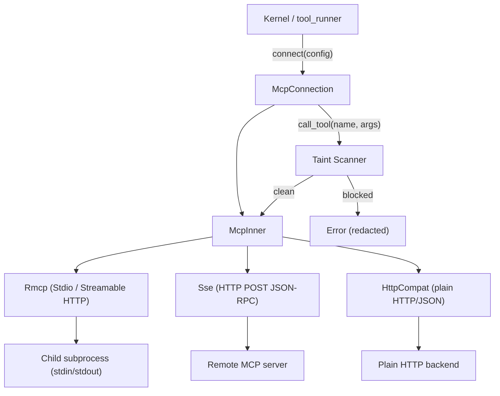

# Agent Runtime — librefang-runtime-mcp-src

# Agent Runtime — `librefang-runtime-mcp`

MCP (Model Context Protocol) client for connecting to external MCP servers. Manages the full lifecycle — transport establishment, tool discovery, namespaced registration, invocation, and teardown — with built-in outbound taint scanning to prevent credential exfiltration through MCP tool calls.

## Architecture



## Transport Types

The `McpTransport` enum (serde tag = `type`, snake_case) defines four connection modes:

| Variant | Protocol | Tool Discovery | Use Case |
|---------|----------|----------------|----------|
| `Stdio` | MCP over subprocess stdin/stdout via `rmcp` SDK | Automatic via `tools/list` | Local MCP servers (npx, python) |
| `Sse` | HTTP POST with JSON-RPC 2.0 | Manual `sse_initialize` + `sse_discover_tools` | Legacy SSE-only servers |
| `Http` | Streamable HTTP (MCP 2025-03-26+) | Automatic via `rmcp` SDK | Modern remote MCP servers |
| `HttpCompat` | Plain HTTP/JSON adapter | Static from config declaration | REST APIs without MCP support |

## Connection Lifecycle

### `McpConnection::connect(config) → Result<Self, String>`

Entry point. Dispatches to the transport-specific connect method, discovers tools, and registers them with namespaced names.

1. **Stdio**: Spawns the subprocess with a sandboxed environment, performs MCP handshake via `rmcp`, calls `list_all_tools()`.
2. **Sse**: Creates an HTTP client. Tools discovered later via `sse_initialize()` → `sse_discover_tools()`.
3. **Http**: Creates a `StreamableHttpClientTransport`, performs MCP handshake via `rmcp`. If the server returns 401, attempts OAuth discovery (see below). Only advertises filesystem `roots` to local URLs.
4. **HttpCompat**: Validates config, probes the base URL, registers statically declared tools.

### `McpConnection::call_tool(name, arguments) → Result<String, String>`

Resolves the raw tool name from the namespaced form, runs taint scanning (if enabled), then dispatches to the transport-specific invocation path.

### `McpConnection::close(self)` (async)

Explicit teardown. For stdio connections, cancels the rmcp service with a 10-second timeout and waits for the subprocess to be reaped. The `Drop` impl provides a best-effort fallback that spawns the close on the current tokio runtime.

## Tool Namespacing

All MCP tools are prefixed to prevent name collisions across servers:

```
format_mcp_tool_name("github", "create_issue") → "mcp_github_create_issue"
```

- **`format_mcp_tool_name(server, tool)`** — produces `mcp_{normalized_server}_{normalized_tool}` where normalization lowercases and replaces hyphens with underscores.
- **`is_mcp_tool(name)`** — checks for the `mcp_` prefix.
- **`resolve_mcp_server_from_known(tool_name, server_names)`** — robust reverse lookup against known server names. Use this over `extract_mcp_server()` which splits naively on underscores.
- **`extract_mcp_server(tool_name)`** — heuristic extraction; unreliable for multi-word server names.

Callers in `tool_runner.rs` use `resolve_mcp_server_from_known` to dispatch tool calls to the correct `McpConnection`.

## Taint Scanning System

Outbound taint scanning prevents LLMs from smuggling credentials, API keys, and PII into MCP tool-call arguments. This is a best-effort pattern-matching filter, not a full information-flow tracker.

### Scan Entry Point

`scan_mcp_arguments_for_taint_with_policy(value, taint_policy, rule_set_registry, tool_name) → Option<String>`

Walks every string leaf in a JSON argument tree against `TaintSink::mcp_tool_call()`. Returns `Some(redacted_description)` on violation, `None` if clean. The returned string contains only the JSON path and rule name — **never the offending payload**.

### Two Detection Layers

**Value-content heuristic** — `walk_taint` calls `detect_outbound_text_violation_rules_with_skip` on each string leaf. Catches patterns like `ghp_...` tokens, `sk-...` keys, email addresses, phone numbers.

**Sensitive key-name blocking** — Object keys matching `MCP_SENSITIVE_KEY_NAMES` (e.g., `authorization`, `api_key`, `password`, `secret`) with non-empty string values are treated as credential-shaped regardless of the value's appearance. This catches patterns like `{"Authorization": "Bearer sk-..."}` that the value heuristic misses due to whitespace and scheme prefixes.

### Policy Configuration

Three levels of control, from coarsest to finest:

**1. Server-level toggle** — `McpServerConfig::taint_scanning` (default: `true`). Setting `false` disables the value-content heuristic for the entire server. Key-name blocking remains active.

**2. Tool-level kill switch** — `McpTaintToolPolicy::default = Skip`. Bypasses all scanning (both layers) for a specific tool.

**3. Per-path skip rules** — `McpTaintPolicy::tools.<tool>.paths.<jsonpath>.skip_rules`. Disables specific `TaintRuleId` variants at specific argument paths.

### Named Rule Sets

`[[taint_rules]]` entries in config define named sets of rules with an action (`Block`, `Warn`, `Log`). Tools reference these sets via `McpTaintToolPolicy::rule_sets`. When a rule fires that belongs to a referenced set:

- **Block** — call is rejected (default scanner behavior)
- **Warn** — call is allowed, logged at `WARN` level
- **Log** — call is allowed, logged at `INFO` level

When multiple sets cover the same rule, the most permissive action wins (`Log` > `Warn` > `Block`).

Rule-set hot-reload: the kernel owns a single `ArcSwap<Vec<NamedTaintRuleSet>>` shared across all connections. Config reloads call `.store(Arc::new(new_rules))`. Each scan takes a `.load()` snapshot that remains stable for the entire argument-tree walk.

### JSONPath Matching

`jsonpath_matches(pattern, path)` supports:

- `$.a.b` — exact nested property
- `$.a.*` — any direct child
- `$.a[*]` — any array element

**Limitation**: Keys containing `.` or `[` cannot be addressed precisely. Use broader patterns like `$.*` or `$.headers.*` as workarounds.

### Depth Cap

`MCP_TAINT_SCAN_MAX_DEPTH = 64`. Nested structures beyond this are rejected outright to prevent stack exhaustion from pathological payloads.

## Security Hardening

### Stdio Subprocess Sandboxing

- **Shell blocking**: `connect_stdio` rejects commands that resolve to shell interpreters (`bash`, `sh`, `cmd`, `powershell`, etc.)
- **Path traversal**: Commands containing `..` are rejected
- **Environment isolation**: `env_clear()` is called before setting only `SAFE_ENV_VARS` (PATH, HOME, NODE_PATH, etc.) plus explicitly declared `env` entries
- **kill_on_drop(true)**: Ensures the subprocess terminates when the transport is dropped
- **Stderr draining**: A background task reads child stderr (capped at 100 lines, 256 bytes each) to prevent pipe-buffer stalls

### Environment Variable Expansion

`expand_env_vars(input, allowed_vars)` expands `$VAR` and `${VAR}` references only for variables in the allowlist (safe system vars + declared `env` entries). Prevents templates from silently reading daemon secrets like `ANTHROPIC_API_KEY`.

`expand_leading_tilde(input)` expands `~` and `~/...` to the home directory. Only applies to leading tildes.

### SSRF Protection

`check_ssrf(url, label)` blocks URLs targeting cloud metadata endpoints (`169.254.169.254`, `metadata.google`). The `mcp_oauth` module extends this with full host-based blocking (link-local, loopback, etc.).

### Response Size Cap

`read_response_bytes_capped(response)` streams HTTP response bodies with a running byte counter, rejecting anything exceeding 16 MiB (`MAX_RESPONSE_BYTES`). Works for both `Content-Length` (fast-path) and chunked transfer (streaming-path).

### Local URL Detection

`is_local_url(url)` uses proper `url` crate parsing to detect localhost/127.0.0.1/::1 destinations. Used to decide whether filesystem `roots` are meaningful for HTTP servers.

## HttpCompat Adapter

Built-in adapter for plain HTTP/JSON backends that don't speak MCP. Configured via `HttpCompatToolConfig` entries:

- **Path templating**: `{key}` placeholders in `tool.path` are URL-percent-encoded and substituted from arguments
- **Request modes**: `JsonBody`, `Query`, or `None`
- **Header injection**: Static values (`header.value`) or environment lookup (`header.value_env`)
- **Response modes**: `Text` (raw) or `Json` (pretty-printed)

Configuration is validated at connect time by `validate_http_compat_config`.

## OAuth Flow

Handled by the `mcp_oauth` submodule. When a Streamable HTTP server returns 401:

1. `extract_auth_header_from_error` extracts the `WWW-Authenticate` header from the rmcp error chain
2. `discover_oauth_metadata` resolves the authorization server via three-tier discovery (WWW-Authenticate hint → `.well-known/oauth-authorization-server` → config fallback)
3. Returns `Err("OAUTH_NEEDS_AUTH")` to signal the API layer to drive the PKCE flow

Cached tokens are injected automatically on subsequent connections via `oauth_provider.load_token()`.

## MCP Roots

The `RootsClientHandler` implements `rmcp::ClientHandler` to advertise filesystem root directories during the MCP `initialize` handshake. Roots are only sent to local servers (stdio and local HTTP URLs).

## MCP Protocol Versioning

`SUPPORTED_MCP_VERSIONS = ["2024-11-05", "2025-03-26"]`. The first entry is advertised in `initialize`. Unknown versions from servers trigger a warning but do not abort the connection.

## Integration Points

| Caller | Module | Usage |
|--------|--------|-------|
| `execute_tool_raw` | `librefang-runtime/tool_runner.rs` | `is_mcp_tool`, `resolve_mcp_server_from_known`, `call_tool` |
| `render_mcp_summary` | `kernel/mcp_summary.rs` | `normalize_name`, `resolve_mcp_server_from_known` |
| `get_agent_mcp_servers` | `routes/agents.rs` | `resolve_mcp_server_from_known` |
| `spawn_fetch_agent_mcp_servers` | `tui/event.rs` | `resolve_mcp_server_from_known` |
| `auth_start` / `auth_callback` | `routes/mcp_auth.rs` | `discover_oauth_metadata`, `generate_state`, `is_ssrf_blocked_url` |