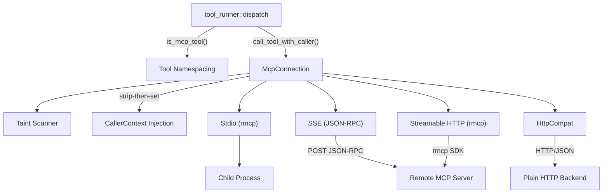

# Agent Runtime — librefang-runtime-mcp-src

# MCP Client Runtime — `librefang-runtime-mcp`

The MCP client runtime connects the LibreFang agent to external tool servers implementing the Model Context Protocol. It manages the full lifecycle — transport establishment, tool discovery, argument validation, taint scanning, caller-context injection, and tool dispatch — across four transport variants.

## Architecture


```mermaid
graph TD
    dispatch["tool_runner::dispatch"] -->|"is_mcp_tool()"| namespacing["Tool Namespacing"]
    dispatch -->|"call_tool_with_caller()"| conn["McpConnection"]
    conn --> taint["Taint Scanner"]
    conn -->|"strip-then-set"| ctx["CallerContext Injection"]
    conn --> stdio["Stdio (rmcp)"]
    conn --> sse["SSE (JSON-RPC)"]
    conn --> http["Streamable HTTP (rmcp)"]
    conn --> compat["HttpCompat"]
    stdio --> subprocess["Child Process"]
    sse -->|"POST JSON-RPC"| remote["Remote MCP Server"]
    http -->|"rmcp SDK"| remote
    compat -->|"HTTP/JSON"| backend["Plain HTTP Backend"]
```

## Transports

The module supports four transport modes, selected via the `McpTransport` enum:

| Transport | Description | Tool Discovery |
|-----------|-------------|----------------|
| `Stdio` | Subprocess with MCP over stdin/stdout via the `rmcp` SDK | Automatic via `tools/list` |
| `Sse` | HTTP POST with JSON-RPC (legacy SSE protocol) | Manual `initialize` + `tools/list` |
| `Http` | Streamable HTTP transport (MCP 2025-03-26+) with session management | Automatic via `rmcp` SDK |
| `HttpCompat` | Built-in adapter for plain HTTP/JSON backends that don't speak MCP | Statically declared in config |

### Stdio Subprocess Sandboxing

Stdio-launched MCP servers run as isolated child processes:

- **Environment is not inherited.** Only `SAFE_ENV_VARS` (system essentials like `PATH`, `HOME`, language/runtime paths) and explicitly declared `env` entries are passed through. This prevents accidental leakage of daemon secrets like `ANTHROPIC_API_KEY`.
- **Shell interpreters are blocked.** The command must be a specific runtime (`npx`, `node`, `python`, etc.) — never `bash`, `sh`, `cmd`, or `powershell`. This prevents command-injection vectors in arguments.
- **Path traversal is rejected.** Commands containing `..` are refused.
- **`kill_on_drop(true)`** ensures orphaned processes are cleaned up when the connection drops.
- **Stderr is drained** in a background task (capped at 100 lines × 256 bytes) to prevent pipe-buffer stalls that would hang the child process.

Environment variable references (`$VAR`, `${VAR}`) in `args` are expanded only for variables in the allowlist (safe system vars + declared `env` entries). Tilde expansion (`~/...`) is also supported.

### SSE Transport

SSE uses a simple JSON-RPC-over-HTTP-POST protocol. It does **not** declare the `roots` capability because SSE is unidirectional — the server cannot send `roots/list` back.

The handshake sequence is: `initialize` → `notifications/initialized` → `tools/list`.

### Streamable HTTP Transport

Uses the `rmcp` SDK's `StreamableHttpClientTransport`, which handles Accept headers, `Mcp-Session-Id` tracking, and SSE stream parsing automatically. Supports OAuth authentication flow — when a server returns a 401 with `WWW-Authenticate`, the module extracts the header and defers to the API layer for PKCE-based OAuth.

Only local filesystem `roots` are advertised to local servers (loopback/RFC1918). Remote servers receive no roots since they don't operate on the local filesystem.

### HttpCompat Transport

A built-in adapter for backends that expose plain HTTP/JSON APIs rather than speaking MCP. Tools are statically declared in config with:

- Path templates with `{parameter}` substitution (URL-encoded automatically)
- Configurable HTTP method (GET, POST, PUT, PATCH, DELETE)
- Request modes: `JsonBody`, `Query`, or `None`
- Response modes: `Text` or `Json` (pretty-printed)
- Per-tool headers with static values or `value_env` references

## Connection Lifecycle

`McpConnection::connect(config)` performs:

1. **Transport establishment** — spawns subprocess, creates HTTP client, or initializes rmcp service
2. **SSRF guard** — all HTTP-based transports validate URLs against cloud-metadata pivots (`169.254/16`, `100.64/0.0/10`, metadata hostnames)
3. **Tool discovery** — via rmcp `tools/list` (Stdio/HTTP) or manual JSON-RPC (SSE) or static config (HttpCompat)
4. **Tool registration** — each tool is namespaced and stored as a `ToolDefinition`

`McpConnection::close()` explicitly shuts down the connection with a 10-second timeout. The `Drop` impl provides a best-effort fallback that spawns an async close on the current tokio runtime.

## Tool Namespacing

All MCP tools are namespaced as `mcp_{server}_{tool}` to prevent collisions across servers. Server and tool names are normalized to lowercase with hyphens replaced by underscores.

Key functions:
- **`format_mcp_tool_name(server, tool)`** — produces the namespaced name
- **`is_mcp_tool(name)`** — checks the `mcp_` prefix
- **`resolve_mcp_server_from_known(tool_name, server_names)`** — robust reverse lookup using longest-prefix match against known server names (handles multi-word server names)
- **`extract_mcp_tool(tool_name)`** — lightweight heuristic that splits on the first `_` after `mcp_`; only reliable for single-word server names

The dispatch layer in `tool_runner::dispatch` uses `is_mcp_tool` to route tool calls and `resolve_mcp_server_from_known` to find the correct `McpConnection`.

## Caller Context

`CallerContext` carries the kernel-attested identity of whoever drove the current agent turn (the human on a channel, a cron trigger, etc.). It contains:

| Field | Description |
|-------|-------------|
| `peer_id` | Channel peer (Telegram user ID, WhatsApp JID) |
| `channel` | Channel name (`"telegram"`, `"slack"`, etc.) |
| `chat_id` | Conversation ID (distinct from `peer_id` in group chats) |
| `session_id` | LibreFang `SessionId` |

### Security: Strip-Then-Set Injection

When `call_tool_with_caller` is invoked, the kernel-attested caller context is injected into the outgoing tool call using a **strip-then-set** pattern:

1. The agent's `arguments` object is cloned
2. Any agent-supplied `_librefang_caller` key is **removed** (even if no caller context is being injected)
3. The kernel-attested value is inserted under `_librefang_caller`

This ordering is the security boundary — an agent that learns the key name cannot spoof a caller identity because its value is always overwritten.

For **Rmcp/SSE** transports, the context travels in the `arguments` envelope. For **HttpCompat**, it's sent as the `X-Librefang-Caller` HTTP header since the body is template-rendered against a native API.

`CallerContext::from_parts` returns `None` when all fields are absent, preserving byte-for-byte payload parity with the pre-caller-context wire format (relevant for prompt-cache equivalence).

## Taint Scanning

Before any tool call reaches the MCP server, the outbound argument tree is scanned for credential-shaped data. This prevents an LLM from exfiltrating secrets through MCP tool-call arguments.

### Scan Pipeline

1. **Tool-level kill switch** — if the tool's policy has `default = Skip`, scanning is bypassed entirely
2. **Tree walk** — every string leaf is checked against `TaintSink::mcp_tool_call()` and the set of sensitive object keys
3. **Sensitive key detection** — object keys matching known credential names (`authorization`, `api_key`, `secret`, `password`, etc.) with non-empty string values are blocked regardless of content shape
4. **Per-path exemptions** — `McpTaintPolicy` allows skipping specific taint rules for specific JSONPaths
5. **Rule-set downgrades** — named rule sets can downgrade `Block` to `Warn` or `Log`

The scanner walks recursively up to `MCP_TAINT_SCAN_MAX_DEPTH` (64 levels). Error messages contain only the JSON path of the offending leaf — never the payload itself.

### Per-Path Exemptions

`McpTaintPolicy` supports JSONPath-based skip rules:

```
$.headers.authorization     → exact match
$.headers.*                 → any direct child
$.items[*]                  → any array element
```

Limitation: object keys containing `.` or `[` cannot be precisely addressed. Use broader patterns (`$.*`) as a workaround.

### Rule-Set Actions

When a tool's policy references named `[[taint_rules]]` sets, rules covered by those sets can be downgraded:

| Action | Behavior |
|--------|----------|
| `Block` | Call is rejected (default) |
| `Warn` | Logged at WARN, call proceeds |
| `Log` | Logged at INFO, call proceeds |

When multiple rule sets cover the same rule, the most permissive action wins (`Log` > `Warn` > `Block`).

Unknown rule-set names trigger a once-per-process WARN to surface config typos without flooding logs.

### Hot-Reload

Taint rule sets use `ArcSwap<Vec<NamedTaintRuleSet>>` — a single handle is cloned into every connected server. The kernel calls `.store()` on config reload; the next tool call picks up new rules without restarting. A `.load()` snapshot taken at scan start stays stable for the entire walk.

## Argument Validation

A lightweight guard runs before the taint scanner:

1. If the schema declares `type: "object"`, rejects non-object arguments (arrays, scalars)
2. Checks that all `required` fields are present

This is intentionally cheap — not a full JSON Schema validator. Nested validation, enums, patterns, and `additionalProperties` remain delegated to MCP servers.

## Response Size Limiting

All HTTP-based transports cap response bodies at 16 MiB (`MAX_RESPONSE_BYTES`). The check uses a two-phase approach:

1. **Fast path:** reject via `Content-Length` header before reading any bytes
2. **Streaming path:** consume chunks incrementally and abort mid-read if the cap is breached

This prevents malicious servers from causing OOM through oversized responses.

## Submodule: `mcp_oauth`

The `mcp_oauth` submodule handles OAuth 2.0 + PKCE authentication for remote MCP servers:

- **`discover_oauth_metadata`** — three-tier resolution: `WWW-Authenticate` header → `.well-known/oauth-authorization-server` → config fallback
- **`McpOAuthProvider`** trait — abstracts token storage (load/save) so the daemon doesn't handle browser redirects directly
- **SSRF protection** — stricter on the OAuth path (blocks loopback, RFC1918, ULA, link-local, cloud-metadata addresses) since OAuth URLs come from remote server responses
- **PKCE helpers** — `generate_pkce_verifier`, `generate_pkce_challenge` (S256), `generate_state`, `generate_flow_id`

The auth flow is: daemon detects 401 → discovers metadata → signals `OAUTH_NEEDS_AUTH` → API layer drives browser-based PKCE → callback stores tokens → next connect uses cached token.

## Integration Points

**Primary entry point:** `tool_runner::dispatch::execute_tool_raw` calls `is_mcp_tool` to identify MCP tool calls, `resolve_mcp_server_from_known` to find the server, `CallerContext::from_parts` to build caller identity, and `call_tool_with_caller` to dispatch.

**API routes:** `mcp_auth::auth_start` and `auth_callback` drive the OAuth PKCE flow using `discover_oauth_metadata`, `generate_state`, and `McpOAuthProvider`.

**Tool listing:** `routes::tools_sessions` uses `resolve_mcp_server_from_known` to attribute tools to servers. `kernel::mcp_summary::render_mcp_summary` uses `normalize_name` for display formatting.

**TUI:** `tui::event::spawn_fetch_agent_mcp_servers` resolves MCP servers for agent configuration views.