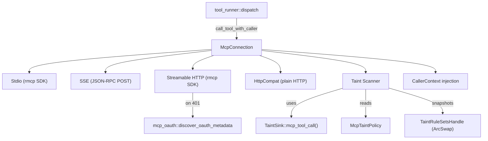

# Agent Runtime — librefang-runtime-mcp-src

# Agent Runtime — `librefang-runtime-mcp`

MCP (Model Context Protocol) client that connects the LibreFang agent runtime to external MCP servers. The module handles connection establishment, tool discovery, argument validation, outbound taint scanning, and secure tool invocation across four transport types.

## Architecture


```mermaid
graph TD
    Dispatch["tool_runner::dispatch"] -->|call_tool_with_caller| Conn["McpConnection"]
    Conn --> Stdio["Stdio (rmcp SDK)"]
    Conn --> SSE["SSE (JSON-RPC POST)"]
    Conn --> HTTP["Streamable HTTP (rmcp SDK)"]
    Conn --> Compat["HttpCompat (plain HTTP)"]
    Conn --> Taint["Taint Scanner"]
    Conn --> CallerCtx["CallerContext injection"]
    Taint -->|uses| TaintSink["TaintSink::mcp_tool_call()"]
    Taint -->|reads| Policy["McpTaintPolicy"]
    Taint -->|snapshots| RuleSets["TaintRuleSetsHandle (ArcSwap)"]
    HTTP -->|on 401| OAuth["mcp_oauth::discover_oauth_metadata"]
```

## Core Types

### `McpServerConfig`

Serializable configuration for a single MCP server connection. Key fields:

| Field | Purpose |
|---|---|
| `name` | Display name; used in tool namespacing (`mcp_{name}_{tool}`) |
| `transport` | Transport variant (`Stdio`, `Sse`, `Http`, `HttpCompat`) |
| `timeout_secs` | Per-call timeout (default: 60) |
| `env` | Environment variables for subprocess (`"KEY=VALUE"` or `"KEY"` to inherit) |
| `headers` | Extra HTTP headers for SSE/HTTP transports (`"Header-Name: value"`) |
| `taint_scanning` | Enable outbound credential scanning (default: `true`) |
| `taint_policy` | Fine-grained per-tool, per-path taint exemptions |
| `taint_rule_sets` | Hot-reloadable `ArcSwap<Vec<NamedTaintRuleSet>>` handle (never serialized) |
| `oauth_provider` | Optional `McpOAuthProvider` for automatic authentication |
| `roots` | Filesystem root directories advertised via MCP Roots capability |

The `taint_rule_sets` field uses `#[serde(skip)]` — it's constructed at runtime and cloned from a shared kernel `ArcSwap` so hot-reload of `[[taint_rules]]` config propagates without restarting MCP connections.

### `McpConnection`

An active, initialized connection to an MCP server. Owns the transport handle, discovered tool definitions, and the original-to-namespaced tool name mapping.

Construction is via `McpConnection::connect(config)` which performs the full handshake and tool discovery. Teardown is via `close()` (awaited) or `Drop` (best-effort async spawn).

### `McpTransport`

```rust
enum McpTransport {
    Stdio { command, args },       // Subprocess via rmcp SDK
    Sse { url },                   // HTTP POST with JSON-RPC
    Http { url },                  // Streamable HTTP (MCP 2025-03-26+)
    HttpCompat { base_url, headers, tools },  // Plain HTTP/JSON adapter
}
```

## Connection Lifecycle

### 1. Connect

`McpConnection::connect(config)` dispatches to a transport-specific connect method:

- **Stdio** (`connect_stdio`): Spawns a child process with sandboxed environment (only `SAFE_ENV_VARS` + declared `env` entries). Performs MCP handshake and `tools/list` via the rmcp SDK. Shell interpreters (`bash`, `sh`, `cmd`, etc.) are explicitly blocked — servers must specify a concrete runtime (`npx`, `node`, `python`). The child's stderr is drained in a background task (capped at 100 lines of 256 bytes each) to prevent pipe stalls.

- **SSE** (`connect_sse`): Creates a `reqwest::Client`, defers initialization and tool discovery to later `sse_initialize()` / `sse_discover_tools()` calls. SSE is unidirectional — no `roots` capability is declared.

- **Streamable HTTP** (`connect_streamable_http`): Uses the rmcp SDK's `StreamableHttpClientTransport`. On a 401, attempts OAuth metadata discovery and returns `Err("OAUTH_NEEDS_AUTH")` to defer the PKCE flow to the API layer. Roots are advertised only for local URLs.

- **HttpCompat** (`connect_http_compat`): Validates the static tool configuration, probes the base URL for reachability, and registers tools from config (no MCP handshake).

### 2. Register Tools

All discovered tools are namespaced via `format_mcp_tool_name(server, raw_name)` → `mcp_{server}_{tool}`. The mapping is stored in `original_names` so tool calls can resolve back to the raw name. MCP `annotations` (`readOnlyHint`, `destructiveHint`) are translated into a `metadata.tool_class` field on the schema for the runtime's tool classifier.

### 3. Call Tool

`call_tool_with_caller(name, arguments, caller)` is the primary invocation path, called from `tool_runner::dispatch`:

```
1. Resolve raw tool name (strip mcp_ prefix)
2. Schema validation (reject non-object args, missing required fields)
3. Taint scan arguments (if taint_scanning enabled)
4. Inject caller context (strip-then-set)
5. Dispatch to transport (Rmcp / SSE / HttpCompat)
6. Return text content or error
```

### 4. Close

`close()` cancels the rmcp service with a 10-second timeout, which kills the child subprocess (via `kill_on_drop(true)`). `Drop` performs a best-effort spawn of the same logic on the current tokio runtime. Callers doing hot-reload should prefer explicit `close()` to guarantee subprocess reaping before starting a new connection.

## Caller Context (#5699)

`CallerContext` carries kernel-attested identity (peer_id, channel, chat_id, session_id) that the agent cannot influence.

**Injection mechanism depends on transport:**

| Transport | Mechanism | Key |
|---|---|---|
| Rmcp (Stdio/HTTP) | `_librefang_caller` key in `arguments` object | `CALLER_CONTEXT_ARG_KEY` |
| SSE | `_librefang_caller` key in `arguments` object | `CALLER_CONTEXT_ARG_KEY` |
| HttpCompat | `X-Librefang-Caller` HTTP header | `CALLER_CONTEXT_HEADER` |

**Security invariant:** `inject_caller_into_arguments` always **strips** any agent-supplied `_librefang_caller` entry before setting the kernel value. Even when `caller` is `None`, the agent-supplied key is removed to prevent spoofing on context-blind legacy servers.

`CallerContext::from_parts()` returns `None` when all fields are absent, preserving byte-for-byte argument parity with pre-#5699 wire format for prompt-cache compatibility.

## Taint Scanner

The scanner walks every string leaf in the JSON argument tree before transmission to an out-of-process MCP server. This prevents an LLM from smuggling credentials (API keys, tokens, passwords) through tool-call arguments.

### Scanning Flow

```
scan_mcp_arguments_for_taint_with_policy(arguments, policy, rule_sets, tool_name)
  ├── Check tool default action: "skip" → bypass entirely
  ├── walk_taint() recursively over the JSON tree
  │   ├── String leaves → detect_outbound_text_violation_rules_with_skip()
  │   ├── Object keys → is_sensitive_key_name() check (authorization, api_key, secret, ...)
  │   ├── Arrays → recurse with indexed path (items[0], items[1], ...)
  │   └── Depth capped at MCP_TAINT_SCAN_MAX_DEPTH (64)
  └── Per-path skip rules from McpTaintPolicy applied before detection
```

### Policy Resolution

Three levels of control:

1. **Server-level**: `taint_scanning = false` disables scanning entirely for that server (escape hatch for trusted local servers).

2. **Tool-level**: `McpTaintToolPolicy.default = "skip"` bypasses scanning for a specific tool. Per-path `skip_rules` exempt individual `TaintRuleId`s at specific JSONPaths.

3. **Rule-set level**: Named `[[taint_rules]]` sets in config can downgrade `Block` to `Warn` or `Log` for specific rules. When multiple sets cover the same rule, the most permissive action wins (`Log > Warn > Block`).

The rule-set registry is read via `ArcSwap::load()` snapshot — stable for the duration of a single scan, immune to mid-walk config reloads.

### Sensitive Key Detection

Object keys matching `MCP_SENSITIVE_KEY_NAMES` (authorization, api_key, secret, password, etc.) with non-empty string values are blocked regardless of the value's shape. This catches patterns like `{"Authorization": "Bearer sk-..."}` where the value contains whitespace and wouldn't trip the text heuristic alone.

### JSONPath Matching

Skip rules and policy paths use a minimal JSONPath syntax: `$.a.b` for exact matches, `$.a.*` for wildcard children, `$.a[*]` for array element wildcards. Keys containing `.` or `[` cannot be addressed precisely — use broader patterns or the default rule set.

### Important Constraints

- The scanner returns **redacted** descriptions (JSON path only) — never the offending payload value.
- Non-string leaves (numbers, booleans, null) are skipped.
- Serialization failures in `CallerContext` never cause privilege escalation — the key is left absent and the server defaults to its no-caller branch.

## Environment Variable Handling

Stdio subprocesses receive a sandboxed environment:

1. `SAFE_ENV_VARS` — system essentials (PATH, HOME, LANG, etc.) and runtime-specific vars (NODE_PATH, PYTHONPATH, CARGO_HOME, etc.)
2. Declared `env` entries from server config, in `"KEY=VALUE"` or legacy `"KEY"` format

The `expand_env_vars()` function expands `$VAR` / `${VAR}` references in command arguments, but **only** for variables in the allowlist (safe system vars + declared env entries). This prevents templates from silently reading daemon secrets like `ANTHROPIC_API_KEY` (#3823).

`expand_leading_tilde()` handles `~/...` expansion for user-edited arguments (#4680).

## SSRF Protection

`check_ssrf()` is called for every HTTP-based transport during connect. It delegates to `mcp_oauth::is_ssrf_blocked_url_for_connect()` which:

- Parses the URL with the `url` crate (no substring matching)
- Rejects non-`http(s)` schemes, userinfo, cloud-metadata pivots (`169.254/16`, `100.64/0.0/10`, `metadata.google.internal`)
- Unwraps IPv4-mapped IPv6 and NAT64 `64:ff9b::/96` prefixes
- Allows loopback/RFC1918/LAN (legitimate for local MCP servers)

The stricter `is_ssrf_blocked_url` (which blocks all RFC1918/ULA) is used on the OAuth discovery/token-exchange path where hosts come from remote server responses.

## Response Size Protection

`read_response_bytes_capped()` streams HTTP responses chunk-by-chunk, rejecting anything exceeding `MAX_RESPONSE_BYTES` (16 MiB). Fast-path rejection via `Content-Length` header, streaming fallback for chunked transfer. Prevents OOM from malicious MCP servers (#3801).

## Tool Namespacing

All MCP tools are namespaced as `mcp_{server}_{tool}` where both names are lowercased with hyphens replaced by underscores (`normalize_name`).

Resolution helpers:

- `is_mcp_tool(name)` — checks for `mcp_` prefix
- `extract_mcp_server(name)` — **unreliable** for multi-segment server names; splits on first `_` only
- `resolve_mcp_server_from_known(name, server_names)` — **robust**; matches against known server names by longest prefix. Used by `tool_runner::dispatch`, `routes::agents`, `routes::tools_sessions`, and `kernel::mcp_summary`.

## OAuth Integration

The `mcp_oauth` submodule handles:

- **PKCE flow**: `generate_pkce()` creates S256 verifier/challenge pairs
- **Metadata discovery**: Three-tier resolution (WWW-Authenticate header → `.well-known/oauth-authorization-server` → config fallback) via `discover_oauth_metadata()`
- **Endpoint validation**: `validate_metadata_endpoints()` rejects cross-domain token endpoints and SSRF-targeting registration endpoints
- **Token storage**: `McpOAuthProvider` trait with `load_token()` / `store_token()` for cached tokens

On Streamable HTTP connect, a cached token is injected as a Bearer header. On 401, the error's `WWW-Authenticate` header is extracted via `extract_auth_header_from_error()` (downcasting through rmcp's type-erased error chain), and the connect returns `Err("OAUTH_NEEDS_AUTH")` for the API layer to drive the browser-based PKCE flow.

## Integration Points

| Caller | Usage |
|---|---|
| `tool_runner::dispatch` | `execute_tool_raw` calls `is_mcp_tool`, `resolve_mcp_server_from_known`, `CallerContext::from_parts`, `call_tool_with_caller` |
| `routes::tools_sessions` | `get_tool` / `list_tools` resolve server names for tool listing |
| `routes::agents` | `get_agent_mcp_servers` filters tools by server |
| `kernel::mcp_summary` | `render_mcp_summary` uses `normalize_name` and `resolve_mcp_server_from_known` |
| `routes::mcp_auth` | `auth_start` / `auth_callback` drive the OAuth PKCE flow |
| `tui::event` | `spawn_fetch_agent_mcp_servers` resolves servers for TUI display |