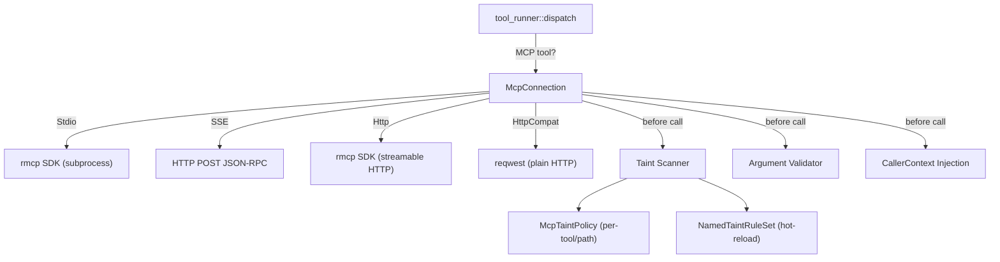

# Agent Runtime — librefang-runtime-mcp-src

# Agent Runtime — `librefang-runtime-mcp`

MCP (Model Context Protocol) client for connecting LibreFang agents to external tool servers. The module handles connection establishment, tool discovery, tool execution, and a set of security guardrails that sit between the LLM's tool-call output and the remote server.

## Architecture Overview


```mermaid
graph TD
    dispatch["tool_runner::dispatch"] -->|MCP tool?| conn["McpConnection"]
    conn -->|Stdio| rmcp["rmcp SDK (subprocess)"]
    conn -->|SSE| http_post["HTTP POST JSON-RPC"]
    conn -->|Http| rmcp_http["rmcp SDK (streamable HTTP)"]
    conn -->|HttpCompat| compat["reqwest (plain HTTP)"]

    conn -->|before call| taint["Taint Scanner"]
    conn -->|before call| validate["Argument Validator"]
    conn -->|before call| caller["CallerContext Injection"]

    taint --> policy["McpTaintPolicy (per-tool/path)"]
    taint --> rules["NamedTaintRuleSet (hot-reload)"]
```

## Connection Lifecycle

### 1. Configuration (`McpServerConfig`)

Each MCP server is declared in configuration and deserialized into `McpServerConfig`:

| Field | Purpose |
|---|---|
| `name` | Display name, used in tool namespacing (`mcp_{name}_{tool}`) |
| `transport` | One of four transport variants (see below) |
| `timeout_secs` | Per-call timeout (default: 60) |
| `env` | Environment variables passed to stdio subprocesses |
| `headers` | Extra HTTP headers for SSE/Streamable HTTP |
| `oauth_provider` / `oauth_config` | OAuth support for remote servers |
| `taint_scanning` | Enable outbound credential/PII scanning (default: true) |
| `taint_policy` | Fine-grained per-tool, per-path taint exemptions |
| `taint_rule_sets` | Hot-reloadable handle to named rule sets from `[[taint_rules]]` |
| `roots` | Filesystem root directories advertised via MCP Roots capability |

### 2. Connecting (`McpConnection::connect`)

`connect(config)` performs the full handshake and returns a ready-to-use `McpConnection`:

1. Validates and establishes the transport
2. Performs MCP `initialize` handshake (Stdio/Http transports via rmcp; SSE manually)
3. Discovers tools via `tools/list`
4. Registers all tools under namespaced names

### 3. Tool Execution (`call_tool_with_caller`)

Production dispatch in `tool_runner::dispatch` calls `call_tool_with_caller`, which:

1. Resolves the raw (un-namespaced) tool name
2. Validates arguments against the tool's JSON Schema (`validate_args_against_schema`)
3. Runs the taint scanner on the original agent-supplied arguments
4. Injects the kernel-attested `CallerContext` into a cloned copy of arguments
5. Dispatches to the appropriate transport

### 4. Teardown (`close` / `Drop`)

Call `close()` explicitly during hot-reload to await subprocess termination. `Drop` spawns a best-effort async close with a 10-second timeout as a safety net.

---

## Transport Types (`McpTransport`)

### `Stdio` — Subprocess via rmcp SDK

Spawns a child process and communicates over stdin/stdout using the rmcp SDK for proper MCP protocol handling.

Security measures:
- **Shell interpreter blocking**: `bash`, `sh`, `cmd`, `powershell`, etc. are rejected — operators must specify a concrete runtime (`npx`, `node`, `python`)
- **Path traversal rejection**: Commands containing `..` are rejected
- **Environment sandboxing**: The subprocess receives only safe system variables (`PATH`, `HOME`, etc.) plus variables explicitly declared in `env` — the daemon's own secrets (`ANTHROPIC_API_KEY`, etc.) are never leaked
- **`kill_on_drop(true)`**: The child is terminated when the connection closes
- **Stderr drainage**: Child stderr is read in a background task (capped at 100 lines × 256 bytes) to prevent pipe-buffer stalls

Environment variable expansion in args (`$HOME`, `${MY_VAR}`) is restricted to an allowlist built from `SAFE_ENV_VARS` + the server's declared `env` entries. Tilde expansion (`~/...`) resolves to the user's home directory.

### `Sse` — HTTP POST with JSON-RPC

Legacy Server-Sent Events transport using direct HTTP POST requests. The module manually constructs JSON-RPC 2.0 envelopes and manages request IDs.

- Performs `initialize` / `notifications/initialized` / `tools/list` manually
- Validates response `Content-Type` (must be `application/json` or `text/event-stream`)
- Verifies JSON-RPC response IDs match request IDs

### `Http` — Streamable HTTP (MCP 2025-03-26+)

Uses rmcp's `StreamableHttpClientTransport` for the modern Streamable HTTP protocol. Handles `Accept` header negotiation, `Mcp-Session-Id` tracking, and SSE stream parsing.

On 401 responses:
1. Extracts `WWW-Authenticate` header from the rmcp error chain
2. Discovers OAuth metadata via three-tier resolution (WWW-Authenticate → `/.well-known/oauth-authorization-server` → config fallback)
3. Returns `"OAUTH_NEEDS_AUTH"` error to signal the API layer to drive the PKCE flow

Filesystem roots are only advertised to local servers (determined by `is_local_url`).

### `HttpCompat` — Plain HTTP/JSON Adapter

A built-in compatibility layer for non-MCP HTTP backends. Tools are statically declared in configuration rather than discovered via `tools/list`.

Features:
- Path templates with `{param}` placeholders (percent-encoded)
- Configurable HTTP method (GET, POST, PUT, PATCH, DELETE)
- Request modes: JSON body, query string, or none
- Response modes: raw text or pretty-printed JSON
- Static or environment-derived headers

---

## Tool Namespacing

All MCP tools are prefixed to prevent collisions across servers:

```
mcp_{server}_{tool}
```

Where `server` and `tool` are normalized (lowercased, hyphens → underscores). For example, a server named `"GitHub"` exposing tool `"create_issue"` becomes `mcp_github_create_issue`.

Key functions:
- `format_mcp_tool_name(server, tool)` — builds the namespaced name
- `is_mcp_tool(name)` — checks the `mcp_` prefix
- `resolve_mcp_server_from_known(tool_name, server_names)` — robust reverse lookup using longest-prefix matching (handles server names containing underscores)
- `extract_mcp_server(tool_name)` — simple heuristic split (only reliable for single-word server names)

---

## Caller Context (#5699)

`CallerContext` carries kernel-attested identity of the entity that drove the current agent turn:

| Field | Source |
|---|---|
| `peer_id` | Channel peer (Telegram user ID, WhatsApp JID, etc.) |
| `channel` | Channel name (`"telegram"`, `"slack"`, etc.) |
| `chat_id` | Platform conversation ID |
| `session_id` | LibreFang `SessionId` string |

Built via `CallerContext::from_parts()` from `ToolExecContext` fields. Returns `None` when all signals are absent, preserving byte-for-byte payload parity for prompt-cache compatibility.

### Injection (Strip-then-Set)

The security boundary is a **strip-then-set** pattern:

1. The agent-supplied `_librefang_caller` key is **always removed** from arguments (even when no caller is present), preventing spoofing
2. The kernel-attested value is then inserted under the same key

Transport-specific injection:
- **Rmcp / SSE**: injected into the `arguments` object under `CALLER_CONTEXT_ARG_KEY` (`"_librefang_caller"`)
- **HttpCompat**: shipped as `CALLER_CONTEXT_HEADER` (`"X-Librefang-Caller"`) HTTP header, since the body is template-rendered

The taint scanner runs on the **original** agent-supplied arguments before injection, so a malicious agent cannot hide credential-shaped data behind the `_librefang_caller` key.

---

## Outbound Taint Scanning

Before any tool call reaches an MCP server, the arguments are scanned for credentials and PII using `scan_mcp_arguments_for_taint_with_policy`. This is a best-effort pattern-matching defense against LLM-driven credential exfiltration.

### Scanner Design

`walk_taint` recursively traverses the JSON argument tree (capped at `MCP_TAINT_SCAN_MAX_DEPTH` = 64 levels):

- **String leaves**: checked via `detect_outbound_text_violation_rules_with_skip` against `TaintSink::mcp_tool_call()`
- **Object keys**: keys matching `MCP_SENSITIVE_KEY_NAMES` (e.g., `authorization`, `api_key`, `password`) with non-empty string values are flagged as credential-shaped regardless of value content
- **Non-string leaves** (numbers, bools, null): skipped

Violation reports contain **only** the JSON path of the offending leaf — never the payload itself, since the error flows back to the LLM.

### Policy Configuration (`McpTaintPolicy`)

Three levels of control:

1. **Server-level kill switch**: `taint_scanning = false` disables scanning entirely (key-name blocking also disabled)
2. **Tool-level bypass**: `taint_policy.tools.{tool}.default = "skip"` bypasses all scanning for a specific tool
3. **Per-path exemptions**: `taint_policy.tools.{tool}.paths.{jsonpath}.skip_rules` disables specific rules at specific argument paths

JSONPath matching supports:
- Exact paths: `$.headers.authorization`
- Wildcards: `$.items.*`, `$.items[*]`
- Array index: `$.items[0]`

Limitation: object keys containing `.` or `[` cannot be precisely targeted.

### Rule Set Actions (`NamedTaintRuleSet`)

Named rule sets referenced from a tool's `rule_sets` field can downgrade the default `Block` action:

| Action | Behavior |
|---|---|
| `Block` | Call is rejected (default) |
| `Warn` | Call proceeds; `WARN`-level trace emitted |
| `Log` | Call proceeds; `INFO`-level trace emitted |

When multiple rule sets cover the same fired rule, the **most permissive** action wins (`Log` > `Warn` > `Block`). Unknown rule-set names trigger a once-per-process warning via `UNKNOWN_RULE_SET_WARNED`.

Rule sets are accessed through `TaintRuleSetsHandle` (`Arc<ArcSwap<Vec<NamedTaintRuleSet>>>`), enabling hot-reload: the kernel calls `.store()` on config reload; the scanner takes a `.load()` snapshot at scan time that remains stable for the entire walk.

---

## Argument Validation (`validate_args_against_schema`)

A lightweight pre-flight check before forwarding arguments to the MCP server:

1. If the schema declares `type: "object"`, rejects non-object arguments (arrays, scalars)
2. Checks the schema's `required` array against the provided argument keys

This is intentionally not a full JSON Schema validator — type correctness of individual fields, patterns, enums, `additionalProperties`, and nested validation remain delegated to the MCP server.

---

## Security Guardrails Summary

| Guardrail | Threat Mitigated |
|---|---|
| Taint scanning | LLM-driven credential/PII exfiltration to MCP servers |
| Caller context strip-then-set | Agent spoofing of kernel-attested identity |
| Environment sandboxing | Subprocess reading daemon secrets |
| SSRF protection (`check_ssrf`) | Pivot to cloud metadata / internal services |
| Response size cap (16 MiB) | OOM from malicious server responses |
| Shell interpreter blocking | Command injection via stdio transport |
| JSON-RPC ID verification | Response confusion from concurrent requests |
| Content-Type validation | Decoding proxy error pages as JSON-RPC |
| Argument validation | Server crashes from malformed input |

### SSRF Protection

`check_ssrf` delegates to `mcp_oauth::is_ssrf_blocked_url_for_connect`, which:
- Parses URLs with the `url` crate (no substring matching)
- Rejects non-`http(s)` schemes and userinfo in URLs
- Blocks cloud-metadata pivots: `0.0.0.0`, `169.254/16`, `100.64.0.0/10`, `192.0.0.192`, `metadata.google.internal`, etc.
- Unwraps IPv4-mapped IPv6 and NAT64 well-known prefixes before re-checking

Local addresses (`127.0.0.1`, `localhost`, `::1`) are allowed for MCP backend URLs (operator-configured), but blocked on the OAuth token-exchange path where hosts come from remote server responses.

### Response Size Capping

`read_response_bytes_capped` streams the response body chunk-by-chunk, aborting once the running total exceeds `MAX_RESPONSE_BYTES` (16 MiB). The `Content-Length` header is checked first as a fast path.

---

## MCP Protocol Versioning

`SUPPORTED_MCP_VERSIONS` lists `["2024-11-05", "2025-03-26"]`. The first entry is advertised in `initialize`; an unknown version from the server triggers a warning but does not abort the connection.

---

## Roots Capability

`RootsClientHandler` implements rmcp's `ClientHandler` trait to advertise filesystem root directories during the MCP handshake. Roots are converted to `file://` URIs (with proper percent-encoding and Windows drive-letter handling) and declared in client capabilities.

Roots are only advertised to:
- Stdio transports (local subprocesses)
- Streamable HTTP transports where `is_local_url` returns true

---

## Submodule: `mcp_oauth`

OAuth support for MCP servers requiring authentication. Provides:

- `discover_oauth_metadata` — three-tier resolution (WWW-Authenticate → well-known → config fallback)
- `McpOAuthProvider` trait — load/save tokens with vault integration
- `McpAuthState` — tracks authentication status per connection
- SSRF validation for OAuth endpoints (stricter than backend URL validation — blocks loopback and RFC1918)

The OAuth flow is API-driven: the daemon never opens a browser. On 401, it returns `"OAUTH_NEEDS_AUTH"` and the API layer drives the PKCE authorization code flow via the dashboard.

---

## Integration Points

### Upstream Callers

| Caller | Module | Function Used |
|---|---|---|
| Tool dispatch | `tool_runner::dispatch` | `call_tool_with_caller`, `CallerContext::from_parts`, `is_mcp_tool`, `resolve_mcp_server_from_known` |
| Agent routes | `routes::agents` | `resolve_mcp_server_from_known` |
| TUI events | `tui::event` | `resolve_mcp_server_from_known` |
| MCP summary | `kernel::mcp_summary` | `normalize_name`, `resolve_mcp_server_from_known` |
| OAuth routes | `routes::mcp_auth` | `discover_oauth_metadata`, `generate_state`, `is_ssrf_blocked_url` |

### Key Dependencies

- `rmcp` — MCP protocol SDK (Stdio and Streamable HTTP transports)
- `reqwest` — HTTP client (SSE and HttpCompat transports)
- `arc_swap` — Lock-free hot-reload of taint rule sets
- `librefang-types` — `TaintSink`, `ToolDefinition`, config types
- `librefang-http` — Proxied HTTP client builder
- `url` — URL parsing for SSRF checks and root URI construction