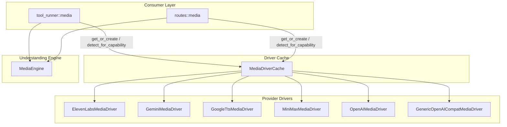

# Agent Runtime — librefang-runtime-media-src

# librefang-runtime-media

Provider-agnostic media generation and understanding — image generation, text-to-speech, video, music, image description, and audio transcription.

## Architecture



The module has two independent subsystems:

1. **Media generation** — `MediaDriver` trait implementations that call provider APIs to produce images, speech, video, and music.
2. **Media understanding** — `MediaEngine` that consumes media (images, audio, video) and produces text descriptions/transcriptions.

Both subsystems are consumed by `tool_runner::media` (agent tool functions) and `routes::media` (HTTP API routes).

---

## MediaDriver Trait

Defined in `lib.rs`. Each provider implements only the modalities it supports. Unimplemented methods return `MediaError::NotSupported` by default.

```rust
#[async_trait]
pub trait MediaDriver: Send + Sync {
    fn capabilities(&self) -> Vec<MediaCapability>;
    fn is_configured(&self) -> bool;
    fn provider_name(&self) -> &str;

    async fn generate_image(&self, request: &MediaImageRequest) -> Result<MediaImageResult, MediaError>;
    async fn synthesize_speech(&self, request: &MediaTtsRequest) -> Result<MediaTtsResult, MediaError>;
    async fn submit_video(&self, request: &MediaVideoRequest) -> Result<MediaVideoSubmitResult, MediaError>;
    async fn poll_video(&self, task_id: &str) -> Result<MediaTaskStatus, MediaError>;
    async fn get_video_result(&self, task_id: &str) -> Result<MediaVideoResult, MediaError>;
    async fn generate_music(&self, request: &MediaMusicRequest) -> Result<MediaMusicResult, MediaError>;
}
```

### Capability matrix

| Driver | Image | TTS | Video | Music |
|---|---|---|---|---|
| `ElevenLabsMediaDriver` | ✗ | ✓ | ✗ | ✗ |
| `GeminiMediaDriver` | ✓ | ✗ | ✗ | ✗ |
| `GoogleTtsMediaDriver` | ✗ | ✓ | ✗ | ✗ |
| `MiniMaxMediaDriver` | ✓ | ✓ | ✓ | ✓ |
| `OpenAIMediaDriver` | ✓ | ✓ | ✗ | ✗ |

---

## MediaDriverCache

Thread-safe, lazy-initializing cache backed by `DashMap<String, Arc<dyn MediaDriver>>`. Created once at boot and shared across the application.

### Construction

```rust
// No URL overrides — all providers use their hardcoded defaults
let cache = MediaDriverCache::new();

// With URL overrides from config.toml [provider_urls]
let cache = MediaDriverCache::new_with_urls(provider_urls_map);
```

### Driver resolution

`get_or_create(provider, base_url)` resolves the driver in this order:

1. **Explicit `base_url` parameter** — always wins.
2. **`provider_urls` map** — keyed by canonical provider name; aliases are resolved (e.g. `"google"` → `"gemini"`).
3. **Driver's hardcoded default** — each driver has a `DEFAULT_BASE_URL` constant.

The cache key is `"{provider}|{url_or_default}"`, so the same provider with different base URLs produces separate driver instances.

### Auto-detection

`detect_for_capability(capability)` iterates the `media_providers` list (populated from the provider registry at boot, with built-in providers appended as fallback) and returns the first driver where `is_configured()` returns `true` and `capabilities()` includes the requested capability.

### Hot-reload

`update_provider_urls(urls)` replaces the URL map and clears the cache so drivers are recreated on next access. `clear()` drops all cached instances.

---

## Provider Drivers

### ElevenLabsMediaDriver (`elevenlabs.rs`)

**Modality:** Text-to-speech only.

**API endpoint:** `POST {base_url}/text-to-speech/{voice_id}?output_format={format}`

**Auth:** `ELEVENLABS_API_KEY` env var, sent as `xi-api-key` header.

**Defaults:**
- Model: `eleven_multilingual_v2`
- Voice: Rachel (`21m00Tcm4TlvDq8ikWAM`)
- Output format: `mp3_44100_128`

**Voice ID validation.** The `validate_voice_id` function enforces that voice IDs are exactly 20 ASCII-alphanumeric characters. This closes a URL-path-injection vector on the `{voice_id}` path segment. Validation runs *before* the API key check so the agent sees the actionable `InvalidRequest` error before a generic `MissingKey`.

**Error echo truncation.** Rejected voice IDs are echoed in the error message, but truncated to 64 bytes (`VOICE_ID_ERROR_ECHO_MAX_BYTES`) to prevent a 10 kB malicious input from producing a 10 kB error string.

**Response size limit:** 25 MB (`MAX_AUDIO_RESPONSE_BYTES`). Checked both from `Content-Length` header and from the actual decoded body.

### GeminiMediaDriver (`gemini.rs`)

**Modality:** Image generation only (Imagen 3).

**API endpoint:** `POST {base_url}/v1beta/models/{model}:predict?key={api_key}`

**Auth:** `GEMINI_API_KEY` or `GOOGLE_API_KEY` env var, passed as `?key=` query parameter.

**Defaults:**
- Model: `imagen-3.0-generate-002`
- Sample count: capped at 4 per request

**Content filtering.** If the response contains no images and has a `raiFilteredReason` field, returns `MediaError::ContentFiltered` with the provider's reason string.

**Response size limit:** 10 MB per base64-encoded image; oversized images are skipped with a warning.

### GoogleTtsMediaDriver (`google_tts.rs`)

**Modality:** Text-to-speech only.

**API endpoint:** `POST {base_url}/text:synthesize?key={api_key}`

**Auth:** `GOOGLE_API_KEY` or `GOOGLE_CLOUD_API_KEY` env var.

**Defaults:**
- Voice: `en-US-Standard-F`
- Language: `en-US`
- Audio encoding: MP3 (mapped from format string)

**SSML detection.** The `build_input` function inspects the input text and automatically selects `ssml` or `text` input:
- Contains `<speak>` → used as-is with `ssml` input.
- Contains SSML-only tags (`<prosody`, `<emphasis`, `<say-as`, etc.) without `<speak>` → auto-wrapped in `<speak>...</speak>`.
- Otherwise → plain `text` input.

The `is_ssml` helper uses unambiguous SSML-only tags and requires paired closing tags or SSML-specific attributes to avoid false positives from HTML content.

**Audio encoding mapping:**
- `opus`/`ogg` → `OGG_OPUS`
- `wav`/`pcm`/`linear16` → `LINEAR16`
- Everything else → `MP3`

### MiniMaxMediaDriver (`minimax.rs`)

**Modalities:** Image, TTS, video, and music — the only driver supporting all four.

**Region-aware API key selection:**
- Base URL containing `minimaxi.com` (China endpoint) → prefers `MINIMAX_CN_API_KEY`.
- International endpoint → prefers `MINIMAX_API_KEY`.

**Error mapping.** MiniMax wraps errors in a `base_resp` object. `check_base_resp` maps status codes to structured `MediaError` variants:
- `1002` → `RateLimit`
- `1004` → `MissingKey`
- `1026`/`1027` → `ContentFiltered`
- `2013` → `InvalidRequest`

**Video generation** uses an async submit-poll pattern:
1. `submit_video` → returns `MediaVideoSubmitResult` with a task ID.
2. `poll_video` → returns `MediaTaskStatus` (pending/processing/succeeded/failed).
3. `get_video_result` → returns the final `MediaVideoResult`.

**Timeouts:** 180s for sync requests (music can take 60s+), 30s for video submit/poll.

### OpenAIMediaDriver (`openai.rs`)

Image generation and TTS. Also includes `GenericOpenAICompatMediaDriver` for user-defined providers with a custom `base_url` — used when `create_media_driver` encounters an unknown provider name that has a URL configured.

---

## MediaEngine (media_understanding.rs)

Consumes media attachments and produces text descriptions or transcriptions. Separate from the generation subsystem — `MediaEngine` does not implement `MediaDriver`.

### Provider selection

Each modality selects a **single** provider — no runtime cascade on failure:

| Method | Config field | Auto-detect priority |
|---|---|---|
| `describe_image` | `[media] image_provider` | Anthropic → OpenAI → Groq → Gemini |
| `transcribe_audio` | `[media] audio_provider` | Groq → OpenAI → Gemini → ElevenLabs → MiniMax → Fireworks → Together → SiliconFlow |
| `describe_video` | requires `GEMINI_API_KEY` | Gemini only |

### Concurrency control

A `Semaphore` clamps concurrency to `max_concurrency` (config value, clamped to 1–8). `process_attachments` spawns one task per attachment, each acquiring a permit before calling the provider.

### Image description providers

- **Anthropic** — base64 `image` block in Messages API.
- **OpenAI / Groq** — base64 data-URL in `image_url` content block via Chat Completions.
- **Gemini** — `inline_data` part via `generateContent`.

All providers receive the same prompt: "Describe this image in detail."

### Audio transcription providers

- **Whisper-compatible** (Groq, OpenAI, MiniMax, Fireworks, Together, SiliconFlow) — multipart `file` upload with `model` and `response_format=text`.
- **Gemini** — multimodal `generateContent` with audio `inline_data`.
- **ElevenLabs** — `POST /v1/speech-to-text` with multipart upload.
- **Custom/self-hosted** — configurable via `[media.custom_stt]` in `config.toml`.

### Model resolution for transcription

```
[media] audio_model (explicit override)
  ↓ if absent
[media.custom_stt] model (custom providers ONLY — guarded against leaking into built-in providers)
  ↓ if absent
default_audio_model(provider) (per-provider hardcoded default)
```

The `custom_stt_model_ref` function returns `None` for all built-in provider names, ensuring an operator's `[media.custom_stt] model = "large-v3"` never overrides Groq's default, for example.

### .oga → .ogg transcoding

Telegram voice notes arrive as `.oga`/`audio/oga`, which Whisper rejects. `transcode_oga_to_ogg_opus` re-encodes via ffmpeg stdin→stdout (no scratch files). Requirements:
- `ffmpeg` on `PATH`.
- 30-second wall-clock timeout with explicit child kill + reap on timeout.

### Security: API key sanitization

Error messages returned to callers contain only HTTP status codes — never response bodies, URLs, or reqwest error displays. Full diagnostics go to `tracing::warn` for operator logs. This prevents provider error responses (which may echo request envelopes) from leaking into the LLM prompt.

---

## MediaError

```rust
pub enum MediaError {
    NotSupported(String),
    MissingKey(String),
    Http(String),
    Api { status: u16, message: String },
    RateLimit(String),
    ContentFiltered(String),
    InvalidRequest(String),
    TaskNotFound(String),
    Other(String),
}
```

All variants implement `Display` and `std::error::Error`.

---

## Provider Registry

`create_media_driver(provider, base_url)` is the factory function:

- Known providers (`elevenlabs`, `gemini`/`google`, `minimax`, `openai`, `google_tts`) → concrete driver types.
- Unknown provider with a `base_url` → `GenericOpenAICompatMediaDriver`.
- Unknown provider without a `base_url` → `MediaError::InvalidRequest` with a message directing the operator to set `provider_urls.{name}` in config.

---

## Utility Functions

### `safe_truncate_str`

```rust
pub(crate) fn safe_truncate_str(s: &str, max_bytes: usize) -> &str
```

UTF-8-safe byte-boundary truncation. Duplicated from `librefang_runtime::str_utils` to avoid a cross-crate dependency for a <10 LOC function.

### `parse_output_format` (elevenlabs.rs)

Parses ElevenLabs format strings like `"mp3_44100_128"` into `(format: "mp3", sample_rate: Some(44100))`.

### `build_input` / `is_ssml` (google_tts.rs)

SSML detection heuristics. See [GoogleTtsMediaDriver](#googlettsmediadriver-googlettsrs) above for details.

---

## Configuration Reference

### Environment variables

| Variable | Used by | Notes |
|---|---|---|
| `ELEVENLABS_API_KEY` | ElevenLabs TTS, ElevenLabs STT | |
| `GEMINI_API_KEY` | Gemini image gen, Gemini vision, Gemini STT | Fallback for `GOOGLE_API_KEY` |
| `GOOGLE_API_KEY` | Gemini image gen, Google Cloud TTS, Gemini vision | |
| `GOOGLE_CLOUD_API_KEY` | Google Cloud TTS | Secondary fallback |
| `OPENAI_API_KEY` | OpenAI image/TTS, OpenAI vision, OpenAI STT | |
| `GROQ_API_KEY` | Groq vision, Groq STT | |
| `MINIMAX_API_KEY` | MiniMax all modalities | International endpoint |
| `MINIMAX_CN_API_KEY` | MiniMax all modalities | China endpoint |
| `FIREWORKS_API_KEY` | Fireworks STT | |
| `TOGETHER_API_KEY` | Together STT | |
| `SILICONFLOW_API_KEY` | SiliconFlow STT | |

### config.toml sections

```toml
[media]
image_provider = "anthropic"     # explicit provider for image description
audio_provider = "groq"          # explicit provider for audio transcription
image_model = "gpt-4o"          # override vision model
audio_model = "whisper-large-v3" # override STT model for built-in providers
max_concurrency = 4             # bounded 1–8

[provider_urls]
minimax = "https://api.minimaxi.com/v1"  # China endpoint override

[media.custom_stt]
base_url = "http://localhost:8080/v1/audio/transcriptions"
api_key_env = "LOCAL_WHISPER_KEY"
key_required = false
model = "large-v3"
```

---

## Testing Notes

- Tests that mutate `ELEVENLABS_API_KEY` use `#[serial_test::serial(elevenlabs_api_key)]` to prevent concurrent env-var races.
- ffmpeg-dependent tests (`transcode_oga_smoke`, etc.) skip gracefully when ffmpeg is not on `PATH`.
- `default_voice_id_matches_shape_invariant` ensures the hardcoded default voice ID passes the same validation applied to user input — a compile-time-ish invariant guard.
- `custom_stt_model_ref_does_not_leak_into_builtin_providers` explicitly enumerates all built-in provider names to verify the isolation guard.