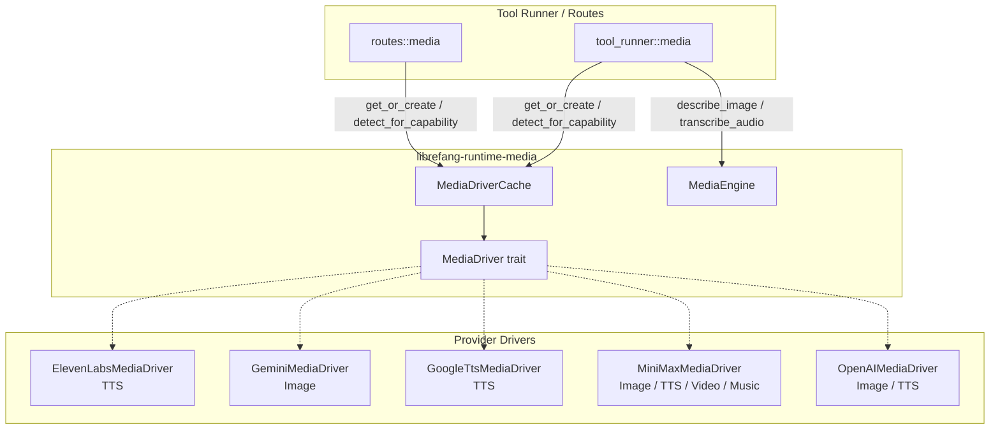

# Agent Runtime — librefang-runtime-media-src

# librefang-runtime-media

Provider-agnostic media generation and understanding layer. Implements a trait-based driver abstraction for image generation, text-to-speech, video generation, and music generation across multiple cloud providers, plus a media understanding engine for image description and audio transcription.

## Architecture



The module is split into two subsystems:

- **Media generation** — `MediaDriver` trait + per-provider implementations + `MediaDriverCache`. Used by tool runners and API routes to produce audio, images, video, and music.
- **Media understanding** — `MediaEngine`. Used by the runtime to describe images, transcribe audio, and analyze video sent as attachments.

## MediaDriver Trait

Defined in `lib.rs`. Each provider implements only the modalities it supports. Unimplemented methods return `MediaError::NotSupported` by default.

```rust
#[async_trait]
pub trait MediaDriver: Send + Sync {
    fn capabilities(&self) -> Vec<MediaCapability>;
    fn is_configured(&self) -> bool;
    fn provider_name(&self) -> &str;

    async fn generate_image(&self, _: &MediaImageRequest) -> Result<MediaImageResult, MediaError>;
    async fn synthesize_speech(&self, _: &MediaTtsRequest) -> Result<MediaTtsResult, MediaError>;
    async fn submit_video(&self, _: &MediaVideoRequest) -> Result<MediaVideoSubmitResult, MediaError>;
    async fn poll_video(&self, _: &str) -> Result<MediaTaskStatus, MediaError>;
    async fn get_video_result(&self, _: &str) -> Result<MediaVideoResult, MediaError>;
    async fn generate_music(&self, _: &MediaMusicRequest) -> Result<MediaMusicResult, MediaError>;
}
```

### Capability matrix

| Provider | Image | TTS | Video | Music |
|---|---|---|---|---|
| `openai` | ✅ | ✅ | — | — |
| `gemini` | ✅ | — | — | — |
| `elevenlabs` | — | ✅ | — | — |
| `google_tts` | — | ✅ | — | — |
| `minimax` | ✅ | ✅ | ✅ | ✅ |

## MediaError

All driver errors flow through a single enum:

| Variant | Meaning |
|---|---|
| `NotSupported` | Modality not implemented by this provider |
| `MissingKey` | Required API key env var not set |
| `Http` | Network / request failure |
| `Api { status, message }` | Provider returned non-2xx; `message` is truncated to 500 bytes |
| `RateLimit` | Provider-specific rate limit hit |
| `ContentFiltered` | Safety filter rejected the request |
| `InvalidRequest` | Bad parameters (e.g. malformed voice ID) |
| `TaskNotFound` | Async task ID doesn't exist |
| `Other` | Catch-all |

## MediaDriverCache

Thread-safe lazy-initializing cache (`DashMap<String, Arc<dyn MediaDriver>>`) that:

1. **Resolves base URLs** — explicit `base_url` argument > `provider_urls` config map > driver hardcoded default. Alias resolution maps `"google"` → `"gemini"` for URL lookups.
2. **Caches by composite key** — `"{provider}|{url}"` — so the same provider with different base URLs produces separate driver instances.
3. **Supports hot-reload** — `update_provider_urls()` replaces the URL map and clears the cache; `load_providers_from_registry()` rebuilds the ordered provider list from TOML registry data.

### Auto-detection

`detect_for_capability(capability)` iterates the ordered provider list and returns the first driver where `is_configured()` returns `true` and `capabilities()` includes the requested capability. Used by tool runners when the caller doesn't specify a provider.

### Unknown providers

If a provider name doesn't match a built-in driver but has a `base_url`, `create_media_driver` falls back to `GenericOpenAICompatMediaDriver` — an OpenAI-compatible shim that reads `{PROVIDER}_API_KEY` from the environment.

## Provider Implementations

### ElevenLabs (`elevenlabs.rs`)

- **Capability**: TTS only
- **Endpoint**: `POST {base_url}/text-to-speech/{voice_id}?output_format={format}`
- **Auth**: `ELEVENLABS_API_KEY` env var, sent as `xi-api-key` header
- **Default model**: `eleven_multilingual_v2`, voice: Rachel (`21m00Tcm4TlvDq8ikWAM`), format: `mp3_44100_128`
- **Voice ID validation**: Enforces exactly 20 ASCII-alphanumeric characters. This closes URL-path-injection vectors on the `{voice_id}` URL segment. Validation runs **before** API key lookup so agents see the actionable `InvalidRequest` error over a generic `MissingKey`.
- **Error echo capping**: Malformed voice IDs are truncated to 64 bytes in error messages to prevent multi-kilobyte echo-back.
- **Response size limit**: 25 MB

### Gemini (`gemini.rs`)

- **Capability**: Image generation via Imagen 3
- **Endpoint**: `POST {base_url}/v1beta/models/{model}:predict?key={api_key}`
- **Auth**: `GEMINI_API_KEY` or `GOOGLE_API_KEY` env var, passed as `?key=` query param
- **Default model**: `imagen-3.0-generate-002`
- **Aspect ratios**: `"1:1"`, `"3:4"`, `"4:3"`, `"9:16"`, `"16:9"`
- **Response**: Base64-encoded images in `predictions[].bytesBase64Encoded`, capped at 10 MB each
- **Content filtering**: Detects `raiFilteredReason` in the response and returns `MediaError::ContentFiltered`

### Google Cloud TTS (`google_tts.rs`)

- **Capability**: TTS
- **Endpoint**: `POST {base_url}/text:synthesize?key={api_key}`
- **Auth**: `GOOGLE_API_KEY` or `GOOGLE_CLOUD_API_KEY`
- **Default voice**: `en-US-Standard-F`, language: `en-US`
- **SSML detection**: `build_input()` automatically detects SSML markup and wraps partial SSML in `<speak>` tags. The `is_ssml()` helper distinguishes SSML-only tags (e.g. `<prosody>`, `<emphasis>`) from similar HTML tags using attribute requirements (e.g. `<sub alias=...>` vs `<sub>` plain HTML).
- **Audio encoding**: Maps format strings to Google Cloud TTS encoding values — `"mp3"` → `MP3`, `"opus"/"ogg"` → `OGG_OPUS`, `"wav"/"pcm"/"linear16"` → `LINEAR16`
- **Response**: Base64-decoded `audioContent`, with a pre-decode size check (base64 expands ~33%)

### MiniMax (`minimax.rs`)

- **Capabilities**: Image, TTS, Video, Music — full modality support
- **Auth**: `MINIMAX_API_KEY` (international) or `MINIMAX_CN_API_KEY` (China endpoint at `api.minimaxi.com`). Region is auto-detected from the base URL.
- **Error handling**: `check_base_resp()` maps MiniMax status codes to typed errors — `1002` → `RateLimit`, `1026/1027` → `ContentFiltered`, `2013` → `InvalidRequest`
- **Video**: Async submit/poll pattern — `submit_video()` returns a task ID, `poll_video()` checks status, `get_video_result()` fetches the final result
- **Timeout**: 180s for sync requests (music generation is slow), 30s for video poll operations

### OpenAI (`openai.rs`)

- **Capabilities**: Image generation, TTS
- **Auth**: `OPENAI_API_KEY` env var
- **Image**: `POST /v1/images/generations` (DALL-E models)
- **TTS**: `POST /v1/audio/speech` with real-time streaming response
- **Generic compat**: `GenericOpenAICompatMediaDriver` wraps any OpenAI-compatible endpoint for unknown provider names that have a configured `base_url`

## MediaEngine

The understanding engine (`media_understanding.rs`) handles image description, audio transcription, and video analysis.

### Provider selection

Each modality selects a **single** provider — there is no runtime fallback cascade:

- **Image description**: `[media] image_provider` config, or auto-detect from env vars in priority order: Anthropic → OpenAI → Groq → Gemini.
- **Audio transcription**: `[media] audio_provider` config, or auto-detect: Groq → OpenAI → Gemini → ElevenLabs → MiniMax → Fireworks → Together → SiliconFlow.
- **Video description**: Gemini only, gated by `[media] video_description = true` config flag.

Auto-detected providers log a warning advising operators to set the explicit config for reproducible behavior.

### Image description providers

| Provider | Protocol | Model default |
|---|---|---|
| Anthropic | Messages API with base64 image block | `claude-sonnet-4-20250514` |
| OpenAI / Groq | Chat Completions with data-URL image | `gpt-4o` / `meta-llama/llama-4-scout-17b-16e-instruct` |
| Gemini | `generateContent` with `inline_data` part | `gemini-2.5-flash` |

### Audio transcription providers

| Provider | Protocol | Model default |
|---|---|---|
| Groq, OpenAI, MiniMax, Fireworks, Together, SiliconFlow | OpenAI Whisper multipart (`/v1/audio/transcriptions`) | Varies by provider |
| Gemini | `generateContent` with audio `inline_data` | `gemini-2.0-flash` |
| ElevenLabs | `/v1/speech-to-text` multipart | `scribe_v1` |
| Custom / self-hosted | OpenAI Whisper-compatible multipart via `[media.custom_stt]` config | `whisper-1` |

### Custom STT configuration

The `[media.custom_stt]` config section enables self-hosted Whisper endpoints:

```toml
[media.custom_stt]
base_url = "http://localhost:8080/v1/audio/transcriptions"
api_key_env = "LOCAL_WHISPER_KEY"   # optional — omit for keyless servers
key_required = false                # true → hard error if env var missing
model = "large-v3"                  # only used for custom providers, NOT built-in ones
```

The `custom_stt_model_ref()` guard ensures `custom_stt.model` never overrides a built-in provider's default model.

### Audio format handling

- `mime_to_ext()` maps MIME types to file extensions for Whisper format detection
- **`.oga` / `audio/oga` transcode**: Telegram voice notes arrive as `.oga`, which Whisper rejects. `transcode_oga_to_ogg_opus()` re-packetises via `ffmpeg` stdin→stdout (no scratch files, 30s timeout, explicit child kill on timeout). Requires `ffmpeg` on `PATH`.

### Concurrency

`MediaEngine` uses a `Semaphore` clamped to `max_concurrency` (1–8, default 2). `process_attachments()` spawns one task per attachment, each acquiring a permit.

### Security

- **API key sanitization**: Error messages returned to the agent/bridge are sanitized — full response bodies and reqwest error details are logged (operator-visible) but not surfaced to the LLM prompt. Gemini's `?key=` URL parameter is never echoed into error strings.
- **Empty auth header**: Custom STT endpoints with no `api_key_env` send requests without an `Authorization` header rather than an empty `Bearer ` token.

## Configuration

The module reads from `MediaConfig` (defined in `librefang-types::media`):

| Field | Default | Purpose |
|---|---|---|
| `image_description` | `true` | Enable/disable image description |
| `audio_transcription` | `true` | Enable/disable audio transcription |
| `video_description` | `false` | Enable/disable video description |
| `image_provider` | auto-detect | Explicit vision LLM provider |
| `audio_provider` | auto-detect | Explicit STT provider |
| `image_model` | per-provider default | Override vision model |
| `audio_model` | per-provider default | Override STT model |
| `max_concurrency` | 2 | Max parallel media operations |
| `custom_stt` | empty | Self-hosted Whisper endpoint config |

Provider base URL overrides come from `config.provider_urls` (passed to `MediaDriverCache::new_with_urls`).

## Integration Points

The module is consumed by:

- **`tool_runner::media`** — `tool_text_to_speech`, `tool_image_generate`, `tool_video_generate`, `tool_music_generate`, `tool_video_status`. These call either `get_or_create(provider, None)` for explicit provider selection or `detect_for_capability(capability)` for auto-detection.
- **`routes::media`** — REST endpoints for media generation and video polling, using `resolve_driver()` which calls `get_or_create` or `detect_for_capability`.

Both subsystems use `librefang_http::proxied_client()` for all outbound HTTP requests, ensuring consistent proxy configuration.