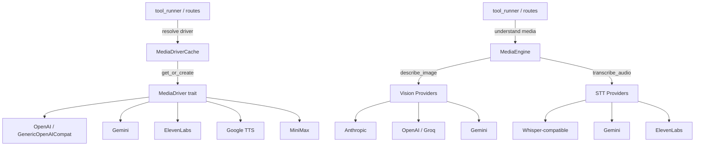

# Agent Runtime — librefang-runtime-media-src

# librefang-runtime-media

Provider-agnostic media generation and understanding for the Agent Runtime. This crate abstracts over multiple third-party APIs — OpenAI, Gemini, ElevenLabs, Google Cloud TTS, and MiniMax — behind two core surfaces:

- **`MediaDriver`** — generate images, speech, video, and music.
- **`MediaEngine`** — describe images, transcribe audio, and analyze video.

Both surfaces are consumed by `src/tool_runner/media.rs` (agent tool calls) and `src/routes/media.rs` (HTTP API endpoints).

## Architecture



## Core Trait: `MediaDriver`

Defined in `src/lib.rs`. Each provider implements only the modalities it supports; unimplemented methods return `MediaError::NotSupported` by default.

```rust
#[async_trait]
pub trait MediaDriver: Send + Sync {
    fn capabilities(&self) -> Vec<MediaCapability>;
    fn is_configured(&self) -> bool;
    fn provider_name(&self) -> &str;

    async fn generate_image(&self, request: &MediaImageRequest) -> Result<MediaImageResult, MediaError>;
    async fn synthesize_speech(&self, request: &MediaTtsRequest) -> Result<MediaTtsResult, MediaError>;
    async fn submit_video(&self, request: &MediaVideoRequest) -> Result<MediaVideoSubmitResult, MediaError>;
    async fn poll_video(&self, task_id: &str) -> Result<MediaTaskStatus, MediaError>;
    async fn get_video_result(&self, task_id: &str) -> Result<MediaVideoResult, MediaError>;
    async fn generate_music(&self, request: &MediaMusicRequest) -> Result<MediaMusicResult, MediaError>;
}
```

### Provider Capabilities Matrix

| Provider | Image | TTS | Video | Music | Env var(s) |
|---|---|---|---|---|---|
| `openai` | ✅ | ✅ | ❌ | ❌ | `OPENAI_API_KEY` |
| `gemini` | ✅ | ❌ | ❌ | ❌ | `GEMINI_API_KEY` or `GOOGLE_API_KEY` |
| `elevenlabs` | ❌ | ✅ | ❌ | ❌ | `ELEVENLABS_API_KEY` |
| `google_tts` | ❌ | ✅ | ❌ | ❌ | `GOOGLE_API_KEY` or `GOOGLE_CLOUD_API_KEY` |
| `minimax` | ✅ | ✅ | ✅ | ✅ | `MINIMAX_API_KEY` or `MINIMAX_CN_API_KEY` |

## Driver Cache: `MediaDriverCache`

Thread-safe, lazy-initializing cache backed by `DashMap`. Lives across the lifetime of the kernel and is shared by all tool runners and HTTP route handlers.

### Construction

```rust
// No URL overrides
let cache = MediaDriverCache::new();

// With custom base URLs from config [provider_urls]
let cache = MediaDriverCache::new_with_urls(my_url_map);
```

### Driver Resolution Flow

`get_or_create(provider, base_url)` resolves a driver as follows:

1. **Explicit `base_url`** argument takes highest priority.
2. Falls back to the `provider_urls` map (sourced from `config.toml` `[provider_urls]`).
3. Falls back to the provider's hardcoded default URL.
4. Cache key is `"{provider}|{url_or_default}"` — same provider with different URLs yields separate driver instances.
5. Unknown providers with a configured `base_url` are dispatched to `GenericOpenAICompatMediaDriver`.

### Auto-Detection: `detect_for_capability`

Iterates the `media_providers` list (built-in order or loaded from registry via `load_providers_from_registry`) and returns the first driver that is both configured (API key present) and supports the requested capability. Used by tool runners when no explicit provider is specified.

### Alias Handling

`"google"` is treated as an alias for `"gemini"` during URL lookup.

### Hot-Reload

- `update_provider_urls(urls)` — replaces the URL map and clears the cache so drivers are recreated on next access.
- `clear()` — drops all cached driver instances.

## Provider Implementations

### OpenAI (`openai`)

Supports image generation (DALL·E 3) and TTS via standard OpenAI endpoints. Also provides `GenericOpenAICompatMediaDriver` for user-defined providers that expose an OpenAI-compatible API.

### Gemini (`gemini`)

Image generation via Imagen 3. Calls `POST /v1beta/models/{model}:predict` with `?key=` auth. Checks for RAI content filtering in responses (`raiFilteredReason`).

### ElevenLabs (`elevenlabs`)

TTS via `POST /v1/text-to-speech/{voice_id}`. Key security detail: the `voice_id` is interpolated directly into the URL path, so it is validated before the HTTP call:

- Must be exactly 20 ASCII-alphanumeric characters (matches the ElevenLabs OpenAPI spec).
- Rejects path traversal (`../../`), query-string injection (`?`), slashes, and non-ASCII.
- Error messages echo at most `VOICE_ID_ERROR_ECHO_MAX_BYTES` (64) bytes of the input to prevent multi-kilobyte echo-back from malicious inputs.

Validation runs **before** the API key check so that malformed voice IDs produce actionable `InvalidRequest` errors rather than generic `MissingKey` errors.

### Google Cloud TTS (`google_tts`)

TTS via `POST /v1/text:synthesize`. Features automatic SSML detection:

- Text containing `<speak>` is sent as SSML directly.
- Text with SSML-only tags (e.g. `<prosody`, `<emphasis`, `<say-as`) but no `<speak>` wrapper is auto-wrapped.
- Plain text is sent as-is.

The `is_ssml()` heuristic is conservative: ambiguous tags like `<sub>` and `<mark>` require SSML-specific attributes (`alias=`, `name=`) to avoid false positives on HTML content.

Audio encoding mapping: `mp3` → `MP3`, `opus`/`ogg` → `OGG_OPUS`, `wav`/`pcm`/`linear16` → `LINEAR16`.

### MiniMax (`minimax`)

Full-spectrum provider — image, TTS, video, and music. Detects China region (`api.minimaxi.com` with extra "i") and selects `MINIMAX_CN_API_KEY` accordingly.

Video generation is asynchronous: `submit_video` returns a `task_id`; poll via `poll_video` with statuses `Preparing` → `Queueing` → `Processing` → `Success`/`Fail`.

MiniMax responses use a `base_resp` envelope with `status_code`/`status_msg`. Known codes are mapped to typed errors:
- `1002` → `RateLimit`
- `1004` → `MissingKey`
- `1026`/`1027` → `ContentFiltered`
- `2013` → `InvalidRequest`

## Media Understanding: `MediaEngine`

Defined in `media_understanding.rs`. Processes media attachments (images, audio, video) to produce text descriptions and transcriptions. Bounded by a `Semaphore` (`max_concurrency`, clamped to 1–8).

### Provider Selection

No runtime cascade — exactly one provider is chosen per call:

1. Explicit `[media]` config (`image_provider` / `audio_provider`) if set.
2. Otherwise, auto-detected from environment variable presence (priority order varies by modality).
3. If the chosen provider errors, that error surfaces directly — no fallback.

**Vision priority:** Anthropic → OpenAI → Groq → Gemini

**STT priority:** Groq → OpenAI → Gemini → ElevenLabs → MiniMax → Fireworks → Together → SiliconFlow

### Image Description (`describe_image`)

Accepts file path or base64 source (URL sources are rejected). Reads bytes, base64-encodes, and dispatches to the configured provider's multimodal endpoint:

- **Anthropic:** Messages API with `image` content block
- **OpenAI / Groq:** Chat Completions with `image_url` data-URL block
- **Gemini:** `generateContent` with `inline_data` part

Default models per provider: `claude-sonnet-4-20250514`, `gpt-4o`, `meta-llama/llama-4-scout-17b-16e-instruct`, `gemini-2.5-flash`.

### Audio Transcription (`transcribe_audio`)

Accepts file path or base64 source. Derives file extension from MIME type. For Whisper-compatible providers, audio is sent as multipart form data. For Gemini and ElevenLabs, audio is sent as base64 in JSON.

**`.oga` / Telegram voice note handling:** These arrive as `audio/oga` which Whisper rejects. The engine detects this and re-encodes to Ogg/Opus via `ffmpeg` (stdin → stdout, no disk files). Requires `ffmpeg` on `PATH`. 30-second wall-clock timeout with explicit child kill on expiry.

### Batch Processing (`process_attachments`)

Spawns a tokio task per attachment, bounded by the engine's semaphore. Skips media types disabled in config (`image_description`, `audio_transcription`, `video_description`).

## Error Type: `MediaError`

```rust
pub enum MediaError {
    NotSupported(String),
    MissingKey(String),
    Http(String),
    Api { status: u16, message: String },
    RateLimit(String),
    ContentFiltered(String),
    InvalidRequest(String),
    TaskNotFound(String),
    Other(String),
}
```

API error messages from providers are truncated to 500 bytes via `safe_truncate_str` (char-boundary-safe UTF-8 truncation) before being embedded in `MediaError` variants, preventing multi-megabyte error bodies from propagating.

## Environment Variables Reference

| Variable | Provider | Notes |
|---|---|---|
| `OPENAI_API_KEY` | openai, vision, STT | |
| `GEMINI_API_KEY` | gemini, vision, STT | Fallback: `GOOGLE_API_KEY` |
| `GOOGLE_API_KEY` | gemini, google_tts | Shared with Gemini |
| `GOOGLE_CLOUD_API_KEY` | google_tts | Secondary for Google TTS |
| `ELEVENLABS_API_KEY` | elevenlabs, STT | |
| `MINIMAX_API_KEY` | minimax | International endpoint |
| `MINIMAX_CN_API_KEY` | minimax | China endpoint (preferred when `is_china`) |
| `GROQ_API_KEY` | vision, STT | |
| `ANTHROPIC_API_KEY` | vision | |
| `FIREWORKS_API_KEY` | STT | Whisper-compatible |
| `TOGETHER_API_KEY` | STT | Whisper-compatible |
| `SILICONFLOW_API_KEY` | STT | Whisper-compatible |

## Adding a New Provider

1. Create a new submodule (e.g. `src/my_provider.rs`).
2. Implement the `MediaDriver` trait. Only implement methods for supported modalities — defaults return `NotSupported`.
3. Add the constructor to `create_media_driver` in `src/lib.rs`.
4. Append the provider name to the `media_providers` default list in `MediaDriverCache::new` and `new_with_urls`.
5. Add any required env var to the table above.