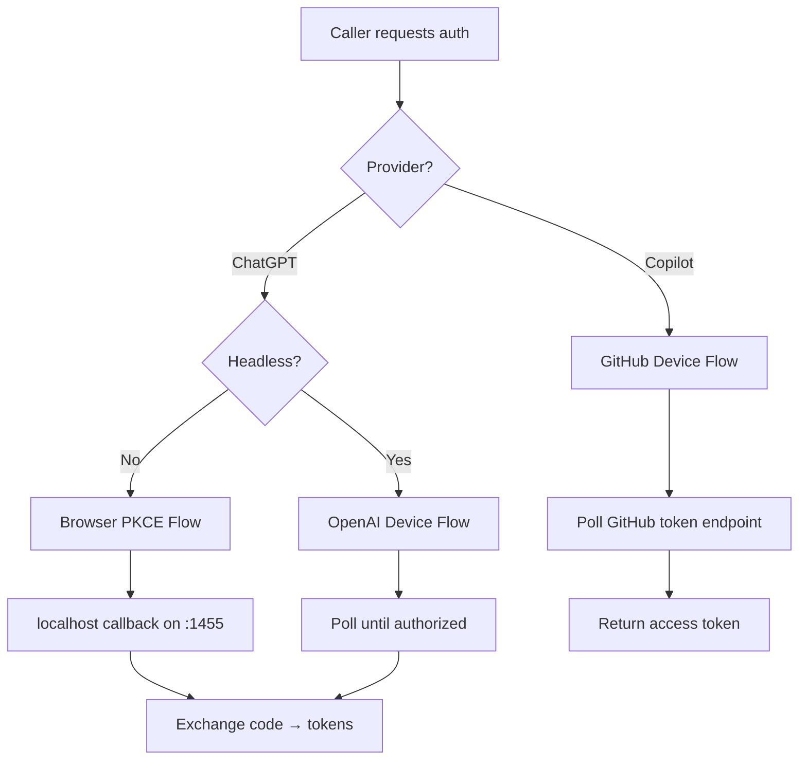

# Agent Runtime — librefang-runtime-oauth-src

# librefang-runtime-oauth

OAuth 2.0 authentication runtime for LibreFang, providing authentication flows for **ChatGPT/OpenAI** and **GitHub Copilot**. The crate implements browser-based authorization with PKCE, headless device-auth flows, token refresh, and model discovery.

## Module Structure

```
librefang-runtime-oauth/
├── lib.rs               # Re-exports chatgpt_oauth and copilot_oauth
├── chatgpt_oauth.rs     # OpenAI Codex OAuth (browser + device flow)
└── copilot_oauth.rs     # GitHub Copilot OAuth (device flow)
```

## Authentication Flows

The crate provides three distinct authentication paths. Callers choose based on the provider and environment:



## ChatGPT OAuth (`chatgpt_oauth`)

### Browser PKCE Flow

For environments with a browser available. Opens the user's browser to OpenAI's authorization endpoint and waits for a callback on `127.0.0.1:1455`.

**Flow:**

1. **`start_oauth_flow()`** — Binds a TCP socket on port 1455 (matching OpenAI's registered redirect URI), generates a PKCE challenge via `generate_pkce()`, creates a random state via `create_state()`, and builds the full authorization URL. Returns `(auth_url, port, pkce_verifier, state)`. The caller should open `auth_url` in the user's browser.

2. **`run_oauth_callback_server(port, expected_state)`** — Starts an async HTTP server that listens for `GET /auth/callback?code=...&state=...`. Validates the `state` parameter against `expected_state` to prevent CSRF, extracts the authorization code, and sends it through a oneshot channel. Serves a success or error HTML page to the browser. Times out after 5 minutes (`AUTH_TIMEOUT_SECS`).

3. **`exchange_code_for_tokens(code, code_verifier, port)`** — Posts the authorization code, PKCE verifier, and redirect URI to OpenAI's token endpoint. Returns a `ChatGptAuthResult` containing the access token, optional refresh token, and expiration.

### Device Auth Flow

For headless or remote environments where opening a browser is impractical.

**Flow:**

1. **`start_device_auth_flow()`** — POSTs to OpenAI's device auth endpoint to obtain a `DeviceAuthPrompt` containing a `device_auth_id`, `user_code`, and recommended poll interval. The user must visit `DEVICE_AUTH_URL` and enter the code.

   Returns `DeviceAuthFlowError::BrowserFallback` with HTTP 404 if device auth is not enabled for the account/workspace, allowing the caller to fall back to the browser flow. Returns `DeviceAuthFlowError::Fatal` for other failures.

2. **`poll_device_auth_flow(prompt)`** — Polls the device auth token endpoint with `device_auth_id` and `user_code`. Treats HTTP 403/404 as "still pending." On success, receives an `authorization_code` and `code_verifier` from the server, then calls `exchange_code_for_tokens_with_redirect_uri()` with `DEVICE_AUTH_REDIRECT_URI`. Times out after 15 minutes.

### Token Refresh

**`refresh_access_token(refresh_token)`** — Posts a `refresh_token` grant to OpenAI's token endpoint. Returns a new `ChatGptAuthResult`. Called by `src/drivers/chatgpt.rs` when the current access token has expired.

### Model Discovery

**`fetch_best_codex_model(access_token)`** — Calls `GET {CHATGPT_BASE_URL}/codex/models?client_version={VERSION}` with the bearer token. Parses the response's `models` array, sorts by `priority` descending, and returns the highest-priority model slug. Falls back to `"gpt-5.1-codex-mini"` on any failure. Called by the CLI after authentication to persist the best available model.

### Session Token Check

**`chatgpt_session_available()`** — Returns `true` if the `CHATGPT_SESSION_TOKEN` environment variable is set and non-empty. Useful for checking whether an alternative auth method (session token) is available before launching an OAuth flow.

## GitHub Copilot OAuth (`copilot_oauth`)

Implements the OAuth 2.0 Device Authorization Grant (RFC 8628) against GitHub's device flow endpoints. Uses the same public client ID as the VS Code Copilot extension (`Iv1.b507a08c87ecfe98`).

**Flow:**

1. **`start_device_flow()`** — POSTs to `https://github.com/login/device/code` with the client ID and `read:user` scope. Returns a `DeviceCodeResponse` containing the `device_code`, `user_code`, `verification_uri`, expiration, and recommended poll interval. The caller should display the verification URI and user code to the user.

2. **`poll_device_flow(device_code)`** — POSTs to `https://github.com/login/oauth/access_token` with the device code. Returns a `DeviceFlowStatus`:

   | Variant | Meaning |
   |---|---|
   | `Pending` | User hasn't completed authorization yet |
   | `Complete { access_token }` | Success — contains the GitHub PAT |
   | `SlowDown { new_interval }` | Server requests a longer poll interval |
   | `Expired` | Device code expired; restart the flow |
   | `AccessDenied` | User explicitly denied authorization |
   | `Error(String)` | Unexpected error with description |

   Note: GitHub returns HTTP 200 with an `error` field during polling, so error detection is response-body-based, not status-code-based.

## Key Types

### `ChatGptAuthResult`

```rust
pub struct ChatGptAuthResult {
    pub access_token: Zeroizing<String>,
    pub refresh_token: Option<Zeroizing<String>>,
    pub expires_in: Option<u64>,
}
```

Tokens are wrapped in `Zeroizing` to ensure they are zeroed from memory when dropped.

### `DeviceAuthPrompt`

```rust
pub struct DeviceAuthPrompt {
    pub device_auth_id: String,
    pub user_code: String,
    pub interval_secs: u64,
}
```

The prompt details that must be displayed to the user before polling begins. The `interval_secs` defaults to 5 seconds if the server response omits or provides an invalid value.

### `DeviceAuthFlowError`

```rust
pub enum DeviceAuthFlowError {
    BrowserFallback { message: String },
    Fatal(String),
}
```

Callers should match on `BrowserFallback` to retry with the browser PKCE flow, and surface `Fatal` errors to the user.

### `PkceChallenge`

```rust
pub struct PkceChallenge {
    pub verifier: String,    // 64 random bytes, base64url-encoded (86 chars)
    pub challenge: String,   // SHA-256 of verifier, base64url-encoded
}
```

Generated by `generate_pkce()`. The challenge uses the S256 method per RFC 7636.

## Constants

| Constant | Value | Purpose |
|---|---|---|
| `CHATGPT_BASE_URL` | `https://chatgpt.com/backend-api` | ChatGPT backend for Codex API calls |
| `DEVICE_AUTH_URL` | `https://auth.openai.com/codex/device` | Verification page for device auth |
| `DEVICE_AUTH_REDIRECT_URI` | `https://auth.openai.com/deviceauth/callback` | Redirect URI for device auth token exchange |
| `CALLBACK_BIND` | `127.0.0.1:1455` | Browser callback bind address |
| `AUTH_TIMEOUT_SECS` | `300` (5 min) | Browser callback timeout |
| `DEVICE_AUTH_TIMEOUT_SECS` | `900` (15 min) | Device auth poll timeout |

## Integration Points

The module is consumed by several parts of the LibreFang codebase:

- **`librefang-cli/src/main.rs`** — The `authenticate_chatgpt` function orchestrates the full ChatGPT auth flow, trying device auth first and falling back to browser flow. After obtaining tokens, it calls `fetch_best_codex_model` and persists credentials.
- **`src/routes/providers.rs`** — HTTP route handlers `copilot_oauth_start` and `copilot_oauth_poll` expose the Copilot device flow as API endpoints.
- **`src/drivers/chatgpt.rs`** — The `refresh_token` function calls `refresh_access_token` when the stored access token expires.
- **`librefang_http`** — All HTTP requests use `proxied_client()` or `proxied_client_builder()` for consistent proxy and TLS configuration.
- **`librefang_types::VERSION`** — Used in the Codex models API query parameter.

## Security Considerations

- **PKCE (S256)** — The browser flow uses Proof Key for Code Exchange to prevent authorization code interception attacks. The verifier is 64 random bytes, and the challenge is its SHA-256 hash.
- **State parameter** — A random 16-byte hex string protects against CSRF during the browser callback. `handle_oauth_callback` rejects requests with a mismatched state.
- **Zeroizing** — Access tokens and refresh tokens are stored in `Zeroizing<String>`, ensuring they are overwritten in memory when dropped.
- **Token scope** — ChatGPT tokens request `api.connectors.read api.connectors.invoke` scopes, which work with the Responses API at `CHATGPT_BASE_URL`, not the standard `/v1/chat/completions` endpoint.