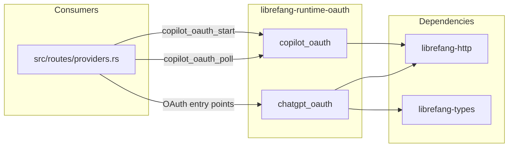
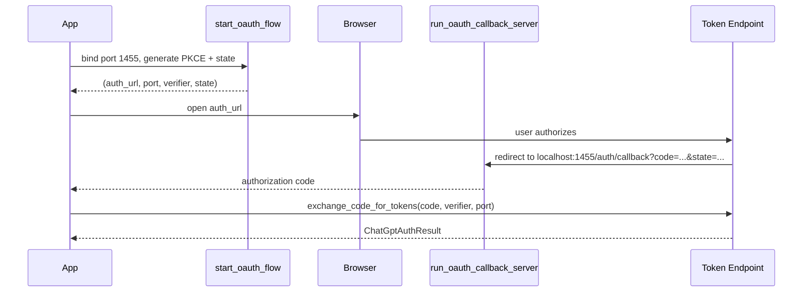
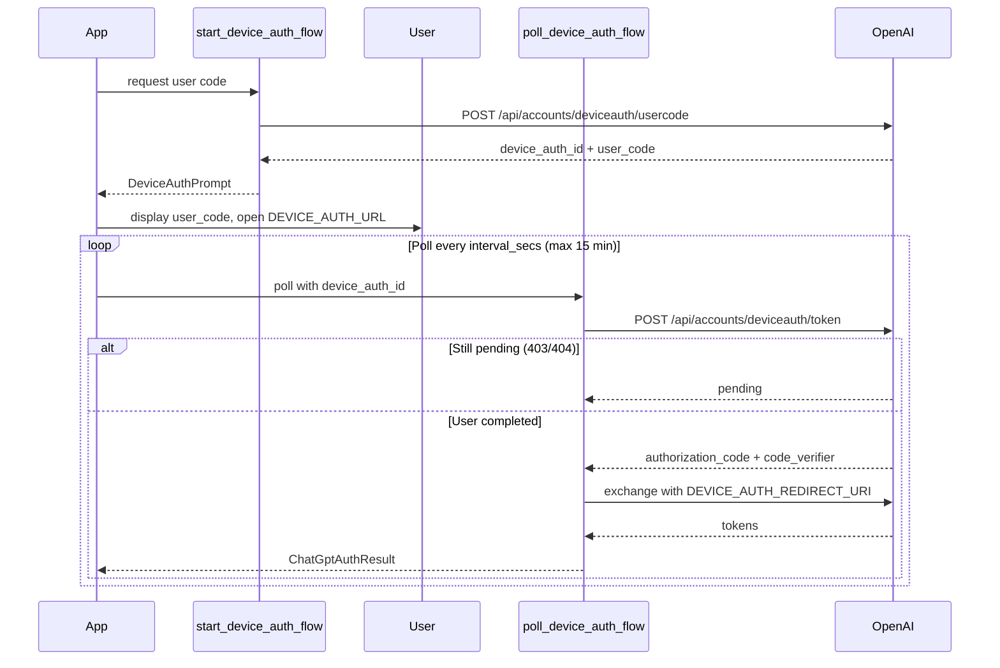

# Agent Runtime — librefang-runtime-oauth-src

# librefang-runtime-oauth

OAuth 2.0 authentication runtime for ChatGPT and GitHub Copilot providers. This crate implements two independent auth modules—browser/device flow for OpenAI and RFC 8628 device authorization grant for GitHub—exposing async functions consumed by the HTTP route layer in `src/routes/providers.rs`.

## Architecture



---

## Module: `chatgpt_oauth`

OpenAI ChatGPT authentication using the Codex OAuth endpoints. Supports two mutually exclusive flows:

| Flow | Use case | Entry point |
|------|----------|-------------|
| **Browser + localhost callback** | Desktop environments with a browser | `start_oauth_flow` → `run_oauth_callback_server` → `exchange_code_for_tokens` |
| **Device authorization** | Headless / remote / CI environments | `start_device_auth_flow` → `poll_device_auth_flow` |

Both flows use PKCE (S256) and produce a `ChatGptAuthResult` containing the access token, optional refresh token, and expiry.

### Key Constants

| Constant | Value | Purpose |
|----------|-------|---------|
| `CHATGPT_BASE_URL` | `https://chatgpt.com/backend-api` | Backend API base for OAuth-token-authenticated calls |
| `DEVICE_AUTH_URL` | `https://auth.openai.com/codex/device` | Verification page shown to users during device flow |
| `DEVICE_AUTH_REDIRECT_URI` | `https://auth.openai.com/deviceauth/callback` | Redirect URI used in device flow token exchange |

The callback server binds to `127.0.0.1:1455` (matching OpenAI's registered redirect URI). Browser flow times out after 5 minutes; device flow after 15 minutes.

### Public Types

#### `ChatGptAuthResult`

Returned by every token-acquisition function. Fields use `Zeroizing<String>` to minimize credential lifetime in memory:

```rust
pub struct ChatGptAuthResult {
    pub access_token: Zeroizing<String>,
    pub refresh_token: Option<Zeroizing<String>>,
    pub expires_in: Option<u64>,
}
```

#### `DeviceAuthPrompt`

Server-issued details that must be displayed to the user before polling begins:

```rust
pub struct DeviceAuthPrompt {
    pub device_auth_id: String,
    pub user_code: String,         // e.g. "ABCD-EFGH"
    pub interval_secs: u64,        // recommended poll interval (default: 5s)
}
```

#### `DeviceAuthFlowError`

Discriminated error enum that lets callers decide whether to fall back to browser auth:

- **`BrowserFallback`** — device auth is not enabled for the account/workspace (HTTP 404). The caller should transparently retry with the browser flow.
- **`Fatal`** — unrecoverable error that should be surfaced to the user.

#### `PkceChallenge`

PKCE verifier/challenge pair produced by `generate_pkce()`:

```rust
pub struct PkceChallenge {
    pub verifier: String,    // 64 random bytes → 86-char base64url string
    pub challenge: String,   // SHA-256(verifier) → base64url
}
```

### Browser Flow



**`start_oauth_flow()`** — Binds `127.0.0.1:1455` to verify availability, generates PKCE and state, and returns the fully-constructed authorization URL along with the verifier and state for later validation. The TCP listener is dropped immediately so the async callback server can re-bind.

**`run_oauth_callback_server(port, expected_state)`** — Starts an async HTTP server that handles `GET /auth/callback`. It validates the `state` parameter against the expected value (CSRF protection), extracts the `code`, sends it through a oneshot channel, and serves either a success or error HTML page to the browser.

**`exchange_code_for_tokens(code, code_verifier, port)`** — Posts the authorization code, PKCE verifier, and redirect URI to OpenAI's token endpoint and returns parsed tokens. Delegates to `exchange_code_for_tokens_with_redirect_uri` with the browser redirect URI.

### Device Flow



**`start_device_auth_flow()`** — Requests a one-time user code from OpenAI. Returns `DeviceAuthFlowError::BrowserFallback` on HTTP 404 (account/workspace doesn't support device auth), allowing callers to silently fall back to the browser flow.

**`poll_device_auth_flow(prompt)`** — Polls `DEVICE_AUTH_TOKEN_URL` at the recommended interval. HTTP 403 and 404 are treated as "authorization pending." On success, the returned `authorization_code` and `code_verifier` are immediately exchanged for tokens via `exchange_code_for_tokens_with_redirect_uri` using `DEVICE_AUTH_REDIRECT_URI`.

### Token Refresh

**`refresh_access_token(refresh_token)`** — Posts a `refresh_token` grant to the token endpoint. Returns a new `ChatGptAuthResult`. Callers should persist the new refresh token if one is returned.

### Model Discovery

**`fetch_best_codex_model(access_token)`** — Queries `{CHATGPT_BASE_URL}/codex/models` with the access token, sorts the response by `priority` descending, and returns the highest-priority model slug. Falls back to `"gpt-5.1-codex-mini"` on any failure.

### Utility Functions

| Function | Description |
|----------|-------------|
| `generate_pkce()` | Generates a `PkceChallenge` (64-byte random verifier, SHA-256 challenge) |
| `create_state()` | Generates a 16-byte random hex state parameter |
| `build_authorization_url(port, code_challenge, state)` | Constructs the full authorization URL with all query parameters |
| `chatgpt_session_available()` | Checks whether the `CHATGPT_SESSION_TOKEN` env var is set and non-empty |

---

## Module: `copilot_oauth`

GitHub Copilot authentication via OAuth 2.0 Device Authorization Grant (RFC 8628). Uses the VSCode Copilot extension's public client ID (`Iv1.b507a08c87ecfe98`).

### Public Types

#### `DeviceCodeResponse`

Deserialized response from the device code initiation:

```rust
pub struct DeviceCodeResponse {
    pub device_code: String,
    pub user_code: String,
    pub verification_uri: String,
    pub expires_in: u64,
    pub interval: u64,           // recommended poll interval in seconds
}
```

#### `DeviceFlowStatus`

Discriminated result of each poll attempt:

| Variant | Meaning |
|---------|---------|
| `Pending` | User hasn't completed authorization yet |
| `Complete { access_token }` | Success — contains the GitHub PAT |
| `SlowDown { new_interval }` | Server requests longer poll interval |
| `Expired` | Device code expired, must restart |
| `AccessDenied` | User denied the authorization |
| `Error(String)` | Unexpected error |

### Flow

**`start_device_flow()`** — POSTs to `https://github.com/login/device/code` with the Copilot client ID and `read:user` scope. Returns a `DeviceCodeResponse` containing the `user_code` and `verification_uri` to display to the user.

**`poll_device_flow(device_code)`** — POSTs to `https://github.com/login/oauth/access_token` with the device code. GitHub returns HTTP 200 with an `error` field while pending (per RFC 8628), so error handling inspects the JSON body rather than the HTTP status. Returns `DeviceFlowStatus::Complete` with a `Zeroizing<String>` access token on success.

Called from `src/routes/providers.rs` via the `copilot_oauth_start` and `copilot_oauth_poll` route handlers.

### HTTP Client Configuration

Both functions build a dedicated HTTP client via `librefang_http::proxied_client_builder()` with a 15-second timeout, separate from the default proxied client used in `chatgpt_oauth`. This avoids propagating OAuth request latencies to other HTTP operations.

---

## Integration with the Codebase

**HTTP client**: All outbound requests use `librefang_http::proxied_client()` or `proxied_client_builder()`, ensuring proxy settings and TLS configuration are applied consistently.

**Version stamping**: `fetch_best_codex_model` includes `librefang_types::VERSION` as a `client_version` query parameter so OpenAI can track client versions.

**Route layer**: `src/routes/providers.rs` is the primary consumer:
- `copilot_oauth_start` → `copilot_oauth::start_device_flow`
- `copilot_oauth_poll` → `copilot_oauth::poll_device_flow`
- ChatGPT OAuth entry points are called from provider setup flows

**Security considerations**:
- All tokens are wrapped in `Zeroizing<String>` to reduce exposure in memory dumps
- PKCE with S256 is mandatory for the browser flow
- State parameter validation prevents CSRF on the callback endpoint
- The callback server only binds to `127.0.0.1`