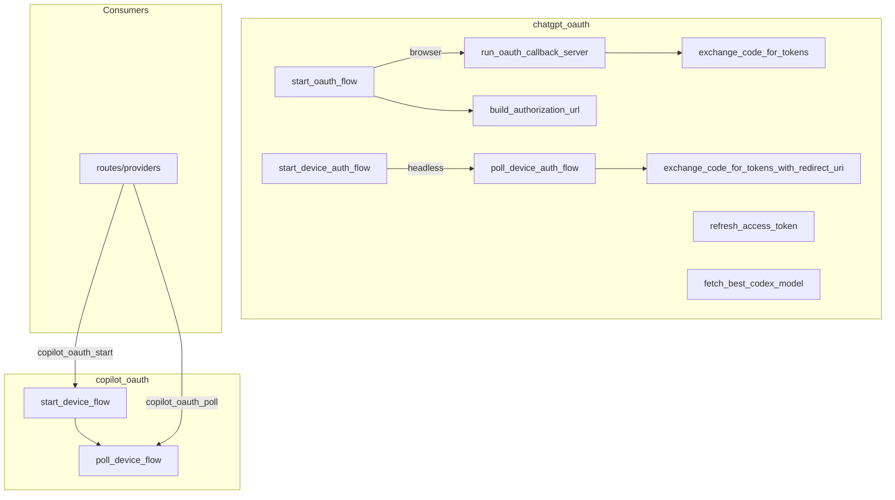

# Agent Runtime — librefang-runtime-oauth-src

# librefang-runtime-oauth

OAuth 2.0 authentication runtime for LibreFang, providing browser-based and device-flow login for both ChatGPT (OpenAI) and GitHub Copilot providers.

## Module Layout

```
librefang-runtime-oauth/
├── lib.rs              # Re-exports chatgpt_oauth and copilot_oauth
├── chatgpt_oauth.rs    # OpenAI/ChatGPT OAuth 2.0 + PKCE
└── copilot_oauth.rs    # GitHub Copilot device authorization grant
```

## Architecture



## chatgpt_oauth

Implements two OAuth 2.0 flows for ChatGPT authentication using OpenAI's Codex CLI endpoints.

### Constants

| Constant | Value | Purpose |
|----------|-------|---------|
| `CHATGPT_BASE_URL` | `https://chatgpt.com/backend-api` | Backend API base for OAuth-token requests. **Note:** OAuth tokens with `api.connectors` scopes work with the Responses API at this endpoint, not `/v1/chat/completions`. |
| `CLIENT_ID` | `app_EMoamEEZ73f0CkXaXp7hrann` | OpenAI Codex CLI OAuth client ID |
| `DEVICE_AUTH_URL` | `https://auth.openai.com/codex/device` | Verification page shown to users during device auth |
| `DEVICE_AUTH_REDIRECT_URI` | `https://auth.openai.com/deviceauth/callback` | Redirect URI used in device auth token exchange |

### Core Types

**`ChatGptAuthResult`** — Returned by every successful auth flow. Holds the bearer access token, optional refresh token (both wrapped in `Zeroizing<String>` for in-memory protection), and the token's TTL in seconds.

**`DeviceAuthPrompt`** — Contains the `device_auth_id` and `user_code` that must be displayed to the user, plus the server-recommended poll interval.

**`DeviceAuthFlowError`** — Discriminated error enum:
- `BrowserFallback` — device auth isn't enabled for the account/workspace; caller should fall back to browser flow
- `Fatal` — unrecoverable failure

**`PkceChallenge`** — Holds a `verifier` (64 random bytes, base64url-encoded to 86 chars) and a `challenge` (SHA-256 of verifier, base64url-encoded).

### Browser-Based OAuth Flow

```
start_oauth_flow()
  → bind TcpListener on 127.0.0.1:1455
  → generate PKCE pair + state
  → build authorization URL
  → return (auth_url, port, pkce.verifier, state)
      ↓
  user opens auth_url in browser
      ↓
run_oauth_callback_server(port, expected_state)
  → listen for GET /auth/callback?code=...&state=...
  → validate state matches (CSRF protection)
  → return authorization code
      ↓
exchange_code_for_tokens(code, code_verifier, port)
  → POST to TOKEN_URL with authorization_code grant
  → return ChatGptAuthResult
```

**`start_oauth_flow()`** — Binds a local TCP socket on `127.0.0.1:1455` (matching OpenAI's registered redirect URI), generates a PKCE challenge and random state, then returns the fully-constructed authorization URL along with the port, PKCE verifier, and state. The listener is dropped immediately so it can be re-bound by the async callback server.

**`build_authorization_url(port, code_challenge, state)`** — Constructs the full authorize URL with query parameters including `response_type=code`, PKCE S256 challenge, scopes (`openid profile email offline_access api.connectors.read api.connectors.invoke`), and Codex-specific flags (`codex_cli_simplified_flow`, `originator=codex_cli_rs`).

**`run_oauth_callback_server(port, expected_state)`** — Spawns a tokio TCP server that handles a single request on `GET /auth/callback`. Validates the `state` parameter, extracts the `code`, and sends it through a oneshot channel. Serves an HTML success or error page to the browser. Times out after 300 seconds (`AUTH_TIMEOUT_SECS`).

**`exchange_code_for_tokens(code, code_verifier, port)`** — Delegates to `exchange_code_for_tokens_with_redirect_uri` using `http://localhost:{port}/auth/callback` as the redirect URI.

### Device Auth Flow (Headless)

```
start_device_auth_flow()
  → POST to DEVICE_AUTH_USERCODE_URL
  → parse DeviceAuthPrompt (device_auth_id, user_code, interval)
      ↓
  user visits https://auth.openai.com/codex/device
  user enters user_code
      ↓
poll_device_auth_flow(prompt)
  → loop: POST to DEVICE_AUTH_TOKEN_URL
     - 200 OK → extract authorization_code + code_verifier → exchange tokens
     - 403/404 → still pending, sleep interval_secs
     - timeout after 15 minutes
  → return ChatGptAuthResult
```

**`start_device_auth_flow()`** — Requests a one-time user code from OpenAI. Returns `DeviceAuthFlowError::BrowserFallback` on HTTP 404 (device auth not enabled for the account), allowing callers to transparently fall back to the browser flow.

**`poll_device_auth_flow(prompt)`** — Polls `DEVICE_AUTH_TOKEN_URL` in a loop using the prompt's `interval_secs`. On success (HTTP 200), the server returns an `authorization_code` and `code_verifier`, which are immediately exchanged for tokens via `exchange_code_for_tokens_with_redirect_uri` using `DEVICE_AUTH_REDIRECT_URI`. HTTP 403 and 404 are treated as "still pending." The poll loop times out after 15 minutes.

### Token Management

**`refresh_access_token(refresh_token)`** — POSTs a `refresh_token` grant to `TOKEN_URL`. Returns a new `ChatGptAuthResult` with fresh tokens.

**`fetch_best_codex_model(access_token)`** — Calls `GET {CHATGPT_BASE_URL}/codex/models?client_version={VERSION}` with the bearer token, sorts returned models by `priority` descending, and returns the highest-priority model slug. Falls back to `gpt-5.1-codex-mini` on any failure (network error, non-200 status, malformed JSON, empty model list).

**`chatgpt_session_available()`** — Checks whether the `CHATGPT_SESSION_TOKEN` environment variable is set and non-empty, indicating that a direct session auth path is available.

### PKCE and State Helpers

**`generate_pkce()`** — Generates a `PkceChallenge` from 64 random bytes. Verifier is base64url-encoded; challenge is SHA-256 of the verifier, also base64url-encoded (S256 method).

**`create_state()`** — Generates a 32-character hex string from 16 random bytes.

## copilot_oauth

Implements GitHub's OAuth 2.0 Device Authorization Grant (RFC 8628) for obtaining a GitHub personal access token via the Copilot extension's client ID.

### Core Types

**`DeviceCodeResponse`** — Deserialized response from the device code initiation. Fields: `device_code`, `user_code`, `verification_uri`, `expires_in`, `interval`.

**`DeviceFlowStatus`** — Enum representing the result of a polling attempt:
- `Pending` — user hasn't completed authorization yet
- `Complete { access_token }` — success, contains the `Zeroizing<String>` token
- `SlowDown { new_interval }` — server requested longer poll interval
- `Expired` — device code expired, flow must restart
- `AccessDenied` — user explicitly denied
- `Error(String)` — unexpected failure

### Flow

```
start_device_flow()
  → POST https://github.com/login/device/code
  → return DeviceCodeResponse (device_code, user_code, verification_uri)
      ↓
  user visits verification_uri, enters user_code
      ↓
poll_device_flow(device_code)
  → POST https://github.com/login/oauth/access_token
  → return DeviceFlowStatus
```

**`start_device_flow()`** — Posts to GitHub's device code endpoint with the Copilot VSCode extension client ID (`Iv1.b507a08c87ecfe98`) and `read:user` scope. Returns a `DeviceCodeResponse` with the user code and verification URI.

**`poll_device_flow(device_code)`** — Polls the GitHub token endpoint with `grant_type=urn:ietf:params:oauth:grant-type:device_code`. GitHub returns HTTP 200 with an `error` field while authorization is pending, so error checking takes priority over success extraction.

### Integration Point

The routes layer calls these functions:

```rust
// src/routes/providers.rs
copilot_oauth_start() → copilot_oauth::start_device_flow()
copilot_oauth_poll()  → copilot_oauth::poll_device_flow()
```

## HTTP Client Usage

All outbound HTTP requests use `librefang_http` for proxy-aware clients:

- `chatgpt_oauth` uses `librefang_http::proxied_client()` — a pre-built client respecting system proxy settings
- `copilot_oauth` uses `librefang_http::proxied_client_builder()` with a 15-second timeout, giving finer control over request timeouts

## Token Security

Sensitive tokens are wrapped in `Zeroizing<String>` from the `zeroize` crate, ensuring they are overwritten in memory when dropped. This applies to:
- `ChatGptAuthResult::access_token`
- `ChatGptAuthResult::refresh_token`
- `DeviceFlowStatus::Complete::access_token`

## Error Handling

Both modules use `Result<_, String>` for their public APIs, with `chatgpt_oauth::start_device_auth_flow` being the exception — it returns `Result<_, DeviceAuthFlowError>` to distinguish retriable browser fallbacks from fatal failures.