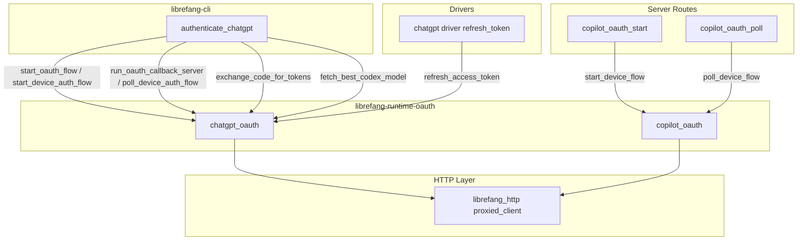

# Agent Runtime — librefang-runtime-oauth-src

# librefang-runtime-oauth

OAuth 2.0 authentication runtime for LibreFang. Provides complete browser-based and device-flow authentication for **ChatGPT (OpenAI)** and **GitHub Copilot**, including token exchange, refresh, and model discovery.

## Module Layout

```
librefang-runtime-oauth/
├── src/
│   ├── lib.rs              # Re-exports: chatgpt_oauth, copilot_oauth
│   ├── chatgpt_oauth.rs    # OpenAI Codex OAuth (browser + device flow)
│   └── copilot_oauth.rs    # GitHub Copilot device flow (RFC 8628)
```

## Architecture



---

## ChatGPT OAuth (`chatgpt_oauth`)

Authenticates against OpenAI's Codex OAuth endpoints. The resulting tokens carry `api.connectors` scopes and work with the ChatGPT backend Responses API at `https://chatgpt.com/backend-api` — **not** the standard `/v1/chat/completions` endpoint.

### Two Authentication Paths

#### 1. Browser Flow (GUI environments)

Opens the user's browser to OpenAI's authorization page, then listens for a callback on `127.0.0.1:1455`.

```rust
// 1. Start the flow — binds port, generates PKCE + state
let (auth_url, port, verifier, state) = chatgpt_oauth::start_oauth_flow().await?;

// 2. Open auth_url in the user's browser (caller's responsibility)
open_browser(auth_url);

// 3. Wait for the callback (up to 5 minutes)
let code = chatgpt_oauth::run_oauth_callback_server(port, &state).await?;

// 4. Exchange code for tokens
let result = chatgpt_oauth::exchange_code_for_tokens(&code, &verifier, port).await?;
```

The callback server (`run_oauth_callback_server`) handles:
- Parsing `GET /auth/callback?code=...&state=...` from the raw TCP stream
- CSRF protection via state parameter validation
- Serving a success or error HTML page back to the browser
- Returning the authorization code through a oneshot channel

#### 2. Device Auth Flow (headless / remote environments)

A two-step process: request a user code, then poll until the user enters it.

```rust
// 1. Request a device code — may return BrowserFallback if not enabled
let prompt = match chatgpt_oauth::start_device_auth_flow().await {
    Ok(p) => p,
    Err(DeviceAuthFlowError::BrowserFallback { message }) => {
        // Fall back to browser flow
        return fallback_to_browser().await;
    }
    Err(DeviceAuthFlowError::Fatal(msg)) => return Err(msg),
};

// 2. Show prompt.user_code and chatgpt_oauth::DEVICE_AUTH_URL to the user

// 3. Poll until authorized (up to 15 minutes)
let result = chatgpt_oauth::poll_device_auth_flow(&prompt).await?;
```

The `DeviceAuthFlowError` enum distinguishes between:
- **`BrowserFallback`** — device auth isn't enabled for the account/workspace (HTTP 404); the caller should fall back to the browser flow
- **`Fatal`** — any other failure that should not silently fall back

Polling treats HTTP 403/404 as "still pending" and retries at the server-suggested interval (default 5 seconds).

### Token Refresh

```rust
let result = chatgpt_oauth::refresh_access_token(&old_refresh_token).await?;
```

### Model Discovery

After authentication, call `fetch_best_codex_model` to determine the highest-priority Codex model available:

```rust
let model = chatgpt_oauth::fetch_best_codex_model(&access_token).await;
// Returns e.g. "gpt-5.2-codex" or falls back to "gpt-5.1-codex-mini"
```

This queries `GET {CHATGPT_BASE_URL}/codex/models?client_version={VERSION}`, sorts the response by `priority` descending, and returns the top slug. Network or parse failures silently fall back to `gpt-5.1-codex-mini`.

### Session Token Detection

```rust
if chatgpt_oauth::chatgpt_session_available() {
    // CHATGPT_SESSION_TOKEN env var is set and non-empty
}
```

### Key Data Structures

| Type | Purpose |
|---|---|
| `ChatGptAuthResult` | Holds `access_token`, optional `refresh_token`, and `expires_in` — all tokens wrapped in `Zeroizing<String>` |
| `PkceChallenge` | PKCE verifier + S256 challenge pair from `generate_pkce()` |
| `DeviceAuthPrompt` | Server-issued `device_auth_id`, `user_code`, and `interval_secs` to display to the user |
| `DeviceAuthFlowError` | Either `BrowserFallback { message }` or `Fatal(String)` |

### Constants

| Constant | Value | Purpose |
|---|---|---|
| `CHATGPT_BASE_URL` | `https://chatgpt.com/backend-api` | Backend API base for OAuth-token requests |
| `DEVICE_AUTH_URL` | `https://auth.openai.com/codex/device` | Verification page URL to show users |
| `DEVICE_AUTH_REDIRECT_URI` | `https://auth.openai.com/deviceauth/callback` | Redirect URI for device auth token exchange |
| Callback bind | `127.0.0.1:1455` | Matches OpenAI's registered redirect URI |
| Browser auth timeout | 300 seconds | Max wait for callback |
| Device auth timeout | 15 minutes | Max poll duration |

### PKCE Implementation

`generate_pkce()` produces a 64-byte random verifier (base64url-encoded to 86 characters) and an S256 challenge (SHA-256 of the verifier, base64url-encoded). The `create_state()` function generates a 16-byte random hex string for CSRF protection.

---

## GitHub Copilot OAuth (`copilot_oauth`)

Implements the OAuth 2.0 Device Authorization Grant ([RFC 8628](https://datatracker.ietf.org/doc/html/rfc8628)) using GitHub's device flow endpoint. Uses the same public client ID as the VS Code Copilot extension (`Iv1.b507a08c87ecfe98`).

### Usage

```rust
// 1. Start the device flow
let device = copilot_oauth::start_device_flow().await?;
// device.verification_uri — URL to visit
// device.user_code — code to enter
// device.interval — recommended poll interval in seconds

// 2. Poll for completion
loop {
    match copilot_oauth::poll_device_flow(&device.device_code).await {
        DeviceFlowStatus::Complete { access_token } => {
            // Done — use access_token
            break;
        }
        DeviceFlowStatus::Pending => {
            tokio::time::sleep(Duration::from_secs(device.interval)).await;
        }
        DeviceFlowStatus::SlowDown { new_interval } => {
            device.interval = new_interval;
            tokio::time::sleep(Duration::from_secs(new_interval)).await;
        }
        DeviceFlowStatus::Expired => return Err("Device code expired".into()),
        DeviceFlowStatus::AccessDenied => return Err("User denied access".into()),
        DeviceFlowStatus::Error(msg) => return Err(msg),
    }
}
```

### Key Data Structures

| Type | Purpose |
|---|---|
| `DeviceCodeResponse` | Parsed response from `start_device_flow()` — contains `device_code`, `user_code`, `verification_uri`, `expires_in`, `interval` |
| `DeviceFlowStatus` | Enum representing poll result states: `Pending`, `Complete { access_token }`, `SlowDown { new_interval }`, `Expired`, `AccessDenied`, `Error(String)` |

### Error Handling

GitHub returns HTTP 200 during polling with an `error` field in the JSON body rather than HTTP error codes. The `poll_device_flow` function handles all standard RFC 8628 error codes:

- `authorization_pending` → `Pending`
- `slow_down` → `SlowDown` with updated interval
- `expired_token` → `Expired`
- `access_denied` → `AccessDenied`

---

## Security Considerations

- **Zeroizing**: All token strings (`access_token`, `refresh_token`) are wrapped in `Zeroizing<String>` from the `zeroize` crate, ensuring they are zeroed in memory when dropped.
- **PKCE**: The ChatGPT browser flow uses S256 PKCE to prevent authorization code interception.
- **CSRF**: The state parameter is validated in the callback server to prevent cross-site request forgery.
- **Timeout**: Both flows have bounded timeouts (5 minutes for browser, 15 minutes for device auth) to prevent indefinite hangs.

## Dependencies on Other Crates

| Crate | Usage |
|---|---|
| `librefang_http` | `proxied_client()` and `proxied_client_builder()` for all outbound HTTP requests |
| `librefang_types` | `VERSION` constant for the Codex models API query parameter |
| `zeroize` | `Zeroizing<String>` for secure token storage |
| `sha2`, `base64` | PKCE S256 challenge generation |
| `tokio` | Async runtime, TCP listener, oneshot channels, timeouts |