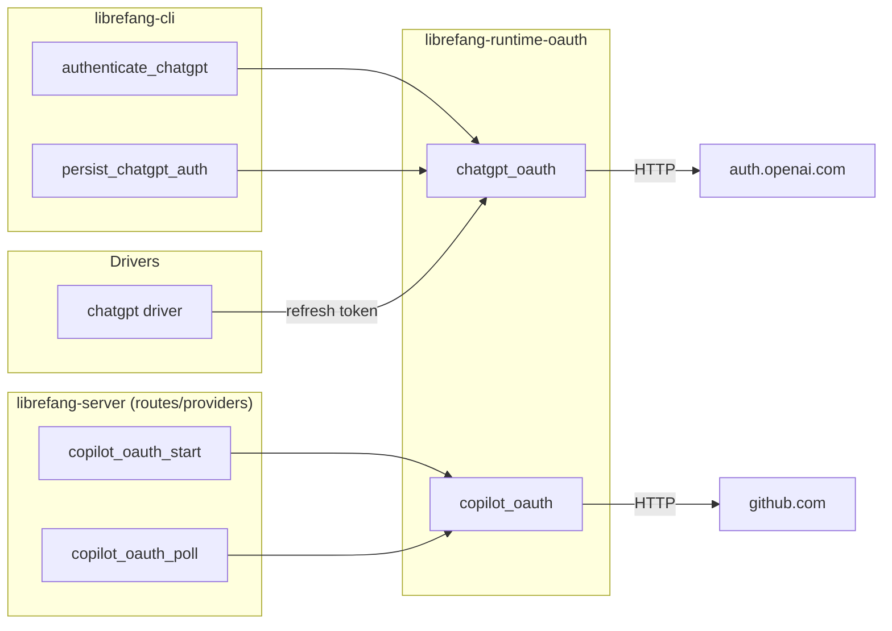

# Agent Runtime — librefang-runtime-oauth-src

# librefang-runtime-oauth

OAuth 2.0 authentication runtime for LibreFang, providing token acquisition and refresh for **ChatGPT** (OpenAI) and **GitHub Copilot**. The module ships two independent flows per provider, optimized for both interactive desktop use and headless environments.

## Module Layout

```
librefang-runtime-oauth/src/
├── lib.rs               # Re-exports chatgpt_oauth and copilot_oauth
├── chatgpt_oauth.rs     # OpenAI/ChatGPT OAuth — browser + device auth
└── copilot_oauth.rs     # GitHub Copilot OAuth — device flow only
```

## Architecture



---

## chatgpt_oauth — OpenAI Authentication

Implements two OAuth flows against OpenAI's Codex endpoints. Tokens obtained here carry the `api.connectors` scopes and work with the ChatGPT backend Responses API, **not** the standard `/v1/chat/completions` endpoint.

### Constants

| Constant | Value | Purpose |
|---|---|---|
| `CHATGPT_BASE_URL` | `https://chatgpt.com/backend-api` | Backend API base for OAuth-token requests |
| `CLIENT_ID` | `app_EMoamEEZ73f0CkXaXp7hrann` | OpenAI Codex CLI OAuth client |
| `AUTHORIZE_URL` | `https://auth.openai.com/oauth/authorize` | Authorization endpoint |
| `TOKEN_URL` | `https://auth.openai.com/oauth/token` | Token exchange and refresh endpoint |
| `DEVICE_AUTH_URL` | `https://auth.openai.com/codex/device` | User-facing device verification page |
| `DEVICE_AUTH_REDIRECT_URI` | `https://auth.openai.com/deviceauth/callback` | Redirect URI for device flow token exchange |
| `SCOPE` | `openid profile email offline_access api.connectors.read api.connectors.invoke` | Requested OAuth scopes |

### Core Types

**`ChatGptAuthResult`** — Returned by every successful token operation. Wraps tokens in `Zeroizing<String>` to minimize credential lifetime in memory.

| Field | Type | Description |
|---|---|---|
| `access_token` | `Zeroizing<String>` | Bearer token for API calls |
| `refresh_token` | `Option<Zeroizing<String>>` | Long-lived token for renewal |
| `expires_in` | `Option<u64>` | Seconds until access token expiry |

**`DeviceAuthPrompt`** — Display-only struct for the device auth flow. Present these to the user, then pass to `poll_device_auth_flow`.

| Field | Type | Description |
|---|---|---|
| `device_auth_id` | `String` | Server-issued identifier for polling |
| `user_code` | `String` | One-time code the user enters at `DEVICE_AUTH_URL` |
| `interval_secs` | `u64` | Recommended seconds between poll requests |

**`DeviceAuthFlowError`** — Two variants with distinct handling semantics:

- **`BrowserFallback { message }`** — Device auth isn't available for this account/workspace (HTTP 404). Callers should fall back to the browser flow.
- **`Fatal(String)`** — Unrecoverable failure; do not silently retry.

**`PkceChallenge`** — PKCE verifier and S256 challenge pair used in the browser flow.

### Browser Flow

For desktop environments with a browser. Opens the user's browser to the OpenAI authorization page, then listens for a redirect callback on `127.0.0.1:1455`.

```
start_oauth_flow() → build_authorization_url()
        ↓
  Browser opens → user logs in → redirect to localhost:1455
        ↓
run_oauth_callback_server(port, state) → authorization code
        ↓
exchange_code_for_tokens(code, verifier, port) → ChatGptAuthResult
```

1. **`start_oauth_flow()`** — Binds port 1455 to confirm availability, generates PKCE + state, builds the auth URL. Returns `(auth_url, port, pkce_verifier, state)`. The caller should open `auth_url` in a browser, then immediately call `run_oauth_callback_server` with the port and state.

2. **`run_oauth_callback_server(port, expected_state)`** — Starts an async TCP server that handles `GET /auth/callback?code=...&state=...`. Validates the CSRF state parameter, sends the authorization code through a oneshot channel, and serves a success/error HTML page to the browser. Times out after 5 minutes.

3. **`exchange_code_for_tokens(code, code_verifier, port)`** — Posts the authorization code, PKCE verifier, and redirect URI to `TOKEN_URL`. Returns `ChatGptAuthResult`.

### Device Auth Flow

For headless or remote environments. The user visits a URL on any device and enters a code.

```
start_device_auth_flow() → DeviceAuthPrompt
        ↓
  User visits DEVICE_AUTH_URL, enters user_code
        ↓
poll_device_auth_flow(&prompt) → ChatGptAuthResult
```

1. **`start_device_auth_flow()`** — POSTs to the OpenAI device auth usercode endpoint. Returns `DeviceAuthPrompt` with the code and polling interval. Returns `DeviceAuthFlowError::BrowserFallback` on HTTP 404 (device auth not enabled).

2. **`poll_device_auth_flow(prompt)`** — Polls the device auth token endpoint every `prompt.interval_secs` seconds. HTTP 403/404 are treated as "still pending." On success, automatically exchanges the resulting authorization code for tokens via `exchange_code_for_tokens_with_redirect_uri`. Times out after 15 minutes.

### Token Refresh

**`refresh_access_token(refresh_token)`** — Posts a `refresh_token` grant to `TOKEN_URL`. Used by the ChatGPT driver when the stored access token has expired.

### Model Discovery

**`fetch_best_codex_model(access_token)`** — Calls `GET {CHATGPT_BASE_URL}/codex/models` with the access token, sorts results by `priority` descending, and returns the highest-priority model slug. Falls back to `"gpt-5.1-codex-mini"` on any failure. Called by the CLI during `persist_chatgpt_auth` to associate the best available model with the stored credentials.

### Session Token Detection

**`chatgpt_session_available()`** — Returns `true` if the `CHATGPT_SESSION_TOKEN` environment variable is set and non-empty. Allows callers to skip OAuth entirely when a direct session token is present.

### PKCE and State Utilities

- **`generate_pkce()`** — Generates 64 random bytes, base64url-encodes them as the verifier, then SHA-256 hashes and base64url-encodes the result as the S256 challenge.
- **`create_state()`** — Generates 16 random bytes hex-encoded (32 characters) as a CSRF-protection state parameter.
- **`build_authorization_url(port, code_challenge, state)`** — Constructs the full authorization URL with all required query parameters including PKCE challenge, scopes, and OpenAI-specific flags (`codex_cli_simplified_flow`, `id_token_add_organizations`).

### Internal Callback Server

`handle_oauth_callback` is the per-connection handler inside the callback server. It performs raw HTTP parsing on a `TcpStream`:

- Extracts the request path and parses query parameters via `parse_query_params`
- Checks for OAuth error responses and serves an error HTML page
- Validates `state` against the expected value (rejects CSRF mismatches with HTTP 400)
- Validates that `code` is present and non-empty
- Sends the code through a `oneshot::Sender` guarded by an `Arc<Mutex<Option<...>>>`
- Serves `success_html()` or `error_html()` as appropriate

URL encoding/decoding is handled internally by `urlencod` (percent-encoding) and `urldecode` (`%XX` and `+` handling) rather than pulling in a URL crate.

---

## copilot_oauth — GitHub Copilot Authentication

Implements the OAuth 2.0 Device Authorization Grant (RFC 8628) against GitHub, using the same public client ID as the VSCode Copilot extension (`Iv1.b507a08c87ecfe98`).

### Core Types

**`DeviceCodeResponse`** — Result of initiating a device flow.

| Field | Type | Description |
|---|---|---|
| `device_code` | `String` | Internal code for polling |
| `user_code` | `String` | Code the user enters at the verification URI |
| `verification_uri` | `String` | URL the user visits |
| `expires_in` | `u64` | Seconds until the device code expires |
| `interval` | `u64` | Recommended polling interval in seconds |

**`DeviceFlowStatus`** — Result of each poll attempt. The caller drives a polling loop based on these variants:

| Variant | Meaning |
|---|---|
| `Pending` | User hasn't authorized yet — keep polling |
| `Complete { access_token }` | Success — token is wrapped in `Zeroizing<String>` |
| `SlowDown { new_interval }` | Server requested a longer interval |
| `Expired` | Device code expired — restart the flow |
| `AccessDenied` | User explicitly denied |
| `Error(String)` | Unexpected failure |

### Flow

```
start_device_flow() → DeviceCodeResponse
        ↓
  User visits verification_uri, enters user_code
        ↓
poll_device_flow(device_code) → DeviceFlowStatus
        ↓                            ↓
  Pending → wait, retry       Complete → use access_token
```

1. **`start_device_flow()`** — POSTs to `https://github.com/login/device/code` with the Copilot client ID and `read:user` scope. Returns the parsed `DeviceCodeResponse`. Uses a 15-second HTTP timeout via `librefang_http::proxied_client_builder`.

2. **`poll_device_flow(device_code)`** — POSTs to `https://github.com/login/oauth/access_token` with the device code grant type. GitHub returns HTTP 200 with an `error` field during pending states, so error detection inspects the JSON body rather than HTTP status. Returns `DeviceFlowStatus` for the caller to act on.

The caller (in `librefang-server` routes) is responsible for the polling loop, sleeping between attempts based on the interval from `start_device_flow` and any `SlowDown` adjustments.

---

## Integration Points

| Caller Location | Function Called | When |
|---|---|---|
| `librefang-cli` → `authenticate_chatgpt` | `start_oauth_flow`, `start_device_auth_flow`, `poll_device_auth_flow`, `run_oauth_callback_server`, `exchange_code_for_tokens` | CLI login command |
| `librefang-cli` → `persist_chatgpt_auth` | `fetch_best_codex_model` | After successful auth, to determine the model |
| `librefang-server` → `copilot_oauth_start` | `start_device_flow` | Web UI initiates Copilot login |
| `librefang-server` → `copilot_oauth_poll` | `poll_device_flow` | Web UI polls for Copilot auth completion |
| `librefang-server` → `chatgpt driver` → `refresh_token` | `refresh_access_token` | Automatic token renewal on 401 |

All HTTP requests go through `librefang_http::proxied_client()` or `proxied_client_builder()`, ensuring proxy environment variables and custom CA certificates are respected.

---

## Security Considerations

- **Zeroizing credentials**: `ChatGptAuthResult` and Copilot tokens are wrapped in `Zeroizing<String>`, which zeroizes memory on drop.
- **PKCE**: The browser flow uses SHA-256 S256 code challenges, preventing authorization code interception.
- **CSRF protection**: The state parameter is validated in the callback server. Mismatches are rejected with HTTP 400.
- **No credential logging**: Tokens are never logged. Only the authorization URL (which contains the challenge, not the verifier) is logged at debug level.