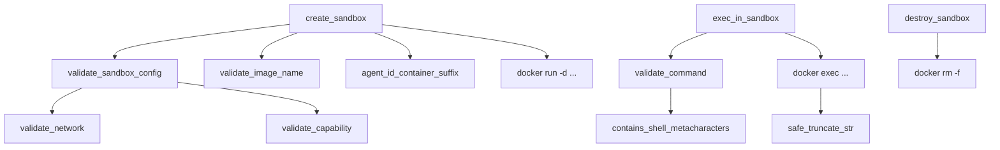

# Agent Runtime — librefang-runtime-sandbox-docker-src

# Docker Sandbox Runtime (`librefang-runtime-sandbox-docker`)

## Purpose

This crate provides OS-level isolation for agent code execution by running commands inside Docker containers. It enforces a strict security boundary—network isolation, capability dropping, read-only filesystems, resource limits, and command sanitization—so that untrusted agent code cannot escape its sandbox or compromise the host system.

## Architecture



Every public entry point validates its inputs before shelling out to `docker`. Validation failures are typed `Err(String)` and also emit `error!`-level log spans so that rejections are recorded at daemon startup even if the caller discards the result.

---

## Security Validation

All validation is designed to **fail closed**: syntactically valid but dangerous values are rejected with explicit error messages, and shell metacharacters are blocked before they ever reach a `docker` invocation.

### Network (`validate_network`)

Restricts the `--network` argument passed to `docker run`:

| Value | Allowed? | Reason |
|---|---|---|
| `bridge` | ✅ | Default Docker bridge; isolated from host |
| `none` | ✅ | No network at all |
| `my-custom-net` | ✅ | User-defined bridge networks (`[A-Za-z0-9_-]+`) |
| `host` | ❌ | Shares host network namespace; exposes loopback, cloud metadata endpoint `169.254.169.254`, and the daemon's own listener |
| `container:*` | ❌ | Joins another container's namespace; can transitively inherit `host` access |

Case-insensitive rejection — `HOST`, `Host`, etc. are all blocked.

### Capabilities (`validate_capability`, `SAFE_CAPS`)

Applies the principle of least privilege via a two-step process:

1. `--cap-drop ALL` removes every Linux capability.
2. Only capabilities in the `SAFE_CAPS` allowlist (14 entries) may be added back via `--cap-add`.

**Excluded by design** (sandbox-collapse vectors):

- `SYS_ADMIN` — mount, kexec, BPF, namespace manipulation
- `NET_ADMIN` — interface reconfiguration, firewall rules, raw sockets
- `SYS_PTRACE` — process attachment; defeats `no-new-privileges`
- `SYS_MODULE`, `SYS_BOOT`, `SYS_RAWIO`, `SYS_TIME`, `BPF`, `PERFMON`, `CHECKPOINT_RESTORE`, and all `MAC_*`, `IPC_*`, `AUDIT_*` capabilities

Capability matching is case-insensitive and tolerates an optional `CAP_` prefix (both `CHOWN` and `CAP_CHOWN` are accepted).

### Commands (`validate_command` → `helpers::contains_shell_metacharacters`)

Blocks injection vectors before commands are passed to `docker exec … sh -c`:

| Pattern | Blocked? | Rationale |
|---|---|---|
| Backticks `` ` `` | ❌ Raw string | Command substitution fires inside double quotes |
| `$(` | ❌ Raw string | Same — POSIX command substitution |
| `${` | ❌ Raw string | Variable expansion works inside double quotes |
| `\n`, `\r`, `\0` | ❌ Raw string | Newline injection / null bytes |
| `;`, `\|`, `>`, `<`, `&`, `{`, `}` | ❌ Unquoted regions only | These are literals inside quoted strings; legitimate quoted arguments like `echo "a && b"` must not false-positive |

The `strip_quoted_regions` helper strips away single- and double-quoted spans (handling backslash escapes in double quotes) before scanning for chaining/redirection metacharacters, while always scanning the raw string for substitution patterns that fire regardless of quoting.

### Bind Mounts (`validate_bind_mount`)

Prevents mounting sensitive host paths into the container:

**Always-blocked paths** (`BLOCKED_MOUNT_PATHS`):
`/etc`, `/proc`, `/sys`, `/dev`, `/var/run/docker.sock`, `/root`, `/boot`

Additional checks:
- **Non-absolute paths** — rejected outright
- **Path traversal** (`..` components) — rejected
- **Symlink escape** — canonicalizes the path (or its nearest existing ancestor) and re-checks against blocked paths to catch symlink-based evasion
- **User-configured blocklist** — additional paths blocked via configuration

### Container Names (`sanitize_container_name`, `agent_id_container_suffix`)

Container names are limited to `[a-zA-Z0-9-]` (max 63 chars). Agent IDs are mapped to a collision-resistant suffix via `SHA-256(agent_id)[..8 hex chars]`, which is bijective with cryptographic confidence for realistic agent counts. This replaced an earlier lossy character-replacement scheme that collapsed distinct IDs like `foo/bar` and `foo-bar` into the same container name.

---

## Container Lifecycle

### `is_docker_available()`

Probes the system for a working Docker daemon by running `docker version --format {{.Server.Version}}`. Returns `false` (never panics) if Docker is absent or the daemon is unreachable.

### `create_sandbox(config, agent_id, workspace)`

Creates and starts a detached container:

1. Validates the image name, sandbox config, and derived container name.
2. Constructs a `docker run -d` command with:
   - **Resource limits**: `--memory`, `--cpus`, `--pids-limit`
   - **Capability drop**: `--cap-drop ALL` + `--security-opt no-new-privileges`, then selectively adds back only allowlisted caps
   - **Read-only root**: `--read-only` when `config.read_only_root` is true
   - **Network**: `--network <validated-network>`
   - **tmpfs mounts**: ephemeral writable filesystems from `config.tmpfs`
   - **Workspace**: agent workspace mounted read-only at `config.workdir`
   - **Keepalive**: runs `sleep infinity` so the container stays alive for `exec` calls
3. Returns a `SandboxContainer` with the container ID, agent ID, and creation timestamp.

### `exec_in_sandbox(container, command, timeout)`

Executes a command inside a running container:

1. Validates the command against the shell-metacharacter denylist.
2. Runs `docker exec <container_id> sh -c <command>` with a `tokio::time::timeout`.
3. Truncates stdout/stderr to 50,000 characters (UTF-8-boundary-safe via `safe_truncate_str`) to prevent unbounded memory growth.
4. Returns an `ExecResult` with captured stdout, stderr, and exit code.

### `destroy_sandbox(container)`

Force-stops and removes the container via `docker rm -f`. Failures are logged at `warn!` level but do not propagate as errors (the container may already be gone).

---

## Container Pool (`ContainerPool`)

Reuses containers across sessions to avoid the overhead of repeated `docker run` / `docker rm` cycles.

```rust
let pool = ContainerPool::new();

// Acquire a matching container (None if pool is empty or cool-down hasn't elapsed)
if let Some(container) = pool.acquire(config_hash(&config), 0) {
    // reuse
} else {
    let container = create_sandbox(&config, agent_id, workspace).await?;
    // use it
    pool.release(container, config_hash(&config));
}

// Periodically clean up stale entries
pool.cleanup(idle_timeout_secs, max_age_secs).await;
```

**Key details:**

- **Concurrency-safe**: backed by `DashMap<String, PoolEntry>`.
- **Config matching**: `config_hash` hashes the image, network, memory limit, and workdir. Containers are only reused when the hash matches exactly.
- **Cool-down**: `acquire` only returns entries whose `last_used` timestamp is at least `cool_secs` seconds old.
- **Cleanup**: `cleanup` destroys containers that are either idle beyond `idle_timeout_secs` or older than `max_age_secs`, calling `destroy_sandbox` for each and removing them from the map.

---

## Helpers Module (`helpers`)

A self-contained, ~60 LOC duplicate of string utilities from `librefang-runtime::subprocess_sandbox` and `librefang-runtime::str_utils`. Duplicated here to avoid a cyclic dependency back into the parent runtime crate.

| Function | Purpose |
|---|---|
| `safe_truncate_str(s, max_bytes)` | Truncates a string to `max_bytes`, falling back to the nearest UTF-8 char boundary to avoid panics |
| `contains_shell_metacharacters(command)` | Returns `Some(reason)` if the command contains injection vectors, `None` if clean |

These are exposed as `pub` so the parent crate can run a parity test (`docker_sandbox_helpers_parity.rs`) asserting byte-for-byte equivalence with the canonical implementations. This guards against silent drift when the upstream denylist gains new entries.

---

## Data Structures

```rust
struct SandboxContainer {
    container_id: String,   // Docker container ID (hex)
    agent_id: String,       // Owning agent identifier
    created_at: DateTime<Utc>,
}

struct ExecResult {
    stdout: String,    // Captured stdout (truncated at 50k chars)
    stderr: String,    // Captured stderr (truncated at 50k chars)
    exit_code: i32,    // Process exit code (-1 if unavailable)
}
```

---

## Configuration (`DockerSandboxConfig`)

Defined in `librefang_types::config`. Defaults:

| Field | Default | Notes |
|---|---|---|
| `enabled` | `false` | Must be explicitly enabled |
| `image` | `python:3.12-slim` | |
| `container_prefix` | `librefang-sandbox` | |
| `workdir` | `/workspace` | |
| `network` | `none` | Most restrictive by default |
| `memory_limit` | `512m` | |
| `cpu_limit` | `1.0` | |
| `timeout_secs` | `60` | |
| `read_only_root` | `true` | |
| `cap_add` | `[]` (empty) | No capabilities beyond the drop-all baseline |
| `tmpfs` | `["/tmp:size=64m"]` | Ephemeral writable `/tmp` |
| `pids_limit` | `100` | |

---

## Typical Integration Flow

1. **Startup**: Call `is_docker_available()` to detect Docker. Load `DockerSandboxConfig` and run `validate_sandbox_config()` to fail fast on unsafe settings.
2. **Agent session**: Call `create_sandbox()` to provision a container (or `ContainerPool::acquire` for reuse).
3. **Execution**: Call `exec_in_sandbox()` for each agent command, passing a per-command timeout.
4. **Teardown**: Call `destroy_sandbox()` (or `ContainerPool::release` for reuse). Run `ContainerPool::cleanup` periodically to garbage-collect stale entries.