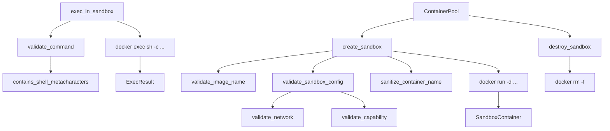

# Agent Runtime — librefang-runtime-sandbox-docker-src

# Docker Container Sandbox (`librefang-runtime-sandbox-docker`)

OS-level isolation for agent code execution using Docker containers. Agents run commands inside hardened containers with strict resource limits, network isolation, dropped capabilities, and read-only root filesystems.

## Architecture



## Sandbox Lifecycle

### 1. Creation — `create_sandbox`

```rust
pub async fn create_sandbox(
    config: &DockerSandboxConfig,
    agent_id: &str,
    workspace: &Path,
) -> Result<SandboxContainer, String>
```

Spawns a long-lived container (`sleep infinity`) with the following hardening:

| Layer | Mechanism |
|-------|-----------|
| Capabilities | `--cap-drop ALL`, then selectively re-adds only allowlisted caps via `--cap-add` |
| Privilege escalation | `--security-opt no-new-privileges` |
| Network | Isolated to a validated non-host network (default: `none`) |
| Filesystem | Optional `--read-only` root; workspace mounted `:ro` |
| Resources | Memory limit, CPU limit, PID limit |
| Temp storage | Configurable tmpfs mounts |

The container name is derived as `{container_prefix}-{sha256(agent_id)[..8]}`, ensuring bijective mapping from agent IDs to container names (no collisions between `"foo/bar"` and `"foo-bar"`).

### 2. Execution — `exec_in_sandbox`

```rust
pub async fn exec_in_sandbox(
    container: &SandboxContainer,
    command: &str,
    timeout: Duration,
) -> Result<ExecResult, String>
```

Runs a command via `docker exec … sh -c <command>`. Output is truncated at 50,000 characters to prevent unbounded memory growth. The timeout kills the `docker exec` subprocess; it does **not** send `SIGKILL` inside the container (the container itself keeps running).

### 3. Destruction — `destroy_sandbox`

```rust
pub async fn destroy_sandbox(container: &SandboxContainer) -> Result<(), String>
```

Force-removes the container (`docker rm -f`). Logs a warning on failure but returns `Ok(())` — a stale container is a resource leak, not a functional error.

## Security Validation Layer

All validation runs **before** any `docker` subprocess is spawned. The design principle is fail-closed: any invalid or dangerous configuration produces a typed `Err(String)` and an `error!` log entry.

### Network — `validate_network`

Rejects configurations that share or join host-level network namespaces:

- **`host`** — exposes loopback, cloud metadata at `169.254.169.254`, and the daemon's listener port.
- **`container:<name>`** — transitively inherits whatever the target container can reach.
- **Bad syntax** — anything outside `[A-Za-z0-9_-]+` fails fast.

Accepted values: `bridge`, `none`, or user-defined Docker network names.

### Capabilities — `validate_capability` and `SAFE_CAPS`

After `--cap-drop ALL`, only the 14 capabilities in `SAFE_CAPS` may be re-added:

```
CHOWN, DAC_OVERRIDE, FOWNER, FSETID, KILL,
SETGID, SETUID, SETPCAP, NET_BIND_SERVICE,
NET_RAW, SYS_CHROOT, MKNOD, AUDIT_WRITE, SETFCAP
```

Dangerous capabilities excluded by design (each is a sandbox-collapse vector):

| Capability | Risk |
|-----------|------|
| `SYS_ADMIN` | Mount, kexec, BPF, namespace manipulation |
| `NET_ADMIN` | Interface reconfiguration, firewall rules, raw sockets |
| `SYS_PTRACE` | Process attachment; defeats `no-new-privileges` |
| `BPF`, `PERFMON` | eBPF loading, kernel observation |
| `SYS_MODULE`, `SYS_BOOT` | Kernel module loading, reboot |

Capability matching is case-insensitive and strips the optional `CAP_` prefix (Docker accepts both `CHOWN` and `CAP_CHOWN`).

### Image Name — `validate_image_name`

Allows only `[a-zA-Z0-9.:/-_]`. Rejects shell metacharacters that could escape the `docker run` argument vector.

### Command Sanitization — `validate_command`

Delegates to `helpers::contains_shell_metacharacters`, which applies a two-phase scan:

1. **Raw string scan** (fires inside double quotes too): backticks, `$(`, `${`, newlines, null bytes.
2. **Unquoted-region scan** (after stripping single/double-quoted regions): `;`, `|`, `>`, `<`, `{`, `}`, `&`.

This split is intentional — command substitution and variable expansion execute inside `"…"` in `sh -c`, while pipes and redirections do not.

### Bind Mount Validation — `validate_bind_mount`

Blocks mounts into sensitive host paths:

```
/etc, /proc, /sys, /dev, /var/run/docker.sock, /root, /boot
```

Plus any user-configured `blocked_mounts`. Performs:

- Absolute path check
- `..` traversal rejection
- **Symlink escape detection**: canonicalizes the path (or its nearest existing ancestor) and verifies the resolved target is not under a blocked path. This prevents TOCTOU attacks where a symlink is created after validation but before Docker resolves it.

### Container Name — `sanitize_container_name`

Validates the final Docker container name is `[a-zA-Z0-9-]{1,63}`. The previous approach of silently replacing disallowed characters with `-` caused collisions (e.g. `"foo/bar"` and `"foo-bar"` both became `"foo-bar"`). Validation now rejects bad input; the `agent_id_container_suffix` function ensures the input is always well-formed.

## Container Pool — `ContainerPool`

Reuses containers across agent sessions to amortize creation cost.

```rust
let pool = ContainerPool::new();

// Return a container for reuse
pool.release(container, config_hash(&config));

// Retrieve a matching container (if cool_secs have elapsed since last use)
if let Some(container) = pool.acquire(config_hash(&config), cool_secs) {
    // reuse
}

// Periodic cleanup — destroy stale containers
pool.cleanup(idle_timeout_secs, max_age_secs).await;
```

Containers are matched by `config_hash`, which hashes the image, network, memory limit, and working directory. A container with a different image but same agent ID will **not** be reused.

### `config_hash`

```rust
pub fn config_hash(config: &DockerSandboxConfig) -> u64
```

Deterministic hash of key config fields (image, network, memory_limit, workdir). Used by the pool to decide whether a returned container is compatible with a new request.

## Availability Check — `is_docker_available`

```rust
pub async fn is_docker_available() -> bool
```

Runs `docker version --format {{.Server.Version}}` and returns whether the Docker daemon is reachable. Use this at startup to decide whether Docker sandboxing can be offered.

## Data Types

### `SandboxContainer`

```rust
pub struct SandboxContainer {
    pub container_id: String,   // Docker container ID (hex)
    pub agent_id: String,       // Owning agent
    pub created_at: DateTime<Utc>,
}
```

### `ExecResult`

```rust
pub struct ExecResult {
    pub stdout: String,    // Truncated at 50,000 chars
    pub stderr: String,    // Truncated at 50,000 chars
    pub exit_code: i32,    // Process exit code (-1 if unknown)
}
```

## Helpers Module

Inlined from `librefang-runtime::subprocess_sandbox` and `librefang-runtime::str_utils` to avoid a cyclic dependency back into the parent runtime crate. Published as `pub` so a parity test (`crates/librefang-runtime/tests/docker_sandbox_helpers_parity.rs`) can verify these implementations stay byte-for-byte identical to the canonical versions.

| Function | Purpose |
|----------|---------|
| `safe_truncate_str(s, max_bytes)` | UTF-8-boundary-safe string truncation |
| `contains_shell_metacharacters(command)` | Shell injection denylist scanner |

**When updating the denylist in either location, the other must be updated in lockstep.** The parity test catches silent drift.

## Configuration Defaults

From `DockerSandboxConfig::default()`:

| Field | Default |
|-------|---------|
| `enabled` | `false` |
| `image` | `python:3.12-slim` |
| `container_prefix` | `librefang-sandbox` |
| `workdir` | `/workspace` |
| `network` | `none` |
| `memory_limit` | `512m` |
| `cpu_limit` | `1.0` |
| `timeout_secs` | `60` |
| `read_only_root` | `true` |
| `cap_add` | `[]` (empty) |
| `tmpfs` | `["/tmp:size=64m"]` |
| `pids_limit` | `100` |

The default network is `none` — no outbound connectivity. Agents that need network access must be explicitly configured with a safe Docker network.