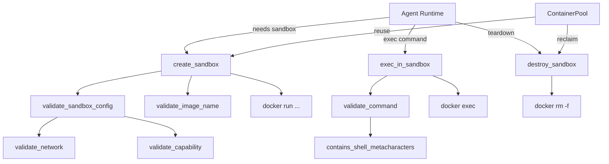

# Agent Runtime — librefang-runtime-sandbox-docker-src

# Agent Runtime — Docker Sandbox (`librefang-runtime-sandbox-docker`)

## Purpose

This module provides OS-level isolation for agent code execution by running commands inside Docker containers. Every container is created with strict security defaults — all Linux capabilities dropped, no-new-privileges, optional read-only root filesystem, network isolation, and resource limits. It acts as one of the sandbox backends available to the LibreFang agent runtime.

## Architecture Overview



## Data Types

### `SandboxContainer`

A handle to a running Docker container. Returned by `create_sandbox` and consumed by `exec_in_sandbox` and `destroy_sandbox`.

| Field | Type | Description |
|-------|------|-------------|
| `container_id` | `String` | Docker container ID (from `docker run` stdout) |
| `agent_id` | `String` | The agent this container belongs to |
| `created_at` | `DateTime<Utc>` | Timestamp of creation |

### `ExecResult`

The outcome of running a command inside a sandbox container. `stdout` and `stderr` are truncated at 50,000 characters (UTF-8 boundary-safe) if the process produces excessive output.

| Field | Type | Description |
|-------|------|-------------|
| `stdout` | `String` | Standard output (possibly truncated) |
| `stderr` | `String` | Standard error (possibly truncated) |
| `exit_code` | `i32` | Process exit code, or `-1` if unavailable |

## Public API

### Container Lifecycle

#### `is_docker_available() -> bool`

Checks whether Docker is reachable on the host by running `docker version --format {{.Server.Version}}`. Returns `true` if the command succeeds, `false` otherwise. Use this at startup to decide whether the Docker sandbox backend is viable.

#### `create_sandbox(config, agent_id, workspace) -> Result<SandboxContainer, String>`

Creates and starts a new Docker container for an agent. The flow:

1. **Validate image name** — rejects empty strings or characters outside `[a-zA-Z0-9.:/-_]`.
2. **Validate security config** — delegates to `validate_sandbox_config` (network + capabilities).
3. **Derive container name** — `"{container_prefix}-{sha256(agent_id)[..8]}"`. The SHA-256 hex suffix replaces the old lossy character-replacement scheme that could cause agent-id collisions (e.g., `foo/bar` and `foo-bar` mapping to the same container name).
4. **Assemble `docker run` command** with security hardening:
   - `--cap-drop ALL` then selectively `--cap-add` from the validated allowlist
   - `--security-opt no-new-privileges`
   - `--memory`, `--cpus`, `--pids-limit` from config
   - `--network` from config (validated; never `host` or `container:*`)
   - `--read-only` if `config.read_only_root` is true
   - `--tmpfs` mounts from config (default: `/tmp:size=64m`)
   - Workspace mounted read-only at `config.workdir`
5. **Launch container** running `sleep infinity` to keep it alive for subsequent `exec` calls.

#### `exec_in_sandbox(container, command, timeout) -> Result<ExecResult, String>`

Executes a command inside an existing container via `docker exec ... sh -c {command}`. The command is validated through the shell metacharacter denylist before being passed to the container. Execution is bounded by `timeout` — if Docker doesn't respond within the deadline, the future resolves to an error.

#### `destroy_sandbox(container) -> Result<(), String>`

Force-stops and removes the container (`docker rm -f`). Logs a warning on failure but does not return an error — containers in a broken state can be cleaned up by Docker's garbage collection.

### Configuration Validation

#### `validate_sandbox_config(config) -> Result<(), String>`

Full validation of `DockerSandboxConfig` at config-load time. Checks the `network` field and every entry in `cap_add`. Emits `error!`-level log messages for rejections, ensuring the daemon startup logs capture the reason even if the caller swallows the `Result`. Called automatically by `create_sandbox`, but can also be called earlier (e.g., at config load) for fail-fast behavior.

#### `validate_bind_mount(path, blocked) -> Result<(), String>`

Validates that a proposed bind mount source path does not expose sensitive host directories. The check:

1. **Rejects non-absolute paths.**
2. **Rejects path traversal** (`..` components).
3. **Rejects default blocked paths:** `/etc`, `/proc`, `/sys`, `/dev`, `/var/run/docker.sock`, `/root`, `/boot`.
4. **Rejects user-configured blocked paths** (passed as `blocked` argument).
5. **Resolves symlinks.** Canonicalizes the path (or its nearest existing ancestor for non-existent paths) and re-checks against both default and configured blocklists. This prevents TOCTOU attacks where a symlink is created after validation points at `/etc/passwd`.

## Security Boundaries

### Network Isolation

`validate_network` rejects three categories:

| Pattern | Reason |
|---------|--------|
| `host` | Shares the entire host network namespace — container can reach `127.0.0.1`, cloud metadata at `169.254.169.254`, and the daemon listener on port 4545 |
| `container:*` | Joins another container's namespace, transitively inheriting its network access |
| Characters outside `[A-Za-z0-9_-]` | Fail-fast rejection of shell injection in the `--network` argument |

Accepted values: `bridge`, `none`, and user-defined network names matching the Docker naming grammar.

### Capability Allowlist (`SAFE_CAPS`)

The allowlist contains 14 capabilities considered safe after `--cap-drop ALL`:

```
CHOWN, DAC_OVERRIDE, FOWNER, FSETID, KILL, SETGID, SETUID,
SETPCAP, NET_BIND_SERVICE, NET_RAW, SYS_CHROOT, MKNOD,
AUDIT_WRITE, SETFCAP
```

Explicitly excluded (sandbox-collapse vectors): `SYS_ADMIN`, `NET_ADMIN`, `SYS_PTRACE`, `SYS_MODULE`, `SYS_BOOT`, `SYS_RAWIO`, `SYS_TIME`, `BPF`, `PERFMON`, `CHECKPOINT_RESTORE`, and others. The test `test_safe_caps_size_and_contents` pins the allowlist size at 14 — any future addition requires updating that assertion, ensuring deliberate review.

`validate_capability` normalizes input by stripping an optional `CAP_` prefix and comparing case-insensitively, matching Docker's own acceptance of both `CHOWN` and `CAP_CHOWN`.

### Command Validation

`validate_command` delegates to `helpers::contains_shell_metacharacters`, which operates in two phases:

1. **Raw string scan** — checks for `\n`, `\r`, `\0`, backticks, `$(`, and `${`. These tokens are expanded by `sh -c` even inside double quotes, so they must be rejected regardless of quoting context.
2. **Unquoted-region scan** — strips single- and double-quoted regions, then checks the remainder for `;`, `|`, `>`, `<`, `{`, `}`, `&`. This allows commands containing metacharacters inside quoted arguments (e.g., `echo "a > b"`) while blocking actual shell chaining.

The helpers module is intentionally duplicated from `librefang-runtime::subprocess_sandbox` to avoid a cyclic dependency. A parity test in the parent crate asserts byte-for-byte equivalence with the canonical implementations.

### Container Name Collision Prevention

`agent_id_container_suffix` computes `SHA-256(agent_id)[..8 hex chars]`, producing a bijective mapping from agent IDs to 8-character hex strings. This replaced the old `safe_truncate_str(agent_id, 8)` approach where character replacement caused distinct agent IDs (e.g., `foo/bar` and `foo-bar`) to collide on the same container name.

## Container Pool

`ContainerPool` reuses Docker containers across sessions to avoid the startup cost of repeated `docker run` calls. It is backed by a `DashMap<String, PoolEntry>` for concurrent access.

```rust
let pool = ContainerPool::new();

// Release a container back to the pool
pool.release(container, config_hash(&config));

// Acquire a matching container (same config hash, cooled for at least N seconds)
if let Some(container) = pool.acquire(config_hash(&config), cool_secs) {
    // reuse
}

// Periodic cleanup: remove stale entries
pool.cleanup(idle_timeout_secs, max_age_secs).await;
```

Pool entries are matched by `config_hash`, which hashes the `image`, `network`, `memory_limit`, and `workdir` fields. A container with a different image or network setting will never be returned for the wrong config.

The `acquire` method applies a `cool_secs` cooldown — a container is only reusable if it has been idle for at least that many seconds. `cleanup` removes containers that exceed either an idle timeout or a maximum age, destroying them via `destroy_sandbox`.

## Dependency on `DockerSandboxConfig`

This module consumes `librefang_types::config::DockerSandboxConfig`. Default values (from the `Default` impl):

| Field | Default |
|-------|---------|
| `enabled` | `false` |
| `image` | `"python:3.12-slim"` |
| `container_prefix` | `"librefang-sandbox"` |
| `workdir` | `"/workspace"` |
| `network` | `"none"` |
| `memory_limit` | `"512m"` |
| `cpu_limit` | `1.0` |
| `timeout_secs` | `60` |
| `read_only_root` | `true` |
| `cap_add` | `[]` (empty) |
| `tmpfs` | `["/tmp:size=64m"]` |
| `pids_limit` | `100` |

## Testing

The module includes extensive inline tests covering:

- **Container name validation** — rejection of special characters, empty strings, overlength names.
- **Agent ID suffix** — collision resistance across 1,000 distinct IDs, determinism, the `foo/bar` vs `foo-bar` regression.
- **Shell metacharacter detection** — backticks, `$()`, `${}`, pipes, semicolons, double-quote bypass scenarios.
- **Network validation** — `host` rejection (case-insensitive), `container:*` rejection, safe modes, injection attempts.
- **Capability validation** — dangerous caps (`SYS_ADMIN`, `NET_ADMIN`, etc.) rejected in all forms (`SYS_ADMIN`, `CAP_SYS_ADMIN`, `sys_admin`); safe caps accepted.
- **Bind mount validation** — blocked paths, traversal, symlink resolution, custom blocklists.
- **Container pool** — release/acquire round-trip, hash mismatch, cleanup.
- **Config hashing** — determinism, sensitivity to image changes.