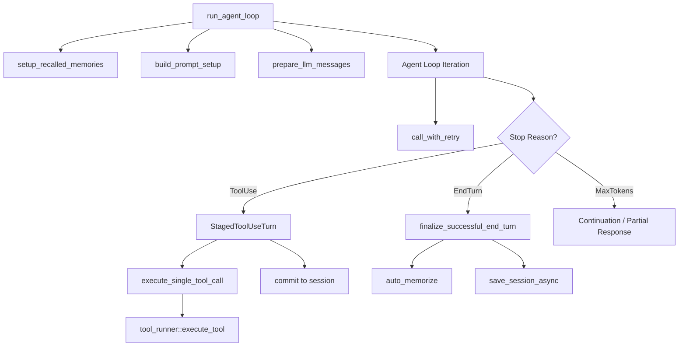

# Agent Runtime — librefang-runtime-src

# Agent Runtime — `librefang-runtime`

The agent runtime is the execution core of LibreFang. It manages the agent loop—receiving user messages, recalling memories, calling LLMs, executing tools, and persisting sessions. It also re-exports key dependencies (LLM drivers, MCP, sandboxing, HTTP client, kernel handle) so downstream crates can depend on a single facade.

## Architecture Overview

## Core Entry Points

### `run_agent_loop`

The primary entry point for non-streaming agent execution. Orchestrates the full lifecycle of a single user turn:

1. **Configuration check** — returns early with `provider_not_configured: true` if the LLM driver isn't ready.
2. **Experiment selection** — picks an A/B test variant via `select_running_experiment`.
3. **Memory recall** — `setup_recalled_memories` queries the context engine (preferred), vector search with embeddings, or plain text search, then merges proactive memories via `auto_retrieve`.
4. **Prompt assembly** — `build_prompt_setup` resolves experiment variant prompts, appends memory context, and adds language-matching instructions.
5. **Message preparation** — `prepare_llm_messages` clones session messages, inserts canonical context and memory blocks, trims to `MAX_HISTORY_MESSAGES` (40), and strips stale image data.
6. **Web search augmentation** — for models without tool support (`should_augment_web_search`), generates search queries via LLM and injects results.
7. **Iteration loop** — bounded by `MAX_ITERATIONS` (default 50, overridable via manifest `autonomous.max_iterations`).

Each iteration:
- Assembles context (overflow recovery + context guard), or delegates to `context_engine.assemble`.
- Calls the LLM via `call_with_retry` (exponential backoff, up to `MAX_RETRIES`).
- Dispatches on `StopReason`:

| StopReason | Behavior |
|---|---|
| `EndTurn` / `StopSequence` | Extract text, parse reply directives, check silent/no-reply, classify retry conditions, finalize. |
| `ToolUse` | Stage the turn, execute each tool call, commit results atomically, check mid-turn signals. |
| `MaxTokens` | Track continuations (up to `MAX_CONTINUATIONS` = 5). Return partial text on pure-text overflow. |

### `run_agent_loop_streaming`

Streaming variant of the loop (implementation follows the same structure but emits `StreamEvent` items through an `mpsc::Sender`). Fires `PHASE_RESPONSE_COMPLETE` via `signal_response_complete` so the UI can unblock input before post-processing finishes.

## Key Data Structures

### `AgentLoopResult`

Returned from every loop invocation. Contains the response text, cumulative `TokenUsage`, iteration count, decision traces, memory summaries, reply directives, experiment context, and a `new_messages_start` index for slicing the turn's messages from the session.

Key fields:
- `silent` / `provider_not_configured` — distinguish intentional silence from system failure.
- `skill_evolution_suggested` — set to `true` when 5+ tool calls indicate a non-trivial task.
- `new_messages_start` — index into `session.messages` where this turn's additions begin.

### `LoopOptions`

Modifies loop behavior for non-standard invocations:

- `is_fork: bool` — derivative (ephemeral) turn. Skips session persistence, memory writes, context engine updates, and `auto_memorize`. Critical for preventing recursive fork loops.
- `allowed_tools: Option<Vec<String>>` — runtime tool allowlist. Enforced at execute time (not schema time) to preserve prompt cache alignment with the parent turn.

### `StagedToolUseTurn`

The structural fix for issue #2381. Buffers the assistant's `tool_use` message and all `tool_result` blocks locally, committing them atomically to both `session.messages` and the LLM working copy. If the turn is dropped before commit (e.g., via `?` propagation), `session.messages` is untouched—no orphan `ToolUse` blocks can reach persistence.

Methods:
- `append_result` — add a tool result block per execution.
- `pad_missing_results` — fabricate synthetic "not executed" results for any `tool_use_id` that never received a result (mid-turn interruption).
- `commit` — atomically push assistant message + user tool-result message to session and working copy.

### `LoopPhase`

Lifecycle phases for UX indicators: `Thinking`, `ToolUse { tool_name }`, `Streaming`, `Done`, `Error`. Emitted via `PhaseCallback` (fire-and-forget, non-blocking).

## Submodule Reference

### Agent Loop Core
| Module | Purpose |
|---|---|
| `agent_loop` | Core execution loop, `run_agent_loop`, `run_agent_loop_streaming` |
| `loop_guard` | Circuit breaker and iteration limits for tool calls (`LoopGuard`, `LoopGuardVerdict`) |
| `retry` | Exponential backoff with jitter for LLM API calls |
| `graceful_shutdown` | Coordinated shutdown signaling |

### Context & Prompt Management
| Module | Purpose |
|---|---|
| `context_budget` | Token budget allocation, dynamic tool result truncation (`ContextBudget`) |
| `context_engine` | Pluggable context assembly interface (`ContextEngine` trait) |
| `context_overflow` | Multi-stage overflow recovery (`recover_from_overflow`, `RecoveryStage`) |
| `prompt_builder` | System prompt construction, memory section formatting |
| `compactor` | Context compaction for long conversations |
| `session_repair` | Message sequence validation, safe trim points, image stripping |

### Memory
| Module | Purpose |
|---|---|
| `embedding` | Embedding driver trait for vector memory recall |
| `proactive_memory` | Automatic memory extraction and recall via `ProactiveMemoryStore` |

### Tool Execution
| Module | Purpose |
|---|---|
| `tool_runner` | Tool dispatch—routes tool calls to handlers (`execute_tool`, `execute_tool_raw`) |
| `tool_policy` | Tool approval and execution policy enforcement |
| `subprocess_sandbox` | Subprocess isolation with command allowlists (`validate_command_allowlist`) |
| `workspace_sandbox` | Filesystem sandboxing—path traversal detection, symlink escape prevention |
| `docker_sandbox` | Docker container isolation for untrusted code |

### Web & Media
| Module | Purpose |
|---|---|
| `web_search` | Multi-provider search (Tavily, DuckDuckGo, Jina, SearXNG) |
| `web_fetch` | HTTP fetching with SSRF protection (`check_ssrf`, `is_private_ip`) |
| `web_content` | HTML-to-markdown conversion with content extraction |
| `web_cache` | TTL-based response caching |
| `media` / `media_understanding` | Media driver cache and multimodal content analysis |
| `image_gen` | Image generation tool |
| `tts` | Text-to-speech synthesis (OpenAI, ElevenLabs, Google) |
| `link_understanding` | URL metadata extraction and summarization |

### LLM Integration
| Module | Purpose |
|---|---|
| `llm_driver` (re-export) | `LlmDriver` trait, `CompletionRequest`, `StreamEvent`, `PHASE_RESPONSE_COMPLETE` |
| `llm_errors` (re-export) | Error classification for retry logic |
| `drivers` (re-export) | Concrete driver implementations |
| `provider_health` | Provider health tracking and failover |
| `routing` | Request routing across providers |
| `model_catalog` | Model capability metadata |

### Integration & Plugins
| Module | Purpose |
|---|---|
| `mcp` (re-export) | Model Context Protocol client connections |
| `mcp_server` | MCP server implementation |
| `mcp_migrate` | MCP configuration migration |
| `mcp_oauth` (re-export) | OAuth flows for MCP providers |
| `plugin_manager` | Plugin manifest parsing, version matching (`parse_version`, `semver_parts`, `version_satisfies`) |
| `plugin_runtime` | Plugin execution environment |
| `python_runtime` | Python code execution support |
| `a2a` | Agent-to-agent discovery and communication |

### Channel & Session
| Module | Purpose |
|---|---|
| `channel_registry` | Channel type registration |
| `command_lane` | Command dispatch lane |
| `reply_directives` | Parse `[[reply_to:...]]`, `[[silent]]` directives from responses |
| `silent_response` | Detect `NO_REPLY` / `[no reply needed]` sentinels (`is_silent_response`, `SilentReason`) |

### Security & Compliance
| Module | Purpose |
|---|---|
| `pii_filter` | PII redaction for messages (`PiiFilter`, configurable patterns) |
| `audit` | Audit logging |
| `shell_bleed` | Shell injection prevention |
| `auth_cooldown` | Provider cooldown management (`ProviderCooldown`, `CooldownVerdict`) |

### Infrastructure
| Module | Purpose |
|---|---|
| `kernel_handle` (re-export) | `KernelHandle` trait for kernel-level operations |
| `catalog_sync` | Agent/model catalog synchronization |
| `registry_sync` | Plugin registry download and sync (`sync_registry`) |
| `trace_store` | Structured trace storage for debugging |
| `workspace_context` | Workspace type detection, cached file reading |
| `process_manager` | Long-running process lifecycle management |
| `apply_patch` | Diff-based patch application |

### Re-exported Dependencies
| Export | Source Crate |
|---|---|
| `llm_driver` | `librefang-llm-driver` |
| `llm_errors` | `librefang-llm-driver` |
| `drivers` | `librefang-llm-drivers` |
| `mcp` | `librefang-runtime-mcp` |
| `mcp_oauth` | `librefang-runtime-mcp` |
| `sandbox` | `librefang-runtime-wasm` |
| `host_functions` | `librefang-runtime-wasm` |
| `http_client` | `librefang-http` |
| `kernel_handle` | `librefang-kernel-handle` |
| `chatgpt_oauth` | `librefang-runtime-oauth` |
| `copilot_oauth` | `librefang-runtime-oauth` |

## Constants & Tuning

| Constant | Value | Purpose |
|---|---|---|
| `MAX_ITERATIONS` | 50 | Hard cap on loop iterations (overridable per agent) |
| `MAX_RETRIES` | 3 | LLM API call retries for rate-limit/overload |
| `BASE_RETRY_DELAY_MS` | 1000 | Exponential backoff base |
| `TOOL_TIMEOUT_SECS` | 600 | Per-tool execution timeout |
| `MAX_CONTINUATIONS` | 5 | Consecutive MaxTokens continuations before returning partial |
| `MAX_HISTORY_MESSAGES` | 40 | Messages retained before auto-trimming (~7–10 real turns) |
| `MAX_CONSECUTIVE_ALL_FAILED` | 3 | Consecutive all-failed iterations before abort |
| `DEFAULT_CONTEXT_WINDOW` | 200,000 | Fallback context window size in tokens |
| `USER_AGENT` | `librefang/<version>` | HTTP User-Agent (required by some providers) |

## Critical Design Decisions

### Atomic Tool-Use Turns (#2381)

The `StagedToolUseTurn` pattern ensures `session.messages` never contains an orphan `ToolUse` block without a paired `ToolResult`. Before this fix, early exits between tool-call staging and result finalization left half-committed states that caused API 400 errors ("tool_call_ids did not have response messages").

### Fork Turn Isolation

Fork turns (`LoopOptions::is_fork = true`) share the parent's session prefix for prompt cache alignment but skip all persistence: session saves, memory writes, context engine updates, and `auto_memorize`. This prevents recursive fork loops (a fork's completion triggering another `auto_memorize` fork) and keeps derivative artifacts out of long-term memory.

### Runtime Tool Allowlist

Tool filtering happens at execute time, not schema time. The full tool set is sent to the LLM so the request body stays byte-identical to the parent turn (preserving Anthropic prompt cache hits). Disallowed tools receive a synthetic error result that the model can adapt to.

### Context Overflow Recovery

The loop applies a multi-stage recovery strategy: `recover_from_overflow` tries progressive truncation, and `apply_context_guard` enforces token budgets. When a `ContextEngine` is available, it takes over assembly entirely. If recovery reaches `RecoveryStage::FinalError`, the loop warns the user to `/reset` or `/compact`.

### Mid-Turn Signal Injection

`handle_mid_turn_signal` allows external messages (user follow-ups, approval resolutions) to interrupt tool execution mid-batch. The staged turn is padded and committed before the injected message is appended, maintaining the ToolUse/ToolResult pairing invariant.

### Group Chat Sender Prefixes

In group chats (`is_group: true`), a sanitized `[sender]: ` prefix is prepended to user messages after PII filtering. This lets the LLM distinguish speakers without exposing display names that might contain redactable PII.

## Execution Flow: Web Search Augmentation

For models without tool/function calling support (`web_search_augmentation` not `Off`):

1. `should_augment_web_search` checks the manifest's `web_search_augmentation` mode (`Auto` defers to `model_supports_tools` metadata).
2. `generate_search_queries` calls a lightweight LLM to produce 1–3 focused queries from conversation context.
3. Each query runs through `web_ctx.search` (provider depends on configuration).
4. Results are injected as a leading user message: `[Web search results — use these to inform your response]`.

## Execution Flow: A/B Experiments

When a running experiment exists for an agent:

1. `select_running_experiment` hashes the session ID to deterministically pick a variant.
2. The variant's `prompt_version_id` is resolved via `kernel.get_prompt_version`.
3. The experiment's system prompt replaces the manifest default.
4. `ExperimentContext` is attached to `AgentLoopResult` for tracking.