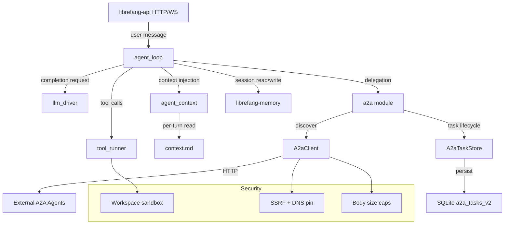

# Agent Runtime — librefang-runtime-src

# LibreFang Runtime (`librefang-runtime`)

The runtime crate is the execution engine of LibreFang. It owns the agent loop (turn processing, tool execution, session persistence), the A2A interoperability layer, and all supporting infrastructure that sits between the HTTP API surface and the underlying LLM/memory/storage drivers.

---

## Architecture Overview



---

## Module: `a2a` — Agent-to-Agent Protocol

Implements Google's A2A protocol for cross-framework agent interoperability. LibreFang agents can both *expose* themselves as A2A services and *consume* external A2A agents.

### Core Types

**`AgentCard`** — A JSON capability manifest served at `/.well-known/agent.json`. Built from an `AgentManifest` via `build_agent_card`. Contains name, description, endpoint URL, skills (derived from tool names), and capability flags (streaming, push notifications, state transition history).

**`A2aTask`** — The unit of work exchanged between agents. Carries an ID, optional `session_id` for conversation continuity, a `status`, message history, artifacts, and audit fields (`agent_id`, `caller_a2a_agent_id`).

**`A2aTaskStatus`** — Enum: `Submitted → Working → InputRequired → Completed | Cancelled | Failed`.

**`A2aTaskStatusWrapper`** — Polymorphic deserializer that accepts both the bare string form (`"completed"`) and the object form (`{"state": "completed", "message": ...}`) used by some A2A implementations. Access the underlying status via `.state()`.

**`A2aMessage` / `A2aPart` / `A2aArtifact`** — Message and content-part types for task conversations. Parts are tagged unions: `Text`, `File` (base64), or `Data` (structured JSON).

### `A2aTaskStore` — Task Lifecycle Tracking

An in-memory + SQLite store that tracks A2A task state. Created via:

| Constructor | Behaviour |
|---|---|
| `new(max_tasks)` | In-memory only |
| `with_ttl(max_tasks, duration)` | In-memory with custom TTL |
| `with_persistence(max_tasks, db_path)` | SQLite-backed |

**Persistence design.** `with_persistence` opens a SQLite database (WAL mode, 5 s busy timeout), creates the `a2a_tasks_v2` schema, prunes rows older than 7 days, and loads the most recent `max_tasks` rows into memory. Every mutation (`insert`, `update_status`, `complete`, `fail`, `cancel`) upserts to SQLite before returning. Disk failures degrade silently to in-memory-only for the affected row.

**Eviction policy** (applied lazily on `insert`):
1. TTL sweep — remove all tasks whose `updated_at` exceeds the configured TTL, regardless of state.
2. Capacity eviction — if still at capacity, evict the oldest terminal-state task first; fall back to the oldest task overall.

**`get` fallback.** When a task has been evicted from the in-memory map (e.g. after a restart with a tighter cap), `get` queries SQLite directly so pollers don't receive spurious 404s.

### `A2aClient` — Outbound A2A Communication

Discovers and interacts with external A2A agents. Each outbound request builds a fresh `reqwest::Client` rather than sharing one, because DNS resolution and SSRF validation must happen per-target.

**Security hardening (per bug references in source):**

| Concern | Mitigation |
|---|---|
| SSRF to internal IPs (#3563) | `check_ssrf` validates resolved IPs before connecting |
| DNS rebinding TOCTOU (#3563) | DNS is pinned to the validated addresses via `ClientBuilder::resolve` |
| Redirect to private IP (#3782, #3563) | Redirects are disabled entirely (`Policy::none`); 3xx responses are rejected |
| Unbounded response body (#3785) | `Content-Length` is checked upfront; body streaming aborts once the running total exceeds the cap. Transport decompression is disabled so the cap measures wire bytes. |
| Trust-list key mismatch (#3786) | `canonicalize_a2a_url` normalizes scheme, host, default port, and trailing slash so cosmetic URL variations don't bypass or falsely deny trust checks |

Body size caps: `MAX_AGENT_CARD_BYTES` = 256 KiB, `MAX_A2A_TASK_BYTES` = 1 MiB.

**Methods:**
- `discover(url)` — Fetches `/.well-known/agent.json` and returns an `AgentCard`.
- `send_task(url, message, session_id)` — Sends a `tasks/send` JSON-RPC request.
- `get_task(url, task_id)` — Polls task status via `tasks/get`.

### `discover_external_agents`

Called during kernel boot. Takes the configured `ExternalAgent` list, fetches each agent's card, and returns `(canonicalized_url, AgentCard)` pairs. Failures are logged but don't prevent boot.

### `build_agent_card`

Converts an `AgentManifest` into an `AgentCard`. Tool names become A2A skill descriptors. The card URL is `{base_url}/a2a`.

---

## Module: `agent_context` — Per-Turn Context Loading

Loads `context.md` files that external tools (cron jobs, scripts) update independently of the agent conversation. The file is re-read on every agent turn so the LLM sees fresh data.

### Resolution Order

1. `{workspace}/.identity/context.md` (current layout)
2. `{workspace}/context.md` (legacy fallback)

The first candidate that exists wins, even if unreadable, so failures are attributed to the canonical location.

### Caching Modes

| `cache_context` | Behaviour |
|---|---|
| `false` (default) | Re-reads from disk every turn. On read failure, falls back to the previously cached content with a warning. On file deletion, returns `None`. |
| `true` | First successful read is frozen and returned on all subsequent calls. |

### Security

- **Symlink rejection.** Uses `symlink_metadata` and refuses to follow symlinks. This prevents a prompt-injection attack where an agent creates a symlink pointing to `/etc/passwd` and has its contents injected into the next LLM turn.
- **Size cap.** Files are read up to 32 KiB (`MAX_CONTEXT_BYTES` + 4 bytes for UTF-8 boundary safety). Oversized files are truncated via `safe_truncate_str`.
- **UTF-8 validation.** Reads are capped at a UTF-8 boundary so multi-byte characters split by the size cap don't corrupt the string.

### API

- `load_context_md(workspace, cache_context)` — synchronous, for the non-async streaming entry point.
- `load_context_md_async(workspace, cache_context)` — async, uses `tokio::fs` to avoid parking the executor.

Both share the same global in-memory cache and have identical semantics.

---

## Module: `agent_loop` — Core Agent Execution Loop

The central loop that processes a user message through the full lifecycle: memory recall → LLM completion → tool execution → session persistence.

### Loop Iteration

```
for each iteration (up to MAX_ITERATIONS):
    1. Build CompletionRequest (system prompt + history + tools)
    2. Call LLM (capped by global concurrency semaphore)
    3. If stop_reason == EndTurn or no tool calls → return response
    4. If stop_reason == MaxTokens → continue generation
    5. If tool calls present:
       a. Stage the tool-use turn (StagedToolUseTurn)
       b. Execute each tool call
       c. Commit turn atomically to session
    6. Trim history if over cap
    7. Loop back with tool results appended
```

### Key Constants and Limits

| Constant | Value | Purpose |
|---|---|---|
| `MAX_ITERATIONS` | 100 (from `AutonomousConfig::DEFAULT_MAX_ITERATIONS`) | Prevents infinite loops |
| `MAX_RETRIES` | 3 | Retries for rate-limited/overloaded API calls |
| `TOOL_TIMEOUT_SECS` | 600 | Per-tool execution timeout |
| `MAX_CONTINUATIONS` | 5 | Consecutive MaxTokens continuations before partial return |
| `MAX_CONCURRENT_LLM_CALLS` | 5 | Global process-wide LLM call semaphore |
| `DEFAULT_MAX_HISTORY_MESSAGES` | 40 | Message history trim ceiling |
| `MIN_HISTORY_MESSAGES` | 4 | Floor below which trim is clamped |
| `MAX_CONSECUTIVE_ALL_FAILED` | 3 | Consecutive iterations where every tool failed before abort |
| `ACCUMULATED_TEXT_MAX_BYTES` | 64 KiB | Cap on the intermediate text fallback buffer |

### `StagedToolUseTurn` — Atomic Tool-Use Commits

The fix for issue #2381. Previously, the assistant's `tool_use` message was pushed to `session.messages` *before* tools executed. Any mid-turn exit (error, signal, panic) left an orphaned `ToolUse` block with no matching `ToolResult`, causing providers to reject subsequent requests with 400 errors.

`StagedToolUseTurn` buffers both the assistant message and all tool results locally. Only the `commit` method writes to `session.messages`, and it does so atomically (assistant + user tool-results in one operation). If the staged turn is dropped without commit — which is exactly what `?` propagation does — the session is untouched.

### Lazy Tool Loading

When an agent's granted-tool set exceeds `LAZY_TOOLS_THRESHOLD` (30), the loop ships only the always-native subset plus any tools the LLM has loaded this turn via `tool_load`. This avoids the token overhead of shipping a ~75-tool catalog when the agent only uses a few.

Lazy mode requires `tool_load` to be in the agent's allowlist — otherwise the LLM would have no way to pull a stripped tool back in. When `tool_load` is absent, all tools are sent eagerly regardless of count.

`ResolvedToolsCache` avoids re-cloning the entire tool catalog on every loop iteration. It rebuilds only when the lazy-mode loaded-tool set grows.

### History Trimming (`safe_trim_messages`)

When message count exceeds the configured cap:

1. Find a trim point at a conversation-turn boundary that doesn't split `ToolUse`/`ToolResult` pairs.
2. Rescue pinned messages (e.g. delegation results) from the drain range and re-insert them at the front.
3. Run `validate_and_repair` on the trimmed history.
4. Ensure the history starts with a user turn (some providers reject function-call turns at position 0).
5. If fewer than 2 messages survive, synthesize a minimal user message so the LLM always has context.

Both the LLM working copy and the persistent session store are trimmed so the on-disk blob doesn't grow unbounded.

### Session Repair (`repair_session_before_save`)

Called on failure exit paths (circuit breaker, max iterations, timeout). Runs `validate_and_repair_with_stats` to remove orphaned tool results, merge empty messages, reorder misplaced results, and insert synthetic results for unpaired tool calls. This ensures the session can be loaded and resumed cleanly.

### Soft vs Hard Error Classification

Tool errors are classified for the consecutive-failure circuit breaker:

- **Soft errors** — approval denials, sandbox rejections, parameter errors. The LLM can self-correct; these don't count toward `MAX_CONSECUTIVE_ALL_FAILED`.
- **Hard errors** — network failures, unrecognized tools, permission errors. These increment the counter.

After 3 consecutive iterations where *every* tool returned a hard error, the loop exits with `RepeatedToolFailures`.

### Guidance Blocks

After tool execution, `append_tool_result_guidance_blocks` injects system text telling the LLM how to handle the results:
- Denied tools: don't retry; explain to the user.
- Modify-and-retry feedback: revise approach, don't repeat the same call.
- Parameter errors: fix arguments yourself, don't ask the user.
- Other errors: report honestly, don't fabricate results.

### Response Classification

- `is_no_reply` — Detects silent-reply sentinels (`NO_REPLY`, `[no reply needed]`, etc.) via `silent_response::is_silent_response`.
- `is_progress_text_leak` — Catches short ellipsis-terminated preambles that the model emits before a tool call but never follows up on (e.g. `"Waiting for the script to complete..."`). These are suppressed to avoid delivering nonsensical partial text to the user.

### Observability

Tool call outcomes are recorded as `librefang_tool_call_total` counters with `tool` and `outcome` labels. Tool names are sanitized (control chars stripped, 64-char cap) to keep metric cardinality bounded.

---

## Integration Points

### Downstream Callers (from `librefang-api`)

- `run_daemon` → `model_catalog` for provider resolution and URL overrides
- `handle_text_message` (WebSocket) → `model_catalog::find_model` and `effective_capabilities`
- `start_stream_text_bridge_with_status` → `silent_response::is_silent_response`
- `embedded_dashboard_available` / `resolve_dashboard_file_with_mode` → `workspace_context::get_file`
- `sync_registry` is called from multiple integration tests

### Upstream Dependencies

- `librefang-types` — manifest types, message types, tool types, error types
- `librefang-memory` — session storage, memory substrate, proactive memory hooks
- `librefang-skills` — skill registry for tool loading
- `librefang-http` — `proxied_client_builder` for outbound HTTP, TLS config
- `rusqlite` — SQLite backing for `A2aTaskStore` persistence
- `reqwest` — HTTP client for A2A outbound requests